+ 动规基础
1. 裴波那切
2. 爬楼梯、爬楼梯最小花费
+ 背包问题
+ 打家劫舍
+ 股票问题
+ 子序列问题

## 2024 年 3 月 1 日
## 动态规划
动态规划是一种“从底至顶”的方法：从最小子问题的解开始，迭代地构建更大子问题的解，直至得到原问题的解。

## 1.爬楼梯问题
#### 1.1 爬楼梯
> 给定一个共有𝑛 阶的楼梯，你每步可以上1 阶或者2 阶，请问有多少种方案可以爬到楼顶。

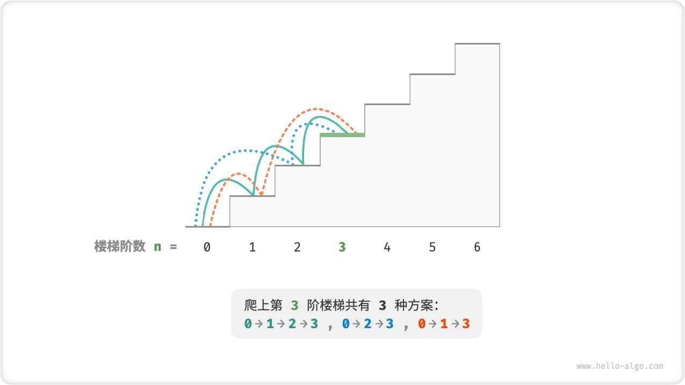

设 爬到第i阶共有dp[i]种方法，那么有以下递推式：
`dp[i] = dp[i-1] + dp[i-2]`
其中 dp[1] = 1，dp[2] = 2

+ 将数组dp 称为「𝑑𝑝 表」，𝑑𝑝[𝑖] 表示状态𝑖 对应子问题的解。
+ 将最小子问题对应的状态（即第1 和2 阶楼梯）称为「初始状态」。
+ 将递推公式𝑑𝑝[𝑖] = 𝑑𝑝[𝑖 − 1] + 𝑑𝑝[𝑖 − 2] 称为「状态转移方程」。

```js
/* 爬楼梯：动态规划 */
function climbingStairsDP(n) {
    if (n === 1 || n === 2) return n;
    // 初始化 dp 表，用于存储子问题的解
    const dp = new Array(n + 1).fill(-1);
    // 初始状态：预设最小子问题的解
    dp[1] = 1;
    dp[2] = 2;
    // 状态转移：从较小子问题逐步求解较大子问题
    for (let i = 3; i <= n; i++) {
        dp[i] = dp[i - 1] + dp[i - 2];
    }
    return dp[n];
}

// 时间复杂度 O(n) 空间复杂度 O(n) 可优化空间

/* 爬楼梯：空间优化后的动态规划 */
function climbingStairsDPComp(n) {
    if (n === 1 || n === 2) return n;
    let a = 1,
        b = 2;
    for (let i = 3; i <= n; i++) {
        const tmp = b;
        b = a + b;
        a = tmp;
    }
    return b;
}

// 此时 时间复杂度 O(n) 空间复杂度 O(1)
```


##### 1.2  爬楼梯最小代价 
> 给定一个楼梯，你每步可以上1 阶或者2 阶，每一阶楼梯上都贴有一个非负整数，表示你在
  该台阶所需要付出的代价。给定一个非负整数数组𝑐𝑜𝑠𝑡 ，其中𝑐𝑜𝑠𝑡[𝑖] 表示在第𝑖 个台阶需
  要付出的代价，𝑐𝑜𝑠𝑡[0] 为地面起始点。请计算最少需要付出多少代价才能到达顶部？

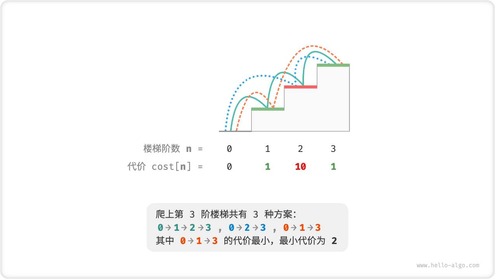

设𝑑𝑝[𝑖] 为爬到第𝑖 阶累计付出的代价，由于第𝑖 阶只可能从𝑖 − 1 阶或𝑖 − 2 阶走来，因此𝑑𝑝[𝑖] 只可能等
于𝑑𝑝[𝑖 − 1] + 𝑐𝑜𝑠𝑡[𝑖] 或𝑑𝑝[𝑖 − 2] + 𝑐𝑜𝑠𝑡[𝑖] 。为了尽可能减少代价，我们应该选择两者中较小的那一个：
𝑑𝑝[𝑖] = min(𝑑𝑝[𝑖 − 1], 𝑑𝑝[𝑖 − 2]) + 𝑐𝑜𝑠𝑡[𝑖]
这便可以引出最优子结构的含义：原问题的最优解是从子问题的最优解构建得来的。

```js
/* 爬楼梯最小代价：动态规划 */
function minCostClimbingStairsDP(cost) {
    const n = cost.length - 1;
    if (n === 1 || n === 2) {
        return cost[n];
    }
    // 初始化 dp 表，用于存储子问题的解
    const dp = new Array(n + 1);
    // 初始状态：预设最小子问题的解
    dp[1] = cost[1];
    dp[2] = cost[2];
    // 状态转移：从较小子问题逐步求解较大子问题
    for (let i = 3; i <= n; i++) {
        dp[i] = Math.min(dp[i - 1], dp[i - 2]) + cost[i];
    }
    return dp[n];
}

/* 爬楼梯最小代价：状态压缩后的动态规划 */
function minCostClimbingStairsDPComp(cost) {
    const n = cost.length - 1;
    if (n === 1 || n === 2) {
        return cost[n];
    }
    let a = cost[1],
        b = cost[2];
    for (let i = 3; i <= n; i++) {
        const tmp = b;
        b = Math.min(a, tmp) + cost[i];
        a = tmp;
    }
    return b;
}

/* Driver Code */
const cost = [0, 1, 10, 1, 1, 1, 10, 1, 1, 10, 1];
console.log('输入楼梯的代价列表为：', cost);

let res = minCostClimbingStairsDP(cost);
console.log(`爬完楼梯的最低代价为：${res}`);

res = minCostClimbingStairsDPComp(cost);
console.log(`爬完楼梯的最低代价为：${res}`);

```


##### 1.3  带约束爬楼梯 
> 给定一个共有𝑛 阶的楼梯，你每步可以上1 阶或者2 阶，但不能连续两轮跳1 阶，请问有多
  少种方案可以爬到楼顶。

在该问题中，如果上一轮是跳1 阶上来的，那么下一轮就必须跳2 阶。这意味着，下一步选择不能由当前状
态（当前楼梯阶数）独立决定，还和前一个状态（上轮楼梯阶数）有关。
不难发现，此问题已不满足无后效性，状态转移方程𝑑𝑝[𝑖] = 𝑑𝑝[𝑖 − 1] + 𝑑𝑝[𝑖 − 2] 也失效了，因为
𝑑𝑝[𝑖 − 1] 代表本轮跳1 阶，但其中包含了许多“上一轮跳1 阶上来的”方案，而为了满足约束，我们就不能
将𝑑𝑝[𝑖 − 1] 直接计入𝑑𝑝[𝑖] 中。
为此，我们需要扩展状态定义：状态[𝑖, 𝑗] 表示处在第𝑖 阶、并且上一轮跳了𝑗 阶，其中𝑗 ∈ {1, 2} 。此状
态定义有效地区分了上一轮跳了1 阶还是2 阶，我们可以据此来决定下一步该怎么跳。
+ 当𝑗 等于1 ，即上一轮跳了1 阶时，这一轮只能选择跳2 阶。
+ 当𝑗 等于2 ，即上一轮跳了2 阶时，这一轮可选择跳1 阶或跳2 阶。

此时状态转移方程为：
𝑑𝑝[𝑖, 1] = 𝑑𝑝[𝑖 − 1, 2]
𝑑𝑝[𝑖, 2] = 𝑑𝑝[𝑖 − 2, 1] + 𝑑𝑝[𝑖 − 2, 2]

```js
/* 带约束爬楼梯：动态规划 */
function climbingStairsConstraintDP(n) {
    if (n === 1 || n === 2) {
        return 1;
    }
    // 初始化 dp 表，用于存储子问题的解
    const dp = Array.from(new Array(n + 1), () => new Array(3));
    // 初始状态：预设最小子问题的解
    dp[1][1] = 1;
    dp[1][2] = 0;
    dp[2][1] = 0;
    dp[2][2] = 1;
    // 状态转移：从较小子问题逐步求解较大子问题
    for (let i = 3; i <= n; i++) {
        dp[i][1] = dp[i - 1][2];
        dp[i][2] = dp[i - 2][1] + dp[i - 2][2];
    }
    return dp[n][1] + dp[n][2];
}

/* Driver Code */
const n = 9;
const res = climbingStairsConstraintDP(n);
console.log(`爬 ${n} 阶楼梯共有 ${res} 种方案`);

```

## 2.动态规划问题求解步骤
动态规划的解题流程会因问题的性质和难度而有所不同，但通常遵循以下步骤：描述决策，定义状态，建立
𝑑𝑝 表，推导状态转移方程，确定边界条件等。
为了更形象地展示解题步骤，我们使用一个经典问题“最小路径和”来举例。

> 给定一个𝑛 × 𝑚 的二维网格grid ，网格中的每个单元格包含一个非负整数，表示该单元格
  的代价。机器人以左上角单元格为起始点，每次只能向下或者向右移动一步，直至到达右下角
  单元格。请返回从左上角到右下角的最小路径和。

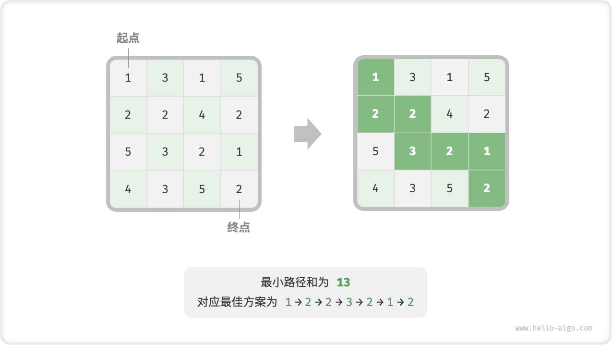


###### 2.1 第一步：思考每轮的决策，定义状态，从而得到𝑑𝑝 表
本题的每一轮的决策就是从当前格子向下或向右一步。设当前格子的行列索引为[𝑖, 𝑗] ，则向下或向右走一
步后，索引变为[𝑖 + 1, 𝑗] 或[𝑖, 𝑗 + 1] 。因此，状态应包含行索引和列索引两个变量，记为[𝑖, 𝑗] 。
状态[𝑖, 𝑗] 对应的子问题为：从起始点[0, 0] 走到[𝑖, 𝑗] 的最小路径和，解记为𝑑𝑝[𝑖, 𝑗] 。

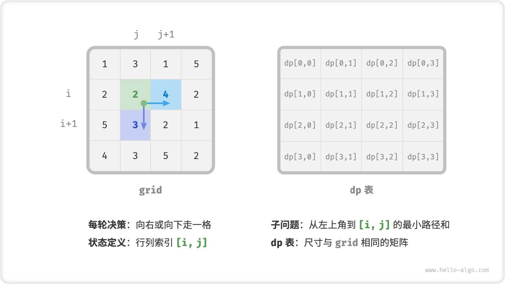

###### 2.2 第二步：找出最优子结构，进而推导出状态转移方程
对于状态[𝑖, 𝑗] ，它只能从上边格子[𝑖 − 1, 𝑗] 和左边格子[𝑖, 𝑗 − 1] 转移而来。因此最优子结构为：到达
[𝑖, 𝑗] 的最小路径和由[𝑖, 𝑗 − 1] 的最小路径和与[𝑖 − 1, 𝑗] 的最小路径和，这两者较小的那一个决定。
根据以上分析，可推出图14‑12 所示的状态转移方程：
𝑑𝑝[𝑖, 𝑗] = min(𝑑𝑝[𝑖 − 1, 𝑗], 𝑑𝑝[𝑖, 𝑗 − 1]) + 𝑔𝑟𝑖𝑑[𝑖, 𝑗]

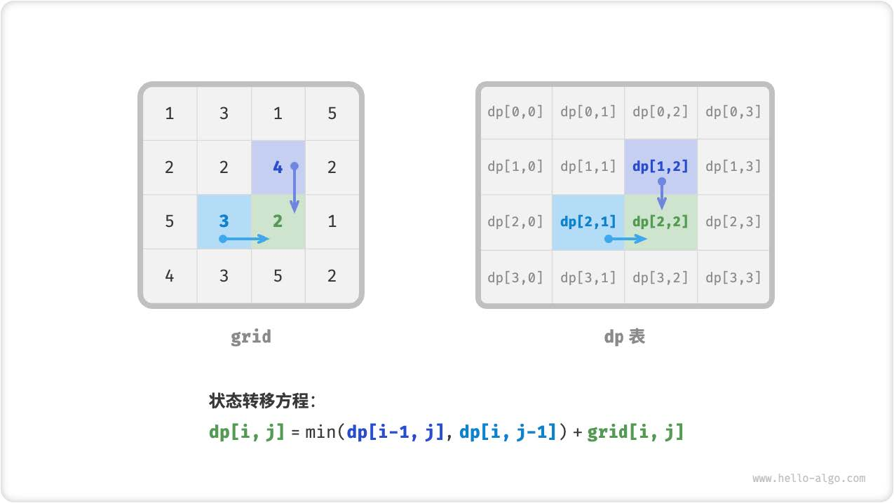

###### 2.3 第三步：确定边界条件和状态转移顺序
在本题中，处在首行的状态只能向右转移，首列状态只能向下转移，因此首行𝑖 = 0 和首列𝑗 = 0 是边界条
件。
由于每个格子是由其左方格子和上方格子转移而来，因此我们使用采用循环来遍历矩阵，
外循环遍历各行、内循环遍历各列。

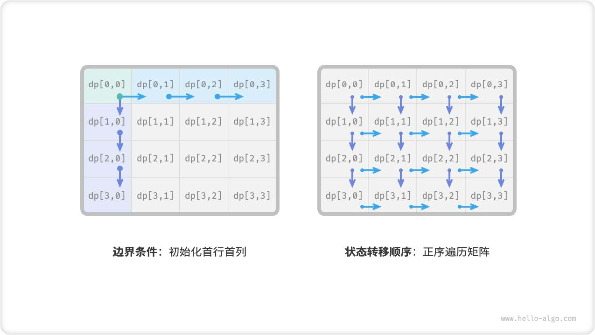

```js
/* 最小路径和：暴力搜索 */
function minPathSumDFS(grid, i, j) {
    // 若为左上角单元格，则终止搜索
    if (i === 0 && j === 0) {
        return grid[0][0];
    }
    // 若行列索引越界，则返回 +∞ 代价
    if (i < 0 || j < 0) {
        return Infinity;
    }
    // 计算从左上角到 (i-1, j) 和 (i, j-1) 的最小路径代价
    const up = minPathSumDFS(grid, i - 1, j);
    const left = minPathSumDFS(grid, i, j - 1);
    // 返回从左上角到 (i, j) 的最小路径代价
    return Math.min(left, up) + grid[i][j];
}

/* 最小路径和：记忆化搜索 */
function minPathSumDFSMem(grid, mem, i, j) {
    // 若为左上角单元格，则终止搜索
    if (i === 0 && j === 0) {
        return grid[0][0];
    }
    // 若行列索引越界，则返回 +∞ 代价
    if (i < 0 || j < 0) {
        return Infinity;
    }
    // 若已有记录，则直接返回
    if (mem[i][j] !== -1) {
        return mem[i][j];
    }
    // 左边和上边单元格的最小路径代价
    const up = minPathSumDFSMem(grid, mem, i - 1, j);
    const left = minPathSumDFSMem(grid, mem, i, j - 1);
    // 记录并返回左上角到 (i, j) 的最小路径代价
    mem[i][j] = Math.min(left, up) + grid[i][j];
    return mem[i][j];
}

/* 最小路径和：动态规划 */
function minPathSumDP(grid) {
    const n = grid.length,
        m = grid[0].length;
    // 初始化 dp 表
    const dp = Array.from({ length: n }, () =>
        Array.from({ length: m }, () => 0)
    );
    dp[0][0] = grid[0][0];
    // 状态转移：首行
    for (let j = 1; j < m; j++) {
        dp[0][j] = dp[0][j - 1] + grid[0][j];
    }
    // 状态转移：首列
    for (let i = 1; i < n; i++) {
        dp[i][0] = dp[i - 1][0] + grid[i][0];
    }
    // 状态转移：其余行和列
    for (let i = 1; i < n; i++) {
        for (let j = 1; j < m; j++) {
            dp[i][j] = Math.min(dp[i][j - 1], dp[i - 1][j]) + grid[i][j];
        }
    }
    return dp[n - 1][m - 1];
}

/* 最小路径和：状态压缩后的动态规划 */
function minPathSumDPComp(grid) {
    const n = grid.length,
        m = grid[0].length;
    // 初始化 dp 表
    const dp = new Array(m);
    // 状态转移：首行
    dp[0] = grid[0][0];
    for (let j = 1; j < m; j++) {
        dp[j] = dp[j - 1] + grid[0][j];
    }
    // 状态转移：其余行
    for (let i = 1; i < n; i++) {
        // 状态转移：首列
        dp[0] = dp[0] + grid[i][0];
        // 状态转移：其余列
        for (let j = 1; j < m; j++) {
            dp[j] = Math.min(dp[j - 1], dp[j]) + grid[i][j];
        }
    }
    return dp[m - 1];
}

/* Driver Code */
const grid = [
    [1, 3, 1, 5],
    [2, 2, 4, 2],
    [5, 3, 2, 1],
    [4, 3, 5, 2],
];
const n = grid.length,
    m = grid[0].length;
// 暴力搜索
let res = minPathSumDFS(grid, n - 1, m - 1);
console.log(`从左上角到右下角的最小路径和为 ${res}`);

// 记忆化搜索
const mem = Array.from({ length: n }, () =>
    Array.from({ length: m }, () => -1)
);
res = minPathSumDFSMem(grid, mem, n - 1, m - 1);
console.log(`从左上角到右下角的最小路径和为 ${res}`);

// 动态规划
res = minPathSumDP(grid);
console.log(`从左上角到右下角的最小路径和为 ${res}`);

// 状态压缩后的动态规划
res = minPathSumDPComp(grid);
console.log(`从左上角到右下角的最小路径和为 ${res}`);
```

<!-- let m = 3,n = 4;
let arr = Array.from(Array(m),() => Array(n));
console.log(arr);  //output:[[empty × 4],[empty × 4],[empty × 4]] -->

## 3. 0-1背包问题

> 给定𝑛 个物品，第𝑖 个物品的重量为𝑤𝑔𝑡[𝑖 − 1]、价值为𝑣𝑎𝑙[𝑖 − 1] ，和一个容量为𝑐𝑎𝑝 的
  背包。每个物品只能选择一次，问在不超过背包容量下能放入物品的最大价值。
  
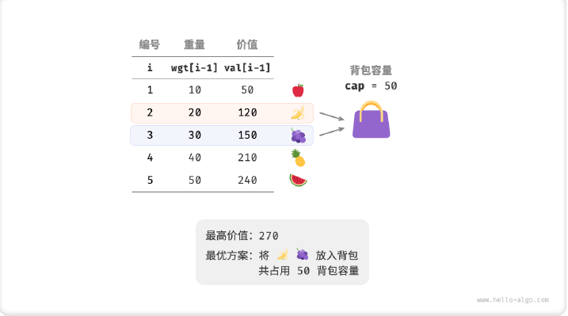

第一步:定义状态
对于每个物品来说，不放入背包，背包容量不变；放入背包，背包容量减小。由此可得状态定义：当前物品
编号𝑖 和剩余背包容量𝑐 ，记为[𝑖, 𝑐] 。
状态[𝑖, 𝑐] 对应的子问题为：前𝑖 个物品在剩余容量为𝑐 的背包中的最大价值，记为𝑑𝑝[𝑖, 𝑐] 。

第二步：找出最优子结构，进而推导出状态转移方程
当我们做出物品𝑖 的决策后，剩余的是前𝑖 − 1 个物品的决策，可分为以下两种情况。
‧ 不放入物品𝑖 ：背包容量不变，状态变化为[𝑖 − 1, 𝑐] 。
‧ 放入物品𝑖 ：背包容量减小𝑤𝑔𝑡[𝑖 − 1] ，价值增加𝑣𝑎𝑙[𝑖 − 1] ，状态变化为[𝑖 − 1, 𝑐 − 𝑤𝑔𝑡[𝑖 − 1]] 。
上述分析向我们揭示了本题的最优子结构：最大价值𝑑𝑝[𝑖, 𝑐] 等于不放入物品𝑖 和放入物品𝑖 两种方案中的
价值更大的那一个。由此可推出状态转移方程：
𝑑𝑝[𝑖, 𝑐] = max(𝑑𝑝[𝑖 − 1, 𝑐], 𝑑𝑝[𝑖 − 1, 𝑐 − 𝑤𝑔𝑡[𝑖 − 1]] + 𝑣𝑎𝑙[𝑖 − 1])

第三步：确定边界条件
当无物品或无剩余背包容量时最大价值为0 ，即首列𝑑𝑝[𝑖, 0] 和首行𝑑𝑝[0, 𝑐] 都等于0 。
当前状态[𝑖, 𝑐] 从上方的状态[𝑖 − 1, 𝑐] 和左上方的状态[𝑖 − 1, 𝑐 − 𝑤𝑔𝑡[𝑖 − 1]] 转移而来，因此通过两层循
环正序遍历整个𝑑𝑝 表即可。

```js

/* 0-1 背包：动态规划 */
function knapsackDP(wgt, val, cap) {
    const n = wgt.length;
    // 初始化 dp 表
    const dp = Array(n + 1)
        .fill(0)
        .map(() => Array(cap + 1).fill(0));
    // 状态转移
    for (let i = 1; i <= n; i++) {
        for (let c = 1; c <= cap; c++) {
            if (wgt[i - 1] > c) {
                // 若超过背包容量，则不选物品 i
                dp[i][c] = dp[i - 1][c];
            } else {
                // 不选和选物品 i 这两种方案的较大值
                dp[i][c] = Math.max(
                    dp[i - 1][c],
                    dp[i - 1][c - wgt[i - 1]] + val[i - 1]
                );
            }
        }
    }
    return dp[n][cap];
}

/* 0-1 背包：状态压缩后的动态规划 */
function knapsackDPComp(wgt, val, cap) {
    const n = wgt.length;
    // 初始化 dp 表
    const dp = Array(cap + 1).fill(0);
    // 状态转移
    for (let i = 1; i <= n; i++) {
        // 倒序遍历
        for (let c = cap; c >= 1; c--) {
            if (wgt[i - 1] <= c) {
                // 不选和选物品 i 这两种方案的较大值
                dp[c] = Math.max(dp[c], dp[c - wgt[i - 1]] + val[i - 1]);
            }
        }
    }
    return dp[cap];
}

/* Driver Code */
const wgt = [10, 20, 30, 40, 50];
const val = [50, 120, 150, 210, 240];
const cap = 50;
const n = wgt.length;

// 动态规划
res = knapsackDP(wgt, val, cap);
console.log(`不超过背包容量的最大物品价值为 ${res}`);

// 状态压缩后的动态规划
res = knapsackDPComp(wgt, val, cap);
console.log(`不超过背包容量的最大物品价值为 ${res}`);
```

## 4. 完全背包问题
> 给定𝑛 个物品，第𝑖 个物品的重量为𝑤𝑔𝑡[𝑖 − 1]、价值为𝑣𝑎𝑙[𝑖 − 1] ，和一个容量为𝑐𝑎𝑝 的
背包。每个物品可以重复选取，问在不超过背包容量下能放入物品的最大价值。

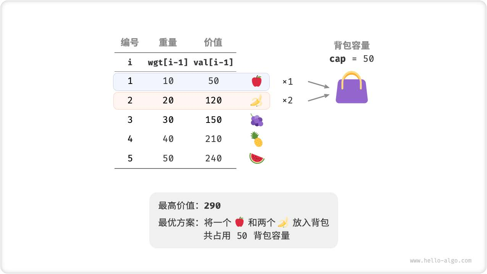

完全背包和0‑1 背包问题非常相似，区别仅在于不限制物品的选择次数。
‧ 在0‑1 背包中，每个物品只有一个，因此将物品𝑖 放入背包后，只能从前𝑖 − 1 个物品中选择。
‧ 在完全背包中，每个物品有无数个，因此将物品𝑖 放入背包后，仍可以从前𝑖 个物品中选择。
在完全背包的规定下，状态[𝑖, 𝑐] 的变化分为两种情况。
‧ 不放入物品𝑖 ：与0‑1 背包相同，转移至[𝑖 − 1, 𝑐] 。
‧ 放入物品𝑖 ：与0‑1 背包不同，转移至[𝑖, 𝑐 − 𝑤𝑔𝑡[𝑖 − 1]] 。
从而状态转移方程变为：
𝑑𝑝[𝑖, 𝑐] = max(𝑑𝑝[𝑖 − 1, 𝑐], 𝑑𝑝[𝑖, 𝑐 − 𝑤𝑔𝑡[𝑖 − 1]] + 𝑣𝑎𝑙[𝑖 − 1])

```js
/* 完全背包：动态规划 */
function unboundedKnapsackDP(wgt, val, cap) {
    const n = wgt.length;
    // 初始化 dp 表
    const dp = Array.from({ length: n + 1 }, () =>
        Array.from({ length: cap + 1 }, () => 0)
    );
    // 状态转移
    for (let i = 1; i <= n; i++) {
        for (let c = 1; c <= cap; c++) {
            if (wgt[i - 1] > c) {
                // 若超过背包容量，则不选物品 i
                dp[i][c] = dp[i - 1][c];
            } else {
                // 不选和选物品 i 这两种方案的较大值
                dp[i][c] = Math.max(
                    dp[i - 1][c],
                    dp[i][c - wgt[i - 1]] + val[i - 1]
                );
            }
        }
    }
    return dp[n][cap];
}

/* 完全背包：状态压缩后的动态规划 */
function unboundedKnapsackDPComp(wgt, val, cap) {
    const n = wgt.length;
    // 初始化 dp 表
    const dp = Array.from({ length: cap + 1 }, () => 0);
    // 状态转移
    for (let i = 1; i <= n; i++) {
        for (let c = 1; c <= cap; c++) {
            if (wgt[i - 1] > c) {
                // 若超过背包容量，则不选物品 i
                dp[c] = dp[c];
            } else {
                // 不选和选物品 i 这两种方案的较大值
                dp[c] = Math.max(dp[c], dp[c - wgt[i - 1]] + val[i - 1]);
            }
        }
    }
    return dp[cap];
}

/* Driver Code */
const wgt = [1, 2, 3];
const val = [5, 11, 15];
const cap = 4;

// 动态规划
let res = unboundedKnapsackDP(wgt, val, cap);
console.log(`不超过背包容量的最大物品价值为 ${res}`);

// 状态压缩后的动态规划
res = unboundedKnapsackDPComp(wgt, val, cap);
console.log(`不超过背包容量的最大物品价值为 ${res}`);

```

## 5. 多重背包问题
给定𝑛 个物品，第𝑖 个物品的重量为𝑤𝑔𝑡[𝑖 − 1]、价值为𝑣𝑎𝑙[𝑖 − 1] 、数量为num[i - 1]，和一个容量为𝑐𝑎𝑝 的
背包。每个物品可以重复选取,但不能超过商品的数量，问在不超过背包容量下能放入物品的最大价值。

解题思路将多重背包拆解为多个0-1背包问题
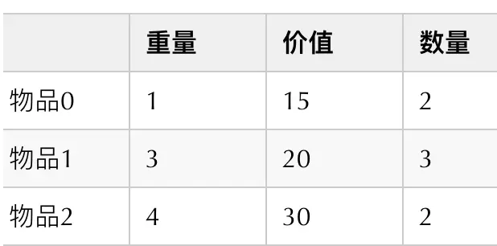

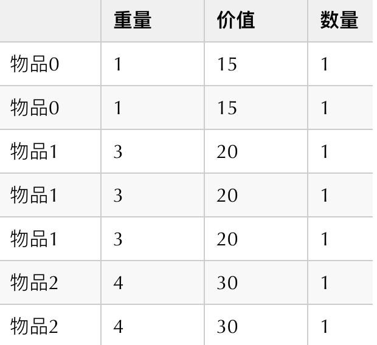


```js
function multipleKnapsackDPComp(wgt, val, num, cap) {
    let weight = [], value = [];
    for (int i = 0; i < num.length; i++) {
        while (num[i] > 1) { // num[i]保留到1，把其他物品都展开
            weight.push(wgt[i]);
            value.push(val[i]);
            num[i]--;
        }
    }
    const n = weight.length;
    // 初始化 dp 表
    const dp = Array(cap + 1).fill(0);
    // 状态转移
    for (let i = 1; i <= n; i++) {
        // 倒序遍历
        for (let c = cap; c >= 1; c--) {
            if (weight[i - 1] <= c) {
                // 不选和选物品 i 这两种方案的较大值
                dp[c] = Math.max(dp[c], dp[c - weight[i - 1]] + value[i - 1]);
            }
        }
    }
    return dp[cap];
}

/* Driver Code */
const wgt = [1, 2, 3];
const val = [5, 11, 15];
const num = [2, 1, 3];
const cap = 4;

// 动态规划
let res = multipleKnapsackDPComp(wgt, val, num, cap);
console.log(`不超过背包容量的最大物品价值为 ${res}`);
```

## 6. 零钱兑换问题
> 给定𝑛 种硬币，第𝑖 种硬币的面值为𝑐𝑜𝑖𝑛𝑠[𝑖 − 1] ，目标金额为𝑎𝑚𝑡 ，每种硬币可以重复选
取，问能够凑出目标金额的最少硬币个数。如果无法凑出目标金额则返回−1 。

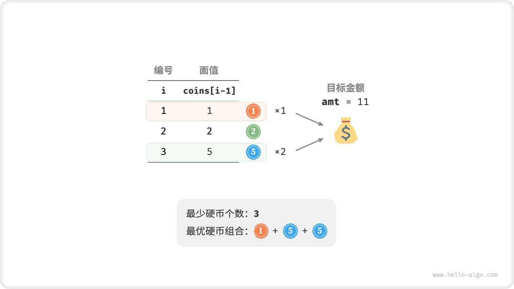

第一步：思考每轮的决策，定义状态，从而得到𝑑𝑝 表
状态[𝑖, 𝑎] 对应的子问题为：前𝑖 种硬币能够凑出金额𝑎 的最少硬币个数，记为𝑑𝑝[𝑖, 𝑎] 。
二维𝑑𝑝 表的尺寸为(𝑛 + 1) × (𝑎𝑚𝑡 + 1) 。

第二步：找出最优子结构，进而推导出状态转移方程
本题与完全背包的状态转移方程存在以下两个差异。
‧ 本题要求最小值，因此需将运算符max() 更改为min() 。
‧ 优化主体是硬币数量而非商品价值，因此在选中硬币时执行+1 即可。
𝑑𝑝[𝑖, 𝑎] = min(𝑑𝑝[𝑖 − 1, 𝑎], 𝑑𝑝[𝑖, 𝑎 − 𝑐𝑜𝑖𝑛𝑠[𝑖 − 1]] + 1)

第三步：确定边界条件和状态转移顺序
当目标金额为0 时，凑出它的最少硬币个数为0 ，即首列所有𝑑𝑝[𝑖, 0] 都等于0 。
当无硬币时，无法凑出任意> 0 的目标金额，即是无效解。为使状态转移方程中的min() 函数能够识别并
过滤无效解，我们考虑使用 amt+ 1 来表示它们，即令首行所有𝑑𝑝[0, 𝑎] 都等于amt + 1 。

```js
/* 零钱兑换：动态规划 */
function coinChangeDP(coins, amt) {
    const n = coins.length;
    const MAX = amt + 1;
    // 初始化 dp 表
    const dp = Array.from({ length: n + 1 }, () =>
        Array.from({ length: amt + 1 }, () => 0)
    );
    // 状态转移：首行首列
    for (let a = 1; a <= amt; a++) {
        dp[0][a] = MAX;
    }
    // 状态转移：其余行和列
    for (let i = 1; i <= n; i++) {
        for (let a = 1; a <= amt; a++) {
            if (coins[i - 1] > a) {
                // 若超过目标金额，则不选硬币 i
                dp[i][a] = dp[i - 1][a];
            } else {
                // 不选和选硬币 i 这两种方案的较小值
                dp[i][a] = Math.min(dp[i - 1][a], dp[i][a - coins[i - 1]] + 1);
            }
        }
    }
    return dp[n][amt] !== MAX ? dp[n][amt] : -1;
}

/* 零钱兑换：状态压缩后的动态规划 */
function coinChangeDPComp(coins, amt) {
    const n = coins.length;
    const MAX = amt + 1;
    // 初始化 dp 表
    const dp = Array.from({ length: amt + 1 }, () => MAX);
    dp[0] = 0;
    // 状态转移
    for (let i = 1; i <= n; i++) {
        for (let a = 1; a <= amt; a++) {
            if (coins[i - 1] > a) {
                // 若超过目标金额，则不选硬币 i
                dp[a] = dp[a];
            } else {
                // 不选和选硬币 i 这两种方案的较小值
                dp[a] = Math.min(dp[a], dp[a - coins[i - 1]] + 1);
            }
        }
    }
    return dp[amt] !== MAX ? dp[amt] : -1;
}

/* Driver Code */
const coins = [1, 2, 5];
const amt = 4;

// 动态规划
let res = coinChangeDP(coins, amt);
console.log(`凑到目标金额所需的最少硬币数量为 ${res}`);

// 状态压缩后的动态规划
res = coinChangeDPComp(coins, amt);
console.log(`凑到目标金额所需的最少硬币数量为 ${res}`);
```

## 7. 零钱兑换问题II
> 给定𝑛 种硬币，第𝑖 种硬币的面值为𝑐𝑜𝑖𝑛𝑠[𝑖 − 1] ，目标金额为𝑎𝑚𝑡 ，每种硬币可以重复选
取，问在凑出目标金额的硬币组合数量。

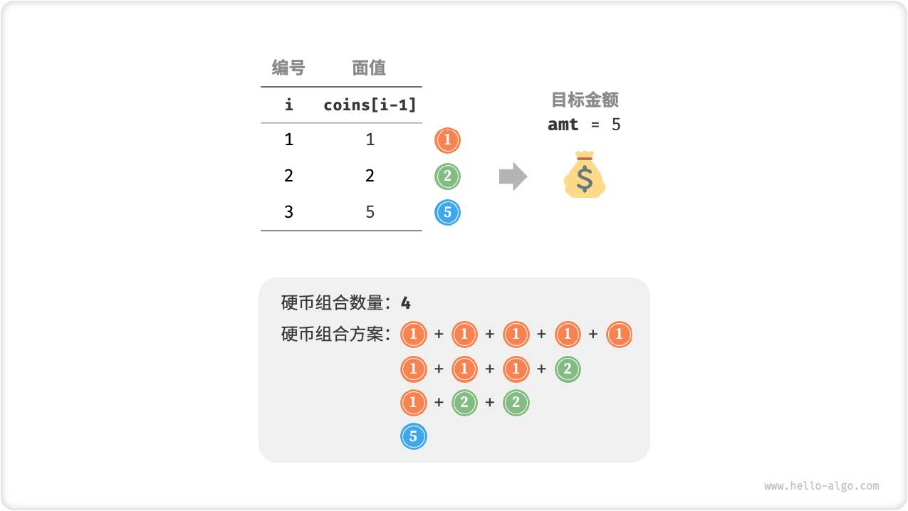

前𝑖 种硬币能够凑出金额𝑎 的组合数量。
当前状态的组合数量等于不选当前硬币与选当前硬币这两种决策的组合数量之和。状态转移方程为：
𝑑𝑝[𝑖, 𝑎] = 𝑑𝑝[𝑖 − 1, 𝑎] + 𝑑𝑝[𝑖, 𝑎 − 𝑐𝑜𝑖𝑛𝑠[𝑖 − 1]]
当目标金额为0 时，无须选择任何硬币即可凑出目标金额，因此应将首列所有𝑑𝑝[𝑖, 0] 都初始化为1 。当无
硬币时，无法凑出任何> 0 的目标金额，因此首行所有𝑑𝑝[0, 𝑎] 都等于0 。

```js
/* 零钱兑换 II：动态规划 */
function coinChangeIIDP(coins, amt) {
    const n = coins.length;
    // 初始化 dp 表
    const dp = Array.from({ length: n + 1 }, () =>
        Array.from({ length: amt + 1 }, () => 0)
    );
    // 初始化首列
    for (let i = 0; i <= n; i++) {
        dp[i][0] = 1;
    }
    // 状态转移
    for (let i = 1; i <= n; i++) {
        for (let a = 1; a <= amt; a++) {
            if (coins[i - 1] > a) {
                // 若超过目标金额，则不选硬币 i
                dp[i][a] = dp[i - 1][a];
            } else {
                // 不选和选硬币 i 这两种方案之和
                dp[i][a] = dp[i - 1][a] + dp[i][a - coins[i - 1]];
            }
        }
    }
    return dp[n][amt];
}

/* 零钱兑换 II：状态压缩后的动态规划 */
function coinChangeIIDPComp(coins, amt) {
    const n = coins.length;
    // 初始化 dp 表
    const dp = Array.from({ length: amt + 1 }, () => 0);
    dp[0] = 1;
    // 状态转移
    for (let i = 1; i <= n; i++) {
        for (let a = 1; a <= amt; a++) {
            if (coins[i - 1] > a) {
                // 若超过目标金额，则不选硬币 i
                dp[a] = dp[a];
            } else {
                // 不选和选硬币 i 这两种方案之和
                dp[a] = dp[a] + dp[a - coins[i - 1]];
            }
        }
    }
    return dp[amt];
}

/* Driver Code */
const coins = [1, 2, 5];
const amt = 5;

// 动态规划
let res = coinChangeIIDP(coins, amt);
console.log(`凑出目标金额的硬币组合数量为 ${res}`);

// 状态压缩后的动态规划
res = coinChangeIIDPComp(coins, amt);
console.log(`凑出目标金额的硬币组合数量为 ${res}`);
```

## 8. 编辑距离问题
> 输入两个字符串𝑠 和𝑡 ，返回将𝑠 转换为𝑡 所需的最少编辑步数。你可以在一个字符串中进行三种编辑操作：插入一个字符、删除一个字符、替换字符为任意一个字符。

1. 第一步：思考每轮的决策，定义状态，从而得到𝑑𝑝 表
状态[𝑖, 𝑗] 对应的子问题：将𝑠 的前𝑖 个字符更改为𝑡 的前𝑗 个字符所需的最少编辑步数。

2. 找出最优子结构，进而推导出状态转移方程
𝑑𝑝[𝑖, 𝑗] ，其对应的两个字符串的尾部字符为𝑠[𝑖 − 1] 和𝑡[𝑗 − 1] ，可根据不同编辑操作分为如下图所示的三种情况。
+  在𝑠[𝑖 − 1] 之后添加𝑡[𝑗 − 1] ，则剩余子问题𝑑𝑝[𝑖, 𝑗 − 1] 。
+  删除𝑠[𝑖 − 1] ，则剩余子问题𝑑𝑝[𝑖 − 1, 𝑗] 。
+ 将𝑠[𝑖 − 1] 替换为𝑡[𝑗 − 1] ，则剩余子问题𝑑𝑝[𝑖 − 1, 𝑗 − 1] 。

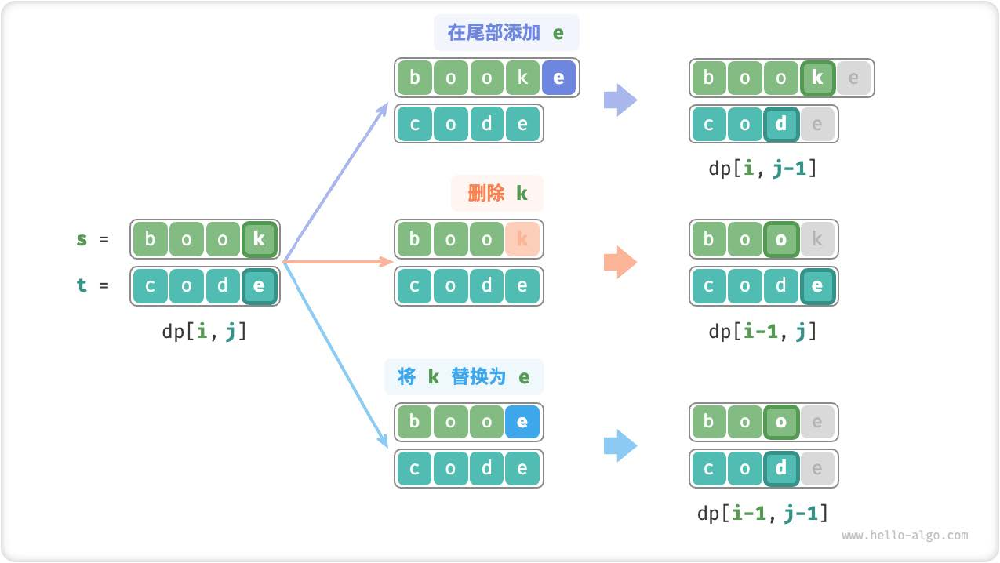

可得最优子结构：𝑑𝑝[𝑖, 𝑗] 的最少编辑步数等于𝑑𝑝[𝑖, 𝑗 − 1]、𝑑𝑝[𝑖 − 1, 𝑗]、𝑑𝑝[𝑖 − 1, 𝑗 − 1]
三者中的最少编辑步数，再加上本次的编辑步数1 。对应的状态转移方程为：
𝑑𝑝[𝑖, 𝑗] = min(𝑑𝑝[𝑖, 𝑗 − 1], 𝑑𝑝[𝑖 − 1, 𝑗], 𝑑𝑝[𝑖 − 1, 𝑗 − 1]) + 1
请注意，当𝑠[𝑖 − 1] 和𝑡[𝑗 − 1] 相同时，无须编辑当前字符，这种情况下的状态转移方程为：𝑑𝑝[𝑖, 𝑗] = 𝑑𝑝[𝑖 − 1, 𝑗 − 1]

3. 第三步：确定边界条件和状态转移顺序
当两字符串都为空时，编辑步数为0 ，即𝑑𝑝[0, 0] = 0 。当𝑠 为空但𝑡 不为空时，最少编辑步数等于𝑡 的长
度，即首行𝑑𝑝[0, 𝑗] = 𝑗 。当𝑠 不为空但𝑡 为空时，等于𝑠 的长度，即首列𝑑𝑝[𝑖, 0] = 𝑖 

```js
/* 编辑距离问题 */
function editDistanceDP(s, t) {
    const m = s.length, n = t.length;
   
    const dp = Array.from(new Array(m + 1) , () => {
        return new Array(n + 1).fill(0)
    });
    // 状态转移：首行首列
    for(let i = 1; i <= n; i++) {
        dp[0][i] = i;
    }

    for(let j = 1; j <= m; j++) {
        dp[j][0] = j;
    }

    for(let i = 1; i <= m; i++) {
        for(let j = 1; j <= n; j++) {
            if(s[i - 1] == t[j - 1]) {
                // 若两字符相等，则直接跳过此两字符
                dp[i][j] = dp[i - 1 ][j - 1]
            } else {
                // 最少编辑步数= 插入、删除、替换这三种操作的最少编辑步数+ 1
                dp[i][j] = Math.min(dp[i][j - 1], dp[i - 1][j], dp[i - 1][j - 1]) + 1
            }
        }
    }
    return dp[m][n];
}


// 动态规划
let res = editDistanceDP('kitten', 'sitting');
console.log(`编辑距离问题 ${res}`);
```