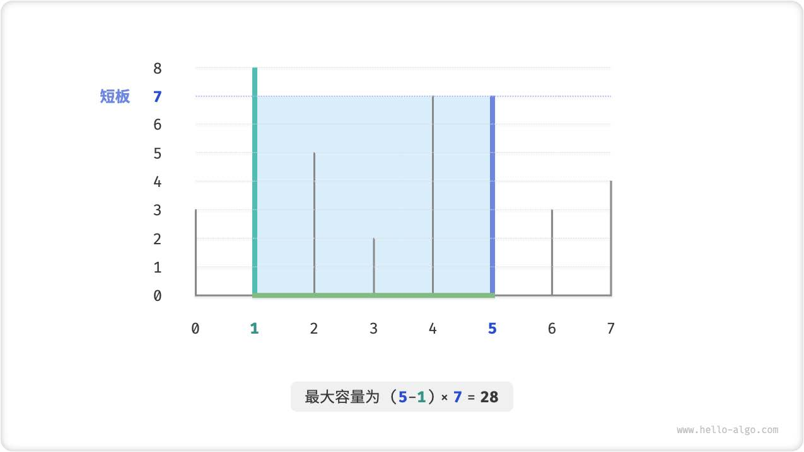
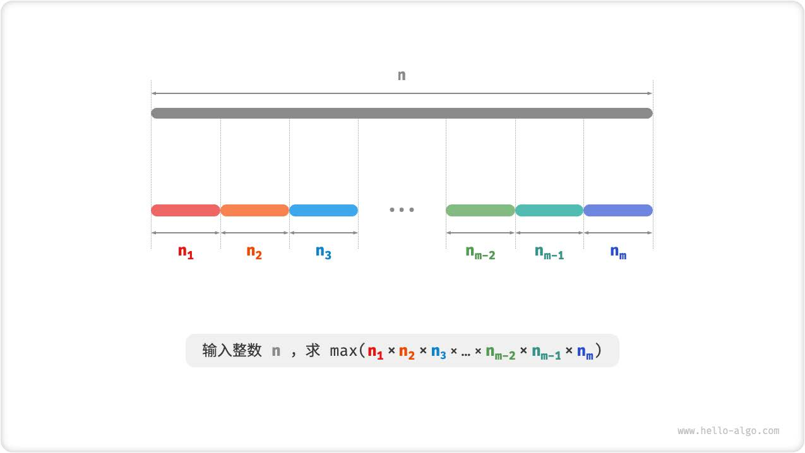

## 2024 年 3 月 4 日
## 贪心算法
> 「贪心算法greedy algorithm」是一种常见的解决优化问题的算法，其基本思想是在问题的每个决策阶段， 
   都选择当前看起来最优的选择，即贪心地做出局部最优的决策，以期望获得全局最优解。

什么样的问题适合使用贪心算法
+ **贪心选择性质**：只有当局部最优选择始终可以导致全局最优解时，贪心算法才能保证得到最优解。
+ **最优子结构**：原问题的最优解包含子问题的最优解。

## 1.分数背包问题
> 给定𝑛 个物品，第𝑖 个物品的重量为𝑤𝑔𝑡[𝑖 − 1]、价值为𝑣𝑎𝑙[𝑖 − 1] ，和一个容量为𝑐𝑎𝑝 的
背包。每个物品只能选择一次，但可以选择物品的一部分，价值根据选择的重量比例计算，问
在不超过背包容量下背包中物品的最大价值。


分数背包和0‑1 背包整体上非常相似，状态包含当前物品𝑖 和容量𝑐 ，目标是求不超过背包容量下的最大价
值。
不同点在于，本题允许只选择物品的一部分。如图15‑4 所示，我们可以对物品任意地进行切分，并按照重量
比例来计算物品价值。
1. 对于物品𝑖 ，它在单位重量下的价值为𝑣𝑎𝑙[𝑖 − 1]/𝑤𝑔𝑡[𝑖 − 1] ，简称为单位价值。
2. 假设放入一部分物品𝑖 ，重量为𝑤 ，则背包增加的价值为𝑤 × 𝑣𝑎𝑙[𝑖 − 1]/𝑤𝑔𝑡[𝑖 − 1] 。
```js
/* 物品 */
class Item {
  constructor(w, v) {
    this.w = w; // 物品重量
    this.v = v; // 物品价值
  }
}

/* 分数背包：贪心 */
function fractionalKnapsack(wgt, val, cap) {
  // 创建物品列表，包含两个属性：重量、价值
  const items = wgt.map((w, i) => new Item(w, val[i]));
  // 按照单位价值 item.v / item.w 从高到低进行排序
  items.sort((a, b) => b.v / b.w - a.v / a.w);
  // 循环贪心选择
  let res = 0;
  for (const item of items) {
    if (item.w <= cap) {
      // 若剩余容量充足，则将当前物品整个装进背包
      res += item.v;
      cap -= item.w;
    } else {
      // 若剩余容量不足，则将当前物品的一部分装进背包
      res += (item.v / item.w) * cap;
      // 已无剩余容量，因此跳出循环
      break;
    }
  }
  return res;
}

/* Driver Code */
const wgt = [10, 20, 30, 40, 50];
const val = [50, 120, 150, 210, 240];
const cap = 50;
const n = wgt.length;

// 贪心算法
const res = fractionalKnapsack(wgt, val, cap);
console.log(`不超过背包容量的最大物品价值为 ${res}`);

```

## 2.最大容量问题
> 输入一个数组ℎ𝑡 ，数组中的每个元素代表一个垂直隔板的高度。数组中的任意两个隔板，以
及它们之间的空间可以组成一个容器。
容器的容量等于高度和宽度的乘积（即面积），其中高度由较短的隔板决定，宽度是两个隔板
的数组索引之差。
请在数组中选择两个隔板，使得组成的容器的容量最大，返回最大容量。



容器由任意两个隔板围成，因此本题的状态为两个隔板的索引，记为[𝑖, 𝑗] 。
根据题意，容量等于高度乘以宽度，其中高度由短板决定，宽度是两隔板的索引之差。设容量为𝑐𝑎𝑝[𝑖, 𝑗] ，
则可得计算公式：
𝑐𝑎𝑝[𝑖, 𝑗] = min(ℎ𝑡[𝑖], ℎ𝑡[𝑗]) × (𝑗 − 𝑖)

贪心策略确定
现选取一个状态[𝑖, 𝑗] ，其满足索引𝑖 < 𝑗 且高度ℎ𝑡[𝑖] < ℎ𝑡[𝑗]
，即𝑖 为短板、𝑗 为长板。若此时将长板𝑗 向短板𝑖 靠近，则容量一定变小。
1. 初始状态下，指针𝑖 和𝑗 分列与数组两端。
2. 计算当前状态的容量𝑐𝑎𝑝[𝑖, 𝑗] ，并更新最大容量。
3. 比较板𝑖 和板𝑗 的高度，并将短板向内移动一格。
4. 循环执行第2. 和3. 步，直至𝑖 和𝑗 相遇时结束。

```js
/* 最大容量：贪心 */
function maxCapacity(ht) {
  // 初始化 i, j，使其分列数组两端
  let i = 0,
    j = ht.length - 1;  
  // 初始最大容量为 0
  let res = 0;
  // 循环贪心选择，直至两板相遇
  while (i < j) {
    // 更新最大容量
    const cap = Math.min(ht[i], ht[j]) * (j - i);
    res = Math.max(res, cap);
    // 向内移动短板
    if (ht[i] < ht[j]) {
      i += 1;
    } else {
      j -= 1;
    }
  }
  return res;
}

/* Driver Code */
const ht = [3, 8, 5, 2, 7, 7, 3, 4];

// 贪心算法
const res = maxCapacity(ht);
console.log(`最大容量为 ${res}`);
```

## 3.最大切分乘积问题
> 给定一个正整数𝑛 ，将其切分为至少两个正整数的和，求切分后所有整数的乘积最大是多少。



贪心策略确定:
两个整数的乘积往往比它们的加和更大。假设从𝑛 中分出一个因子2 ，则它们的乘积为2(𝑛 − 2)
。我们将该乘积与𝑛 作比较：
2(𝑛 − 2) ≥ 𝑛
2𝑛 − 𝑛 − 4 ≥ 0
𝑛 ≥ 4
当𝑛 ≥ 4 时，切分出一个2 后乘积会变大，这说明大于等于4 的整数都应该被切分。
贪心策略一：如果切分方案中包含≥ 4 的因子，那么它就应该被继续切分。最终的切分方案只应出现1、2、
3 这三种因子。
当𝑛 = 6 时，有3 × 3 > 2 × 2 × 2 。这意味着切分出3 比切分出2 更优。
贪心策略二：在切分方案中，最多只应存在两个2 。因为三个2 总是可以被替换为两个3 ，从而获得更大乘
积。

总结以上，可推出以下贪心策略。
1. 输入整数𝑛 ，从其不断地切分出因子3 ，直至余数为0、1、2 。
2. 当余数为0 时，代表𝑛 是3 的倍数，因此不做任何处理。
3. 当余数为2 时，不继续划分，保留之。
4. 当余数为1 时，由于2 × 2 > 1 × 3 ，因此应将最后一个3 替换为2 。

```js
/* 最大切分乘积：贪心 */
function maxProductCutting(n) {
  // 当 n <= 3 时，必须切分出一个 1
  if (n <= 3) {
    return 1 * (n - 1);
  }
  // 贪心地切分出 3 ，a 为 3 的个数，b 为余数
  let a = Math.floor(n / 3);
  let b = n % 3;
  if (b === 1) {
    // 当余数为 1 时，将一对 1 * 3 转化为 2 * 2
    return Math.pow(3, a - 1) * 2 * 2;
  }
  if (b === 2) {
    // 当余数为 2 时，不做处理
    return Math.pow(3, a) * 2;
  }
  // 当余数为 0 时，不做处理
  return Math.pow(3, a);
}

/* Driver Code */
let n = 58;

// 贪心算法
let res = maxProductCutting(n);
console.log(`最大切分乘积为 ${res}`);
```