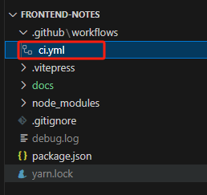
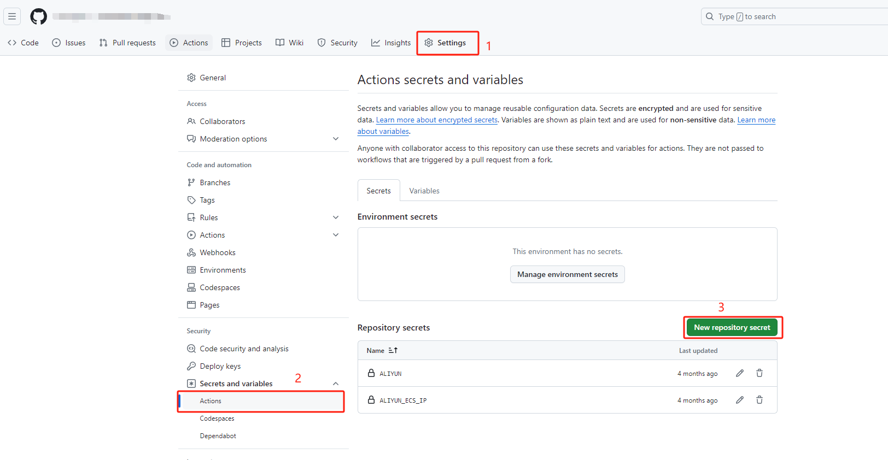
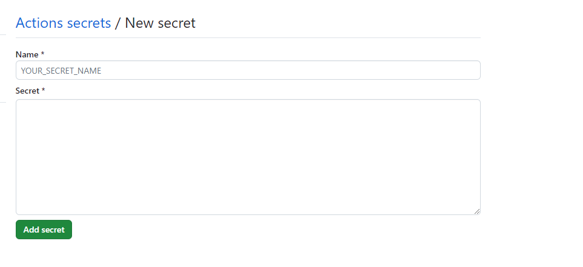
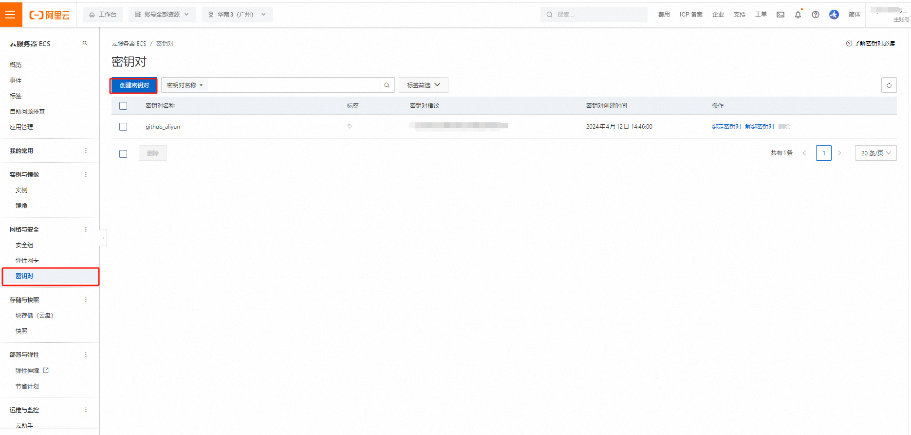
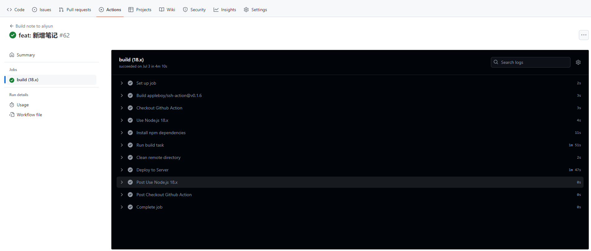

## 2024 年 8 月 15 日 项目部署的实践

> `CI`，`Continuous Integration`，持续集成。
  `CD`，`Continuous Deployment`，持续部署。
## 一、github中基于Action做代码CD
> 需求 当本地修改完推送到main分支后将代码打包后的产物部署到阿里云服务器中

#### 1. 新建yml文件
在代码文件中的`.github`文件夹下新建`workflows`文件夹，在`workflows`文件夹下新建`xxx.yml`文件。其中`xxx`随便命名。



#### 2. 配置Action变量
在github仓库中的`Setting -> Security -> Secreats and variables -> Action` 中填加一些变量避免`yml`文件中暴漏私人信息（不在乎可忽略，但不建议）




#### 3. 获取远程服务的秘钥
以阿里云为例： `云服务器 -> 网络与安全 -> 密钥对 创建秘钥`



#### 4. yml配置文件如下：

[yml参考配置地址](https://docs.github.com/zh/actions/writing-workflows/workflow-syntax-for-github-actions)

```yml
name: Build note to aliyun
on:
  #监听push操作
  push:
    branches:
      # master分支，你也可以改成其他分支
      - main
jobs:
  build:
    runs-on: ubuntu-latest
    
    strategy:
      matrix:
        node-version: [18.x] # 可以指定多个希望测试的Node.js版本

    steps:

      - name: Checkout Github Action
        uses: actions/checkout@v3

      - name: Use Node.js ${{ matrix.node-version }}
        uses: actions/setup-node@v3
        with:
          node-version: ${{ matrix.node-version }}
          
      - name: Install npm dependencies
        run: yarn

      - name: Run build task
        run: yarn docs:build

      - name: Clean remote directory
        uses: appleboy/ssh-action@v0.1.6
        with:
          # 远程仓库的主机地址 其中secrets.ALIYUN_ECS_IP 为步骤2中配置的变量
          host: ${{ secrets.ALIYUN_ECS_IP }} 
          username: root
          # 远程仓库的key 步骤3中获取 其中secrets.ALIYUN 为步骤2中配置的变量
          key: ${{ secrets.ALIYUN }}   
          script: |
            rm -rf /usr/local/nginx/html/doc/*

      - name: Deploy to Server
        uses: easingthemes/ssh-deploy@v2.1.5
        with:
          SSH_PRIVATE_KEY: ${{ secrets.ALIYUN }}
          ARGS: "-r"
          SOURCE: "docs/.vitepress/dist/"
          REMOTE_HOST: ${{ secrets.ALIYUN_ECS_IP }}
          REMOTE_USER: root
          TARGET: "/usr/local/nginx/html/doc/"

```

当代码`mian`分支`push`则会触发`action` 依据我们配置的`yml`文件执行



## 二、jenkins 配置CI/CD


## 三、基于docker配置 CI/CD

