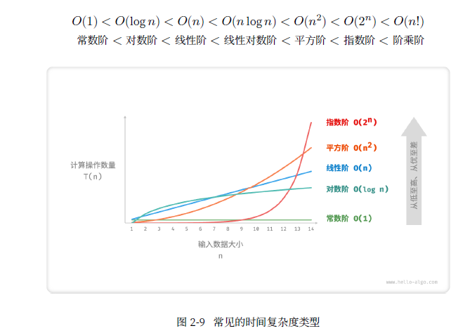

[算法题github仓库](https://github.com/Sunny-117/js-challenges)
[代码随想录](https://programmercarl.com/)

## 2024 年 2 月 29 日

## 1.时间复杂度和空间复杂度

+ 时间复杂度： 算法运行时间随着数据量变大时的增长趋势
𝑂(1) < 𝑂(log 𝑛) < 𝑂(𝑛) < 𝑂(𝑛 log 𝑛) < 𝑂(𝑛2) < 𝑂(2𝑛) < 𝑂(𝑛!)
常数阶< 对数阶< 线性阶< 线性对数阶< 平方阶< 指数阶< 阶乘阶

1. 常数阶𝑂(1)
常数阶的操作数量与输入数据大小𝑛 无关，即不随着𝑛 的变化而变化。
2. 线性阶𝑂(𝑛)
线性阶的操作数量相对于输入数据大小𝑛 以线性级别增长。单层for循环
3. 平方阶𝑂(𝑛2)
平方阶的操作数量相对于输入数据大小𝑛 以平方级别增长。平方阶通常出现在嵌套循环中，外层循环和内层
循环都为𝑂(𝑛) ，因此总体为𝑂(𝑛2) 
4. 指数阶𝑂(2𝑛)
在实际算法中，指数阶常出现于递归函数中。例如在以下代码中，其递归地一分为二，经过𝑛 次分裂后停
止：
```js
// === File: time_complexity.cpp ===
/* 指数阶（递归实现） */
int expRecur(int n) {
if (n == 1)
return 1;
return expRecur(n - 1) + expRecur(n - 1) + 1;
}
```
5. 对数阶𝑂(log 𝑛)
与指数阶相反，对数阶反映了“每轮缩减到一半”的情况。设输入数据大小为𝑛 ，由于每轮缩减到一半，因
此循环次数是log2 𝑛 ，即2𝑛 的反函数。
```js
/* 对数阶（递归实现） */
int logRecur(float n) {
if (n <= 1)
return 0;
return logRecur(n / 2) + 1;
}
```
6. 线性对数阶𝑂(𝑛 log 𝑛)
线性对数阶常出现于嵌套循环中，两层循环的时间复杂度分别为𝑂(log 𝑛) 和𝑂(𝑛) 。相关代码如下：

7. 阶乘阶𝑂(𝑛!)
阶乘阶对应数学上的“全排列”问题。

+ 空间复杂度：用于衡量算法占用内存空间随着数据量变大时的增长趋势
𝑂(1) < 𝑂(log 𝑛) < 𝑂(𝑛) < 𝑂(𝑛2) < 𝑂(2𝑛)
常数阶< 对数阶< 线性阶< 平方阶< 指数阶
1. 常数阶𝑂(1)
常数阶常见于数量与输入数据大小𝑛 无关的常量、变量、对象。
2. 线性阶𝑂(𝑛)
线性阶常见于元素数量与𝑛 成正比的数组、链表、栈、队列等：
3. 平方阶𝑂(𝑛2)
平方阶常见于矩阵和图，元素数量与𝑛 成平方关系：
4. 指数阶𝑂(2𝑛)
指数阶常见于二叉树。高度为𝑛 的“满二叉树”的节点数量为2𝑛 − 1 ，占用𝑂(2𝑛) 空间：
5. 对数阶𝑂(log 𝑛)
对数阶常见于分治算法。例如归并排序，输入长度为𝑛 的数组，每轮递归将数组从中点划分为两半，形成高
度为log 𝑛 的递归树，使用𝑂(log 𝑛) 栈帧空间。

## 2. 常见的数据结构包括数组、链表、栈、队列、哈希表、树、堆、图
/* 前序遍历*/  根节点-> 左子树-> 右子树
/* 中序遍历*/  左子树-> 根节点-> 右子树
/* 后序遍历*/  左子树-> 右子树-> 根节点

## 3. 二分查找
时间复杂度𝑂(log 𝑛) ：在二分循环中，区间每轮缩小一半，循环次数为log2 𝑛 。
空间复杂度𝑂(1) ：指针𝑖 和𝑗 使用常数大小空间。
```js
const binarySearch = (arr, target) => {
  let l = 0, r = arr.length - 1;
  while (l <= r) {
    const m = l + Math.floor((r - l) / 2);
    if (arr[m] < target) {
      l = m + 1;
    }
    if (arr[m] > target) {
      r = m - 1;
    }
    if (arr[m] === target) {
      return m;
    }
  }
  return -1;
};
```
## 4. 排序算法
#### 4.1 选择排序
> 开启一个循环，每轮从未排序区间选择最小的元素，将其放到已排序区间的末尾。
+ 时间复杂度为𝑂(𝑛2)
+ 空间复杂度𝑂(1)
+ 非稳定排序
```js

const selectionSort = (arr) => {
  const len = arr.length;
  for (let i = 0; i < len; i++) {
    let min = i;
    for (let j = i + 1; j < len; j++) {
      if (arr[j] < arr[min]) {
        min = j;
      }
    }
    if (min !== i) {
      const temp = arr[i];
      arr[i] = arr[min];
      arr[min] = temp;
    }
  }
  return arr;
};

console.log(selectionSort([4,1,3,1,5,2]))
```

#### 4.2 冒泡排序
> 开启一个循环，每轮比较相邻的元素，如果前面的元素比后面的大，就交换它们的位置。
+ 时间复杂度为𝑂(𝑛2)
+ 空间复杂度𝑂(1)
+ 稳定排序
```js
const bubbleSort = (arr) => {
  const len = arr.length;

  for (let i = len - 1; i > 0; i--;) {
    for (let j = 0; j < i; j++) {
      if (arr[j] > arr[j + 1]) {
        const temp = arr[j];
        arr[j] = arr[j + 1];
        arr[j + 1] = temp;
      }
    }
  }
  return arr;
};
```

#### 4.3 插入排序
> 我们在未排序区间选择一个基准元素，将该元素与其左侧已排序区间的元素逐一比较大小，并将该元素插入到正确的位置。
+ 时间复杂度为𝑂(𝑛2)
+ 空间复杂度𝑂(1)
+ 稳定排序
```js
const insertionSort = (arr) => {
  const len = arr.length;
  for (let i = 1; i < len; i++) {
    const base = arr[i];
    let j = i - 1;
    while (j>=0 && arr[j] > base) {
      arr[j+1] = arr[j];
      j--;
    }
    arr[j+1] = base;
  }
  return arr;
}

```

#### 4.4 快速排序
> 快速排序的基本思想是：
> 1. 从数列中挑出一个元素，称为“基准”（pivot）；
> 2. 重新排序数列，所有元素比基准值小的摆放在基准前面，
> 3. 所有元素比基准值大的摆在基准后面；
> 4. 这一基准就处于数列的中间位置。
+ 时间复杂度为𝑂(𝑛log 𝑛)
+ 空间复杂度𝑂(1)
+ 不稳定排序
```js
const quickSort = (arr) => {
  const len = arr.length;
  if (len <= 1) {
    return arr;
  }
  const pivot = arr[0];
  const left = [];
  const right = [];
  for (let i = 1; i < len; i++) {
    if (arr[i] < pivot) {
      left.push(arr[i]);
    }
    if (arr[i] > pivot) {
      right.push(arr[i]);
    }
    return quickSort(left).concat(pivot, quickSort(right));
  }
}
```

#### 4.5 归并排序
> 
+ 时间复杂度为𝑂(𝑛log 𝑛)
+ 空间复杂度𝑂(n)
+ 稳定排序
```js
// 合并两个有序数组的函数
function merge(leftHalf, rightHalf) {
  let result = [];
  let leftIndex = 0;
  let rightIndex = 0;

  // 比较左右两边数组的元素，按顺序合并到结果数组中
  while (leftIndex < leftHalf.length && rightIndex < rightHalf.length) {
    if (leftHalf[leftIndex] <= rightHalf[rightIndex]) {
      result.push(leftHalf[leftIndex++]);
    } else {
      result.push(rightHalf[rightIndex++]);
    }
  }

  // 如果左边数组还有剩余元素，则将其全部添加到结果数组
  while (leftIndex < leftHalf.length) {
    result.push(leftHalf[leftIndex++]);
  }

  // 如果右边数组还有剩余元素，则将其全部添加到结果数组
  while (rightIndex < rightHalf.length) {
    result.push(rightHalf[rightIndex++]);
  }

  return result;
}
const mergeSort = (arr) => {
  if (arr.length <= 1) {
    return arr;
  }
  const mid = Math.floor(arr.length / 2);
  const left = arr.slice(0, mid);
  const right = arr.slice(mid);
  return merge(mergeSort(left), mergeSort(right));
}

```

