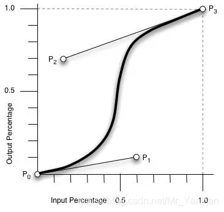
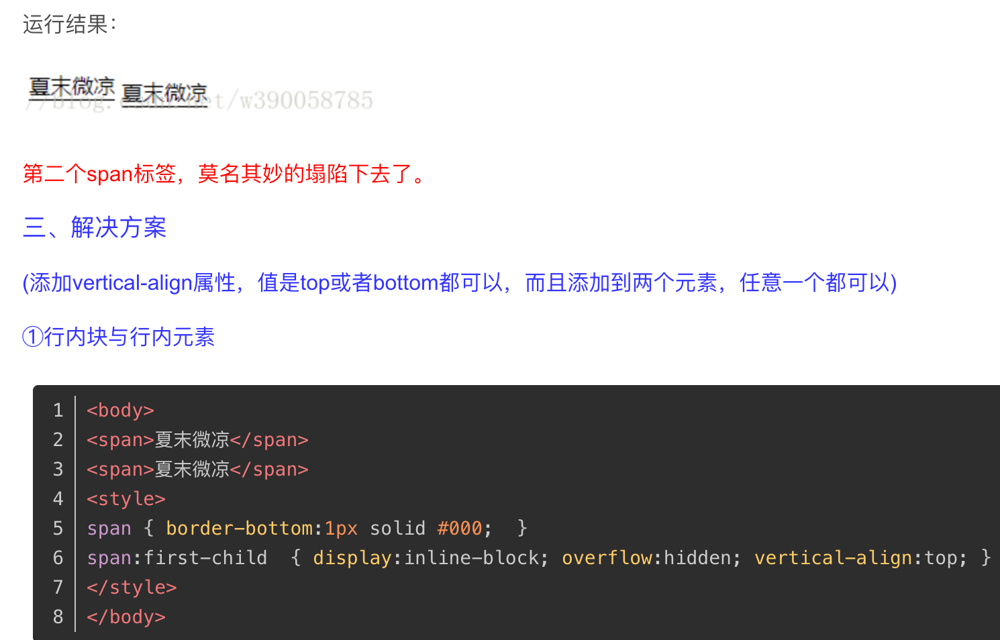
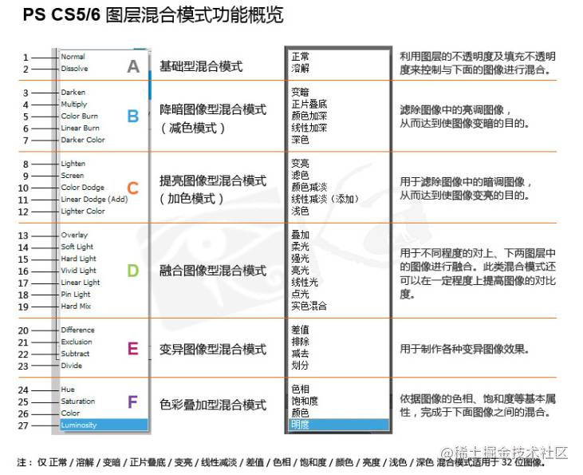
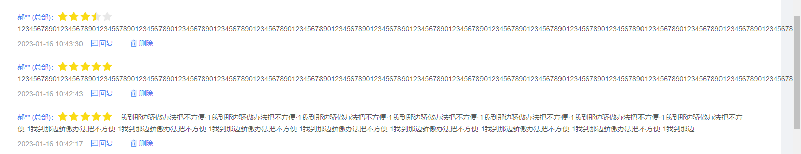
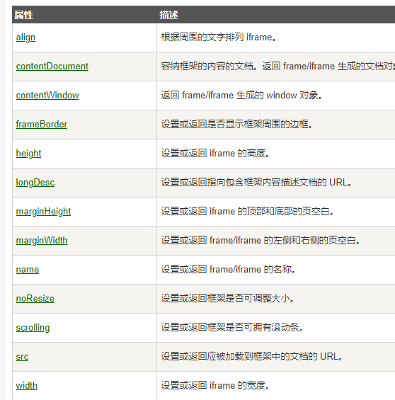
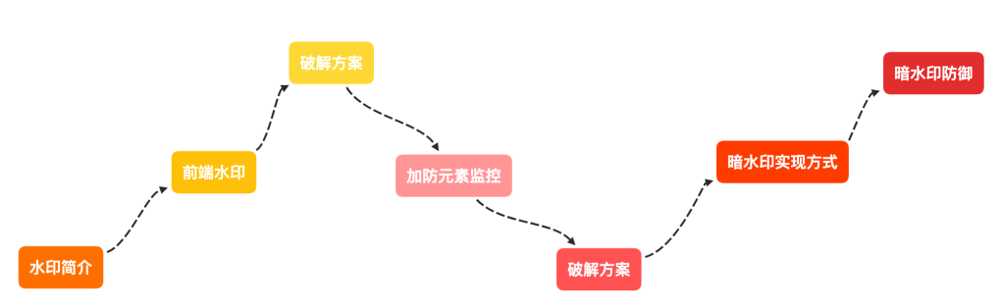

<WaterMark />
# H5C3

### CSS相关


#### 自定义css属性

```css
/* css中 :root 表示根标签<html> */
:root {
  --first-color: #488cff;    /* 自定义属性，使用 -- 开头 */
  --second-color: #ffff8c;
}

#firstParagraph {
  background-color: var(--first-color);  /* 使用自定义变量 var() */
  color: var(--second-color);
}
```


#### 盒子模型

- 通过`box-sizing`指定盒子模型
  - `content-box`：盒子大小为 width + padding + border （默认属性）
  - `box-sizing`：盒子大小为 width（padding、border包含在width中）
    - 此时的border和padding不会撑大盒子（它们不超过width时）
    - css3盒模型相比于传统盒模型，更适合移动端开发


#### 计算函数calc

> calc() 函数用于动态计算长度值。

- 注意：运算符前后都需要保留一个空格，例如：`width: calc(100% - 10px)`

- 任何长度值都可以使用，支持  +  -  *  /  运算

  ```css
  input {
    padding: 2px;
    display: block;
    width: calc(100% - 1em);
  }
   
  #formbox {
    width: calc(100% / 6);
    border: 1px solid black;
    padding: 4px;
  }
  ```

  


#### 文本溢出隐藏

```html
<style>
.app{
    // 单行文本溢出隐藏
    overflow:hidden;
    text-overflow:ellipsis;
    white-space:nowrap;
    
    // 多行文本溢出隐藏
    display: -webkit-box;
    overflow:hidden;
    -webkit-line-clamp: 2;
    -webkit-box-orient: vertical;
    
    // text-overflow:ellipsis;
}
</style>
```


#### span中字母换行

在*span*内加上style属性word-break:break-all;


#### animation动画

- 关键帧动画- 步长`setup`
- 可以为某个元素添加多个动画，用逗号分隔，他们会分别同时执行。

```css
/* steps 就是分几步来完成动画 有了steps就不用再写动画速度ease或linear  */
animation: bear 3s setup(3), move 3s forwards;
@keyframes bear{
    0%{
        background-position:0 0;
    }
    100% {
        background-position:-1600px 0;
    }
}
@keyframes move{
    0%{
        left:0;
    }
    100%{
        left:100%;
    }
}
```


#### 贝赛尔曲线

> - cubic-bezier又称三次贝塞尔曲线，这是一个函数，可以生成CSS动画的速度曲线
>
> [CSS--贝塞尔曲线(cubic-bezier)--使用/教程/实例_css贝塞尔曲线](https://blog.csdn.net/feiying0canglang/article/details/121186124)
>
> [CSS过渡动画中的回弹(OverScroll)效果，一个函数就能让你的动效瞬间变得高大上](https://zhuanlan.zhihu.com/p/397089242#:~:text=CSS代码： transition%3A transform 1s,linear%3B transform%3A translateX(60vw)%3B 但是动画效果十分的生硬，可以看下图%3A 我们可以稍微加一点修饰，将transition的第三个参数转速曲线（timing-function）改成ease-in-out（平滑进平滑出），可以让它稍微有一点物体的质感。)

```css
格式：cubic-bezier(<x1>,<y1>,<x2>,<y2>)。 
P0：默认值(0,0)
P1：动态取值(x1,y1)
P2：动态取值(x2,y2)
p3：默认值(1,1)

/* 
	linear ：cubic-bezier(0,0,1,1)   匀速运动
	ease ：cubic-bezier(0.25,0.1,0.25,1),  先慢后快再慢
	linear ：cubic-bezier(0,0,1,1)   匀速运动
	ease-in-out ：cubic-bezier(0.42,0,0.58,1),先慢后快再慢
*/
```




#### 2D/3D

- 所谓的`移动`或`旋转`都是对于盒子当前的平面来说的


#### 布局

##### Grid网格布局

> 二维布局，可同时控制行、列的布局
>
> - [Grid布局实现不定高度的真瀑布流，只需几行代码 - 掘金 (juejin.cn)](https://juejin.cn/post/7263386035462127671)
> - [史上最全的瀑布流布局前端方案汇总！ - 掘金 (juejin.cn)](https://juejin.cn/post/7013650466877898789)
> - [列宽自适应`auto-fill 与 auto-fit` 区别](https://juejin.cn/post/6844903565463388168)
>   - `auto-fill` 倾向于容纳更多的列，所以如果在满足宽度限制的前提下还有空间能容纳新列，那么它会暗中创建一些列来填充当前行。即使创建出来的列没有任何内容，但实际上还是占据了行的空间。
>   - `auto-fit` 倾向于使用最少列数占满当前行空间，浏览器先是和 `auto-fill` 一样，暗中创建一些列来填充多出来的行空间，然后坍缩（collapse）这些列以便腾出空间让其余列扩张。

```css
/* 父元素 - 需要给个宽度 */
display:grid			/* 开启grid布局 */
grid-template-columns: 100px 100px 1fr 2fr;	/* 设置n列，以及每列的宽度，px固定宽度 || fr浮动宽度  */
grid-template-columns: repeat(auto-fill, minmax(280px, 1fr));	/* 自适应，最小宽度280px，最大1fr */
column-gap: 24px;	/* 设置列间距 */
row-gap: 24px;	/* 设置行间距 */
gap: 24px;		/* 简写，统一设置 行、列 间距 */

align-items: center || end || top; /* 设置每块垂直方向的对齐方式 */
justify-items: center || end || space-between;	/* 设置每块水平方向的对齐方式 */

align-content:center;	/* 设置整体在Grid容器中垂直方向的对齐方式 - 当内容小于grid容器时使用 */
justify-content:center;	/* 设置整体在Grid容器中垂直方向的对齐方式 - 当内容小于grid容器时使用 */


/* 列宽自适应 */
repeat() 方法自适应列数
	minmax() 限制自适应大小范围

/* 
指定网格列数：
	- 保持12列
	- 1fr 表示让浏览器将网格空间进行均分
	- minmax(250px, 1fr) 250px 最小宽度; 1fr  最大宽度
*/
grid-template-columns: repeat(12, 1fr);	
grid-template-columns: repeat(auto-fit, minmax(250px, 1fr) );
```


##### 多列布局

> - 缺点
>   - css3 多列布局是 先竖向 后横向 排列
>   - 真正的瀑布流是 先横向 后竖向 排列
>   - 如果后期动态追加数据，会导致页面所有盒子重新排序

```css
columns: 5;
column-gap: 1vw;

/* 避免内容被分裂 */
height: 100%;
overflow: auto;
```


#### 性能


##### content-visibility

> 控制元素是否渲染其内容，以及施加一组强局限，由此允许用户代理有机会在不需要时省略大片的布局和渲染工作。
>
> - [使用 content-visibility 优化渲染性能 - 掘金 (juejin.cn)](https://juejin.cn/post/7108921365628977166)
> - [content-visibility - CSS：层叠样式表 | MDN (mozilla.org)](https://developer.mozilla.org/zh-CN/docs/Web/CSS/content-visibility#浏览器兼容性)

- 通过调过可视区外元素的渲染，实现长列表、大量数据的切换加载渲染性能

```css
content-visibility: auto;		/* 如果该元素不在屏幕上，且与用户无关，则不渲染其后代元素 */
contain-intrinsic-size: 284px;	 /* 基于一定初始高度，撑开滚动条 */
```


##### 浏览器私有前缀

> 兼容旧版本浏览器时需要添加，不过打包工具已经做了

```css
-moz-   /* firefox */
-ms-   /* ie */
-webkit-   /* 绝大数，代表chrome、safari等 */
-o-   /* opera */

// 从前的写法
-moz-border-radius: 10px;
-webkit-border-radius: 10px;
-o-border-radius: 10px;
border-radius:10px
```


#### 移动端特殊样式

```css
/* ios移动端默认的样式，需要加该样式才能给按钮和输入框自定义样式 */
input{  -webkit-appearance:none; }

/* 禁用长按页面是的弹出菜单 */
img,a{ -webkit-touch-callout:none; }
```


#### 小问题

##### css滚动条隐藏

```css
/* 隐藏滚动条，但保留功能： */
/* 隐藏 Chrome、Safari 和 Opera 的滚动条 */
.example::-webkit-scrollbar {
  display: none;
}

/* 隐藏 IE、Edge 和 Firefox 的滚动条 */
.example {
  -ms-overflow-style: none;  /* IE and Edge */
  scrollbar-width: none;  /* Firefox */
}
```


##### 粘性定位不生效

> position:sticky;

1. 需指定 left, right, top 或 bottom 中的任何一个值
2. 情况2: 垂直滚动时，粘性约束元素高度小于等于 sticky 元素高度


##### 溢出隐藏-文本塌陷

- 产生原因：实现隐藏功能的时候，隐藏部分的内容的vertical-align变成了baseline;对齐了，这样也导致行内块元素高度被撑高了。而后续的行内块元素跟行内元素，是接在了隐藏部分的vertical-align的高度上了。只要改回后续行内块元素跟行内元素的vertical-align值就可以了




#### 样式美化


##### color自动反转

> - [神奇的 CSS，让文字智能适配背景颜色-腾讯云开发者社区-腾讯云 (tencent.com)](https://cloud.tencent.com/developer/article/1989572)
> - [CSS 如何根据背景色自动切换黑白文字？ - 掘金 (juejin.cn)](https://juejin.cn/post/7181328175774269500)

```js
// 使用css混合模式
mix-blend-mode: difference
```




##### 背景渐变

```css
 background-color: #99fff0;
 background-image:
	radial-gradient(at 95% 18%, hsla(150, 67%, 73%, 1) 0px, transparent 50%),
	radial-gradient(at 58% 99%, hsla(153, 85%, 77%, 1) 0px, transparent 50%),
	radial-gradient(at 16% 88%, hsla(178, 91%, 56%, 0.74) 0px, transparent 50%),
	radial-gradient(at 95% 64%, hsla(181, 73%, 71%, 1) 0px, transparent 50%),
	radial-gradient(at 27% 35%, hsla(185, 94%, 72%, 1) 0px, transparent 50%);


background: linear-gradient(blue, pink);	/* 至少指定两个色标，也可以指定任意数量 */
background: linear-gradient(to right, blue, pink);	/* 指定渐变的方向，默认从上到下 */
background: linear-gradient(to bottom right, blue, pink);  /* 对角线渐变 */
background: linear-gradient(70deg, blue, pink);	/* 自定义渐变角度 0 上到下；90 左到右 */
```


##### 好看的字体

- 轮廓线的字体

  ```css
    font-weight: 600;
    font-size: 36px;
    color: #B7F0FD;
    letter-spacing: 2px;
    text-shadow: 0px 0px 3px #0069FF, 0px 0px 3px #0069FF,
      0px 0px 3px #0069FF, 0px 0px 3px #0069FF;
  
  ```

  

- 渐变色字体

  ```css
    background: -webkit-linear-gradient(#06b46c,#405792,#1a0157);
    -webkit-background-clip: text;
    -webkit-text-fill-color: transparent;
  ```


##### CSS滤镜：

- drop-shadow：给一个元素`(而不是整个盒子)`添加阴影，这个阴影并不对应于它的边界框，而是使用该元素的Alpha蒙版。例如，我们可以在透明的PNG或SVG徽标中添加投影

- box-shadow：提供了一个矩形阴影，即使元素没有背景；

- css抗锯齿形：`-webkit-font-smoothing:antialiased`，让文字显示更加清晰

- 背景图片模糊+背景遮罩（不创建额外的元素）

  - ```css
    background-image:url('a.png');
    background-color:red;
    background-blend-mode:multiply;	/* 使用混合模式，背景色和背景图同时生效 */
    ```


### HTML相关

#### 标签

##### script标签

```html
<!-- 配置：crossorigin="anonymous"  在引入指定文件时，不向引入资源的服务器发送cookie内容 -->
<script crossorigin="anonymous"  href=""></script>
```


##### 语义化标签

```html
<header>顶部的部分</header>
<nav>导航</nav>
<section>重要的内容</section>
<main>网站的一部分</main>
<article>网站的一部分</article>
<aside>与本网站相关的一些链接或内容区域</aside>
<footer>底部区域</footer>
<code>一段电脑代码 print("Hello World")</code>   <!-- 标签是一个短语标签，用来定义计算机代码文本 -->
<kbd>键入</kbd>			<!-- 定义键盘文本。它表示文本是从键盘上键入的。它经常用在与计算机相关的文档或手册中 -->
```


#### emmnt语法

```html
<!-- 生成的标签中默认显示文字 div{文字}*2    -->
<div>文字</div>
<div>文字</div>
<!-- 生成的标签中默认显示文字 div{$}*3  $表示序号  -->
<div>1</div><div>2</div><div>3</div>
```


#### span换行异常

> - span标签内英文字母或数字超过标签宽度不自动换行问题
> - 添加样式`style="word-break: break-all"` 完美解决。
>
> 


#### script标签

```html
<!-- 配置：crossorigin="anonymous"  在引入指定文件时，不向引入资源的服务器发送cookie内容 -->
<script crossorigin="anonymous"  href=""></script>
```


#### 网页标题图标

- 写在head标签内，且`favicon.ico`放到网站的根目录下，浏览器会自动将该图标显示在地址栏和收藏夹中
- 建议设置`ico`格式的图片，并将图片命名为`favicon.ico`，像素大小16*16，颜色不超过16色
- 图片地址：本地图片 / 网络图片 均可。

` <link rel="icon shortcut" href="图片地址" type="image/x-icon" />`


#### 清除浮动

1. `clear:both;`

2. 给父元素添加高度

3. 开启BFC（块级格式化上下文）

   -  (BFC可以解决：margin合并   margin塌陷   浮动无法撑开父盒子)
   - (**BFC的子元素**不会对外面的元素产生影响)

   - 触发条件：

     - float 值不为none
     - overflow 值 不为visible
     - `display：table || table-cell || table-block`（不等于block、inline、none）
     - position:absolute  ||  fixed（不为 relative）
     - 根元素html

     


#### 语义化标签

```html
<header>顶部的部分</header>
<nav>导航</nav>
<section>重要的内容</section>
<main>网站的一部分</main>
<article>网站的一部分</article>
<aside>与本网站相关的一些链接或内容区域</aside>
<footer>底部区域</footer>
```

#### 表单增强

- type类型

  - tel 手机号

  - number：只允许输入数字

  - data 日期选择：会弹出日期选择框，value值格式为：`2022-04-21`

  - time 时间选择：value值格式为：`12:35`

  - 其他日期相关：datetime-local年月日时分、month年月、week第几周

  - color 颜色选择：value值格式为十六进制颜色值

  - range 滑块输入，属性：min最小值，max最大值，step分为几步

    ```html
    <input type='range' max='100' min='0' step='10'/>
    ```

    

- 新增input属性：

```html
<!-- 
pattern：值为正则表达式，在表单提交时进行表单验证
title：值为字符串，当不符合正则时的错误提示
required：有该属性表示此项为必填项
autofocus：有该属性则在页面加载后自动被选中
placeholder：用户未输入时的提示文本，值为字符串

注意：必须使用from标签包裹，且只在点击提交按钮后进行验证
-->
<input type='tel' pattern='1[3-8][0-9]{9}' required title="请输入正确的手机号">
```

- 其他标签

  ```html
  <!-- 
    progress：进度条,与滑块输入相比，该进度条用户不能直接操作
    meter：标尺，好像没啥用
  -->
  <progress value='30' max='100'></progress>
  <meter value='3' min='0' max='100'></meter>
  ```

- 其他属性

  ```html
  <!-- contenteditable='true'  该属性，可以让普通的元素变成一个可编辑的文本编辑器 -->
  <p contenteditable='true'>这里的内容是可以进行编辑的</p>
  ```

  


#### 标签配置

> JavaScript中，DOM对象通常都是多重继承的。同时继承了HTML和JavaScript的Object。Object是完完全全的内存对象，所以使用的是Property，而HTML本身是标记语言所以使用的是Attribute。
> 由于一些Attribute是很常用的，比如id等，所以DOM把它们映射到了Property上以方便使用。这样我们就会遇到一个对象同时具有id这个Attribute和Property。

- Attribute：特性
  - 是标记语言的概念，标记语言本身是一种文本，所以Attribute这种文本方式描述的性质在标记语言中很容易使用。
- property：属
  - 是保存在内存（memory）中，而内存会随着程序运行结束被释放，因此变得无法长期储存。


###  IFrame和Frame

- `<frameset cols='50%,50%'/>` （html4中定义一个框架集,h5不支持？）
  - 属性
    - cols 定义框架集中列的数目和尺寸
    - rows 定义框架集中行的数目和尺寸
  - `<noframes>` 标签 当浏览器不支持 framse时使用
  
- `<iframe/>`对象属性
  - contentDocument    容纳框架的内容的文档。返回 frame/iframe 生成的文档对象
  - contentWindow    返回 frame/iframe 生成的 window 对象
  - [Frame 和 IFrame 对象](https://www.runoob.com/jsref/dom-obj-frame.html)
  - 
  
- [获取父窗口的元素、父窗口、子窗口 ](https://www.cnblogs.com/goloving/p/7642381.html)

- contentWindow、contentDocument，区别如下：
  - contentWindow  这是个只读属性，返回指定的iframe的窗口对象
  - contentDocument   获取document对象
  - document.getElementById("myiframe").contentWindow，得到iframe对象后，就可以通过**contentWindow得到iframe包含页面的window对象**，然后就可以正常访问页面元素了；
  - 在iframe页面通过**parent可以获得主页面的window，接着就可以正常访问父亲页面的元素**了
  - parent.$("#frame_A")[0].contentWindow.document.getElmentById("#frame_B"); **同级iframe页面之间调用，需要先得到父亲的window**，然后调用同级的iframe得到window进行操作；
  - 　ifr.contentWindow 这里，返回的是iframe的window对象，所以后面可以接着调用document方法，再接着调用getElementByTagName。那么就可以对iframe里面的元素进行操作了
  - 在iframe本页面，要操作这个iframe的父页面的DOM元素（即嵌套这个iframe的页面）可以用：window.parent、window.top(这里的TOP是获取的顶层，即有多层嵌套iframe的时候使用)
  
- Frame / IFrame 对象事件
  - onload     在frame或者iframe载入完成后被触发
  
- 总结

  ```js
  self.location.href    // 指当前窗口的URL地址,去掉self默认为当前窗口的URL地址. 一般用于防止外部引用
  ```

  

### [postMessage() ](https://www.runoob.com/js/met-win-postmessage.html)

> postMessage() 方法用于安全地实现跨源通信
>


### CSS预处理语言

常见的css预处理器：Sass、Less、Stylus

#### [Less 快速入门](https://less.bootcss.com/)

- 使用：
  - 文件命名：`.less`
- 特点：
  - 引入变量、Mixin(混入)、运算、函数。。。
  - 简化css的编写、降低css的维护成本，用更少的代码做更多的事

##### Less变量

```less
// 定义变量语法：   @变量名:值;
@backgroundColor:red;

// 使用变量： 
body{
   background-color:@backgroundColor;
}
```

- 变量分类：
  - 作为普通属性值使用：直接使用`@+变量名`
  - 作为选择器和属性名：`#@{选择器的值}`的形式
  - 作为url：`@{url}`
  - 
- 变量命名规范：
  - 必须有@作为前缀
  - 不能包含特殊字符
  - 不能以数字开头
  - 大小写敏感
- 特点：当修改定义时变量的内容时，可以自动修改引用它的地方的内容


##### Less编译

- less需要转化为css，才能够被使用
- Vscode中借助 easy less插件进行自动编译：保存less文件时，直接生成对应的css


##### less注释

- `//` 开头的注释，**不会**被编译到css文件中
- `/* */` 包裹的注释**会**被编译到css文件中

```less
// 块注释和行注释都可以使用：

/* 一个块注释   会被编译到css中
 * style comment! */ 

// 一个行注释   不会被编译到css中   @var: white;
```


##### less嵌套

- 子元素的样式可以直接写在父元素的样式里面
- **伪类、交集选择器、伪元素选择器** 的使用需要在伪类前加`&`符号，依旧写在该元素内部
  - 没有 &符号的选择器，默认被解析为父元素的后代选择器

```less
.header {
   width:100%;
   height:100%;
   //less 嵌套，子元素的样式可以直接写在父元素里
   a {
      color:red;
        // 为a添加 :hover 伪类
        &:hover{
         color:pink;
        }
   }
   // 为.header添加 :hover 伪类
   &:hover{
      color:yellow;
   }
}
```


##### less运算

- 任何数字、颜色、变量 都可以参与运算 + - * /
- 注意点：
  - 运算符左右两侧必须有一个空格隔开
  - 颜色值也可以进行运算，
  - **单位问题：**
    - 如果只有一个单位，则以这个单位为准
    - 当多个数都有单位且不相同时，则以第一个单位为准

```less
//less 运算

@border: 5px + 5;
body{
   width: 200px - 50;
   height: 200px * 2;
   border: @border solid red;
   img {
      width: 80 / 50 rem;
      height: (@border + 2) * 20; 
   }
}
```


##### less作用域

- 以`括号{}`为基础进行作用域划分，在括号内部的内容只属于该作用域，无法在父括号外使用；
- 最外层的定义的内容可以在任意位置使用，但存在命名冲突的内容时，以局部就近原则为准；

**变量的延时加载**

- 在less中，作用域中内容会先执行完，再回头为使用变量的内容赋值。

```less
@var: 0;
.class{
   @var: 1;
   .brass{
      @var: 2;
      three: @var;
      @var: 3;
   }
   one: @var;
}

// 预测 three 和 one 的值
// 结果：three：3   one：1
```


##### less混合(mixin)

混合就是将一系列属性从一个规则集中引入到另一个规则集的方式

- 普通混合：会将定义的混合随编译放到css中

- 不带输出的混合：定义的混合只保存在less中，不出现在编译后的css中

- 带参数的混合：可以且必须在调用混合时，携带对应的参数；

  - 当不存在默认值时：实参与形参必须对应，且不能忽略
  - 当存在默认值时，可以忽略，或只指定传入某些参数和值

  ```less
  // 定义普通混合 
  .juzhong1{
     position:absolute;
     left:0;
     right:0;
     top:0;
     bottom:0;
     margin:auto;
  }
  // 不带输出的混合,就加了个小括号()
  .juzhong2(){
     position:absolute;
     left:0;
     right:0;
     top:0;
     bottom:0;
     margin:auto;
  }
  // 带参数的混合,括号中写参数，类似于函数封装()
  // 参数:值  定义混合时，可以设置默认值
  .juzhong3(@w:10px,@h,@bgc){
     position:absolute;
     left:0;
     top:0;
     width:@w;
     height:@h;
     background:@bgc;
  }
  
  
  #wrap{
     position:relative;
     left:0;
     bottom: 0;
     .inner1{
        //使用 普通/不带输出的 混合
        .juzhong1;
        .juzhong2;
     }
     .inner2{
        // 使用带参数的混合，但没有默认值
        .juzhong3(100px,200px,red);
        // 使用带参数的混合，有默认值可以只指定某个参数
        .juzhong3(@h:20px;@bgc:hotpink);
     }
  }
  ```

  


##### less更多

- [Less 快速入门 | Less.js 中文文档 - Less 中文网 (bootcss.com)](https://less.bootcss.com/#概览)


###  拖放Drag,Drop

拖拽指的是鼠标点击源对象后一直移动对象不松手，一但松手即释放了（拖拽：Drag，释放：Drop）

**使用步骤：**

1. 设置拖拽元素为可拖放（为结构标签增加属性）

   - draggable=true 表示可拖拽   (a链接和img图片默认可拖拽)
   - draggable=false 表示不可拖拽

2. 绑定拖拽相关事件

   **被拖动的源对象可以触发的事件：**

   - ondragstart：源对象开始被拖动
   - ondrag：源对象被拖动过程中(鼠标可能在移动也可能未移动)
   - ondragend：源对象被拖动结束

     **拖动源对象可以进入到上方的目标对象可以触发的事件：**

   - ondragenter：目标对象被源对象拖动着进入
   - ondragover：目标对象被源对象拖动着悬停在上方
   - ondragleave：源对象拖动着离开了目标对象
   - ondrop：源对象拖动着在目标对象上方释放/松手


**注意点：**

- 这里常用到事件委托的思想，为更外层的元素绑定拖拽事件，配合`e.target`使用 更便捷、高效

  ```js
  // 目标对象被源对象拖动着悬停在上方时
  // 阻止对元素的默认处理方式,否则会显示禁止拖动的图标
  document.ondragover = function() {
        event.preventDefault();
   }
  ```


#### Vue中使用

```vue
<template>
 <!--  :draggable='true' 开启拖拽*/ -->
 <div class="widget" :draggable='true'>pie</div>

 <!--  放置拖拽元素的位置，阻止默认事件、处理拖拽事件 */ -->
 <div class="components-right" @dragover="e=>e.preventDefault()" @drop="onDrop">
</template>

<script setup>

</script>
```


### FormData对象

```js
let formData = new FormData();
formData.append("picture", this.picture[0].file);
let data = this.mydata;
for (const key in data) {
   formData.append(key, data[key]);
}
this.$axios({
	method: "POST",
     url: `http://127.0.0.1:5210/api/ding/api`,
     headers: {
        "content-type": "multipart/form-data",
     },
      // 请求体参数
      data: formData,
}).then((response) => {
          
}).catch((err)=>{
          
})
             
```


### FileReader文件读取

FileReader对象可以读取本地存储的文件，借助表单添加文件的multiple属性，因此Files对象是一个伪数组形式

`var reader = new FileReader();     // 实例化一个FileReader对象`

**文件读取方法：**

- `reader.readAsDataURL();      // DataURL形式读取文件`    异步读取
  - 该方法将文件读取为一段以 data: 开头的字符串，这段字符串的实质就是 Data URL
  - Data URL是一种将小文件直接嵌入文档的方案。这里的小文件通常是指图像与 html 等格式的文件
  - 可以将读取来的数据直接赋给img标签的src属性
- `URL.createObjectURL()`返回一段带hash的url，并且一直存储在内存中，直到document触发了`unload`事件（例如：document close）或者执行`revokeObjectURL`来释放。
- `reader.readAsBinaryString()      //  以二进制编码的形式进行读取 `   
- `reader.readAsText(file,[encoding]);     // 读取文件根据特殊的编码格式转化为内容(字符串形式)`
  - 参数1：文本
  - 参数2：可选值，文本的编码方式，默认值为 UTF-8
- `abort()              // 中断读取`
- 使用`createObjectURL`可以节省性能并更快速，只不过需要在不使用的情况下手动释放内存
- 如果不太在意设备性能问题，并想获取图片的base64，则推荐使用`FileReader.readAsDataURL`

**读取处理事件：**

- 事件监听：
  - onload    当文件读取完成且成功时调用
  - onabort   中断时触发
  - onerror    出错时触发
  - onloadend   读取完成触发，无论成功或失败
  - onloadstart   读取开始时触发
  - onprogress    读取中
- 属性
  - reader.result 文件读取结果 
    - 当文件开始读取时，result就会被填充，
    - 读取失败，则 result 的值为 null ，否则即是读取的结果

> 1.检测浏览器对 FileReader 的支持
>
> ```js
> if(window.FileReader){
>     var fr = new FileReader();
> }else {
> alert("不支持")
> }
> ```
>
> 2.示例
>
> ```html
>     <input type="file"  class="file"/>
>     <script>
>         const file= document.querySelector(".aaa")
>         file.addEventListener("change",()=>{
>             var reader = new FileReader();
>             reader.readAsDataURL(file.files[0]);//发起异步请求
>             reader.onload = function(){
>                 //读取完成后，数据保存在对象的result属性中
>                 console.log(reader.result);//base64内容显示
>             }
>         })
>     </script>
> ```
>
> 


### Canvas绘画+水印

因为canvas的默认宽高为300px*150px，在css中设置canvas的宽高，实际上是把canvas在300px*150px的基础上进行了拉伸，会导致绘制出来的图像会发生变形。

       因此，如果要动态改变canvas的大小，用以下的方式可以使其不变形的同时放大缩小：
                 document.getElementById("canvas").width = 100;
                 document.getElementById("canvas").height =100;
- 正确的设置宽高：在canvas标签中使用 width 和 height 属性设置,默认单位是px
  - 例：`<canvas width=400 height=580 id='myCanvas'>当不支持该标签时显示该文字</canvas>   `


#### 建立Canvas绘画环境

-    <span style='color:hotpink'>`obj.getContext('2d'); `</span>      建立2D绘图对象,obj为Cancas绘图对象

```html
<canvas id='myCanvas'>当不支持该标签时显示该文字</canvas>   
<!-- <canvas>是html标签，用于建立绘图环境，当浏览器不支持canvas时显示标签中的内容 -->
<!-- <canvas>本身不具有绘图功能，必须用js调用Canvas API进行绘图 -->

<script>
    let obj = document.querySelector('.myCanvas');     //获取绘制对象
    let one = obj.getContext('2d');        //建立2D绘图对象
</script>
```


#### 绘制图形

- <span style='color:hotpink'>`beginPath();`</span>  开始一个新的路径，清除旧的记录，但已经绘制出来的图案不受影响。<span style='color:#FFD86D'>习惯写在每次绘制线条前</span>

- <span style='color:hotpink'>`stroke();`   </span>该方法是绘制图形的框线，默认黑色；不使用该方法，可能无法看到的绘制的图形。

- <span style='color:hotpink'>`fillStyle="value";`</span> 设置填充的颜色、渐变或模式 <span style='color:#FFD86D'>(注意fillStyle和fillRect的书写顺序,先设置再填充)</span>
  
  - `color`：颜色值，默认为黑色
  - `gradient`:使用线性渐变或辐射渐变颜色
  - `pattern`：使用图案样式
  
-  <span style='color:hotpink'>`strokeStyle="value";`</span> 设置线条的颜色，可以应用在线条和矩形线框；value可取值如下
  
  - `color`：颜色值，默认为黑色
  - `gradient`:使用线性渐变或辐射渐变颜色
  - `pattern`：使用图案样式
  
- <span style='color:hotpink'>`fill();`   </span> 将当前所绘制的路径填满，如果绘制的图案未闭合则自动连接终点到起点形成闭合的图案

- **阴影的相关设置**

  - <span style='color:hotpink'>`shadowColor="value"`</span>设置阴影的颜色,value为颜色值，配合`shadowBlur`使用
  - <span style='color:hotpink'>`shadowBlur=number;`</span> 设置阴影的模糊级数，直接写数字
  - <span style='color:hotpink'>`shadowOffsetX=number`</span> 设置x轴阴影的偏移量，可以为负值
  - <span style='color:hotpink'>`shadowOffsetY=number`</span> 设置y轴阴影的偏移量，可以为负值

- **色彩渐变效果 (可用于填充矩形、圆形、线条、文本等)**

  - [HTML 画布 | 菜鸟教程 (runoob.com)](https://www.runoob.com/tags/ref-canvas.html)

  - **线性渐变**

    - 建立渐变对象<span style='color:hotpink'>`createLinearGradient(x1,y1,x2,y2);`</span> (x1,y1)(x2,y2)分别代表线性渐变的起点和终点,确定渐变方向

    - 设置区间内渐变的颜色<span style='color:hotpink'>`addColorStop(value,"color");`</span>

      - value是色彩停驻点的位置，取值 0 ~ 1；0是线性渐变的起点，1是线性渐变的终点
      - color是颜色值

      ```js
      let obj = document.querySelect('canvas');      //获取canvas对象
      let one = obj.getContext('2d');                //建立2d绘图对象
      
      let one_jianbian.createLinearGradient(20,20,60,20);   //建立渐变对象one_jianbian
      one_jianbian.addColorStop(0,'yellow');  
      one_jianbian.addColorStop(1,'red');                   //设置完渐变样式
      
      one.fillStyle = one.jianbian;     //设置填充样式
      one.fillRect(20,20,160,160);      //绘制填充的矩形
      ```

  - **辐射渐变**

    - 建立渐变对象<span style='color:hotpink'>`createRadialGradient(x1,y1,r1,x2,y2,r2);`</span> r1、r2分别是起点和终点的半径
    - 设置区间内渐变的颜色<span style='color:hotpink'>`addColorStop(value,"color");`</span><span style='color:#FFD86D'>与线性渐变用法一致</span>


##### 绘制矩形

- <span style='color:hotpink'>`rect(x,y,width,height);`  </span>绘制矩形，x、y分别表示相对于绘制区左上角的距离，width、height分别表示绘制的宽高
- <span style='color:hotpink'>`strokeRect(x,y,width,height);`</span> 绘制的同时添加外框线，是`rect()`和`stroke()`方法的集合，与<span style='color:#FFD86D'>`rect()`用法一致</span>
- 
- <span style='color:hotpink'>`fillRect(value);`</span>绘制填充的矩形，<span style='color:#FFD86D'>与`rect()`使用方法一致</span>
- <span style='color:hotpink'>`clearRect(x,y,width,height);`</span>用来清除区块区间，用法<span style='color:#FFD86D'>与`rect()`用法一致</span>


##### 绘制线条

- <span style='color:hotpink'>`.moveTo(x,y);`</span> 定义绘制线条的起点
- <span style='color:hotpink'>`.lineTo(x,y);`</span> 定义绘制线条的终点，如果继续多次使用，则接着上一个终点继续绘制
- <span style='color:#FFD86D'>绘制完成后也需要用`stroke()`方法进行上色</span>
- <span style='color:hotpink'>`.closePath();`</span> 关闭路径，将目前绘图点与绘图起点连接起来，围成图案。
- <span style='color:hotpink'>`.lineWidth`   </span> 使用canvas默认的线条宽度为1px，用lineWidth可以改，单位px；`obj.lineWidth=5;`
- <span style='color:hotpink'>`.lineJoin`   </span> 设置线条的交点样式
  - `mitre`：默认值，尖角 
  - `round` ： 线的交点为圆弧
  - `fill()`：交点为斜的
  - `bevel`：交点是平的
- <span style='color:hotpink'>`.lineCap="value"`   </span> 设置线条端点的样式
  - `butt`：默认值，平的
  - `round`：线的端点是圆弧，会让线条变长一些
  - `square`：线的端点为矩形，会让线条变长一些


##### 绘制圆形或弧线

- <span style='color:hotpink'>`.arc(x,y,r,startangle,endangle,counterclockwise);`</span> 绘制圆形或弧线；
  - (x,y)是圆心坐标，r是圆的半径，后两个分别是起始角度和结束角度。一般为：0 - 2*Math.PI
  - 绘制弧线是，只需要调整起始和结束角度即可
  - <span style='color:#FFD86D'>参数`counterclockwise`可省略</span>，默认是flase，如果改为true，则逆时针方向绘制弧线
  - 绘制实心圆或者其他半圆则只需闭合弧线，然后改`fullstyle`填充样式即可


##### 绘制文字

- <span style='color:hotpink'>`.font="value1 value2"`</span> 设置字体
  - 参数1：文字大小
  - 参数2：字体样式
  - 还可以设置的参数还有：字体粗细、行高。。。 `与css的font简写属性类似`
  - 例：`ctx.font="30px Arial"; `
- <span style='color:hotpink'>`.fillText(text,x,y);`</span> 绘制实心的文本
  - 参数1：文本内容
  - 参数2：开始的横坐标
  - 参数3：开始的纵坐标
  - 例：`ctx.fillText("Hello World",10,50);`
- <span style='color:hotpink'>`.strokeText(text,x,y);`</span>  绘制空心的文本（使用方法与 fillText(text,x,y); 一致）


##### 绘制图像

- <span style='color:hotpink'>`.drawImage(img,sx,sy,swidth,sheight,x,y,width,height);`</span>
  - `img`：规定要使用的图像、画布或视频
  - `sx/sy`：开始剪切的` x/y` 坐标位置,**可选值**
  - `swidth/sheight`：被剪切图像的宽度/高度,**可选值**
  - `x/y`：在画布上放置图像的 x/y 坐标
  - `width/height`：要使用的图像的`宽度/高度`（伸展或缩小图像）,**可选值**


##### 其他方法

- <span style='color:hotpink'>`.toDataURL(type,encoderOptions);`</span>  返回一个包含图片展示的 数据URL
  - `type(类型)`：图片格式，默认为 image/png,可以是其他image/jpeg等
  - `encoderOptions`：0到1之间取值，主要用来选定图片的质量，默认值是0.92，超出范围也会选择默认值。
  - 返回值是一个数据url，是base64组成的图片的源数据、可以直接赋值给图片的src属性。
  - 方法前的内容，应是获取到的画布元素，而不是建立的绘图对象，否则无法下载图片并报错


#### canvas保存到本地图片方法

- 在canvas区域，右键直接能以png图片形式保存到本地


**a标签法：**

1. 将 canvas 元素的数据通过原生 api 转换成 base64 编码的图片格式
2. 利用 a 标签设置 download 属性可以将 href 链接元素下载，我们将 a 标签的 href 属性值设置为上一步获得的 base64 格式字符串
3. 构造一个单击事件并通过 api 触发 a 标签的 click 事件完成下载 

- 缺点：
  - 无法被异步代码包裹，也就是包含 Ajax 请求的情况下代码不生效。
  - 对于分辨率过高的 canvas, 我们生成的 dataURL 过长，超过浏览器限制，可能会导致无法顺利下载

```js
// Converts canvas to an image
function convertCanvasToImage(canvas) {
	var image = new Image();
	image.src = canvas.toDataURL("image/png");
	return image;
}
```


#### 图片转base64

- 使用canvas原生方法实现：

  ```js
  function imageBase64(img) {
      //创建canvas画布，并绘制同等大小的canvas  
      var canvas = document.createElement("canvas");
      canvas.width = img.width;
      canvas.height = img.height;
      var ctx = canvas.getContext("2d");
      ctx.drawImage(img, 0, 0, img.width, img.height);
      // 将canvas画布转化为png图片格式的 base64编码 并返回
      var dataURL = canvas.toDataURL("image/png");
      return dataURL;
  }
  
  function getImgBase64(src){
      var base64="";
      var img = new Image();
      img.src=src;
      //当图片加载完成后，执行函数获取图片banse64编码
      img.onload=function(){
          base64 = imageBase64(img);
          console.log(base64);
      }
  }
  // 传入图片路径
  getImgBase64(src);
  ```

  

#### 前端水印实现

> 最重要的防御措施就是水印了,**水印能够很好的保护知识产权**
>
> 

- 方案1：使用背景图-canvas实现

  - 思路1：使用canvas绘制，并生成为图片格式，作为指定父元素的背景图+水平竖直平铺

  - 思路2：通过绝对定位，来将水印图片覆盖到我们的页面之上，并使用css属性`pointer-events`让其不会触发鼠标事件

    > **`pointer-events`**值为none时，能让元素实体虚化，虽然存在这个元素，但是该元素不会触发鼠标事件。

  - 思路3：使用svg，svg 和 canvas 类似，主要还是生成背景图片

    ```html
    function createWaterMark() {
      const svgStr =
        `<svg xmlns="http://www.w3.org/2000/svg" width="180px" height="100px">
          <text x="0px" y="30px" dy="16px"
          text-anchor="start"
          stroke="#000"
          stroke-opacity="0.1"
          fill="none"
          transform="rotate(-20)"
          font-weight="100"
          font-size="16"
          >
           秋风的笔记
          </text>
        </svg>`;
      return `data:image/svg+xml;base64,${window.btoa(unescape(encodeURIComponent(svgStr)))}`;
    }
    const watermakr = document.createElement('div');
    watermakr.className = 'watermark';
    watermakr.style.backgroundImage = `url(${createWaterMark()})`
    document.body.appendChild(watermakr);
    ```

    

- 方案2：纯 html 元素(div) 实现

  - ```html
    <div class="app">
            <h1>秋风</h1>
            <p>hello</p>
    </div>
    
    <script>
    // user-select属性 控制用户能否选中文本，除了文本框。
    function cssHelper(el, prototype) {
      for (let i in prototype) {
        el.style[i] = prototype[i]
      }
    }
    const item = document.createElement('div')
    item.innerHTML = '秋风的笔记'
    cssHelper(item, {
      position: 'absolute',
      top: `50px`,
      left: `50px`,
      fontSize: `16px`,
      color: '#000',
      lineHeight: 1.5,
      opacity: 0.1,
      transform: `rotate(-15deg)`,
      transformOrigin: '0 0',
      userSelect: 'none',
      whiteSpace: 'nowrap',
      overflow: 'hidden',
    })
        
    // 通过计算屏幕的宽高，以及水印的大小来计算我们需要生成的水印个数。
    const waterHeight = 100;
    const waterWidth = 180;
    const { clientWidth, clientHeight } = document.documentElement || document.body;
    const column = Math.ceil(clientWidth / waterWidth);
    const rows = Math.ceil(clientHeight / waterHeight);
    for (let i = 0; i < column * rows; i++) {
        const wrap = document.createElement('div');
        cssHelper(wrap, Object.create({
            position: 'relative',
            width: `${waterWidth}px`,
            height: `${waterHeight}px`,
            flex: `0 0 ${waterWidth}px`,
            overflow: 'hidden',
        }));
        wrap.appendChild(createItem());
        waterWrapper.appendChild(wrap)
    }
    document.body.appendChild(waterWrapper)
    </script>
    ```

    

##### 明水印防御

> 通过控制台取消前端明水印的背景图片，很easy

思路：

> js 方法 `MutationObserver 元素观察器`，用来观察Node（节点）变化、监控元素的改动
>
> - 水印元素本身是否被移除
> - 水印元素属性是否被篡改（display: none ...）
> - 水印元素的子元素是否被移除和篡改 （element生成的方式 ）

实现方案：参见[Watermark-明水印防御.js](https://gitee.com/wzt521/personal-notes/blob/master/代码文件（笔记的一部分）/Watermark-明水印防御.js)

- 仍可破解：
  1. 禁用浏览器js
  2. 将原有元素直接复制一份（不带水印的部分）
  3. 打开一个代理工具，例如 `charles`，将生成水印相关的代码删除。


##### 暗水印-看不见

> 一种肉眼不可见的水印方式，可以保持图片美观的同时，保护资源版权
>
> - 常见的为通过修改**RGB 分量值的小量变动**、DWT、DCT 和 FFT 等等方法
> - 具体加密方案 种类繁多，参考以下网址即可

[隐秘的印记：暗水印实践技术分享 - FreeBuf网络安全行业门户](https://www.freebuf.com/articles/database/278617.html)

[不能说的秘密——前端也能玩的图片隐写术 | AlloyTeam](http://www.alloyteam.com/2016/03/image-steganography/#prettyPhoto)

[javascript - 从破解某设计网站谈前端水印](https://segmentfault.com/a/1190000038365780#item-3-11)


### 获取用户的经纬度数据

- GPS：精确的获取地理位置信息，误差小，定位慢、耗电多
- WIFI：可以获取位置信息
- 电话公司基地台：使用三角定位法获取位置信息
- IP地址：由IP地址获取位置信息，特别别是针对固定的IP地址，容易有误差。

  

#### 判断浏览器是否支持获取位置

```js
// navigator.geolocation  判断浏览器是否支持显示位置信息
//各种定位方法与相关属性都是 navigator.geolocation 的子对象，首先应确定它为true才能继续操作。


if(navigator.geolocation){
    语句1;      //如果支持，执行此语句
   }else{
    语句2;  //如果不支持，执行此语句
}
```


### 获取经纬度数据

- 用户允许浏览器获取位置信息后，会传回经度( longitude )、纬度( latitude )信息。

```js
// getCurrentPosition(onSuccess,onError,option) 方法       获取用户的经纬度信息

//参数2、3可省略,这三个参数都属于函数，名称可以自定义，并通过调用函数的方法使用它们
```


##### 第一个参数

**参数 `onSuccess`: 是一个回调函数，其中的`position`对象包含：`coords`属性、`timestamp`属性**

**`timestamp`属性 本身是个对象，记录用户的当前 时间戳。**

**`coords`属性本身也是一个对象，包含下列信息**

- `coords.latitude`纬度信息
- `coords.longitude`经度信息
- `coords.accuracy`位置准确度信息(如果有就返回)，单位：米
- `coords.altitude`海拔高度信息(如果有就返回)，单位：米
- `coords.altitudeAccuracy`海拔高度准确度信息，单位：米
- `coords.heading`设备前进方向，用正北顺时针方向角度表示
- `coords.speed`目前前进速度

```js
if(navigator.geolocation){
    navigator.geolocation.getCurrentPosition(weiZhi);     //如果支持，使用getCurrentPosition方法
   }else{
    语句2;  //如果不支持，执行此语句
}

function weiZhi(position){
    console.log(position.coords.latitude);    //打印纬度信息
    let timer = new Date(position.timestamp);  //获取时间戳并转化为 data实例对象，获取具体时间信息
    console.log(timer.toLocaleTimeString())；   //利用 date提供的方法对时间进行格式化
}
```


##### 第二个参数

**参数：`onError` 是错误处理函数，其中包含的`error对象`含有`code属性`用于返回错误信息代码**

**只有当获取位置出现错误时，这个函数才会被调用。**

`code属性的可能值：`

- `PERMISSION_DENIED`或`1`：表示使用者拒绝提供信息
- `POSITION_UNAVAILABLE`或`2`：表示目前没有信息
- `TIMEOUT`或者`3`：请求用户地理位置超时
- `UNKNOWN_ERROR`：不明错误原因，未知错误


##### 第三个参数

提供下列可配置信息

- `enableHighAccuracy`:默认值是 false，若是true，则告诉浏览器要获取高精度位置信息
- `maximumAge`：设定位置缓存时间，以毫秒为单位，如果不设置该值，该值默认为0，超过响应时间后浏览器会再次提供新数据
- `timeOut`：设定响应时间内未能获取位置定位，则执行`errorCallback()`返回code 3。默认为无穷大，如果timeout为负数，则默认timeout为0。


#### 持续返回位置信息

```js
// watchPosition() 方法    持续返回浏览器用户最新的位置信息，与getCurrentPosition()方法用法一致
// clearWatch() 方法      终止 watchPosition()方法
```


#### 百度地图API

> v3.0版本的引用方式：`src="https://api.map.baidu.com/api?v=3.0&ak=您的密钥"`
>
> `<script type="text/javascript" src="https://api.map.baidu.com/api?v=3.0&ak=ssssss">`

​		

- 在现实开发中，通过调用第三方API（如百度地图）来实现地理定位信息，这些API都是基于用户当前位置的，并将用位置位置（经/纬度）当做参数传递，就可以实现相应的功能。

  http://api.map.baidu.com/lbsapi/creatmap/index.html

  - 1.在搜索引擎中搜索“百度地图生成器”。

  - 2.切换当前城市。

  - 3.查找定位地点。

  - 4.拖动地图，微调定位地点，使定位地点位于地图的中央。

  - 5.也可通过地图上的控件调整地图的等级和位置。

  - 6.根据项目需求设置地图的显示尺寸，要现实的操作控件以及地图的状态。

  - 7.添加标注点，并对标注点进行设置说明，然后保存。

  - 8.预览最终结果，然后获取生成代码。

  - 9.拷贝生成代码，创建html文件，例如，map.html，并粘贴拷贝的代码。

  - 生成代码默认使用的gb2312编码

    `<meta http-equiv="Content-Type" content="text/html; charset=gb2312" />`

    修改成utf-8即可。

  - 地图中的图标默认是显示不出来的，需要手动替换图片地址。

  - `http://api.map.baidu.com/lbsapi/creatmap/images/us_cursor.gif ` `http://api.map.baidu.com/img/markers.png`

  功能复杂的地图建议：http://lbsyun.baidu.com/   百度地图api，调用百度API进行地图设置

