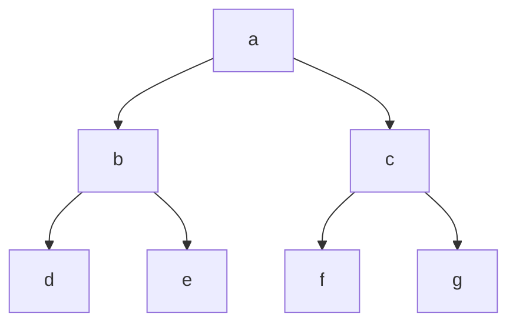

## 1. vue中的diff算法的源码中是怎么做的？
在Vue的diff算法源码中，主要通过一种叫做"双端比较"（double-end comparison）的算法来比较新旧虚拟DOM树，找出变化并进行最小量的DOM操作。这个过程发生在patch函数中，以下是对其主要步骤的解析：

初始化与入口： 在Vue的虚拟DOM更新过程中，patch函数是入口。它的作用是对比新旧虚拟DOM树，并对实际的DOM进行必要的更新。

```js
function patch(oldVnode, vnode, hydrating, removeOnly) {
 // ...
 if (!oldVnode) {
   // 新节点，创建并插入
   createElm(vnode, insertedVnodeQueue, parentElm, refElm);
 } else {
   // 更新已有节点
   const isRealElement = oldVnode.nodeType !== undefined;
   if (!isRealElement && sameVnode(oldVnode, vnode)) {
     // 同类型节点，做diff操作
     patchVnode(oldVnode, vnode, insertedVnodeQueue, removeOnly);
   } else {
     // 其他情况，重新创建
     createElm(vnode, insertedVnodeQueue, parentElm, refElm);
   }
 }
 // ...
}
```
sameVnode函数： 判断两个节点是否为相同节点，通过tag、key等属性判断。

```js
function sameVnode(a, b) {
 return (
   a.key === b.key &&
   a.tag === b.tag &&
   a.isComment === b.isComment &&
   isDef(a.data) === isDef(b.data) &&
   sameInputType(a, b)
 );
}
```
patchVnode函数： 是核心diff逻辑所在。它会递归对比新旧节点的子节点。

```js
function patchVnode(oldVnode, vnode, insertedVnodeQueue, removeOnly) {
 // ... 省略了一些更新属性和事件的代码

 const oldCh = oldVnode.children;
 const ch = vnode.children;
 if (isDef(ch) && isDef(oldCh)) {
   if (oldCh !== ch) updateChildren(elm, oldCh, ch, insertedVnodeQueue, removeOnly);
 } else if (isDef(ch)) {
   // 旧节点无子节点，新节点有子节点
   createChildren(vnode, ch, insertedVnodeQueue);
 } else if (isDef(oldCh)) {
   // 新节点无子节点，旧节点有子节点
   removeVnodes(elm, oldCh, 0, oldCh.length - 1);
 }
 // ... 省略了一些其他情况处理代码
}
```
updateChildren函数： 进行双端比较的核心函数。它维护四个指针，分别指向新旧节点数组的头尾，通过一系列条件判断更新DOM。

 ```js
function updateChildren(parentElm, oldCh, newCh, insertedVnodeQueue, removeOnly) {
  let oldStartIdx = 0;
  let newStartIdx = 0;
  let oldEndIdx = oldCh.length - 1;
  let newEndIdx = newCh.length - 1;
  let oldStartVnode = oldCh[oldStartIdx];
  let oldEndVnode = oldCh[oldEndIdx];
  let newStartVnode = newCh[newStartIdx];
  let newEndVnode = newCh[newEndIdx];
  let oldKeyToIdx, idxInOld, vnodeToMove, refElm;

  while (oldStartIdx <= oldEndIdx && newStartIdx <= newEndIdx) {
    // ... 一系列复杂的比较逻辑
    if (sameVnode(oldStartVnode, newStartVnode)) {
      patchVnode(oldStartVnode, newStartVnode, insertedVnodeQueue, removeOnly);
      oldStartVnode = oldCh[++oldStartIdx];
      newStartVnode = newCh[++newStartIdx];
    } else if (sameVnode(oldEndVnode, newEndVnode)) {
      patchVnode(oldEndVnode, newEndVnode, insertedVnodeQueue, removeOnly);
      oldEndVnode = oldCh[--oldEndIdx];
      newEndVnode = newCh[--newEndIdx];
    } else if (sameVnode(oldStartVnode, newEndVnode)) {
      // Vnode moved right
      patchVnode(oldStartVnode, newEndVnode, insertedVnodeQueue, removeOnly);
      canMove && nodeOps.insertBefore(parentElm, oldStartVnode.elm, nodeOps.nextSibling(oldEndVnode.elm));
      oldStartVnode = oldCh[++oldStartIdx];
      newEndVnode = newCh[--newEndIdx];
    } else if (sameVnode(oldEndVnode, newStartVnode)) {
      // Vnode moved left
      patchVnode(oldEndVnode, newStartVnode, insertedVnodeQueue, removeOnly);
      canMove && nodeOps.insertBefore(parentElm, oldEndVnode.elm, oldStartVnode.elm);
      oldEndVnode = oldCh[--oldEndIdx];
      newStartVnode = newCh[++newStartIdx];
    } else {
      // 处理其他情况
      if (!oldKeyToIdx) oldKeyToIdx = createKeyToOldIdx(oldCh, oldStartIdx, oldEndIdx);
      idxInOld = isDef(newStartVnode.key) ? oldKeyToIdx[newStartVnode.key] : null;
      if (!isDef(idxInOld)) {
        // New element
        createElm(newStartVnode, insertedVnodeQueue, parentElm, oldStartVnode.elm);
        newStartVnode = newCh[++newStartIdx];
      } else {
        vnodeToMove = oldCh[idxInOld];
        if (sameVnode(vnodeToMove, newStartVnode)) {
          patchVnode(vnodeToMove, newStartVnode, insertedVnodeQueue, removeOnly);
          oldCh[idxInOld] = undefined;
          canMove && nodeOps.insertBefore(parentElm, vnodeToMove.elm, oldStartVnode.elm);
        } else {
          // same key but different element. treat as new element
          createElm(newStartVnode, insertedVnodeQueue, parentElm, oldStartVnode.elm);
        }
        newStartVnode = newCh[++newStartIdx];
      }
    }
  }
  // 添加剩余的节点
  if (oldStartIdx > oldEndIdx) {
    refElm = isDef(newCh[newEndIdx + 1]) ? newCh[newEndIdx + 1].elm : null;
    addVnodes(parentElm, refElm, newCh, newStartIdx, newEndIdx, insertedVnodeQueue);
  } else if (newStartIdx > newEndIdx) {
    removeVnodes(parentElm, oldCh, oldStartIdx, oldEndIdx);
  }
}
```
通过以上核心步骤，Vue实现了高效的虚拟DOM diff算法。它通过双端比较和key的使用，在保证最小化DOM操作的同时，确保了节点的正确更新。

## 2. Vue3相比Vue2源码在diff算法层面上的优化
Vue.js 是一个流行的前端框架，其核心之一是高效的虚拟 DOM diff 算法。在 Vue 3 中，diff 算法相较于 Vue 2 进行了多项优化和改进，以提升性能和开发体验。以下是一些关键的优化点：

1. 编译阶段的优化

Vue 3 在编译阶段做了更多优化，使得生成的渲染函数更高效。通过静态分析模板，Vue 3 可以确定哪些部分是动态的，哪些是静态的，从而减少运行时的 diff 操作。

静态提升

在 Vue 3 中，编译器会将静态节点提升到渲染函数之外，避免每次渲染时都重新创建相同的静态节点。

```js
// Vue 3
const render = (ctx) => {
  return [/* 静态节点 */, .../* 动态节点 */];
};
```
2. Block Tree 结构

Vue 3 引入了 Block Tree 结构，使得只对动态部分进行更新成为可能。Block 是由动态节点组成的树结构，编译器会将模板划分为多个 block。

Patch Flags

编译器会生成 patch flags，用于标识动态节点的变化类型。这使得运行时只需要检查标记的部分，减少不必要的比较。

 ```js
const patchFlags = {
  TEXT: 1,
  CLASS: 2,
  STYLE: 4,
  // 其他标志
};
```
3. 更高效的 DOM Diff 算法

Vue 3 在 DOM diff 算法上进行了改进，提升了性能和效率。

+ 双端比较

Vue 3 采用双端比较（双指针）策略，在处理节点移动时更加高效。

 ```js
function patchKeyedChildren(c1, c2) {
  let i = 0;
  let e1 = c1.length - 1;
  let e2 = c2.length - 1;

  // 头到头比较
  while (i <= e1 && i <= e2 && isSameVNode(c1[i], c2[i])) {
    patch(c1[i], c2[i]);
    i++;
  }

  // 尾到尾比较
  while (e1 >= i && e2 >= i && isSameVNode(c1[e1], c2[e2])) {
    patch(c1[e1], c2[e2]);
    e1--;
    e2--;
  }

  // 其他情况处理
  // ...
}
```
+ 最长递增子序列

在处理节点顺序变化时，Vue 3 使用最长递增子序列算法（LIS）来最小化 DOM 操作。

 ```js
function getSequence(arr) {
  const p = arr.slice();
  const result = [0];
  let i, j, u, v, c;
  const len = arr.length;
  for (i = 0; i < len; i++) {
    const arrI = arr[i];
    if (arrI !== 0) {
      j = result[result.length - 1];
      if (arr[j] < arrI) {
        p[i] = j;
        result.push(i);
        continue;
      }
      u = 0;
      v = result.length - 1;
      while (u < v) {
        c = (u + v) >> 1;
        if (arr[result[c]] < arrI) {
          u = c + 1;
        } else {
          v = c;
        }
      }
      if (arrI < arr[result[u]]) {
        if (u > 0) {
          p[i] = result[u - 1];
        }
        result[u] = i;
      }
    }
  }
  u = result.length;
  v = result[u - 1];
  while (u-- > 0) {
    result[u] = v;
    v = p[v];
  }
  return result;
}
```
4. 渲染性能优化

Vue 3 在渲染性能上做了多项优化，使得在处理复杂组件树和大量动态节点时更加高效。

+ Fragment 支持

Vue 3 支持 Fragment，使得可以在不引入额外 DOM 元素的情况下，渲染多个子节点。这在某些场景下可以减少 DOM 操作。

 ```js
const Fragment = Symbol('Fragment');

function renderFragment(children) {
  return {
    type: Fragment,
    children,
  };
}
```
+ 自定义渲染器
Vue 3 允许用户创建自定义渲染器（Custom Renderer），以适应不同的渲染环境（如原生应用、Canvas 等）。

 ```js
import { createRenderer } from 'vue';

const { render, createApp } = createRenderer({
  patchProp,
  insert,
  remove,
  createElement,
  // ...
});
```
5. 内存优化

Vue 3 通过改进组件的内部结构和减少不必要的内存分配，提升了内存使用效率。

+ Proxy 代理
Vue 3 使用 ES6 Proxy 进行响应式数据的实现，相较于 Vue 2 的 Object.defineProperty，Proxy 可以更高效地处理动态属性的添加和删除。

 ```js
const reactiveHandler = {
  get(target, key) {
    // 依赖收集
    return Reflect.get(target, key);
  },
  set(target, key, value) {
    // 触发更新
    return Reflect.set(target, key, value);
  },
};

function reactive(target) {
  return new Proxy(target, reactiveHandler);
}
```
**总结**

Vue 3 在 diff 算法上进行了多项优化和改进，主要包括编译阶段的静态提升、Block Tree 结构、双端比较策略、最长递增子序列算法、Fragment 支持和 Proxy 代理等。这些优化使得 Vue 3 在处理复杂组件树和大量动态节点时性能更高、内存使用更高效，从而提升了整体的开发体验和应用性能。

## 3. vue3组件通信声明周期
在 Vue 3 中，组件通信的生命周期钩子主要通过 setup 函数中的响应式变量和生命周期函数实现。相较于 Vue 2.x 的选项式 API，Vue 3 使用了 Composition API，使得组件通信更加灵活和直观。以下是 Vue 3 组件通信的主要生命周期钩子：

1. setup 函数
setup 函数是 Vue 3 中组件配置的入口，用于设置组件的响应式变量和生命周期函数。

使用方式：
 ```js
import { ref, reactive, onMounted } from 'vue';

export default {
  setup() {
    // 声明响应式变量
    const count = ref(0);
    const state = reactive({
      message: 'Hello Vue 3!',
    });

    // 生命周期钩子
    onMounted(() => {
      console.log('Component mounted');
    });

    // 返回响应式变量和生命周期函数
    return { count, state };
  },
};
```
2. 生命周期钩子
Vue 3 提供了一系列生命周期函数，通过 onXXX 的形式来使用，如 onMounted、onUpdated、onUnmounted 等。

常用生命周期钩子：
onBeforeMount: 在组件挂载之前调用。

onMounted: 在组件挂载后调用。

onBeforeUpdate: 在组件更新之前调用。

onUpdated: 在组件更新后调用。

onBeforeUnmount: 在组件卸载之前调用。

onUnmounted: 在组件卸载后调用。

使用方式：
 ```js
import { onMounted, onUnmounted } from 'vue';

export default {
  setup() {
    // 生命周期钩子
    onMounted(() => {
      console.log('Component mounted');
    });

    onUnmounted(() => {
      console.log('Component unmounted');
    });

    // ...
  },
};
```
3. 组件间通信
在 Vue 3 中，组件通信可以使用传统的 props 和 emit，也可以使用 provide 和 inject 进行跨层级通信。

使用 props 和 emit：
 ```vue
<template>
  <child :message="parentMessage" @update="handleUpdate" />
</template>

<script>
import { ref } from 'vue';
import Child from './Child.vue';

export default {
  components: {
    Child,
  },
  data() {
    return {
      parentMessage: 'Hello from Parent',
    };
  },
  methods: {
    handleUpdate(message) {
      console.log('Received message from Child:', message);
    },
  },
};
</script>
```
使用 provide 和 inject：
 ```vue
<template>
  <grand-child />
</template>

<script>
import { provide } from 'vue';
import GrandChild from './GrandChild.vue';

export default {
  components: {
    GrandChild,
  },
  setup() {
    provide('message', 'Hello from Parent');
  },
};
</script>
 ```

 ```vue
<template>
  <div>{{ message }}</div>
</template>

<script>
import { inject } from 'vue';

export default {
  setup() {
    const message = inject('message');
    console.log('Received message from Parent:', message);
    return { message };
  },
};
</script>
```
总结
在 Vue 3 中，组件通信的声明周期主要由 setup 函数和生命周期钩子来管理。通过 setup 函数可以声明响应式变量和设置生命周期函数，而生命周期钩子则提供了组件不同阶段的钩子函数，可以用于执行相应的操作。此外，组件间通信可以通过 props、emit、provide 和 inject 等方式来实现。这些特性使得 Vue 3 中的组件通信更加灵活和直观。

## 4. ssr性能优化相关有哪些
服务器端渲染（Server-Side Rendering，SSR）在提升性能和SEO方面有显著优势，但实现和优化一个高性能的SSR应用也需要注意许多细节。以下是一些SSR性能优化的关键策略：

1. 缓存策略
+ 页面缓存
缓存整个HTML页面，以减少服务器渲染次数。可以使用CDN或者反向代理（如Nginx）来缓存页面。

 ```js
// 使用Redis缓存
const redis = require('redis');
const client = redis.createClient();

app.get('*', (req, res) => {
  const key = `ssr:${req.url}`;
  client.get(key, (err, cachedPage) => {
    if (cachedPage) {
      res.send(cachedPage);
    } else {
      renderToString(req, (err, html) => {
        client.set(key, html, 'EX', 3600); // 缓存1小时
        res.send(html);
      });
    }
  });
});
```
+ 分片缓存
缓存页面的一部分，比如组件或者数据请求。

 ```js
// 缓存数据请求
const cacheMiddleware = (req, res, next) => {
  const key = `data:${req.url}`;
  client.get(key, (err, cachedData) => {
    if (cachedData) {
      res.json(JSON.parse(cachedData));
    } else {
      res.sendResponse = res.send;
      res.send = (body) => {
        client.set(key, body, 'EX', 3600); // 缓存1小时
        res.sendResponse(body);
      };
      next();
    }
  });
};

app.get('/api/data', cacheMiddleware, (req, res) => {
  // 数据请求逻辑
});
```
2. 组件级别的静态化

将不经常改变的组件预先渲染成静态HTML并缓存，减少动态渲染的开销。

3. 异步数据获取优化

尽量并行化数据请求，减少数据获取的时间。

 ```js
async function fetchDataForComponents(components, store) {
  return Promise.all(
    components.map(component => {
      if (component.asyncData) {
        return component.asyncData({ store });
      }
    })
  );
}

// 在路由处理时并行获取数据
router.beforeResolve((to, from, next) => {
  const matched = router.getMatchedComponents(to);
  const asyncDataHooks = matched.map(c => c.asyncData).filter(_ => _);
  if (!asyncDataHooks.length) {
    return next();
  }
  Promise.all(asyncDataHooks.map(hook => hook({ store, route: to })))
    .then(() => next())
    .catch(next);
});
```
4. 使用流式渲染

使用流式渲染（streaming）技术，可以逐步向客户端发送HTML，提高首屏加载速度。

 ```js
const { createBundleRenderer } = require('vue-server-renderer');
const renderer = createBundleRenderer(serverBundle, {
  runInNewContext: false,
  template,
  clientManifest
});

app.get('*', (req, res) => {
  const context = { url: req.url };
  res.setHeader('Content-Type', 'text/html');
  const stream = renderer.renderToStream(context);
  stream.pipe(res);
});
```
5. 减少客户端JavaScript体积

使用代码拆分和懒加载减少客户端需要加载的JavaScript体积。

 ```js
// 使用动态import实现懒加载
const Foo = () => import('./Foo.vue');

new VueRouter({
  routes: [
    { path: '/foo', component: Foo }
  ]
});
```
6. 预加载关键资源

利用`<link rel="preload">和<link rel="prefetch">`标签预加载关键资源，减少页面切换时的延迟。

 ```html
<link rel="preload" href="/static/js/main.js" as="script">
<link rel="preload" href="/static/css/main.css" as="style">
```
7. 服务端和客户端渲染结果一致

确保服务端和客户端渲染的结果一致，以避免不必要的DOM操作和样式抖动。

8. 性能监控与分析

使用性能监控工具如Google Lighthouse、New Relic或WebPageTest，持续监控和分析SSR性能，找出瓶颈并优化。

9. 优化服务器性能

确保服务器资源充足，合理配置CPU、内存、网络等资源，优化Node.js运行环境（如使用最新的LTS版本），使用集群模式（如PM2）来提升并发处理能力。

10. 代码优化

尽量减少不必要的计算和复杂度，优化算法和数据结构，减少阻塞操作。

通过以上策略，可以显著提升SSR应用的性能，提供更快的响应速度和更好的用户体验。

## 5. 前端性能指标LCP这个最大的内容底层是用什么算法计算的
Largest Contentful Paint（LCP，最大内容绘制）是衡量网页加载性能的关键指标之一，反映了页面在用户可视区域内最大可见内容元素的加载时间。LCP 的计算涉及一系列复杂的底层算法和技术，主要包括以下几个方面：

1. 内容元素的识别
浏览器需要识别页面上所有的内容元素，并判断哪些元素是用户可见的。LCP 关注的内容元素包括：

+ `` 标签中的图片。
+ `<video>` 标签中的海报图像（poster）。
+ 包含背景图像的元素（通过 background-image CSS 属性定义的图像）。
+ `<svg>` 元素。
+ 块级元素或行内块级元素中的文本节点（如 `<div>、<p>、<h1>` 等）。

2. 元素的可见性计算

浏览器会计算每个内容元素的可见性。这包括确定元素是否在视口（viewport）内，是否被其他元素遮挡等。

3. 元素尺寸的计算

对于在视口内的内容元素，浏览器会计算其渲染尺寸（rendered size），并选择其中最大的元素作为候选。

4. 时间戳的捕获

+ 每个候选元素在首次绘制到屏幕时，浏览器会捕获其渲染时间戳。这包括以下几种情况：
+ 首次渲染图片、视频、SVG 等图像元素。
+ 首次渲染文本内容。
+ 图像加载完成后，重新绘制图像元素。

5. 选择最大内容元素

在页面加载过程中，浏览器持续监控所有内容元素的变化，并根据其可见性和尺寸，动态更新最大的内容元素及其渲染时间戳。

6. 最终LCP的确定

页面加载完成或在用户首次交互（如滚动、点击等）之后，浏览器会确定最终的 LCP 值，即最大的内容元素的渲染时间戳。

**LCP 计算的底层算法**

浏览器使用一系列复杂的算法和机制来实现上述步骤，以下是一些具体的实现细节：

+ 可见性算法

浏览器会利用布局引擎和渲染引擎的功能，结合视口的位置和尺寸，判断元素是否在视口内，并计算元素的可见区域。

+ 尺寸计算

通过浏览器的布局计算，确定元素的渲染尺寸。对于图片和视频，尺寸计算比较直接。对于文本内容，浏览器需要计算包含文本的块级元素的尺寸。

+ 时间戳捕获

利用性能计时 API（如 PerformanceObserver）捕获内容元素的渲染时间。PerformanceObserver 可以监听 largest-contentful-paint 条目，并通过回调函数获取相关时间戳。

 ```js
if ('PerformanceObserver' in window) {
  const observer = new PerformanceObserver((entryList) => {
    for (const entry of entryList.getEntries()) {
      console.log('LCP candidate:', entry);
    }
  });
  observer.observe({ type: 'largest-contentful-paint', buffered: true });
}
```
示例代码
以下是一个简单的示例代码，展示如何使用 PerformanceObserver 监听和获取 LCP 值：

 ```js
if ('PerformanceObserver' in window) {
  const observer = new PerformanceObserver((list) => {
    const entries = list.getEntries();
    const lastEntry = entries[entries.length - 1];
    console.log('Largest Contentful Paint:', lastEntry.startTime);
  });
  observer.observe({ type: 'largest-contentful-paint', buffered: true });

  window.addEventListener('load', () => {
    setTimeout(() => {
      observer.takeRecords();
      observer.disconnect();
    }, 5000); // 等待页面加载完成5秒后断开observer
  });
}
```
在这个示例中，PerformanceObserver 被用来监听 largest-contentful-paint 类型的性能条目，并在加载完成后获取并打印 LCP 的时间戳。

通过这些底层算法和机制，浏览器能够准确地计算和报告 LCP 值，帮助开发者优化网页的加载性能。

## 6. LCP FMP FCP为什么选择FCP作为衡量指标而不是其他指标
选择 FCP（First Contentful Paint，首次内容绘制）作为衡量指标有多个原因。尽管 LCP（Largest Contentful Paint，最大内容绘制）和 FMP（First Meaningful Paint，首次有意义绘制）也是非常重要的性能指标，但 FCP 在某些关键方面更适合作为衡量网页性能的标准。以下是详细的原因和解释：

1. 定义与易理解性
+ FCP：

定义：FCP 是指浏览器在开始渲染第一个由 DOM 内容渲染的内容（例如文本、图像、SVG 等）时的时间点。

易理解性：FCP 是用户第一次看到页面内容的时间，非常直观和易于理解。

+ LCP：

定义：LCP 是指页面中最大的内容元素（如大图、视频或大块文本）完全渲染完成的时间点。

复杂性：虽然 LCP 反映了页面中最重要内容的加载时间，但它的计算较为复杂，涉及对内容元素的识别和尺寸计算。

+ FMP：

定义：FMP 是指页面上主要内容第一次绘制完成的时间点。

不确定性：FMP 的定义和测量标准并不统一，且计算方法复杂，容易导致结果不一致。

2. 用户体验的关键时刻
FCP 直接反映了用户何时能看到页面内容，这个时间点非常关键，因为它标志着页面开始变得有意义。用户体验的研究表明，用户对页面的首次可见内容非常敏感，FCP 能较好地反映这一体验。

3. 测量和实现的简单性
FCP 易于测量和实现。浏览器通过性能 API 能够准确地捕捉到 FCP 事件，并且各大浏览器对 FCP 的实现和支持都比较一致，减少了跨浏览器的一致性问题。

4. 优化的指导性
FCP 提供了明确的优化目标。为了改善 FCP，开发者可以专注于减少首屏内容的阻塞资源、优化关键渲染路径、提高服务器响应速度等。这些优化措施也能间接提升其他性能指标（如 LCP 和 FMP）。

5. 标准化和广泛接受
FCP 已经被广泛接受为性能优化的重要指标，且被包括 Google 在内的多种性能评估工具（如 Lighthouse 和 Web Vitals）采用，形成了业界的标准。

6. 与其他指标的关系
虽然 LCP 和 FMP 也很重要，但它们更多是反映页面加载过程中的后续阶段。FCP 作为一个早期指标，可以快速反馈页面加载性能，帮助开发者在早期阶段进行优化。

总结
选择 FCP 作为衡量指标，是因为它直接反映了用户在页面加载过程中首次看到内容的时间点，这对用户体验至关重要。FCP 易于理解、测量和优化，为开发者提供了明确的优化方向，同时它也得到了广泛的标准化和应用。这些优势使得 FCP 成为评估网页性能的一个理想指标。

## 7. 虚拟列表item固定高度和不固定高度是怎么做的
虚拟列表是一种优化长列表渲染性能的技术，通过只渲染视口内的可见项来减少DOM节点数，从而提高渲染性能。虚拟列表可以处理固定高度和不固定高度的项，以下是实现两者的不同方法：

1. 固定高度的虚拟列表
对于固定高度的虚拟列表，每个项的高度是相同的，这样可以通过简单的数学计算来确定哪些项需要渲染。

实现步骤：
+ 确定每个项的高度：假设每个项的高度为itemHeight。
+ 计算可见项的数量：根据视口高度viewportHeight和项的高度itemHeight，计算出视口内可以容纳的最大项数。
+ 计算滚动偏移：根据滚动位置scrollTop，计算出第一个可见项的索引。
+ 渲染可见项：根据第一个可见项的索引和可见项的数量，只渲染这些项。

示例代码：
 ```js
import React, { useState, useRef, useEffect } from 'react';

const VirtualList = ({ itemCount, itemHeight, renderItem }) => {
  const [scrollTop, setScrollTop] = useState(0);
  const viewportRef = useRef(null);

  const viewportHeight = 500; // 假设视口高度为500px
  const totalHeight = itemCount * itemHeight;

  const startIndex = Math.floor(scrollTop / itemHeight);
  const endIndex = Math.min(itemCount - 1, Math.ceil((scrollTop + viewportHeight) / itemHeight) - 1);

  const visibleItems = [];
  for (let i = startIndex; i <= endIndex; i++) {
    visibleItems.push(
      <div key={i} style={{ position: 'absolute', top: i * itemHeight, height: itemHeight, width: '100%' }}>
        {renderItem(i)}
      </div>
    );
  }

  useEffect(() => {
    const handleScroll = (e) => {
      setScrollTop(e.target.scrollTop);
    };
    const viewport = viewportRef.current;
    viewport.addEventListener('scroll', handleScroll);
    return () => {
      viewport.removeEventListener('scroll', handleScroll);
    };
  }, []);

  return (
    <div ref={viewportRef} style={{ position: 'relative', height: viewportHeight, overflowY: 'auto' }}>
      <div style={{ height: totalHeight, position: 'relative' }}>
        {visibleItems}
      </div>
    </div>
  );
};
```

```js
// 使用示例
const App = () => {
  const itemCount = 1000;
  const itemHeight = 50;
  const renderItem = (index) => <div style={{ padding: 20 }}>Item {index}</div>;

  return <VirtualList itemCount={itemCount} itemHeight={itemHeight} renderItem={renderItem} />;
};

export default App;
```

2. 不固定高度的虚拟列表

对于不固定高度的虚拟列表，每个项的高度不同，需要使用更复杂的计算来确定哪些项需要渲染。可以采用以下方法：

实现步骤：
+ 动态测量项的高度：在初次渲染时，测量每个项的高度，并缓存这些高度。
+ 计算可见项的数量：根据视口高度和滚动位置，计算出哪些项是可见的。
+ 渲染可见项：根据可见项的索引，只渲染这些项，并将它们放置在正确的位置。

示例代码：
 ```js
import React, { useState, useRef, useEffect, useCallback } from 'react';

const VirtualList = ({ itemCount, renderItem }) => {
  const [scrollTop, setScrollTop] = useState(0);
  const [itemHeights, setItemHeights] = useState(new Array(itemCount).fill(0));
  const [totalHeight, setTotalHeight] = useState(0);
  const viewportRef = useRef(null);
  const itemRefs = useRef(new Array(itemCount).fill(null));

  const viewportHeight = 500; // 假设视口高度为500px

  // 动态测量项的高度
  const measureItems = useCallback(() => {
    const newItemHeights = itemRefs.current.map((item) => (item ? item.getBoundingClientRect().height : 0));
    setItemHeights(newItemHeights);
    setTotalHeight(newItemHeights.reduce((sum, height) => sum + height, 0));
  }, [itemCount]);

  useEffect(() => {
    measureItems();
  }, [measureItems]);

  const getVisibleRange = () => {
    let startIndex = 0;
    let offset = 0;

    while (offset + itemHeights[startIndex] < scrollTop) {
      offset += itemHeights[startIndex];
      startIndex += 1;
    }

    let endIndex = startIndex;
    offset = 0;

    while (offset < viewportHeight && endIndex < itemCount) {
      offset += itemHeights[endIndex];
      endIndex += 1;
    }

    return { startIndex, endIndex: Math.min(endIndex, itemCount - 1) };
  };

  const { startIndex, endIndex } = getVisibleRange();

  const visibleItems = [];
  let offset = 0;
  for (let i = 0; i < startIndex; i++) {
    offset += itemHeights[i];
  }
  for (let i = startIndex; i <= endIndex; i++) {
    visibleItems.push(
      <div
        key={i}
        ref={(el) => (itemRefs.current[i] = el)}
        style={{ position: 'absolute', top: offset, width: '100%' }}
      >
        {renderItem(i)}
      </div>
    );
    offset += itemHeights[i];
  }

  useEffect(() => {
    const handleScroll = (e) => {
      setScrollTop(e.target.scrollTop);
    };
    const viewport = viewportRef.current;
    viewport.addEventListener('scroll', handleScroll);
    return () => {
      viewport.removeEventListener('scroll', handleScroll);
    };
  }, []);

  return (
    <div ref={viewportRef} style={{ position: 'relative', height: viewportHeight, overflowY: 'auto' }}>
      <div style={{ height: totalHeight, position: 'relative' }}>
        {visibleItems}
      </div>
    </div>
  );
};
```
```js
// 使用示例
const App = () => {
  const itemCount = 1000;
  const renderItem = (index) => <div style={{ padding: 20 }}>Item {index}</div>;

  return <VirtualList itemCount={itemCount} renderItem={renderItem} />;
};

export default App;

```
关键点解释

+ 固定高度：由于所有项的高度固定，计算哪些项可见非常简单，只需根据视口高度和项高度进行简单的数学计算。

+ 不固定高度：需要动态测量每个项的高度，并根据滚动位置计算可见项的范围，这需要更多的计算和缓存。

以上两种方法都可以有效地优化长列表的渲染性能，但根据具体应用场景选择合适的方法非常重要。固定高度的虚拟列表实现较为简单，性能较好；而不固定高度的虚拟列表实现更为复杂，但灵活性更高。

## 8. tree shaking 底层是怎么实现的
> Tree shaking 是一种用于删除 JavaScript 中未使用代码的技术，通常应用于现代模块打包工具（如 Webpack、Rollup 等）以优化打包结果，减小最终输出的文件体积。其核心是依赖静态分析技术，通过分析代码的依赖关系，去除那些从未被使用的代码。

Tree Shaking 的核心原理

1. Tree shaking 的核心原理主要依赖于以下几方面：

ES6 模块语法：

ES6 模块系统（import 和 export）是静态的，可以在编译时进行静态分析。这与 CommonJS（require 和 module.exports）不同，后者的动态特性使得静态分析更加困难。

静态分析：

  + 静态分析代码，构建模块之间的依赖关系图（dependency graph）。
  + 通过分析哪些模块和导出的成员被实际使用（引用），确定哪些是“树”的可达部分。
  + 移除依赖关系图中不可达的代码。

实现细节

以 Webpack 和 Rollup 为例，具体的实现细节如下：

**Webpack**

1. 解析和构建依赖图：
    + Webpack 从入口文件开始，递归解析所有模块和依赖，构建一个模块依赖图。
    + 通过 Babel 等工具，将 ES6 模块转换为 Webpack 可识别的模块格式。

2. 标记和摇树：

    + Webpack 的 TerserPlugin（默认压缩插件）在压缩阶段进行 tree shaking。
    + 通过解析 AST（抽象语法树），标记所有被使用的导出。
    + 移除未被使用的导出代码。

3. 输出优化：

   + 通过 sideEffects 属性，进一步优化模块。如果一个模块或文件被标记为无副作用（sideEffects: false），Webpack 可以大胆地移除未使用的导入。

**Rollup**

1. 模块分析：

    + Rollup 直接使用 ES6 模块语法，解析并构建模块依赖图。
    + 通过递归分析导入和导出，确定哪些模块和导出是未被使用的。

2. 标记和移除：

    + Rollup 通过标记那些被引用的导出，移除未引用的导出。
    + 生成优化后的输出代码，只包含被使用的代码部分。

3. 摇树优化：

  + Rollup 更加专注于纯净的 ES6 模块环境，结合其内部的静态分析算法，有效地移除未使用的代码。

Tree Shaking 实现示例
下面是一个简单的 Tree Shaking 实现示例，展示了如何在 Webpack 和 Rollup 中使用 tree shaking。

Webpack 配置 项目结构：
```js
 
src/
  - index.js
  - utils.js
webpack.config.js
src/utils.js：

 
export const usedFunction = () => {
  console.log('This function is used');
};

export const unusedFunction = () => {
  console.log('This function is unused');
};
src/index.js：

 
import { usedFunction } from './utils';

usedFunction();
webpack.config.js：

 
const path = require('path');

module.exports = {
  mode: 'production',
  entry: './src/index.js',
  output: {
    filename: 'bundle.js',
    path: path.resolve(__dirname, 'dist'),
  },
  optimization: {
    usedExports: true, // 启用 tree shaking
  },
  module: {
    rules: [
      {
        test: /\.js$/,
        exclude: /node_modules/,
        use: {
          loader: 'babel-loader',
          options: {
            presets: ['@babel/preset-env'],
          },
        },
      },
    ],
  },
};
```
Rollup 配置
项目结构：

 ```js
src/
  - index.js
  - utils.js
rollup.config.js
src/utils.js：

 
export const usedFunction = () => {
  console.log('This function is used');
};

export const unusedFunction = () => {
  console.log('This function is unused');
};
src/index.js：

 
import { usedFunction } from './utils';

usedFunction();
rollup.config.js：

 
import { terser } from 'rollup-plugin-terser';

export default {
  input: 'src/index.js',
  output: {
    file: 'dist/bundle.js',
    format: 'es',
  },
  plugins: [terser()],
};
```
结论
Tree shaking 通过静态分析代码依赖关系，移除未使用的代码，优化了打包结果。借助于 ES6 模块的静态特性，工具如 Webpack 和 Rollup 能够有效地实现这一过程，从而提高前端应用的性能和加载速度。在实际项目中，结合 sideEffects 属性和合理的代码结构，可以进一步提升 tree shaking 的效果。

## 9. 前端和客户端交互底层是怎么实现的
前端和客户端交互的底层实现主要依赖于网络通信协议和浏览器内的机制。这里我们将详细探讨这些技术和机制，包括 HTTP/HTTPS 请求、WebSocket、WebRTC 以及浏览器提供的 API 等。

1. HTTP/HTTPS 请求
HTTP（HyperText Transfer Protocol）和 HTTPS（HTTP Secure）是前端和后端进行通信的最常见方式。

基本流程
DNS 解析：浏览器将域名解析为服务器的 IP 地址。

TCP 连接：通过 TCP（三次握手）与服务器建立连接。如果是 HTTPS，还会进行 TLS 握手以建立加密连接。

发送请求：浏览器构造并发送 HTTP/HTTPS 请求报文。

服务器处理请求：服务器处理请求并返回响应报文。

接收响应：浏览器接收响应并解析数据，更新页面或执行相应逻辑。

底层细节
TCP/IP 协议：HTTP/HTTPS 基于 TCP/IP 协议栈。TCP 负责确保数据包的可靠传输和顺序，IP 负责路由和寻址。

TLS/SSL 协议：HTTPS 使用 TLS/SSL 协议进行加密，确保数据传输的安全性。

示例代码
 ```js
// 使用 fetch API 进行 HTTP 请求
fetch('https://api.example.com/data')
  .then(response => response.json())
  .then(data => console.log(data))
  .catch(error => console.error('Error:', error));

  ```
2. WebSocket
WebSocket 是一种全双工通信协议，允许客户端和服务器之间进行实时通信。

基本流程
建立连接：客户端向服务器发送 WebSocket 握手请求。

握手成功：服务器接受握手，升级 HTTP 连接为 WebSocket 连接。

双向通信：客户端和服务器可以相互发送消息，保持连接打开。

关闭连接：任一方可以关闭连接，结束通信。

底层细节
基于 TCP：WebSocket 基于 TCP 连接，具有较低的延迟。

协议升级：通过 HTTP 协议的 101 状态码升级为 WebSocket 协议。

示例代码
 ```js
// 创建 WebSocket 连接
const socket = new WebSocket('wss://example.com/socket');

// 连接打开事件
socket.addEventListener('open', (event) => {
  console.log('WebSocket is open now.');
  socket.send('Hello Server!');
});

// 收到消息事件
socket.addEventListener('message', (event) => {
  console.log('Message from server ', event.data);
});

// 连接关闭事件
socket.addEventListener('close', (event) => {
  console.log('WebSocket is closed now.');
});
```
3. WebRTC
WebRTC（Web Real-Time Communication）允许在浏览器之间直接进行音视频和数据传输。

基本流程
信令：通过现有的通信渠道（如 WebSocket）交换会话描述协议（SDP）和 ICE 候选者。

建立连接：使用 SDP 和 ICE 候选者进行 P2P 连接。

传输数据：通过 P2P 连接传输音视频流和数据。

关闭连接：任一方可以关闭连接，结束通信。

底层细节
P2P 连接：通过 NAT 打洞技术实现浏览器之间的直接连接。

多媒体处理：使用 RTP/RTCP 协议进行音视频数据传输。

数据通道：使用 SCTP 协议传输任意数据。

示例代码
 ```js
const pc = new RTCPeerConnection();

// 添加本地媒体流
navigator.mediaDevices.getUserMedia({ video: true, audio: true })
  .then(stream => {
    stream.getTracks().forEach(track => pc.addTrack(track, stream));
  });

pc.onicecandidate = (event) => {
  if (event.candidate) {
    // 发送 ICE 候选者给远端
    sendIceCandidateToRemote(event.candidate);
  }
};

pc.ontrack = (event) => {
  // 显示远端视频流
  const remoteVideo = document.getElementById('remoteVideo');
  remoteVideo.srcObject = event.streams[0];
};

// 通过信令服务器交换 SDP
function createOffer() {
  pc.createOffer().then(offer => {
    pc.setLocalDescription(offer);
    sendOfferToRemote(offer);
  });
}

function handleAnswer(answer) {
  pc.setRemoteDescription(answer);
}
```
4. 浏览器 API
浏览器提供了一些 API，简化前端和客户端之间的交互：

Fetch API：用于发起网络请求，替代 XMLHttpRequest。

Service Workers：拦截网络请求，实现离线缓存和推送通知。

IndexedDB：本地存储大型结构化数据。

示例代码（Service Worker）
 ```js
// 注册 Service Worker
navigator.serviceWorker.register('/service-worker.js');

// 在 service-worker.js 中拦截请求并缓存
self.addEventListener('fetch', (event) => {
  event.respondWith(
    caches.match(event.request)
      .then(response => {
        if (response) {
          return response; // 从缓存返回
        }
        return fetch(event.request); // 发起网络请求
      })
  );
});
```
总结
前端和客户端交互通过多种技术和协议实现，从传统的 HTTP/HTTPS 请求到实时通信的 WebSocket 和 WebRTC。这些技术各有其应用场景和优势，结合使用可以构建高效、灵活和实时的前端应用。在实际开发中，根据具体需求选择合适的通信方式和技术栈，优化用户体验和应用性能。

## 10.createWebhistory 和 createwebhashhistory 的区别
> 在Vue.js中，Vue Router是非常重要的路由管理工具，它提供了多种路由模式来满足不同的需求。其中，createWebHistory和createWebHashHistory是两种常用的路由模式，它们在URL的处理方式上有着显著的区别。

1. createWebHistory

**原理**： createWebHistory使用HTML5 History API来管理路由，它通过浏览器的History API来改变URL，实现路由的跳转和管理。在使用createWebHistory时，URL中的路由信息是以正常的路径形式呈现，不带有#号。

**应用场景**：

+ 适用于支持HTML5 History API的现代浏览器，如Chrome、Firefox、Safari等。
+ 适用于需要更加友好的URL形式，不带有#号，更符合用户的预期和习惯。
+ 适用于需要利用浏览器的前进和后退按钮进行导航的场景。

**优点**：

+ URL更加美观，不带有#号，提升了用户体验。
+ 支持HTML5 History API，能够利用浏览器的前进和后退按钮进行导航。

**缺点**：

+ 不兼容低版本的浏览器，需要特殊处理。
+ 在部署时需要服务器端的配置支持，以避免刷新页面时出现404错误。

2. createWebHashHistory

**原理**： createWebHashHistory使用浏览器的URL的哈希（#）部分来管理路由，它通过监听浏览器的hashchange事件来实现路由的跳转和管理。在使用createWebHashHistory时，URL中的路由信息是以哈希（#）的形式呈现。

**应用场景**：

+ 适用于兼容性要求较高的场景，哈希模式在大多数浏览器中都能正常工作。
+ 适用于不支持HTML5 History API的浏览器，如IE9及以下版本。

**优点**：

+ 兼容性较好，适用于大多数现代浏览器以及不支持HTML5 History API的旧版本浏览器。
+ 不需要服务器端的特殊配置，可以直接部署上线。

**缺点**：

+ URL带有#号，不够美观，可能会影响用户体验。
+ 无法利用浏览器的前进和后退按钮进行导航，需要自行实现路由的导航逻辑。

**结论**

`createWebHistory`和`createWebHashHistory`是`Vue Router`提供的两种常用的路由模式，它们在URL的处理方式上有着显著的区别。
+ createWebHistory使用HTML5 History API来管理路由，URL中不带有#号，适用于现代浏览器；
+ 而createWebHashHistory使用URL的哈希部分来管理路由，URL中带有#号，兼容性较好，适用于不支持HTML5 History API的浏览器。

在实际开发中，根据项目的需求和目标浏览器的兼容性要求，合理选择适当的路由模式非常重要。如果项目不需要考虑兼容性问题，并且希望URL更加友好美观，可以选择createWebHistory；如果项目需要兼容性较好，并且不介意URL中带有#号，可以选择createWebHashHistory。

深入理解createWebHistory和createWebHashHistory的原理和应用场景，可以帮助我们更好地选择合适的路由模式，提升Vue.js应用的开发效率和用户体验。

## 11. 什么是 MVVM？比之 MVC 有什么区别？
MVVM（Model-View-ViewModel）和 MVC（Model-View-Controller）都是软件设计模式，用于组织和架构应用程序的代码。它们之间的主要区别在于如何组织和管理用户界面的代码。

a. **MVC**（Model-View-Controller）：

+ Model（模型）： 负责应用程序的数据和业务逻辑。它表示应用程序的状态和行为，与数据库通信以检索或更新数据。
+ View（视图）： 负责显示数据和用户界面元素。它接收来自控制器的数据，并将其渲染成用户界面。
+ Controller（控制器）： 负责处理用户输入、更新模型和调整视图。它充当用户界面和应用程序逻辑之间的协调者。
+ 在传统的 MVC 模式中，View 和 Controller 之间的关系是相对紧密的，Controller 负责管理用户输入并更新 Model，同时直接影响 View。

b. **MVVM**（Model-View-ViewModel）：
+ Model（模型）： 负责应用程序的数据和业务逻辑，与 MVC 中的 Model 类似。
+ View（视图）： 负责显示数据和用户界面元素，与 MVC 中的 View 类似。
+ ViewModel（视图模型）： 介于 View 和 Model 之间，负责处理用户输入、与 Model 交互，并为 View 提供渲染所需的数据。ViewModel 是一个用于封装视图状态和行为的抽象层。
+ 在 MVVM 中，View 和 ViewModel 是通过数据绑定关联的，ViewModel 通常会包含一个或多个属性，这些属性与 View 中的元素绑定。当 ViewModel 的属性变化时，View 会自动更新，而用户的操作也会直接影响到 ViewModel 中的数据。

**区别**：

+ 数据绑定： MVVM 强调数据绑定，通过双向绑定实现视图和数据的同步。MVC 中，视图和控制器之间的关系通常是单向的。
+ 视图模型： MVVM 引入了 ViewModel，它是一个专门用于管理视图状态和行为的组件。MVC 中，控制器负责处理用户输入和更新模型，直接影响视图。
+ 松散耦合： MVVM 中的各个组件之间相对较为松散耦合，每个组件都有明确定义的职责。MVC 中，视图和控制器之间的联系相对较紧密。

总体而言，MVVM 强调数据驱动视图，通过数据绑定实现自动更新，而 MVC 强调用户输入驱动视图，通过控制器更新视图。 MVVM 的数据绑定使得前端开发更加简洁和高效，特别适用于大规模的前端应用。

## 12. Vue 和 React 之间的区别
Vue.js 和 React 都是流行的前端 JavaScript 框架，用于构建用户界面。以下是它们之间的一些主要区别：

a. **设计理念和开发范式**：
组件化：
 + Vue： Vue.js 将组件化作为其核心思想，提供了更直观和灵活的组件系统。单文件组件（SFC）是一种将模板、样式和脚本封装在一个文件中的方式。
 + React： React 也支持组件化，但它更加强调的是一切皆是组件的思想。React 组件使用 JSX 语法，将模板和逻辑紧密结合在一起。

b. **数据绑定**：
双向数据绑定：
+ Vue： Vue 提供了简单的双向数据绑定，通过 v-model 指令可以轻松实现表单元素和数据的双向绑定。
+ React： React 采用的是单向数据流，通过状态（state）和属性（props）来管理数据流向。

c. **模板语法**：
模板语法：
+ Vue： Vue 使用模板语法，模板中可以包含直接渲染的 HTML 代码。Vue 的模板更接近传统的 HTML 结构。
+ React： React 使用 JSX 语法，它是一种在 JavaScript 中嵌套 XML 结构的语法。这使得模板和逻辑更紧密地结合在一起，但也需要习惯这种嵌套结构。

d. **学习曲线**：
学习曲线：
+ Vue： Vue 被认为是相对容易学习的框架，尤其适合初学者。其文档清晰，API 直观，上手较快。
+ React： React 在一开始可能对新手有一定的学习曲线，尤其是对于 JSX 语法和一些概念的理解。但一旦掌握，React 提供了强大的灵活性。

e. **生态系统和社区**：
生态系统：
+ Vue： Vue 的生态系统相对较小，但也在不断壮大。它有一些优秀的插件和工具，但相比 React，生态规模较小。
+ React： React 拥有更大的生态系统和庞大的社区支持。有丰富的第三方库和组件，适用于各种应用场景。

f. **状态管理**：
状态管理：
+ Vue： Vue 提供了 Vuex 作为官方的状态管理库，用于管理组件之间的共享状态。
+ React： React 可以使用 Context API 和第三方库（如 Redux）来进行状态管理。

g. **组件通信**：
组件通信：
+ Vue： Vue 提供了 props 和自定义事件等机制来实现组件之间的通信。
+ React： React 通过 props 和回调函数来传递数据，同时也可以使用 Context API 或 Redux 等进行全局状态管理。

h. **社区和企业应用**：
应用场景：
+ Vue： Vue 在中小型项目和单页面应用中表现良好，也适用于快速原型开发。
+ React： React 更常用于大型和复杂的项目，且在大型企业应用中更为普遍。

总体而言，Vue 和 React 都是强大的前端框架，选择其中之一通常取决于项目的需求、团队的经验和开发者的偏好。

## 13. Vue2，3 的区别
Vue 2 和 Vue 3 之间有一些显著的区别。以下是它们的一些主要区别：

+ **性能优化**： Vue 3 在性能方面有显著的改进。它引入了响应式系统的重写，使用 Proxy 替代 Object.defineProperty，这使得 Vue 3 的性能比 Vue 2 更好。
+ **Composition API**： Vue 3 引入了 Composition API，这是一个新的组织组件逻辑的方式。相比于 Vue 2 的选项 API，Composition API 更灵活，更容易组织和重用代码。
+  **Teleport**： Vue 3 引入了 Teleport 特性，允许你在 DOM 中的任何位置渲染组件的内容。这对于在应用程序中移动组件的位置或在不同的层次结构中渲染组件很有用。
+ **新的特性和改进**： Vue 3 引入了一些新的特性，如 Fragments（片段）、Custom Directives（自定义指令）等，并对一些现有特性进行了改进。这使得开发者在构建复杂应用时更加方便。
+ **Tree-shaking 支持**： Vue 3 更好地支持 tree-shaking，这意味着在构建时可以更有效地剔除未使用的代码，从而减小应用程序的体积。
+ **TypeScript 集成**： Vue 3 对 TypeScript 的支持更加紧密和友好，包括完全的 TypeScript 类型定义。

这些只是一些主要的区别，具体取决于你的项目需求和个人偏好。如果你已经使用 Vue 2，迁移到 Vue 3 可能需要一些时间，但从性能和开发体验的角度来看，它可能是值得的。

## 14. Vue3 性能更好在哪里
Vue 3 相对于 Vue 2 在性能方面有一些改进，主要体现在以下几个方面：

+ **Proxy 替代 Object.defineProperty**： Vue 3 中的响应式系统采用 Proxy 替代了 Vue 2 中使用的 Object.defineProperty。Proxy 允许更细粒度的拦截操作，这使得 Vue 3 能够更高效地追踪属性的变化，提高了响应式系统的性能。
+ **编译器优化**： Vue 3 的编译器经过优化，生成的代码更加精简和高效。这有助于减小应用程序的体积并提高运行时的性能。
+ **静态树提升**（Static Tree Hoisting）： Vue 3 引入了静态树提升的概念，可以将一些静态节点在渲染时提升为常量，减少不必要的重复渲染，从而提高性能。
+ **优化的事件处理**： Vue 3 对事件处理进行了优化，使其更加高效。特别是对于频繁触发的事件，Vue 3 的性能相对更好。
+ **Teleport 特性的引入**： Vue 3 的 Teleport 特性允许在 DOM 中的任何位置渲染组件的内容，这在性能优化方面提供了更多的灵活性，能够更高效地处理组件的渲染和移动。
+ **Tree-shaking 支持**： Vue 3 更好地支持 tree-shaking，使得在构建时可以更有效地剔除未使用的代码，减小应用程序的体积，从而提高加载和运行时的性能。

总体而言，这些改进和优化使得 Vue 3 在性能方面相对于 Vue 2 有所提升，特别是在处理大型和复杂的应用程序时。

## 15. Vue2，3 diff 算法原理
Vue 2 和 Vue 3 在数据响应方面采用了不同的 diff 算法，用于比较虚拟 DOM 树并更新视图。以下是 Vue 2 和 Vue 3 的 diff 算法原理的概述：

a. **Vue 2 的 Diff 算法**：

Vue 2 使用的是经典的Virtual DOM和基于深度优先的双端比较的算法。它的主要步骤如下：

+ 创建虚拟 DOM 树： 将组件的状态映射到虚拟 DOM 树，这是一个 JavaScript 对象表示的抽象层次结构。
+ 渲染为真实 DOM： 将虚拟 DOM 树渲染为真实 DOM。
+ 数据变更时的 Diff： 当组件状态变化时，生成新的虚拟 DOM 树，然后和之前的虚拟 DOM 树进行比较。
+ 差异计算： 通过深度优先的算法，逐层比较新旧虚拟 DOM 树，找到两者之间的差异。
+ 更新： 根据差异，只对需要更新的部分进行实际 DOM 操作，最小化了对真实 DOM 的修改，提高了性能。

Vue 2 使用的是经典的 Virtual DOM 和基于深度优先的双端比较的 diff 算法。下面是 Vue 2 中 diff 算法的一般步骤：

+ 创建虚拟 DOM 树（Virtual DOM Tree）： 当组件的状态发生变化时，Vue 2 会首先根据新的状态生成一个新的虚拟 DOM 树。
+ 比较新旧虚拟 DOM 树： Vue 2 通过逐层比较新旧虚拟 DOM 树的节点，找出两者之间的差异。这一步是通过深度优先的算法实现的。
+ 生成差异（Diff）： 在比较过程中，当发现节点有差异时，Vue 2 会生成一个差异对象，该对象描述了如何更新真实 DOM 以保持与虚拟 DOM 的一致性。
+ 应用差异（Patch）： Vue 2 将生成的差异对象应用到真实 DOM 上，从而更新视图。这一步是通过对真实 DOM 进行相应的操作，比如修改节点的属性、插入新节点、删除不需要的节点等来实现的。
+ 更新组件状态： 最后，Vue 2 会更新组件的状态，确保虚拟 DOM 和组件的状态保持同步。

在这个过程中，Vue 2 采用了一些优化措施，例如通过限制比较的深度，只对同一层级的节点进行比较，以减小比较的范围。同时，对于列表渲染，Vue 2 采用了一种叫做“key”的机制，通过给列表中的元素添加唯一的标识符，可以帮助 Vue 更准确地追踪列表中元素的变化。

总体而言，Vue 2 的 diff 算法是一个高效的、基于 Virtual DOM 的算法，可以有效地减小对真实 DOM 的操作，提高视图更新的性能。然而，它并不是完美的，特别是在处理大型列表时，一些额外的优化措施可能是必要的。

b. **Vue 3 的 Diff 算法**：
Vue 3 引入了基于 Proxy 的响应式系统，同时也对 diff 算法进行了优化。其主要变化有：

+ Proxy 响应式系统： Vue 3 使用 Proxy 替代 Object.defineProperty 来实现响应式系统。Proxy 提供了更细粒度的拦截能力，使得 Vue 3 能够更精确地追踪属性的变化。
+ 静态树提升： Vue 3 引入了静态树提升的概念，通过提升静态节点，可以减少比较的复杂性，提高 diff 算法的效率。
+ Patch Flag： Vue 3 使用 Patch Flag 来标记需要更新的节点类型，从而减小比较的范围，提高了性能。
+ 缓存节点： Vue 3 在 diff 过程中对一些中间结果进行缓存，避免不必要的重复计算，提高了性能。

总体而言，Vue 3 的 diff 算法在基于 Proxy 的响应式系统和一些优化手段的支持下，相对于 Vue 2 在性能方面有所提升。这些优化使得 Vue 3 更高效地处理组件状态变更并更新视图。

Vue 3 的 diff 算法相对于 Vue 2 有一些改进，采用了一种称为“优化的渲染器”（Optimized Renderer）的策略。以下是 Vue 3 中 diff 算法的一般步骤：

+ 生成虚拟 DOM（Virtual DOM）： 当组件的状态发生变化时，Vue 3 会生成一个新的虚拟 DOM 树，该树表示组件的当前状态。
+ 计算新旧虚拟 DOM 之间的差异： Vue 3 使用 Patch Flag 机制，通过在虚拟 DOM 节点上标记一些信息，例如节点的静态性、是否有子节点等，来帮助 diff 算法更快速地找到差异。这使得 + Vue 3 在比较新旧虚拟 DOM 时能够更高效地确定需要更新的节点。
+ 生成差异（Diff）： 在比较过程中，Vue 3 生成一个差异对象，描述了需要对真实 DOM 进行的操作，如添加、移动、删除节点等。Vue 3 放弃了双端比较，采用的是更为高效的单端比较。
+ 应用差异（Patch）： Vue 3 将生成的差异对象应用到真实 DOM 上，通过对真实 DOM 进行相应的操作，更新视图。与 Vue 2 不同，Vue 3 的渲染器对 DOM 操作进行了优化，采用了更高效的算法，如可选的静态树提升等。
+ 更新组件状态： 最后，Vue 3 更新组件的状态，确保虚拟 DOM 和组件的状态保持同步。

Vue 3 引入了一些新的概念和优化，如 Patch Flag、静态树提升等，以提高 diff 算法的性能。总体而言，Vue 3 的 diff 算法在性能上有一些提升，尤其是在处理大型组件和复杂视图时。


## 16. Vue v-for 的 key 值是什么，没有唯一性的 key 值怎么办
在 Vue 中，key 是用于识别 v-for 循环中的每个节点的特殊属性。它的作用是帮助 Vue 识别每个节点的身份，从而在列表发生变化时更高效地更新 DOM。key 应该具有唯一性，即在同一列表中，key 的值不能重复。
```vue
<div v-for="(item, index) in items" :key="item.id">
  {{ item.name }}
</div>
```
在上面的例子中，item.id 被用作 key，假设 item.id 具有唯一性，这有助于 Vue 在更新列表时更准确地识别每个节点。

如果数据中没有唯一标识符可供用作 key，可以使用索引作为 key。但要注意，最好在有唯一标识符的情况下使用唯一标识符，因为使用索引作为 key 有时可能引发一些问题，特别是在列表项的顺序发生变化时。
```vue
<div v-for="(item, index) in items" :key="index">
  {{ item.name }}
</div>
```
如果列表项没有唯一标识符且不适合使用索引，可以考虑使用 v-for 的特殊语法，直接迭代对象的值而不是索引。这样，Vue 将使用对象的属性名作为 key。
```vue
<div v-for="item in items" :key="item.id">
  {{ item.name }}
</div>
```
在任何情况下，尽量确保 key 具有唯一性，以确保 Vue 在处理列表时能够正确追踪和更新节点。

## 17.Generator 打印了什么

Generator 函数是 ES6 引入的一种新型函数，它通过 function* 关键字定义。Generator 函数可以被看作是可以暂停和继续执行的函数。在执行 Generator 函数时，通过调用其 next 方法，可以逐步执行 Generator 函数体内的代码。

让我们逐步分析你提供的代码：
```js
function* test(x) {
 const y = 2 * (yield (x + 1))
 const z = yield (y / 3)
 console.log('x', x, 'y', y, 'z', z)
 return x + y + z
}

const b = test(5)
console.log(b.next())   // { value: 6, done: false }
console.log(b.next(12)) // { value: 8, done: false }
console.log(b.next(13)) // x 5 y 24 z 13 { value: 42, done: true }
```
+ 第一次调用 `b.next()`：
`Generator` 函数开始执行，执行到 `yield (x + 1)` 时暂停，返回 `{ value: 6, done: false }`。此时 yield 的表达式的值为 `x + 1`，即 `5 + 1`。
+ 第二次调用 `b.next(12)`：
继续执行 `Generator` 函数，将传入的参数 `12` 赋给上一个 `yield` 表达式的结果。执行到 `yield (y / 3)` 时暂停，返回 `{ value: 8, done: false }`。此时 y 的值为` 2 * 12`，即 `24`。
+ 第三次调用 `b.next(13)`：
继续执行 `Generator` 函数，将传入的参数 `13` 赋给上一个 `yield` 表达式的结果。执行到函数末尾，即 `console.log` 语句，打印 `'x 5 y 24 z 13'`。最终返回 `{ value: 42, done: true }`，表示 `Generator` 函数执行完毕。

注意：

+ 第一次调用 `next` 时传入的参数并不会被使用，因为第一次调用主要用于启动生成器。
+ 每次调用 `next` 时，传入的参数将会成为上一个 yield 表达式的结果，即它将影响到 `Generator` 函数中的赋值语句。

## 18 promise.all()

```js
function customPromiseAll(promises) {
  return new Promise((resolve, reject) => {
    // 先判断是否为数组
    if (!Array.isArray(promises)) {
      reject(new TypeError('Promises must be an array'));
    }

    const results = [];
    let completedCount = 0;

    const handleCompletion = (index, result) => {
      results[index] = result;
      completedCount++;

      if (completedCount === promises.length) {
        resolve(results);
      }
    };

    for (let i = 0; i < promises.length; i++) {
      Promise.resolve(promises[i])
        .then((result) => {
          handleCompletion(i, result);
        })
        .catch((error) => {
          reject(error);
        });
    }

    if (promises.length === 0) {
      resolve(results);
    }
  });
}

// 示例用法
const promise1 = Promise.resolve(1);
const promise2 = Promise.resolve(2);
const promise3 = Promise.resolve(3);

customPromiseAll([promise1, promise2, promise3])
  .then((results) => {
    console.log('All promises resolved:', results);
  })
  .catch((error) => {
    console.error('One or more promises rejected:', error);
  });


```

> 这个实现会返回一个新的 Promise，该 Promise 在所有传入的 Promise 都成功时将解析为一个数组，包含每个 Promise 的结果。如果其中任何一个 Promise 被拒绝，它会立即将新的 Promise 拒绝，并传递拒绝的原因。请注意，此实现仅处理 Promise 对象，并且不支持其他可迭代对象。在实际应用中，可能需要更多的边界检查和错误处理。

## 19 require 和 import 的区别

在 JavaScript 和 TypeScript 中，`require` 和 `import` 是两种用于引入模块的方式。它们之间有一些显著的区别，主要体现在语法、使用环境和功能特性上。

#### 1. `require`

`require` 是 Node.js 中的模块加载方式，基于 CommonJS 模块规范。

###### 特点

- **语法**：`const module = require('module');`
- **同步加载**：`require` 是同步的，在执行到 `require` 语句时，模块会被立即加载和执行。
- **运行时加载**：模块在代码运行时被动态加载。
- **适用范围**：主要用于 Node.js 环境，但在某些打包工具（如 Browserify）中也可以用于前端。
- **动态加载**：可以在代码的任意位置使用 `require` 语句。

###### 示例

```javascript
const fs = require('fs');

fs.readFile('example.txt', 'utf8', (err, data) => {
  if (err) throw err;
  console.log(data);
});
```

#### 2. `import`

`import` 是 ES6（ECMAScript 2015）引入的模块加载方式，基于 ES 模块规范。

###### 特点

- **语法**：
  - 引入整个模块：`import * as module from 'module';`
  - 引入部分导出：`import { export1, export2 } from 'module';`
  - 默认导出：`import defaultExport from 'module';`
- **静态加载**：`import` 是静态的，模块在编译时被解析和加载。
- **块级作用域**：`import` 语句必须位于模块的顶层作用域，不允许在条件语句或函数中使用。
- **适用范围**：适用于浏览器环境和 Node.js（在启用了 ES 模块支持的情况下，通常需要将文件扩展名设为 `.mjs` 或在 `package.json` 中设置 `"type": "module"`）。
- **支持 Tree Shaking**：由于静态分析的特性，编译器可以在打包过程中进行 Tree Shaking，移除未使用的代码。

###### 示例

```javascript
import fs from 'fs';

fs.readFile('example.txt', 'utf8', (err, data) => {
  if (err) throw err;
  console.log(data);
});
```

#### 比较

| 特性                 | `require`                        | `import`                           |
|----------------------|----------------------------------|------------------------------------|
| 规范                 | CommonJS                         | ES6 模块                           |
| 语法                 | `const module = require('module');` | `import { something } from 'module';` |
| 加载方式             | 同步                             | 异步（静态解析）                   |
| 使用环境             | Node.js                          | 浏览器和 Node.js（ESM 支持）       |
| 动态加载             | 支持                             | 不支持                             |
| 适用范围             | 任意代码位置                     | 只能在顶层作用域                   |
| Tree Shaking 支持    | 不支持                           | 支持                               |

#### 选择使用

- **Node.js 环境**：
  - 使用 `require`，特别是在需要动态加载模块或兼容性需求时。
  - 使用 `import`，如果使用的是 ES 模块并且 Node.js 版本支持（如 v12+ 版本）。

- **前端开发**：
  - 使用 `import`，因为现代浏览器和工具链（如 Webpack、Babel）对 ES 模块有更好的支持和优化。

总结来说，`import` 是未来的趋势，更适合现代 JavaScript 开发，特别是在前端。而 `require` 依然是 Node.js 传统的模块加载方式，在需要兼容老旧环境或进行动态模块加载时仍然非常有用。

## 20 async 和 await的设计实现

> async 和 await 是 JavaScript 中用于处理异步操作的关键字，它们基于 Promise，提供了一种更直观和简洁的方式来编写异步代码。

#### 设计理念
  + 简化异步代码：async 和 await 通过使用同步风格的代码来处理异步操作，使代码更易于理解和维护，避免了传统回调地狱的问题。
  + 基于 Promise：它们是对 Promise 的语法糖，提供了一种更简洁的方式来处理 Promise，而不需要显式地使用 then 和 catch。

#### 实现原理

  ###### async 函数的执行：

  + async 函数会返回一个 Promise 对象。
  + 函数内部的所有代码会被包装在一个生成器函数中，当函数被调用时，生成器会立即执行，直到第一个 await 表达式。

  ###### await 的执行：

  + 当执行到 await 关键字时，函数的执行会被暂停，等待 await 后面的 Promise 完成。
  + await 表达式会返回 Promise 的解析值。
  + 如果 Promise 被拒绝，await 会抛出一个错误，这个错误可以被 try...catch 捕获。


#### async 和 await 的优势
+ 代码更简洁：相比于使用 Promise 的链式调用，async 和 await 可以使异步代码看起来像同步代码，增强代码的可读性。
+ 错误处理更容易：可以使用标准的 try...catch 语法来捕获异步操作中的错误，而不需要单独的错误处理函数。
+ 调试更方便：由于代码看起来更像同步代码，调试器可以更容易地逐行调试异步代码。

#### async ... asait 转换为es5

> `async`函数底层是`Generator`和`自动执行器`实现。

```js
// async ... await 方法
function awaitTime(time) {
  return new Promise(res => {
    setTimeout(res, time);
  });
}

async function init() {
  await awaitTime(1000);
  console.log('1 second');
  await awaitTime(1000);
  console.log('2 second');
}

// Generator 生成器
function* initGen(){ 
  yield awaitTime(1000);
  console.log('1 second');
  yield waitTime(1000);
  console.log('2 second');
}

// 自动执行器
function run(gen) {
  const iter = gen();
  const next = (value) => {
    const { value, done } = iter.next(value);
    // 当Promise状态改变的时候执行下一步，从而实现自动执行
    value.then(res => {
      next(res);
    })
  }
  
  next();
}
run(initGen);
```

## 21 webpack的打包流程

Webpack 是一个流行的模块打包工具，用于将多个 JavaScript 模块和资源打包成一个或多个优化的文件，以提高网页的加载速度和性能。Webpack 的打包流程包括几个关键的步骤：

#### 1. 初始化

Webpack 通过读取配置文件（如 `webpack.config.js`）来初始化。配置文件中定义了入口文件、输出文件、加载器（loader）、插件（plugin）等信息。

```javascript
module.exports = {
  entry: './src/index.js',
  output: {
    filename: 'bundle.js',
    path: __dirname + '/dist'
  },
  module: {
    rules: [
      {
        test: /\.js$/,
        exclude: /node_modules/,
        use: 'babel-loader'
      }
    ]
  },
  plugins: [
    new HtmlWebpackPlugin({
      template: './src/index.html'
    })
  ]
};
```

#### 2. 构建依赖图

Webpack 从入口文件开始，递归地解析模块的依赖关系，构建一个依赖图（Dependency Graph）。在这个过程中，Webpack 会处理每个模块的导入和导出，解析模块依赖。

#### 3. 模块转换

在构建依赖图的过程中，Webpack 使用配置中的加载器（loader）来转换不同类型的文件。例如，`babel-loader` 会将 ES6 代码转换为 ES5，`css-loader` 会处理 CSS 文件，`file-loader` 会处理图像文件等。

```javascript
module: {
  rules: [
    {
      test: /\.js$/,
      exclude: /node_modules/,
      use: 'babel-loader'
    },
    {
      test: /\.css$/,
      use: ['style-loader', 'css-loader']
    },
    {
      test: /\.(png|svg|jpg|gif)$/,
      use: ['file-loader']
    }
  ]
}
```

#### 4. 模块打包

Webpack 根据依赖图将所有模块打包成一个或多个文件。默认情况下，Webpack 会生成一个单独的 JavaScript 文件（通常命名为 `bundle.js`），其中包含所有模块的代码。通过代码拆分和懒加载，Webpack 也可以将代码分割成多个文件，以优化性能。

#### 5. 插件处理

Webpack 在打包过程中使用插件来完成各种任务，如优化代码、注入环境变量、生成 HTML 文件等。插件是扩展 Webpack 功能的强大工具，通过插件可以实现复杂的构建流程和优化策略。

```javascript
plugins: [
  new HtmlWebpackPlugin({
    template: './src/index.html'
  }),
  new DefinePlugin({
    'process.env.NODE_ENV': JSON.stringify('production')
  }),
  new MiniCssExtractPlugin({
    filename: '[name].[contenthash].css'
  })
]
```

#### 6. 输出文件

Webpack 将打包好的文件输出到配置指定的目录。输出文件包括 JavaScript 文件、CSS 文件、图片等资源文件。

```javascript
output: {
  filename: 'bundle.js',
  path: __dirname + '/dist'
}
```

#### 7. 热更新和开发服务器

在开发过程中，Webpack 提供了开发服务器（Webpack Dev Server），支持热更新（Hot Module Replacement, HMR），使开发更加高效。开发服务器会监听文件变化，并自动刷新浏览器或更新模块，无需手动刷新页面。

```javascript
devServer: {
  contentBase: './dist',
  hot: true
}
```

#### 总结

Webpack 的打包流程大致如下：

1. **初始化**：读取配置文件，创建 Compiler 实例。
2. **构建依赖图**：从入口文件开始，递归解析模块依赖，构建依赖图。
3. **模块转换**：使用加载器将不同类型的文件转换为 JavaScript 模块。
4. **模块打包**：根据依赖图将所有模块打包成一个或多个文件。
5. **插件处理**：使用插件执行各种任务，如优化、注入、生成文件等。
6. **输出文件**：将打包好的文件输出到指定目录。
7. **热更新和开发服务器**：在开发过程中使用开发服务器和热更新功能，提高开发效率。

通过这些步骤，Webpack 可以将复杂的项目结构和多种资源类型打包成高效的文件，优化网页的加载性能和用户体验。

## 22 实现树的深度优先和广度优先


<CollapseCode code="const treeData = {
  value: 'a',
  children: [{
    value: 'b',
    children: [{
      value: 'd',
      children: []
    }, {
      value: 'e',
      children: []
    }]
  }, {
    value: 'c',
    children: [{
      value: 'f',
      children: []
    }, {
      value: 'g',
      children: []
    }]
  }]
}" lang="javascript">
</CollapseCode>

```js
// 深度优先算法
const deepFirstSearch = (tree, result = []) => {
  if(tree) {
    result.push(tree.value);
    const children = tree.children;
    for(let i = 0; i < children.length; i++) {
      deepFirstSearch(children[i], result);
    }
  }
  return result;
};

// 栈 - stack 先进后出
const deepFirstSearch1 = (tree, result = []) => {
  if(tree) {
    const stack = [tree];
    while(stack.length != 0) {
      const item = stack.pop(); // 取出队列最后一项
      result.push(item.value);
      const children = item.children;
      for(let i = children.length - 1; i >= 0 ; i--) {
        stack.push(children[i]); // 将子节点从右到左推入栈中
      }
    }
  }
  return result;
};

// 广度优先算法 - 队列 先进先出
const breadthFirstSearch = (tree, result = []) => {
  if(tree) {
    const queue = [tree];
    while(queue.length != 0) {
      const item = queue.shift(); // 从队列头部取出节点
      result.push(item.value);
      const children = item.children;
      for(let i = 0; i < children.length; i++) {
        queue.push(children[i]); // // 将子节点依次推入队列
      }
    }
  }
  return result;
};
console.log('深度',deepFirstSearch(treeData));
console.log('深度1',deepFirstSearch1(treeData));
console.log('广度',breadthFirstSearch(treeData));

```

## 23 什么是CSRF,如何避免CSRF
> CSRF（Cross-Site Request Forgery，跨站请求伪造）是一种网络攻击，它利用受害者在受信任网站上的身份，发送伪造的请求，通常是执行一些未授权的操作，例如转账、修改账户信息等。攻击者通过诱导用户访问特制的网页或点击恶意链接，向受信任网站发送未经用户同意的请求。

#### 1. CSRF工作原理

1. **用户登录受信任网站**：用户在浏览器中登录某个受信任的网站，并且该网站在用户的浏览器中设置了一个会话 cookie。
2. **用户访问恶意网站**：攻击者诱导用户访问一个恶意网站，或者用户点击了恶意邮件中的链接。
3. **恶意网站发送请求**：恶意网站构造一个请求，该请求利用用户在受信任网站的会话 cookie，发送伪造的请求到受信任的网站。
4. **受信任网站处理请求**：受信任的网站在不知道请求是伪造的情况下，执行了请求中的操作。

#### 2. 如何避免CSRF攻击

  1. **使用 `CSRF Token`**
  + 在每次用户请求页面时，服务器生成一个唯一的 CSRF Token，并将其嵌入到页面的表单或请求中。
  + 服务器在接收到请求时，验证请求中的 CSRF Token 是否有效。
  + 如果 Token 验证失败，则拒绝请求。

  2. **使用 `SameSite Cookie` 属性**
  + 将会话 cookie 设置为 SameSite 属性，防止浏览器在跨站请求中发送 cookie。
  + SameSite 有三个值：Strict、Lax 和 None。Strict 是最严格的，仅在同一站点请求时发送 cookie。

  3. **双重提交 `Cookie`**
  + 将 CSRF Token 存储在会话 cookie 中，并在请求时同时在表单数据或请求头中发送该 Token。
  + 服务器验证两个 Token 是否匹配。

## 24 JS 原型和原型链

#### 1. 谈谈你对 JS 原型和原型链的理解？
> JS 原型是指为其它对象提供共享属性访问的对象。在创建对象时，每个对象都包含一个隐式引用指向它的原型对象或者 null。原型也是对象，因此它也有自己的原型。这样构成一个原型链。

#### 2. 原型链有什么作用？
> 在访问一个对象的属性时，实际上是在查询原型链。这个对象是原型链的第一个元素，先检查它是否包含属性名，如果包含则返回属性值，否则检查原型链上的第二个元素，以此类推。

#### 3. 那如何实现原型继承呢？

有两种方式。
+ 一种是通过 Object.create 或者 Object.setPrototypeOf 显式继承另一个对象，将它设置为原型。
+ 另一种是通过 constructor 构造函数，在使用 new 关键字实例化时，会自动继承 constructor 的 prototype 对象，作为实例的原型。

#### 4. 实现new

在调用 new 的过程中会发生以上四件事情：
1. 首先创建了一个新的空对象
2. 设置原型，将对象的原型设置为函数的 prototype 对象。
3. 让函数的 this 指向这个对象，执行构造函数的代码（为这个新对象添加属性）
4. 判断函数的返回值类型，如果是值类型，返回创建的对象。如果是引用类型，就返回这个引用类型的对象。

```js
function objectFactory() {
  let newObject = null;
  let constructor = Array.prototype.shift.call(arguments);
  let result = null;
  // 判断参数是否是一个函数
  if (typeof constructor !== "function") {
    console.error("type error");
    return;
  }
  // 新建一个空对象，对象的原型为构造函数的 prototype 对象
  newObject = Object.create(constructor.prototype);
  // 将 this 指向新建对象，并执行函数
  result = constructor.apply(newObject, arguments);
  // 判断返回对象
  let flag = result && (typeof result === "object" || typeof result === "function");
  // 判断返回结果
  return flag ? result : newObject;
}
// 使用方法
objectFactory(`构造函数`, `初始化参数`);
```

## 25 vite的打包流程   vite与webpack的区别
#### Vite 的打包流程

1. **开发服务器启动**：
   - 在开发模式下，Vite 使用原生 ES 模块加载进行模块解析和热重载。它启动一个开发服务器，实时响应文件的变化。
   - Vite 不进行预打包，而是直接使用浏览器的能力加载模块，并进行按需编译。

2. **模块加载与转换**：
   - 当一个模块被请求时，Vite 会在服务端快速转换和处理这个模块，包括处理现代 JavaScript 特性（如 JSX、TypeScript）和各种资源（如 CSS、图像）。
   - 通过 ESBuild 和 Rollup 的结合，Vite 可以快速进行代码转换和模块解析。

3. **热模块替换（HMR）**：
   - Vite 实现了高效的 HMR，使用 WebSocket 通信，保证代码变更可以即时在浏览器中反映，无需重新加载整个页面。
   - HMR 机制允许在开发过程中保留应用的状态，而不需要重新加载应用。

4. **生产构建**：
   - 在生产模式下，Vite 使用 Rollup 进行最终的打包，将所有模块和资源进行优化和打包。
   - Rollup 负责树摇（tree-shaking）和代码分割（code-splitting），确保输出的代码体积尽可能小。

5. **优化和输出**：
   - Vite 会对生产环境中的代码进行优化，包括压缩 JavaScript 和 CSS，内联小资源，删除未使用的代码等。
   - 最终生成的文件会输出到指定的目录（通常是 `dist` 目录），可以直接部署到生产环境。

#### Vite 与 Webpack 的区别

1. **开发体验**：
   - **Vite**：利用浏览器的原生 ES 模块支持，启动速度快，代码变更反应迅速，支持即时热模块替换（HMR）。
   - **Webpack**：需要进行模块预打包，启动速度较慢，热更新速度也不如 Vite 快。

2. **模块处理方式**：
   - **Vite**：在开发模式下，模块以原生 ES 模块的形式加载和处理，按需进行转换。
   - **Webpack**：所有模块在构建时被打包成一个或多个文件，开发时需要依赖预打包。

3. **打包工具**：
   - **Vite**：开发模式下使用 ESBuild，生产模式下使用 Rollup，结合了两者的优点，提供了高效的模块处理和优化。
   - **Webpack**：自身即是一个打包工具，提供完整的打包和优化功能，依赖插件和加载器来处理各种文件类型。

4. **配置复杂度**：
   - **Vite**：默认配置简洁，开箱即用，适合快速开发和简单配置。
   - **Webpack**：配置相对复杂，需要更多的配置文件和插件，适合复杂的项目需求。

5. **性能优化**：
   - **Vite**：利用 ESBuild 的高性能编译和 Rollup 的强大优化能力，开发和生产模式下都表现出色。
   - **Webpack**：依赖大量插件进行优化，可能需要手动配置和调整才能达到最佳性能。

#### 示例代码

###### Vite 配置示例（vite.config.js）

```javascript
import { defineConfig } from 'vite';
import vue from '@vitejs/plugin-vue';

export default defineConfig({
  plugins: [vue()],
  build: {
    outDir: 'dist',
    rollupOptions: {
      // Rollup-specific options
    }
  },
  server: {
    port: 3000,
    open: true,
    hmr: {
      overlay: true
    }
  }
});
```

###### Webpack 配置示例（webpack.config.js）

```javascript
const path = require('path');
const HtmlWebpackPlugin = require('html-webpack-plugin');
const { VueLoaderPlugin } = require('vue-loader');

module.exports = {
  entry: './src/main.js',
  output: {
    filename: 'bundle.js',
    path: path.resolve(__dirname, 'dist')
  },
  module: {
    rules: [
      {
        test: /\.vue$/,
        loader: 'vue-loader'
      },
      {
        test: /\.js$/,
        loader: 'babel-loader',
        exclude: /node_modules/
      },
      {
        test: /\.css$/,
        use: ['style-loader', 'css-loader']
      }
    ]
  },
  plugins: [
    new HtmlWebpackPlugin({
      template: './public/index.html'
    }),
    new VueLoaderPlugin()
  ],
  devServer: {
    contentBase: './dist',
    hot: true,
    open: true,
    port: 3000
  }
};
```

#### vite在开发环境用esbuild而在生产环境不使用？

###### 1. 为什么esbuild这么快？
+ 它是用 **Go 语言**编写的，该语言可以编译为本地代码。其他的一般使用js编写的。 而且 Go 的执行速度很快。 一般来说，JS 的操作是毫秒级，而 Go 则是纳秒级。
+ 解析，生成最终打包文件和生成 source maps 的操作全部完全**并行**化，
+ 无需昂贵的数据转换，只需很少的几步即可完成所有操作
+ 该库以提高编译速度为编写代码时的第一原则，并尽量避免不必要的内存分配。

###### 2. 为什么使用esbuild
现代浏览器对于`esm`模块的支持， Vite 以 原生 ESM 方式提供源码，只需要在浏览器请求源码时进行转换并按需提供源码。
Esbuild 作为构建的性能利器，Vite 利用其 Bundler 的功能进行依赖预构建，
+ 用其 Transformer 的能力进行 TS 和 JSX 文件的转译，
+ 也用到它的压缩能力进行 JS 和 CSS 代码的压缩。

###### 3. 为什么vite再生产环境不使用esbuild
+ 尽管原生 ESM 现在得到了广泛支持，但由于嵌套导入会导致额外的网络往返，在**生产环境中发布未打包的 ESM 仍然效率低下**（即使使用 HTTP/2）。
+ 为了在生产环境中获得最佳的加载性能，最好还是将代码进行 tree-shaking、懒加载和 chunk 分割（以获得更好的缓存）。
+ esbuild 针对构建应用的重要功能仍然还在持续开发中 —— 特别是**代码分割**和 **CSS 处理方面**。

#### 总结

Vite 和 Webpack 都是强大的构建工具，但它们在设计理念、开发体验、配置复杂度和性能优化上有着显著的区别。Vite 更适合现代前端开发，尤其是在开发速度和体验方面有明显优势，而 Webpack 则更加成熟，适用于复杂项目的构建需求。根据项目需求选择合适的工具，可以大大提升开发效率和项目性能。

## 26 实现插入排序
```js
function insertionSort(arr) {
  let len = arr.length;
  let preIndex, current;
  for (let i = 1; i < len; i++) {
    preIndex = i - 1;
    current = arr[i];
    while (preIndex >= 0 && current < arr[preIndex]) {
      arr[preIndex + 1] = arr[preIndex];
      preIndex--;
    }
    arr[preIndex + 1] = current;
  }
  return arr;
}

const arr = [3, 5, 7, 1, 4, 56, 12, 78, 25, 0, 9, 8, 42, 37];
console.log(insertionSort(arr));
```


## 27 实现add方法完成两个大数相加

以下是一个使用 JavaScript 实现大数相加的 `add` 方法：

```javascript
function add(num1, num2) {
  // 分离整数部分和小数部分
  let [intPart1, decPart1] = num1.split('.');
  let [intPart2, decPart2] = num2.split('.');
  
  // 如果小数部分不存在，赋值为空字符串
  decPart1 = decPart1 || '';
  decPart2 = decPart2 || '';

  // 对齐小数部分长度
  const maxDecLength = Math.max(decPart1.length, decPart2.length);
  decPart1 = decPart1.padEnd(maxDecLength, '0');
  decPart2 = decPart2.padEnd(maxDecLength, '0');

  // 对齐整数部分长度
  const maxIntLength = Math.max(intPart1.length, intPart2.length);
  intPart1 = intPart1.padStart(maxIntLength, '0');
  intPart2 = intPart2.padStart(maxIntLength, '0');

  // 从小数部分开始相加
  let carry = 0;
  let decResult = '';
  for (let i = maxDecLength - 1; i >= 0; i--) {
    const sum = parseInt(decPart1[i]) + parseInt(decPart2[i]) + carry;
    decResult = (sum % 10) + decResult;
    carry = Math.floor(sum / 10);
  }

  // 再相加整数部分
  let intResult = '';
  for (let i = maxIntLength - 1; i >= 0; i--) {
    const sum = parseInt(intPart1[i]) + parseInt(intPart2[i]) + carry;
    intResult = (sum % 10) + intResult;
    carry = Math.floor(sum / 10);
  }

  // 如果最后有进位，加入到整数部分
  if (carry > 0) {
    intResult = carry + intResult;
  }

  // 合并整数部分和小数部分
  return decResult ? `${intResult}.${decResult}` : intResult;
}


function add(num1, num2) {
    // 确保 num1 和 num2 是字符串
    num1 = num1.toString();
    num2 = num2.toString();
    
    // 确保 num1 是更长的那个，如果不是则交换
    if (num1.length < num2.length) {
        [num1, num2] = [num2, num1];
    }
    
    // 反转字符串以便从最低位开始相加
    num1 = num1.split('').reverse().join('');
    num2 = num2.split('').reverse().join('');
    
    // 结果数组和进位变量
    let result = [];
    let carry = 0;
    
    // 遍历所有位
    for (let i = 0; i < num1.length; i++) {
        let digit1 = parseInt(num1[i]);
        let digit2 = i < num2.length ? parseInt(num2[i]) : 0;
        
        // 当前位的总和和进位
        let total = digit1 + digit2 + carry;
        
        // 计算当前位的值和新的进位
        let currentDigit = total % 10;
        carry = Math.floor(total / 10);
        
        // 将当前位的值添加到结果中
        result.push(currentDigit);
    }
    
    // 如果还有剩余的进位，将其添加到结果中
    if (carry > 0) {
        result.push(carry);
    }
    
    // 反转结果并转换为字符串
    return result.reverse().join('');
}
// 示例用法
console.log(add("123456789.987654321", "987654321.123456789")); // "1111111111.11111111"
console.log(add("123456789", "987654321")); // "1111111110"
console.log(add("123.456", "76.544")); // "200.000"
```

## 28 如何获取对象非原型链上的属性

  #### 1. for...in 和 for..of
  + `for... in` 遍历的是对象的属性名,而 `for... of` 遍历的是可迭代对象的元素值。
  + `for...in`会遍历对象自身以及原型链上的属性,而`for..of`只遍历对象自身的元素。
  + `for... in` 适用于普通对象，而`for... of` 适用于可迭代对象,如数组、字符串、Map、 Set等。

  #### 2. 获取非原型链上的属性
  + `Reflect.ownKeys()` 方法返回一个数组，包含对象自身的所有属性键，包括字符串键和 Symbol 键。

  + `for...in + hasOwnProperty()` 其中`hasOwnProperty()` 方法返回一个布尔值，表示对象是否具有指定的自身属性 不包括 Symbol 属性。
  + `Object.getOwnPropertyNames()` 方法返回一个数组，包含对象自身的所有属性（包括不可枚举属性，但不包括 Symbol 属性）。
  + `Object.keys()` 方法返回一个数组，包含对象自身的可枚举属性 不包括 Symbol 属性。

## 29 最多只能允许n 个异步并发处理
```js

class AsyncTaskPool {
  constructor(maxConcurrent) {
    this.maxConcurrent = maxConcurrent;  // 最大并发数
    this.currentConcurrent = 0;          // 当前并发数
    this.queue = [];                     // 任务队列
  }

  // 添加任务的方法
  addTask(task) {
    return new Promise((resolve, reject) => {
      // 包装任务，使其符合Promise签名
      const runTask = async () => {
        try {
          // 执行任务
          const result = await task();
          resolve(result);
        } catch (error) {
          reject(error);
        } finally {
          // 任务完成，处理下一个任务
          this.currentConcurrent--;
          this.next();
        }
      };

      // 如果当前并发数小于最大并发数，则直接运行任务，否则加入队列
      if (this.currentConcurrent < this.maxConcurrent) {
        this.currentConcurrent++;
        runTask();
      } else {
        this.queue.push(runTask);
      }
    });
  }

  // 处理队列中的下一个任务
  next() {
    if (this.queue.length > 0 && this.currentConcurrent < this.maxConcurrent) {
      this.currentConcurrent++;
      const nextTask = this.queue.shift();
      nextTask();
    }
  }
}

// 使用示例
const taskPool = new AsyncTaskPool(3); // 创建一个最多允许3个并发任务的任务池

// 创建一些示例异步任务
const createTask = (taskId, duration) => () => new Promise(resolve => {
  console.log(`Task ${taskId} started`);
  setTimeout(() => {
    console.log(`Task ${taskId} completed`);
    resolve(taskId);
  }, duration);
});

// 添加任务到任务池
const tasks = [
  taskPool.addTask(createTask(1, 3000)),
  taskPool.addTask(createTask(2, 2000)),
  taskPool.addTask(createTask(3, 1000)),
  taskPool.addTask(createTask(4, 4000)),
  taskPool.addTask(createTask(5, 5000)),
  taskPool.addTask(createTask(6, 6000))
];

// 等待所有任务完成
Promise.all(tasks).then(results => {
  console.log('All tasks completed:', results);
});

```

## 30 node中的事件循环


## 31 进程和线程的区别 浏览器中如何通信

#### 进程和线程的区别

###### 进程 (Process)

1. **定义**：进程是操作系统中资源分配和管理的基本单位，是一个独立运行的程序实例。每个进程都有自己独立的内存空间和系统资源。
2. **资源分配**：操作系统为每个进程分配独立的地址空间、文件句柄和其它资源。
3. **独立性**：进程之间相互独立，一个进程的崩溃不会影响其他进程。
4. **开销**：创建和销毁进程的开销较大，进程间切换的开销也较高。
5. **通信**：进程间通信（IPC）比较复杂，需要借助管道、消息队列、共享内存等机制。

###### 线程 (Thread)

1. **定义**：线程是进程中的一个执行单元，是操作系统调度和执行的基本单位。一个进程可以包含多个线程，线程共享进程的资源。
2. **资源分配**：线程共享同一个进程的地址空间和资源，但每个线程有自己的栈空间和寄存器。
3. **独立性**：线程之间相对独立，但由于共享资源，一个线程的崩溃可能会导致整个进程崩溃。
4. **开销**：创建和销毁线程的开销较小，线程间切换的开销也较低。
5. **通信**：线程间通信（如共享变量）比较容易，但需要注意同步问题，避免竞争条件。

#### 浏览器中的进程和线程

现代浏览器采用多进程架构，常见的进程类型包括：

1. **浏览器主进程**：负责界面显示、用户交互、子进程管理等。
2. **渲染进程**：负责解析 HTML、CSS、JavaScript，并渲染页面。通常每个标签页对应一个渲染进程。
3. **网络进程**：负责网络请求。
4. **插件进程**：负责加载和运行浏览器插件。
5. **GPU 进程**：负责处理 GPU 相关任务。

#### 浏览器中进程间通信

在浏览器中，进程间通信（IPC）是通过多种机制实现的，主要包括：

1. **消息传递机制**：浏览器的不同进程之间通过消息传递进行通信。例如，渲染进程向浏览器主进程发送消息，请求数据或通知事件。
2. **共享内存**：某些情况下，浏览器进程之间可能使用共享内存来共享数据，但这需要特别小心同步问题。
3. **Web Workers**：用于在浏览器中创建独立的线程来执行 JavaScript。Web Workers 可以通过消息传递与主线程通信。
4. **Service Workers**：用于在后台独立于网页运行脚本，主要用于实现缓存和推送通知。Service Workers 与主线程也通过消息传递进行通信。
5. **BroadcastChannel API**：允许同源的不同浏览上下文（如不同的标签页、iframe）之间进行消息传递。
6. **PostMessage API**：允许不同窗口（甚至是跨域的）之间发送消息。

## 32 判断对称二叉树

## 33 web worker

> JavaScript 语言采用的是单线程模型，也就是说，所有任务只能在一个线程上完成，一次只能做一件事。前面的任务没做完，后面的任务只能等着。随着电脑计算能力的增强，尤其是多核 CPU 的出現，单线程带来很大的不变，无法充分发挥计算机的计算能力。

JavaScript 语言采用的是单线程模型，也就是说，所有任务只能在一个线程上完成，一次只能做一件事。前面的任务没做完，后面的任务只能等着。随着电脑计算能力的增强，尤其是多核 CPU 的出現，单线程带来很大的不变，无法充分发挥计算机的计算能力。

`Web Worker` 的作用，就是为 JavaScript 创造多线程环境，允许主线程创建 Worker 线程，将一些任务分配给后者运行。在主线程运行的同时，Worker 线程在后台运行，两者互不干扰。等到 Worker 线程完成计算任务，再把结果返回给主线程。这样的好处是，一些计算密集型或高延迟的任务，被 Worker 线程负担了，主线程（通常负责 UI 交互）就会很流畅，不会被阻塞或拖慢。

Worker 线程一旦创建成功，就会始终运行，不会被主线程上的活动（比如用户点击按钮、提交表单）打断。这样有利于随时响应主线程的通信。但是，这也造成了 Worker 比较耗费资源，不应该过度使用，而且一旦使用完毕，就应该关闭。

Worker 使用构造函数 WebWorker 运行一个命名的 JavaScript 文件，这个文件包含将在工作线程中运行的代码。Worker 运行在另一个全局上下文中，不同与当前的 window。因此，使用 window 快捷方式获取当前全局范围在一个 Worker 内将返回错误。

在 Worker 线程中你可以运行任何代码，不过有一些例外情况。比如：在 Worker 内，不能直接操作 DOM 节点，也不能使用 window 对象的默认方法和属性。然而你可以使用大量 window 对象之下的东西，包括 WebSockets，IndexDB 以及 FIreFox OS 专用的 Data Store API 等数据存储机制。

Workers 和主线程间的数据传递通过这样的消息机制进行，双方都使用 `postMessage()` 方法发送各自的消息，使用 `onmessage` 事件处理函数来响应消息（消息被包含在 Message 事件的 data 属性中）。这个过程中数据并不是被共享而是被复制。

Web Worker 有以下几个使用注意点：

+ 同源限制：分配给 `Web Worker` 线程运行的脚本文件，必须与主线程的脚本文件同源
+ DOM 限制：`Worker` 线程所在的全局对象，与主线程不一样，无法读取主线程所在网页的 `DOM` 对象，也无法使用 `document、window、parent` 这些对象。但是，`Worker` 线程可以访问 `navigator` 对象和 `location` 对象。
+ 通信联系：Worker 线程和主线程不再同一个上下文环境，它们不能直接通信，必须通过消息完成。
+ 脚本限制：Worker 线程不能执行 `alert()` 和 `confirm()` 方法，但可以使用 `XMLHttpRequest` 对象发出 `AJAX` 请求
+ 文件限制：Worker 线程无法读取本地文件，即不能打开本地的文件系统`（file://）` ，它所加载的脚本，必须来自网络

#### 4.1 基本用法
<div align="center"><strong>主线程</strong></div>

主线程调用构造函数 Worker 创建一个 Worker 线程，构造函数参数是一个 URL。创建方式分为脚本文件和字符串形式。

+ **脚本文件形式**
```js
const worker = new Worker('https:// ~.js');
```
Worker 限制
  + 分配给 Worker 线程运行的脚本文件，必须与主线程的脚本文件同源。
  + Worker 不能读取本地的文件`（不能打开本机的文件系统 file://）`，它所加载的脚本必须来自网络。

+ **字符串形式**
```js
const data = `
// worker 线程 do something
`;

const blob = new Blob([data]);
const url = window.URL.createObjectURL(blob);
const worker = new Worker(url);
```
Worker 构造函数的参数是一个脚本文件，该文件就是 Worker 线程所要执行的任务。由于 Worker 不能读取本地文件，所以这个脚本必须来自网络，如果下载没有成功（比如 404 错误），Worker 就会默默地失败。

然后，主线程调用 `worker.postMessage()` 方法，向 Worker 发消息。
```js
worker.postMessage('Hello world!');
worker.postMessage({ method: 'echo', args: ['Work'] });
worker.postMessage() 
//方法的参数，就是主线程传给 Worker 的数据。它可以是各种数据类型，包括二进制数据。
```
接着，主线程通过 `worker.onmessage()` 指定监听函数，接收 Worker 线程发回来的消息。
```js
worker.onmessage = function(event) {
  console.log('Received message ' + event.data);
  doSomthing();
};

function doSomething() {
  worker.postMessage('Work done!');
}
```
上面代码中，事件对象的 data 属性可以获取 Worker 发来的数据。

Worker 完成任务以后，主线程就可以把它关掉了。
<div align="center"><strong>Worker 线程</strong></div>

Worker 线程内部需要有一个监听函数，监听 `message` 事件。

```js
self.addEventListener(
  'message',
  function(e) {
    self.postMessage('You said: ' + e.data);
  },
  false
);
```
上面代码，`self` 代表 Worker 线程本身，即 `Worker `线程的全局对象。因此，等同于以下两种写法：
```js
this.addEventListener(
  'message',
  function(e) {
    this.postMessage('You said: ' + e.data);
  },
  false
);

addEventListener(
  'message',
  function(e) {
    postMessage('You said: ' + e.data);
  }.false
);
```
除了使用 `self.addEventListener()` 指定监听函数，也可以使用 `self.onmessage` 指定。监听函数的参数是一个事件对象，它的 data 属性包含主线程发来的数据。`self.postMessage() `方法用来向主线程发送消息。

根据主线程发来的数据，Worker 线程可以调用不同的方法，下面是一个例子：
```js
self.addEventListener(
  'message',
  function(e) {
    var data = e.data;
    switch (data.cmd) {
      case 'start':
        self.postMessage('WORKER STARTED: ' + data.msg);
        break;
      case 'stop':
        self.postMessage('WORKER STOPPED: ' + data.msg);
        self.close(); 
        break;
      default:
        self.postMessage('Unknown command: ' + data.msg);
    }
  },
  false
);
```
上面代码中，`self.close()` 用于在 Worker 内部关闭自身。

<div align="center"><strong>终止</strong></div>

如果需要从主线程中立刻终止一个运行中的 Worker，可以调用 Worker 的 `terminate` 方法。

Worker 线程会被立即杀死，不会有任何机会让它完成自己的操作或清理工作。

而在 Worker 线程中，Workers 也可以调用自己的 `close` 方法进行关闭。

<div align="center"><strong>加载脚本</strong></div>

Worker 内部如果要加载其它脚本，有一个专门的方法 `importScripts()`。

```js
importScripts('script1.js');
```

该方法可以同时加载多个脚本。
```js
importScripts('script1.js', 'script2.js');
```
<div align="center"><strong>错误处理</strong></div>

主线程可以监听 Worker 是否发生错误。如果发生错误，Worker 会触发主线程的 error 事件。

```js
worker.onerror(function(event) {
  console.log(['ERROR: Line ', e.lineno, ' in ', e.filename, ': ', e.message].join(''));
});
worker.addEventListener('error', function(event) {
});

```

#### 4.2 数据通信
前面提及，主线程与 Worker 线程之间的通信内容，可以是文本，也可以是对象。需要注意的是，这种通信是拷贝关系，即是传值而不是传址，Worker 对通信内容的修改，不会影响到主线程。事实上，浏览器内部的运行机制是，现将通信内容串行化，然后把串行化的字符串发给 Worker，后者再将它还原。

主线程与 Worker 线程之间也可以交换二进制数据，比如 `File、Blob、ArrayBuffer` 等类型，也可以在线程之间发送。
```js
var uInt8Array = new Uint8Array(new ArrayBuffer(10));
for (var i = 0; i < uInt8Array.length; ++i) {
  uInt8Array[i] = i * 2; 
}

worker.postMessage(uInt8Array);

self.onmessage = function(e) {
  var uInt8Array = e.data;
  postMessage('Inside worker.js: uInt8Array.toString() = ' + uInt8Array.toString());
  postMessage('Inside worker.js: uInt8Array.byteLength = ' + uInt8Array.byteLength);
};
```
但是，拷贝方式发送二进制数据，会造成性能问题。比如，主线程向 Worker 发送一个 500MB 文件，默认情况下浏览器会生成一个原文件的拷贝。为了解决这个问题，JavaScript 允许主线程把二进制数据直接转移给 Worker 线程，但是一旦转移，主线程就无法再使用这些二进制数据了，这是为了防止出现多个线程同时修改数据的麻烦局面。这种转移数据的方法，叫做 `Transferable Objects`。这使得主线程可以快速把数据交给 Worker，对于影像处理、声音处理、3D 运算等就非常方便了，不会产生性能负担。

如果要直接转移数据的控制权，就要使用下面的写法：
```js
worker.postMessage(arrayBuffer, [arrayBuffer]);
var ab = new ArrayBuffer(1);
worker.postMessage(ab, [ab]);
```

#### 4.3 同页面的 Web Worker
通常情况下，Worker 载入的是一个单独的 JavaScript 脚本文件，但是也可以载入与主线程在同一个网页的代码。
```html
<!DOCTYPE html>
  <body>
    <script id="worker" type="app/worker">
      addEventListener('message', function () {
        postMessage('some message');
      }, false);
    </script>
  </body>
</html>
```
上面是一段嵌入网页的脚本，注意必须指定 `<script>` 标签的 type 属性是一个浏览器不认识的值，上例是 `app/worker`。

然后，读取这一段嵌入页面的脚本，用 Worker 来处理。
```js
var blob = new Blob([document.querySelector('#worker').textContent]);
var url = window.URL.createObjectURL(blob);
var worker = new Worker(url);
worker.onmessage = function(e) {
};
```
上面代码中，先将嵌入网页的脚本代码，转成一个二进制对象，然后为这个二进制对象生成 URL，再让 Worker 加载这个 URL。这样就做到了，主线程和 Worker 的代码都在同一个网页上面。

#### 4.4应用场景
WebWorker 带来后台计算能力，WebWorker 自身是由 Webkit 多线程实现，但它并没有为 JavaScript 语言带来多线程编程特性，我们现在仍然不能在 JavaScript 代码中创建并管理一个线程，或者主动控制线程间的同步与锁等特性。Web Worker 只是浏览器（宿主环境）提供的一个能力 / API。而且它不支持 IE。

+ **使用专用线程进行数学运算**Web Worker 最简单的应用就是用来做后台计算，而这种计算并不会中断前台用户的操作

+ **图像处理**通过使用从 Canvas 或者 Video 元素中获取的数据，可以把图像分割成几个不同的区域并且把它们推送给并行的不同 Workers 来做计算

+ **大量数据的检索**当需要在调用 AJAX 后处理大量的数据，如果处理这些数据所需的时间长短非常重要，可以在 Web Worker 中来做这些，避免冻结 UI 线程。

+ **背景数据分析**由于在使用 Web Worker 的时候，我们有更多潜在的 CPU 可用时间，我们现在可以考虑一下 JavaScript 中的新应用场景。我们现在可以考虑一下 JavaScript 中的新应用场景。例如，我们可以想像在不影响 UI 体验的情况下实时处理用户输入。利用这样一种可能，我们可以想像一个像 Word（Office Web Apps 套装）一样的应用：当用户打字时后台在词典中进行查找，帮助用户自动纠错等等。


#### 4.5实例：Worker 线程完成轮询
有时，浏览器需要轮询服务器状态，以便第一时间得知状态改变。这个工作可以放在 Worker 线程里面完成。
```js
function createWorker(f) {
  var blob = new Blob(['(' + f.toString() +')()']);
  var url = window.URL.createObjectURL(blob);
  var worker = new Worker(url);
  return worker;
}

var pollingWorker = createWorker(function (e) {
  var cache;
  function compare(new, old) { ... };
  setInterval(function () {
    fetch('/my-api-endpoint').then(function (res) {
      var data = res.json();
      if (!compare(data, cache)) {
        cache = data;
        self.postMessage(data);
      }
    })
  }, 1000)
});

pollingWorker.onmessage = function () {

}
pollingWorker.postMessage('init');
```
上面代码中，Worker 线程每秒钟轮询一次数据，然后跟缓存做比较。如果不一致，就说明服务端有了新的变化，因此就要通知主线程。


## 34 输出字符串全排列

## 35 最长回文子串

```js
/**
 * @param {string} s
 * @return {string}
 */
var longestPalindrome = function(s) {
  var start = end = 0
  for(let i = 0 ; i < s.length; i++){
    let len1 = search(s,i,i)
    let len2 = search(s,i,i+1)
    
    let len = Math.max(len1,len2)
    if(len > end -start){
      start = i - Math.floor((len - 1) / 2)
      end = i + Math.floor(len / 2)
    }   
  }
  return s.slice(start,end+1) 

  function search(s,l,r){
    let left = l,
      right = r;
    while(left >= 0 && right < s.length && s[left] === s[right]){
      left--;
      right++;
    }
    return right - left - 1;
  }
};

```

## 36 hooks为什么只能写在顶层，不写顶层会报错吗
+ Vue 依赖于组合函数的调用顺序来维护内部状态的一致性。如果在条件语句或循环中调用组合函数，可能会导致每次渲染时调用顺序不一致，从而破坏 Vue 的状态管理机制。
+ Vue 可能不会直接抛出错误，但这会导致不可预测的行为和难以调试的错误。

## 37 http 301 302 307的区别

当然，可以将 HTTP 状态码 301、302 和 307 的主要区别用表格展示，如下所示：

| 特性             | 301 Moved Permanently          | 302 Found                    | 307 Temporary Redirect        |
|------------------|--------------------------------|------------------------------|--------------------------------|
| **重定向性质**   | 永久性重定向                   | 临时性重定向                 | 临时性重定向                   |
| **请求方法处理** | 请求方法从 POST 改为 GET      | 请求方法从 POST 改为 GET    | 保持请求方法和请求主体不变     |
| **搜索引擎处理** | 将旧 URL 的权重转移到新 URL  | 不将旧 URL 的权重转移到新 URL | 不将旧 URL 的权重转移到新 URL |
| **使用场景**     | 资源的永久性移动              | 资源的临时性移动或维护       | 资源的临时性移动，需要保持请求方法和主体 |


## 38 pinia的原理和vuex的区别

## 39 vite原理

Vite 是一个新型前端构建工具，旨在提供极快的开发体验和高效的生产构建。它的核心原理和实现主要包括以下几个方面：

#### 核心原理

1. **原生 ES 模块**：
   - Vite 利用现代浏览器对 ES 模块的原生支持，在开发阶段直接以 ES 模块的形式提供代码，不需要像传统构建工具那样进行繁重的打包和构建。

2. **按需编译**：
   - 在开发环境中，Vite 只在请求时对代码进行编译和转换，从而大大提高了启动速度。
   - 代码被拆分成独立的模块，只有被请求的模块才会被编译。

3. **快速热模块替换（HMR）**：
   - Vite 提供原生的快速热模块替换功能，可以在代码更改时即时更新页面，而无需刷新整个页面。

4. **现代浏览器支持**：
   - Vite 专注于现代浏览器环境，不需要考虑旧版浏览器的兼容性问题，从而可以简化构建和优化流程。

#### Vite 实现原理

Vite 的实现可以分为开发环境和生产环境两个部分。

###### 开发环境

1. **Dev Server**：
   - Vite 启动一个开发服务器（基于 [Koa](https://koajs.com/)），处理文件请求。
   - 对于每个文件请求，Vite 检查文件类型，根据需要对文件进行编译和转换（如处理 `.vue`、`.ts` 文件等）。

2. **文件请求处理**：
   - **静态资源**：直接返回静态文件。
   - **JS/TS 文件**：利用 [esbuild](https://esbuild.github.io/) 进行超快速的编译和转换。
   - **CSS 文件**：处理 CSS 预处理器（如 Sass、Less 等），并注入 HMR 代码。

3. **依赖预构建**：
   - 第三方依赖使用 esbuild 进行预构建，并将它们转换为原生 ESM 格式，以加快后续的请求处理。

4. **模块热替换（HMR）**：
   - Vite 通过 WebSocket 实现 HMR，当源代码发生变化时，通知客户端更新相应的模块，而无需刷新整个页面。

###### 生产环境

1. **Rollup 构建**：
   - 在生产模式下，Vite 使用 [Rollup](https://rollupjs.org/) 进行打包构建。
   - Rollup 擅长处理 ES 模块，提供高效的代码拆分和 Tree Shaking。

2. **静态资源优化**：
   - Vite 对静态资源（如图片、字体等）进行优化和哈希处理，以便在生产环境中进行缓存。

3. **代码拆分**：
   - Vite 利用 Rollup 的代码拆分功能，将代码拆分为多个小包，以提高加载性能。

#### 总结

Vite 通过利用现代浏览器的原生 ES 模块支持、按需编译和快速热模块替换（HMR），在开发阶段提供了极快的启动速度和即时的开发反馈。在生产环境中，Vite 通过 Rollup 提供高效的打包和优化功能，实现了现代前端开发的高效流程。Vite 的这种设计理念和实现方式，使其成为现代前端开发的一个强大工具。

#### 在 Vite 中，开发环境使用 esbuild，而生产环境使用 Rollup。
这里有几个关键原因解释了这种设计选择：

###### 1. 开发环境中的快速热重载

**esbuild 的优势**：
- **速度极快**：esbuild 是用 Go 语言编写的，其编译速度比 JavaScript 编写的工具（如 Rollup 和 Webpack）快得多。它的设计目标是提供快速的构建和打包体验，这在开发环境中非常重要，因为开发者需要频繁地重新编译代码以查看实时更改。
- **增量编译**：esbuild 支持高效的增量编译，这意味着它可以快速处理代码更改并仅重新编译受影响的部分，而不是整个项目。

###### 2. 生产环境中的优化和特性支持

**Rollup 的优势**：
- **更多的优化**：Rollup 提供了更多高级优化和特性，例如 tree shaking、代码拆分和动态导入。它的优化能力能够生成更小、更高效的生产包。
- **生态系统**：Rollup 具有广泛的插件生态系统，这些插件能够处理各种构建需求，如代码分割、CSS 处理、图片优化等。这使得 Rollup 更加适合用于复杂的生产环境配置。
- **输出格式灵活**：Rollup 支持多种输出格式（如 ES 模块、CommonJS、IIFE 等），这使得它在处理不同类型的模块系统时更加灵活。

###### 3. 构建过程的需求差异

- **开发环境**：在开发环境中，主要关注点是构建速度和实时反馈。esbuild 可以提供非常快速的编译和打包体验，使得开发者可以更高效地进行开发工作。
- **生产环境**：在生产环境中，代码的性能、包的大小和加载速度更为重要。Rollup 的优化功能和插件支持能够生成高度优化的生产包，确保应用在生产环境中的运行效率和加载性能。


## 40 esm和commonjs区别

+ ESM 它的模块解析是发生在 **编译阶段**。CommonJS，它的模块解析发生在 **执行阶段**;
> 因为 require 和 module 本质上就是个函数或者对象，只有在 执行阶段 运行时，这些函数或者对象才会被实例化。因此被称为 运行时加载。

+ CommonJS用同步的方式加载模块。ESM是异步的基于promise。
+ CommonJS 模块输出的是一个值的拷贝，ES6 模块输出的是值的引用。
+ ESM编译时 tree shanking, CommonJS 只能运行时优化


## 41 less-loader 底层原理
> Less 是一种预处理器，允许使用变量、嵌套规则、混合、函数等扩展 CSS 的功能。

less-loader 的工作流程和底层原理：
+ Webpack 发现需要处理的 .less 文件，并调用 less-loader。
+ less-loader 使用 less 编译器将 Less 代码编译为 CSS。
+ 编译后的 CSS 代码会被传递给下一个加载器（如 css-loader）进行进一步处理。
+ css-loader 会将 CSS 转换为 JavaScript 模块，然后 style-loader 会将这些样式注入到页面中。

## 42 发布订阅 
```js
class EventBus {
  constructor() {
    // 缓存列表，用来存放注册的事件与回调
    this.cache = {};
  }
 
  // 订阅事件
  on(name, cb) {
    // 如果当前事件没有订阅过，就给事件创建一个队列
    if (!this.cache[name]) {
      this.cache[name] = []; //由于一个事件可能注册多个回调函数，所以使用数组来存储事件队列
    }
    this.cache[name].push(cb); 
  }
 
  // 触发事件
  emit(name, ...args) {
    // 检查目标事件是否有监听函数队列
    if (this.cache[name]) {
      // 逐个调用队列里的回调函数
      this.cache[name].forEach((callback) => {
        callback(...args);
      });
    }
  }
 
  // 取消订阅
  off(name, cb) {
    const callbacks = this.cache[name]; 
    const index = callbacks.indexOf(cb); 
    if (index !== -1) {
      callbacks.splice(index, 1); 
    }
  }
 
  // 只订阅一次
  once(name, cb) {
    // 执行完第一次回调函数后，自动删除当前订阅事件
    const fn = (...args) => {
      cb(...args); 
      this.off(name, fn); 
    };
    this.on(name, fn);
  }
}
 
// 测试
let eventBus = new EventBus();
let event1 = function (...args) {
  console.log(`通知1-订阅者小陈老师,小明同学当前心情状态：${args}`)
};
// 订阅事件，只订阅一次
eventBus.once("teacherName1", event1);
// 发布事件
eventBus.emit("teacherName1", "教室", "上课", "打架", "愤怒");
eventBus.emit("teacherName1", "教室", "上课", "打架", "愤怒");
eventBus.emit("teacherName1", "教室", "上课", "打架", "愤怒");

```
## 43 观察者模式

```js
// 主题对象
class Subject {
  constructor() {
    this.observers = []; // 观察者列表
  }

  // 注册观察者
  addObserver(observer) {
    this.observers.push(observer);
  }

  // 移除观察者
  removeObserver(observer) {
    this.observers = this.observers.filter(obs => obs !== observer);
  }

  // 通知观察者
  notify(data) {
    this.observers.forEach(observer => observer.update(data));
  }
}

// 观察者对象
class Observer {
  constructor(name) {
    this.name = name;
  }

  // 观察者行为
  update(data) {
    console.log(`${this.name} received data: ${data}`);
  }
}

// 使用示例
const subject = new Subject();

const observer1 = new Observer('Observer 1');
const observer2 = new Observer('Observer 2');

// 注册观察者
subject.addObserver(observer1);
subject.addObserver(observer2);

// 主题状态发生变化，通知观察者
subject.notify('New data 1');

// 移除观察者
subject.removeObserver(observer1);

// 主题状态再次发生变化，通知观察者
subject.notify('New data 2');
```

## 44 requestAnimationFrame

#### 1. requestAnimationFrame 是什么
> requestAnimationFrame 是一种浏览器 API，它可以更高效地控制页面动画的渲染。它允许开发者在浏览器重绘之前调用函数来更新动画。它非常适用于管理动画和游戏循环。与 setTimeout 和 setInterval 相比，requestAnimationFrame 更加高效，因为它会在浏览器重绘之前调用函数，而不是在固定的时间间隔内调用函数。这可以防止动画卡顿，提高动画流畅性，并且根据浏览器的刷新率自动调整动画帧率。

总之，requestAnimationFrame 是一种更高效的动画渲染方式，它可以确保动画流畅并且节省电量。

举个例子

```js
function animate() {
  // update animation
  requestAnimationFrame(animate);
}

requestAnimationFrame(animate);
```
上面的代码实现了循环动画，每一帧动画都会在浏览器重绘之前调用 animate 函数。
因为它更加高效，所以在构建动画或游戏时，推荐使用 requestAnimationFrame 代替 setTimeout 和 setInterval。

#### 2. 例子对比说明使用 setTimeout 会卡顿，使用 requestAnimationFrame 不会

是的，我可以举一个例子来说明使用 setTimeout 会导致动画卡顿，而使用 requestAnimationFrame 则不会。
假设我们要创建一个简单的动画，在页面上移动一个 div 元素。使用 setTimeout 实现这个动画的代码可能长这样：

```html
<div id="box"></div>

<script>
  var box = document.getElementById('box');
  var left = 0;
  function animate() {
    left++;
    box.style.left = left + 'px';
    setTimeout(animate, 1000 / 60);
  }
  animate();
</script>
```

这个例子中，我们使用 setTimeout 在每一帧动画之间添加了一个时间间隔。我们设置了一个 60fps 的帧率，也就是每秒 60 帧。这意味着每一帧动画的时间间隔为 1000/60 = 16.67ms。
这种实现方式会导致动画卡顿，因为它并不能保证在浏览器重绘之前调用 animate 函数。由于 JavaScript 是单线程的，如果在 JavaScript 执行过程中阻塞了其他任务，那么就会导致动画卡顿。

相反，使用 requestAnimationFrame 则不会卡顿，它能保证动画在浏览器重绘之前调用，而不是在固定的时间间隔内调用。

```html
<div id="box"></div>

<script>
  var box = document.getElementById('box');
  var left = 0;
  function animate() {
    left++;
    box.style.left = left + 'px';
    requestAnimationFrame(animate);
  }
  requestAnimationFrame(animate);
</script>
```

在这个例子中，我们使用 requestAnimationFrame 来调用 animate 函数，这样就能保证动画在浏览器重绘之前调用，而不是在固定的时间间隔内调用。
使用 requestAnimationFrame 的好处在于，它能与浏览器重绘同步运行，从而避免动画卡顿。而使用 setTimeout 或 setInterval 就不能保证这一点，所以在构建动画或游戏时，推荐使用 requestAnimationFrame 代替 setTimeout 和 setInterval。

#### 3. requestAnimationFrame 和 setTimeout/setInterval 的区别

requestAnimationFrame 和 setTimeout/setInterval 最明显的区别是它们用于控制动画的方式不同。

setTimeout 和 setInterval 是 JavaScript 提供的定时器函数，它们在指定的时间间隔内不断调用函数。这意味着，即使浏览器没有重绘，也会不断调用函数。这可能会导致动画卡顿，因为浏览器在重绘时需要停顿一段时间来处理函数的调用。

requestAnimationFrame 是浏览器提供的 API，它在浏览器下一次重绘之前调用函数。这意味着，如果浏览器没有重绘，就不会调用函数。这样可以节省资源并确保动画流畅。

总结来说，requestAnimationFrame 是一种更高效的动画渲染方式，它可以根据浏览器的刷新率自动调整动画帧率，并且可以暂停或取消动画。而 setTimeout 和 setInterval 是在固定时间间隔内不断调用函数，可能会导致动画卡顿。

#### 4. requestAnimationFrame 在现代浏览器中的兼容性

[can i use](https://caniuse.com/)

requestAnimationFrame 在现代浏览器中是很好的支持的。

几乎所有现代浏览器都支持 requestAnimationFrame API。包括：

- Internet Explorer 10+
- Microsoft Edge
- Google Chrome
- Mozilla Firefox
- Apple Safari
- Opera

然而，在一些较老的浏览器中， requestAnimationFrame 可能不可用。如果需要兼容性，可以使用第三方库，如 Paul Irish 的 requestAnimationFrame.js 来提供兼容性。

总之，requestAnimationFrame 是一种广泛支持的 API，但如果需要兼容性，可以使用第三方库来提供兼容性。

#### 5. 如何使用 requestAnimationFrame 进行动画渲染

使用 requestAnimationFrame 进行动画渲染需要遵循一些基本的步骤。

1. 首先，需要在动画函数中使用 requestAnimationFrame 来调用函数。

```js
function animate() {
  // 更新动画
  requestAnimationFrame(animate);
}
```

2. 其次，在动画函数中需要更新动画元素的状态。这可能包括更新元素的位置、大小、样式等。

```js
function animate() {
  // 更新动画元素的状态
  element.style.left = x + 'px';
  element.style.top = y + 'px';

  requestAnimationFrame(animate);
}
```

3. 最后，在页面加载完成后调用动画函数。

```js
window.onload = function () {
  animate();
};
```

需要注意的是, requestAnimationFrame 只会在浏览器重绘时调用动画函数，因此动画不会占用太多的 CPU 资源。另外，在动画执行过程中可以通过 cancelAnimationFrame 取消动画。

总之，使用 requestAnimationFrame 进行动画渲染需要定义动画函数，在动画函数中使用 requestAnimationFrame 来调用函数，更新动画元素的状态并在页面加载完成后调用动画函数。

#### 6. requestAnimationFrame 的一些实际应用场景（如：页面滚动动画，canvas 动画等）

###### 页面滚动动画：

使用 requestAnimationFrame 可以创建流畅的页面滚动动画。例如，可以使用它来控制页面元素的滚动效果，或者在页面滚动时显示/隐藏元素。

###### canvas 动画：

使用 requestAnimationFrame 可以创建高性能的 canvas 动画。例如，可以使用它来控制 canvas 中元素的运动，或者在 canvas 中绘制动态图形。

###### 游戏：

requestAnimationFrame 还可以用于游戏开发。例如，可以使用它来控制游戏角色的运动，或者在游戏循环中更新游戏场景。因为 requestAnimationFrame 根据浏览器的刷新率自动调整帧率，所以可以确保游戏流畅并且节省电量。

动画效果，如导航栏的收缩展开，按钮的点击效果等

###### 其他动画效果：

如轮播图的切换效果，图片的缩放效果等。

总之, requestAnimationFrame 是一种高效的动画渲染方式，它可以用于多种应用场景，如页面滚动动画，canvas 动画，游戏开发，动画效果等。它可以确保动画流畅并节省电量，是一种非常实用的动画渲染方式。

#### 小结：requestAnimationFrame 是一种更高效的动画渲染方式，可以节省电量并优化性能。

- requestAnimationFrame 是一种更高效的动画渲染方式，它可以在浏览器重绘之前调用函数，节省电量并优化性能。
- 它可以用于多种应用场景，如页面滚动动画，canvas 动画，游戏开发，动画效果等。
- 并且广泛支持于现代浏览器，在兼容性问题上可以使用第三方库来解决。

#### 参考地址

https://developer.mozilla.org/zh-CN/docs/Web/API/window/requestAnimationFrame

---

#### 7. 常见问题解答

###### requestAnimationFrame 是宏任务吗?

requestAnimationFrame 是一个由浏览器提供的 API，它能够在屏幕重绘前通知浏览器调用回调函数。

> 根据 W3C 官方文档：

> "requestAnimationFrame() 方法告诉浏览器——你希望执行一个动画，并且要求浏览器在下次重绘之前调用指定的回调函数更新动画。"

> "这个方法使动画更加平滑，因为它避免了因为 JavaScript 脚本的执行速度过快而导致的动画卡顿现象。"

这说明 requestAnimationFrame 是和浏览器屏幕刷新率相关的，它是在屏幕重绘前调用，所以它属于宏任务.

## 45  JavaScript代码的执行过程
> JavaScript代码的执行过程可以分为三个阶段：解析（Parsing）、编译（Compilation）和执行（Execution）。

#### 解析（Parsing）
> 解析是JavaScript引擎的第一个阶段，它将源代码转换为抽象语法树（Abstract Syntax Tree，简称AST）。

解析器的主要任务包括：

+ 词法分析：将源代码分割成一个个的标记（Tokens），如关键字、变量名、操作符等。
+ 语法分析：根据语法规则将标记转换为抽象语法树的节点。

#### 编译（Compilation）
> 编译是JavaScript引擎的第二个阶段，它将抽象语法树转换为可执行的字节码或机器码。编译器（Compiler）负责执行编译过程。

编译器的主要任务包括：

+ 优化：对抽象语法树进行优化，如消除冗余代码、提取常量等。
+ 生成字节码或机器码：将优化后的抽象语法树转换为可执行的字节码或机器码。

#### 执行（Execution）
> 执行是JavaScript引擎的最后一个阶段，它执行编译生成的字节码或机器码，并产生相应的输出。执行引擎（Execution Engine）负责执行过程。

执行引擎的主要任务包括：

+ 解释执行：逐行执行字节码或机器码，并根据操作码执行相应的操作。
+ 处理数据：执行过程中处理变量、对象、函数等的创建、修改和销毁。
+ 处理控制流：根据条件执行、循环执行等控制流程。

## 46 浏览器有哪些安全措施

1. **安全连接**
  + HTTPS: 浏览器强制和鼓励网站使用HTTPS协议，确保数据传输时的加密，防止中间人攻击。
  + TLS/SSL证书验证: 浏览器会检查网站的SSL/TLS证书的有效性，警告用户关于证书问题。

2. **内容安全策略 (CSP)**
  + CSP: 网站可以通过内容安全策略来定义哪些资源可以加载，防止跨站脚本攻击（XSS）和数据注入。

3. **同源策略**
  + 同源策略: 浏览器限制不同来源的脚本访问其他来源的数据，防止跨站请求伪造（CSRF）和数据盗窃。

4. **无痕模式**
  + 无痕浏览: 无痕或隐私模式可以防止浏览器保存浏览记录、Cookie和其他临时文件。

## 47 对一个对象进行键值对反转
1. 方法一 `for...in`

```js
const invert = (obj) => {
  const res = {};
  for(let key in obj) {
    if(obj.hasOwnProperty(key)) {
      res[obj[key]] = key;
    }
  }
  return res;
}
// 示例
const original = { a: 1, b: 2, c: 3 };
const inverted = invert(original);
console.log(inverted); // { '1': 'a', '2': 'b', '3': 'c' }
```

2. 方法二 `Object.entries`和`reduce`

```js
const invert = (obj) => {
  return Object.entries(obj).reduce((res, [key, value]) =>{ 
    res[value] = key;
    return res
  }, {})
}
// 示例
const original = { a: 1, b: 2, c: 3 };
const inverted = invert(original);
console.log(inverted); // { '1': 'a', '2': 'b', '3': 'c' }
```

3. 方法三 `Object.keys`和`forEach`

```js
const invert = (obj) => {
  const res = {};
  Object.keys(obj).forEach(key => {
    res[obj[key]] = key;
  });
  return res;
}
// 示例
const original = { a: 1, b: 2, c: 3 };
const inverted = invert(original);
console.log(inverted); // { '1': 'a', '2': 'b', '3': 'c' }
```

若深层嵌套对象
```js
function invertDeep(deepObj) {
  let res = {};

  function invert (obj, parentKey = '') {
    Object.keys(obj).forEach(key => {
      const newKey = parentKey ? `${parentKey}.${key}` : key;
      if(typeof obj[key] == 'object') {
        invert(obj[key], newKey);
      } else {
        res[obj[key]] = newKey;
      }
    });
  }

  invert(deepObj);
  return res;
}

// 示例
const original = {
  a: 1,
  b: 2,
  c: {
    d: 3,
    e: {
      f: 4
    }
  }
};

const inverted = invertDeep(original);
console.log(inverted); 
// 输出: { '1': 'a', '2': 'b', '3': 'c.d', '4': 'c.e.f' }

```


## 48 有没有方法可以知道当前Promise的状态
利用promise.race()
```js
const PROMISE_STATE = {
  PENDING: 'pending',
  FULFILLED: 'fulfilled',
  REJECTED: 'rejected'
}

function decidePromiseState(promise) {
  const t = {name: 'foo'};
  return Promise.race([t, promise])
  .then(v => {
    console.log('resolved:', v)
    return (v === t) ? PROMISE_STATE.PENDING : PROMISE_STATE.FULFILLED
  })
  .catch(() => PROMISE_STATE.REJECTED)
}

let a = Promise.resolve(1);
let b = Promise.reject(2);
let c = new Promise(() => {});

decidePromiseState(a).then(state => console.log(state)); // fulfilled
decidePromiseState(b).then(state => console.log(state)); // rejected
decidePromiseState(c).then(state => console.log(state)); // pending
```


## 49 package.json里面常用的字段
  + `name` - 项目名称，必须是唯一的。
  + `version` - 项目版本，遵循语义化版本的规范，格式为 ..，例如 “1.0.0”。
  + `description` - 项目描述，用于描述项目的功能和特点。
  + `keywords` - 项目关键字，用于搜索和分类，可以把与项目相关的一些关键词添加在这个字段中，多个关键字之间用逗号分隔。
  + `repository` - 项目的代码仓库信息，包括 type（仓库类型，如 git）、 url（代码仓库 URL）、directory（相对仓库根目录的项目目录，可选）。
  + `author` - 项目作者，可以是一个字符串或者一个包含 name、email 和 url 三个字段的对象。
  + `license` - 项目许可证，遵循 SPDX License Expression 格式，例如 “MIT”, “ISC” 等。
  + `dependencies` - 项目的依赖，以一组键值对的形式记录，键为依赖项包名，值为依赖项版本号，例如：“dependencies”:{“lodash”:“^4.17.11”}。
  + `devDependencies` - 项目的开发依赖，即只在开发过程中需要用到的依赖项，在项目部署的时候并不需要。
  + `engines` - 该项目的最低运行环境和版本，例如：“engines”:{“node”:“14.0.0”}，表示需要 Node.js 版本不低于 14.0.0。
  + `scripts` - 定义一组命令脚本，用于构建和运行该项目，例如：“scripts”: {“start”: “node index.js”, “test”: “mocha test.js”}。


  #### devDependecies和dependencies有什么区别
  1. dependencies
    + 正常项目依赖，会打包到输出文件
    + 如果为开发npm包, 在别人安装我们的这个包的时候，会去检查并确保这些第三方包必须有
  2. devDependencies
    + 正常项目，项目的开发依赖，即只在开发过程中需要用到的依赖项，在项目部署的时候并不需要。 
    + 如果为开发npm包, 在别人安装我们的这个包的时候, npm 不会去管该字段的
  3. peerDependencies
    > peerDependencies向 npm 告知我们当前版本适用于版本第三方包

## 50 https详细
> HTTPS（HyperText Transfer Protocol Secure）是HTTP（HyperText Transfer Protocol）的安全版本。它通过TLS（Transport Layer Security）或其前身SSL（Secure Sockets Layer）对通信进行加密，确保数据在客户端和服务器之间传输时的安全性和完整性。

#### HTTPS的工作原理

1. **客户端发起HTTPS请求**: 当用户在浏览器中输入一个HTTPS URL，浏览器与服务器之间会建立一个安全连接。
2. **服务器发送证书**: 服务器响应客户端请求，发送其数字证书。该证书包含服务器的公钥和由受信任的证书颁发机构（CA）签名的证书。
3. **客户端验证证书**: 客户端验证服务器证书的有效性。它检查证书是否由受信任的CA签发、是否在有效期内以及证书是否与访问的域名匹配。
4. **生成会话密钥**: 如果证书验证成功，客户端会生成一个随机的会话密钥，并使用服务器的公钥加密这个会话密钥，然后发送给服务器。
5. **服务器解密会话密钥**: 服务器使用其私钥解密会话密钥。此时，客户端和服务器都持有相同的会话密钥。
6. **加密通信**: 使用会话密钥对通信数据进行对称加密，以确保数据在传输过程中的机密性和完整性。

#### TLS和SSL
> TLS（Transport Layer Security）是SSL（Secure Sockets Layer）的后续版本，旨在提供更高的安全性和性能。以下是它们的关键特性和差异：

- **SSL**: 最早由网景公司开发的加密协议，现在已经被认为不够安全，逐渐被TLS取代。
- **TLS**: 是SSL的升级版本，提供更强的加密算法和更安全的协议机制。当前广泛使用的版本是TLS 1.2和TLS 1.3。

#### 密钥和加密

在HTTPS中，涉及到多种类型的密钥和加密技术：

1. **对称加密**:
   - 使用同一个密钥加密和解密数据。
   - 常见算法包括AES（Advanced Encryption Standard）和ChaCha20。
   - 速度快，适合大数据量的加密。

2. **非对称加密**:
   - 使用一对密钥：公钥和私钥。公钥加密，私钥解密。
   - 常见算法包括RSA（Rivest-Shamir-Adleman）和ECC（Elliptic Curve Cryptography）。
   - 安全性高，适合小数据量的加密（如会话密钥）。

3. **会话密钥**:
   - 是对称密钥，用于整个会话期间的数据加密。
   - 会话密钥通过非对称加密进行交换，以确保其安全性。

#### 证书和证书颁发机构（CA）

1. **数字证书**:
   - 由CA签发，包含服务器的公钥和身份信息。
   - 常见格式为X.509。
   - 证书包括：公钥、服务器身份信息、CA的签名、有效期等。

2. **证书颁发机构（CA）**:
   - CA是受信任的第三方，负责签发和管理数字证书。
   - 受信任的CA如DigiCert、Let's Encrypt、GlobalSign等。
   - 浏览器和操作系统中预装了多个受信任CA的根证书。

3. **证书链**:
   - 包含服务器证书、中间证书和根证书。
   - 浏览器通过验证整个证书链来确认服务器证书的有效性。

#### TLS握手过程

1. **客户端问候（Client Hello）**:
   - 客户端发送支持的TLS版本、加密算法、压缩方法等信息给服务器。

2. **服务器问候（Server Hello）**:
   - 服务器选择TLS版本、加密算法等，并发送服务器证书。

3. **密钥交换**:
   - 客户端生成随机数（会话密钥），使用服务器的公钥加密后发送给服务器。
   - 服务器使用私钥解密，获取会话密钥。

4. **握手完成**:
   - 双方使用会话密钥对握手过程中的信息进行验证。
   - 验证通过后，握手结束，开始加密通信。

#### 前向保密（PFS）

PFS确保会话密钥即使在未来被泄露，过去的通信数据也不会被解密。每次会话生成独立的密钥，常用的算法如ECDHE（Elliptic Curve Diffie-Hellman Ephemeral）。

#### HTTPS的优点和挑战

1. **优点**:
   - 数据加密：保护数据在传输过程中的机密性。
   - 数据完整性：防止数据在传输过程中被篡改。
   - 身份验证：确保通信双方的身份真实可靠。

2. **挑战**:
   - 性能开销：加密和解密需要计算资源。
   - 证书管理：证书的获取、更新和管理需要成本和技术支持。
   - 兼容性：一些旧设备和浏览器可能不支持最新的TLS版本。

#### 总结

HTTPS通过TLS/SSL协议实现数据加密和安全通信。其核心原理包括非对称加密、对称加密、数字证书和证书链。尽管HTTPS引入了一些性能开销和管理复杂性，但它在保护用户数据和建立信任方面的优势使其成为现代互联网通信的标准。


## 51 `var [a, b] = {a: 1, b: 2} console.log(a,b);`

```js

Object.prototype[Symbol.iterator] = function() {
  // 使用 Object.values(this) 方法获取对象的所有值，并返回这些值的迭代器对象
  return Object.values(this)[Symbol.iterator]()
}
var [a, b] = {a: 1, b: 2};
console.log(a, b);

```


## 60 假如说浏览器判断某一个请求跨域了，浏览器会把这个请求发出去吗？

1. 跨域请求：
  + 如果浏览器判断一个请求跨域了，会根据上述机制决定是否发送请求。
  + 对于简单请求，浏览器会直接发送，并根据服务器的响应头决定是否允许访问响应数据。
  + 对于复杂请求，浏览器会先发送预检请求，只有预检请求通过后，才会发送实际请求。

2. 未通过CORS检查：
  + 如果服务器未在响应头中包含适当的CORS头部，浏览器会阻止前端JavaScript访问响应数据。
  + 实际请求仍可能被发送，但浏览器会在CORS检查失败时阻止响应的处理。

## 61 this指向和箭头函数详解

#### this指向


#### 箭头函数
在ES6中，箭头函数是其中最有趣的新增特性之一，箭头函数是一种使用箭头`=>`定义函数的新语法，但它和传统的JavaScript函数有些许不同：

+ **没有 this、super、arguments 和 new.target 绑定**：箭头函数中的this、super、arguments和new.target这些值由外围最近一层非箭头函数所决定。
+ **不能通过 new 关键词调用**：因为箭头函数没有[[Construct]]函数，所以不能通过new关键词进行调用，如果使用new进行调用会抛出错误。
+ **没有原型**：因为不会通过new关键词进行调用，所以没有构建原型的需要，也就没有了prototype这个属性。
+ **不可以改变 this 的绑定**：在箭头函数的内部，this的值不可改变(即不能通过call、apply或者bind等方法来改变)。
+ **不支持 arguments 对象**：箭头函数没有arguments绑定，所以必须使用命名参数或者不定参数这两种形式访问参数。
+ **不支持重复的命名参数**：无论是否处于严格模式，箭头函数都不支持重复的命名参数。

## 62 前端监控报错有哪些方法

#### 1. 全局捕获
+ 使用 `window.onerror`
```js
window.onerror = function () {
  ...
}
```

+  使用 `window.addEventListener` 可以捕获资源加载错误（如图片、脚本）
```js
window.addEventListener('error', function(event){
  ...
}, true);
```

#### 2. 捕获promise异常

```js
window.addEventListener('unhandledrejection', function (event) {
  ...
});
```

#### 3. 使用`try...catch`捕获特定代码块错误

```js
try {
  // 可能抛出错误的代码
  someFunctionThatMayThrow();
} catch (error) {
 // 错误处理
}
```

## 63 事件冒泡与捕获
#### 事件处理模型
事件处理模型定义了事件在DOM树中传播的三个阶段：

1. **捕获阶段（Capture Phase）**：

  + 事件从根节点开始，逐层向下传播到目标元素。
  + 可以通过设置事件监听器的第三个参数为`true`来注册捕获阶段的事件处理函数。

2. **目标阶段（Target Phase）**：

  + 事件在目标元素上触发。
  + 无论是否使用捕获或冒泡，事件都会在目标元素上触发。

3. **冒泡阶段（Bubble Phase）**：

  + 事件从目标元素开始，逐层向上传播到根节点。
  + 默认情况下，事件处理函数是在冒泡阶段被调用。
  + 可以通过设置事件监听器的第三个参数为`false`来注册冒泡阶段的事件处理函数。 (默认值)

#### 阻止事件传播
在某些情况下，你可能希望阻止事件的进一步传播，可以使用以下方法：

1. `event.stopPropagation()`：阻止事件继续传播到父元素（即冒泡和捕获阶段都将停止）。
2. `event.stopImmediatePropagation()`：不仅阻止事件传播，还阻止当前元素上其他相同事件类型的处理函数被调用。
3. `event.preventDefault()`：阻止默认行为（例如，表单提交或链接跳转）。

## 64 nginx跨域的原理，为什么设置了代理就可以跨域了

#### 1. Nginx代理实现跨域的原理
Nginx作为反向代理服务器时，客户端并不知道实际资源所在的服务器地址。对于客户端来说，请求是发往Nginx的，因此请求的源是Nginx服务器本身，而不是跨域的实际服务器。这样，通过Nginx代理，可以绕过浏览器的同源策略。

#### 2. Nginx配置示例
假设有一个前端应用在http://frontend.example.com，后端API在http://api.example.com。为了实现跨域请求，我们可以在Nginx中配置反向代理。

```sh
server {
    listen 80;
    server_name frontend.example.com;

    location /api/ {
        proxy_pass http://api.example.com/;
        proxy_set_header Host $host;
        proxy_set_header X-Real-IP $remote_addr;
        proxy_set_header X-Forwarded-For $proxy_add_x_forwarded_for;
        proxy_set_header X-Forwarded-Proto $scheme;

        # 处理CORS请求头
        add_header 'Access-Control-Allow-Origin' '*';
        add_header 'Access-Control-Allow-Methods' 'GET, POST, OPTIONS';
        add_header 'Access-Control-Allow-Headers' 'Origin, Authorization, Accept, Content-Type';
    }
}
```

## 65 `flex: 1`

```css
{
  flex: 1;
  /* 相当于 flex: 0 1 auto; */
}
/* flex 是 flex-grow flow-shrink flex-basis的缩写 */

/* flex-grow: 伸缩因子 即放大比例 */
/* flex-shrink: 伸缩系数 即缩小比例 */
/* flex-basis: 初始主轴方向上的尺寸 */

/* flex:1表示在分配多余空间之前，项目本身的大小为auto，
存在剩余空间时，项目不会放大，空间不足时，项目将缩小。 */

```

## 66 promise.allSettled()实现

```js

function customPromiseAllSettled(promises) {
  return new Promise((resolve, reject) => {
    // 先判断是否为数组
    if (!Array.isArray(promises)) {
      reject(new TypeError('Promises must be an array'));
    }

    const results = [];
    let completedCount = 0;

    for (let i = 0; i < promises.length; i++) {
      Promise.resolve(promises[i])
        .then((result) => {
          results[i] = { status: 'fulfilled', value: result };
        })
        .catch((error) => {
          results[i] = { status: 'rejected', value: error };;
        })
        .finally(() => {
          completedCount++;
          if (completedCount === promises.length) {
            resolve(results);
          }
        });
    }
  });
}

// 示例用法
const promise1 = Promise.resolve(1);
const promise2 = Promise.reject(2);
const promise3 = Promise.resolve(3);
customPromiseAllSettled([promise1, promise2, promise3]).then(res => {
  console.log(res);
  //   [
  //     {
  //         "status": "fulfilled",
  //         "value": 1
  //     },
  //     {
  //         "status": "rejected",
  //         "value": 2
  //     },
  //     {
  //         "status": "fulfilled",
  //         "value": 3
  //     }
  // ]
});
```

## 66 LRU实现

```js
class MyLRU {
  constructor(max){
    this.max = max;
    this.list = [];
  }

  get(key) {
    const index = this.list.findIndex(item => item.key == key);
    if(index < 0) return null;
    const [deleteItem] = this.list.splice(index, 1);
    this.list.push(deleteItem);
    return deleteItem.value;
  }

  set({key, value}) {
    const index = this.list.findIndex(item => item.key == key);
    if(index < 0) {
      if(this.list.length < this.max) {
        this.list.push({key, value});
      } else {
        this.list.shift();
        this.list.push({key, value});
      }
    } else {
      const [deleteItem] = this.list.splice(index, 1);
      this.list.push(deleteItem);
    }
  }
}
```

## 67 ref和reactive区别
`ref` 和 `reactive` 的对比：

| 特性            | `ref`                      | `reactive`                |
|-----------------|----------------------------|---------------------------|
| **实现原理**    | `Object.defineProperty()`  | `Proxy`                   |
| **响应式值类型**| 值类型和对象类型           | 对象类型                     |
| **访问方式**    | `.value`                   | 直接使用                   |
| **响应式深度**  |   深度响应式                 |

`reactive`局限性： 
1. 不能替换整个对象
2. 对解构操作不友好


## 68 设计模式


## 69 函数柯里化
> 函数柯里化是一种技术，一种将多入参函数变成单入参函数。

```js
//函数柯里化封装（这个封装可以直接复制走使用）
function curry(fn, args) {
  var length = fn.length;
  var args = args || [];
  return function () {
    newArgs = args.concat(Array.prototype.slice.call(arguments));
    if (newArgs.length < length) {
      return curry.call(this, fn, newArgs);
    } else {
      return fn.apply(this, newArgs);
    }
  }
}
    
//需要被柯里化的函数
function multiFn(a, b, c) {
  return a * b * c;
}

//multi是柯里化之后的函数
var multi = curry(multiFn);
console.log(multi(2)(3)(4));
console.log(multi(2, 3, 4));
console.log(multi(2)(3, 4));
console.log(multi(2, 3)(4));

```


