<WaterMark />
# ECMAScript

### 基础知识

#### 代码注释

- 注释的功能：描述架构、记录函数的参数和用法、解释思路和想法、讲解特性和使用方法
- **不能任意添加注释**
  - 当代码本身就能表示要做什么的时候不需要添加注释
  - 一个原则：如果代码不够清晰，需要的不是一个注释，而是对代码进行修改
    - 例如：在某个for循环内部存在一个新循环用来进行判断，那么，可以用一个函数调用代替其中的内容，而不是使用注释进行说明( 要善于封装函数、善于使用高级的、可读性高的属性 )


#### JS执行

1. 浏览器端

   > 浏览器本身并不会执行JS代码，而是通过内置javascript引擎（解释器）来执行js代码。js引擎执行代码逐行解释——》转为机器语言——》计算机执行。
   >
   > JavaScript语言归为脚本语言，会逐行解释执行。

   - 渲染引擎：用来解析HTML、CSS，俗称内核，例如webkit、blink
   - JS引擎/解释器：用来读取js代码，对其进行处理后运行，例chromeV8引擎

2. 预解析

   - js预解析在运行js代码时分两步：预解析->代码执行
     - 变量提升 var let const function 提升到当前作用域的最前
       - 变量提升：把所有的变量声明提升到当前作用域的最前面，不提升赋值操作
       - 函数提升：把所有函数声明提升到当前作用域的最前面，不调用函数
     - 代码执行，从上至下依次执行

   


#### 语句分号问题

- 是否加分号时编码风格的问题，没有应该不应该，只有喜欢不喜欢，但推荐加

- 实际只有以下情况才有必要加分号：

  - 小括号开头的前一条语句（立即执行函数）
  - 中方括号的前一条语句
  - 例：Vue.js不使用分号


#### JS 数据类型

- 基本类型：字符串、数字、布尔、空(Null)、未定义(Undefined)、Symbol、BigInt
- 对象类型：对象(Object)、函数(function)、数组(Array)

> 引用数据类型赋值给新的变量，只是将索引值传递给它，并不复制产生新的内容，会随原内容修改而修改；
>
> 变量类型( 变量值的类型 )：基本类型 和 引用类型(保存的是地址)

- Number 数字型    0、1、2、3.1415...
  - JS中 Number类型 被定义为 64为双精度浮点型数据
  - 在其他语言中，一般具有int、float、double等类型
  - `<span style="color:#0FA6D8">js中尽可能不要使用小数的运算，存在精度问题。</span>`
    - 可以对小数进行取整操作
  
- BigInt 长整型
  - BigInt 类型 用于表示任意精度格式的整数，在数字后尾使用n 标识( 1234567890n )
  - 特点：
    - Number类型的数字取值范围：-(2^53-1) ~ (2^53-1)
    - BigInt 类型，用于表示超出这个范围的数值
  
- String 字符串型
  - String类型的数据必须用引号括起来，浏览器的 prompt() 获取到的数据默认为字符串类型。
  
- Boolean 布尔数据类型：true false

- Null：

  - 声明且定义为null
  - 表示一个不存在的值 或 无效的object 或 无效的地址应用

- Undefined 
  -  声明但未定义的变量的初始值
  - 没有实际参数的形式参数的值(形参)
  
- Object 对象类型
  - 数组 数据结构是对象的一种
  - 用于处理数据的指令或数据结构
  
  > 关于引用变量赋值问题：
  >
  > - 多个引用变量指向同一个对象，当通过一个变量修改对象内部的数据时，另一个变量中看到的数据会随之修改
  >
  >   ```js
  >   var obj1 = {name:one }
  >   var obj2 = obj1
  >   obj1.name=two;
  >   console.log(obj2.name);  //two
  >                                                                                                                                                                                                                                                     
  >   var a = { age : 12 }
  >   var b = a;
  >   // 在这一步a的索引发生改变
  >   a ={ name:tom , age:13}
  >   b.age = 14;
  >   console.log(b.age,a.age,a.name)  //14,13,tom
  >                                                                                                                                                                                                                                                     
  >   function fn(obj){
  >      // 在这一步a的索引又发生改变
  >      obj = {age:15}
  >   }
  >   fn(a)
  >   console.log(a.age);   //15
  >   ```
  >
  >   
  
- Symbol 类型
  
  > 代表独一无二的值，可用来避免冲突。
  
  


**类型的判断**

- 方法1：`console.log(typeof 数据)`    //打印数据的数据类型

- 方法2：type 数据 === 'number'

- 方法3：instanceof  原型判断法      

- ```js
  {} instanceof Object; //true
  [] instanceof Array;  //true
  [] instanceof Object; //true
  "123" instanceof String; //falsenew String(123) instanceof String; //true
  ```


#### 函数与变量提升

- 只有var声明的变量才会变量提升，不适用var就不会提升。

- 特征一：

  - 函数声明提前，在函数定义以后，代码执行时，会将函数的所有声明全部提前定义，可以提前调用执行

  - ```js
    showValue("我爱你");
    function showValue(one){
       console.log(one);
    }
    //这里的函数定义会被提前，可以成功调用
    ```

- 不能执行的代码

  - ```js
    showVlue("不爱你")
    var showValue = function(value){
       console.log(value)
    }
    // 这里是将定义好的函数 存储在一个变量，不涉及函数的定义，所以不存在函数定义提前，无法执行
    ```
  
- 当两种方式都存在时，会以第二中方式执行，无论二者的书写顺序

  - 原因：var 声明变量提前，但对应的函数还没执行，function定义的函数提前，
  - 最后执行到该段代码时，var 定义的函数会替换掉原本定义的function函数

> 面试题：
>
> ```js
> var c=1;
> function c(c){
> console.log(c);
> }
> c(2)    //结果：报错
> // 变量提升与命名提升后，var c ==> function c(){} ==> c=1 ==> c()就未定义
> 
> //面试题2
> var x=10;
> function fn(){
> 	console.log(x);
> }
> function show(f){
> 	var x=20;
> 	f();
> }
> show(fn);     //输出10 
> //分析：函数的上下文作用域，在代码运行前就已经决定，在fn中只能读取到全局作用域中的x=10
> 
> //面试题3
> var obj={
> 	fn2：function(){ console.log(fn2) }
> }
> obj.fu2();   //报错，在全局中未定义fun2，若想输出自身的fn2需要使用this.fn2
> 
> // 4.0
> var num = 10;
> fun();   // 因函数提升，成功执行
> function fun(){
>     console.log(num);  // 函数局部作用域，undefined
>     var num = 20;
> }
> 
> // 5.0
> fn1()
> console.log(c)
> console.log(b)
> console.log(a)
> function fn1(){
>     var a=b=c=9
>     console.log(c)
> 	console.log(b)
> 	console.log(a)
> }
> // 输出 9 9 9 9 9 报错(未声明)
> // var a=b=c=9;   在局部作用域中b和c都未声明而直接赋值，相当于全局声明，而a是局部声明
> //首先，调用 fn1() 函数。
> //在函数内部，执行 var a = b = c = 9; 这一行代码。
> //这一行代码实际上是分解为两步执行的：
> //c = 9：由于 c 没有用 var 声明，它会被赋值为全局变量 c，并且 c 的值为 9。
> // = c：同理，b 也没有用 var 声明，因此 b 也是一个全局变量，并且 b 的值为 9。
> //var a = b：这时候，a 被声明为函数 fn1 的局部变量，并赋值为 9。
> //于是，console.log(c) 和 console.log(b) 会输出 9，而 console.log(a) 也会输出 9。
> ```


### 事件

> - 一种异步编程的实现方式，是程序各个组成部分间的通信。
> - 事件不是js对象，只是一种传递信息的机制，事件本身不能承载任何数据内容。
> - 浏览器通过事件的 event对象承载事件数据信息。

#### 常见事件

- 浏览器窗口事件

  - load 页面/ifram框架 加载完成 时触发
  - beforeunload 窗口关闭之前触发
  - unload 窗口关闭时触发
  - focus 得到焦点时触发
  - blur 失去焦点时触发
  - error 页面上有脚本报错时触发
  - resize 窗口大小改变时触发
  - contextmenu 弹出右键菜单时触发

- 表单事件

  - blur 当表单元素失去焦点时触发
  - focus 当表单元素获取焦点时触发
  - submit 提交表单时触发
  - change 当表单元素的值被改变时触发
  - input 当表单元素获得用户输入时触发
  - select  当元素内容被选中时触发

- 鼠标事件 6

- 拖放事件 7

- video视频事件

  > [ video标签 获取视频时间+播放相关事件 ](https://blog.csdn.net/yunchong_zhao/article/details/103896309)

  -  ended	视频结束触发得事件		this.duration - 视频总时长

  - canplay   视频准备就绪触发

  - timeupdate  播放事件发生变化       this.currentTime - 视频当前播放时长

  - pause  暂停事件

  - playing   视频已经在开始在播放触发的事件

  - volumechange     视频已经在开始在播放触发的事件

- 移动端事件 

  - 触摸事件 Touch Event

    - touchstart：当触摸屏幕时触发 
    - touchmove：手指在屏幕上滑动时触发
    - touchend：手指离开屏幕时触发
    - touchcancel：系统停止跟踪触摸时触发

    ```sh
    # event对象是 TouchEvent类型
    touches  # 正在触摸屏幕所有手指的一个列表
    targetTouches  # 在触摸当前DOM元素上的手指的一个列表
    changedTouches # 手指状态发生了改变的列表，从无到有，从有到无变化
    
    # 每个touch对象包含相关事件信息如下
    clientX   # 触摸点在视口中的X坐标
    clientY   # 触摸点在视口中的Y坐标
    pageX     # 触摸点在页面中的X坐标
    pageY     # 触摸点在页面中的Y坐标
    screenX   # 触摸点在屏幕中的X坐标
    screenY   # 触摸点在屏幕中的Y坐标
    
    # e.touches[0].clientX
    ```
    
  - 手势事件 

    - gesturestart：当手势开始时触发（两根或多根手指触摸屏幕）
    - gesturechange：当手势改变时触发（两根或多根手指触摸屏幕，且发生移动）
    - gestureend：当手势结束时触发（倒数第二根手指离开屏幕)

    ```sh
    # event对象是 GestureEvent类型 
    # 除了包含 screenX、screenY、clientX、clientY等信息外还包含如下内容
    scale   # 缩放比例，即手指移动过程中分开/合拢的比例，默认为1，相对初始位置，手指分散开值变大，合拢值变小
    rotation  # 旋转角度，手指间连线旋转的角度，默认为0.0，逆时针为负，顺时针为正值
    ```

  - 传感器事件 Sensor Event

    - deviceorientation事件（提供设备的物理方向信息）

      > 当屏幕水平放置时：屏幕指向西方 `{alpha:90,beta:0,gamma:0}`

      - alpha：在围绕Z轴，左右旋转时的，Y轴度数差
      - beta：在围绕X轴旋转时，前后旋转时，Z轴度数差
      - gamma：在围绕Y轴旋转时，扭转设备，X轴的度数差

    - devicemotion事件 

      > 提供设备的加速度信息，表示为定义在设备上的坐标系中的笛卡尔坐标，其还提供了设备在坐标系中的自转速率  可以实现“摇一摇”的交互效果

      - accelerationIncludingGravity：重力加速度，X Y Z轴三个值（包括重心引力9.8）
      - acceleration：设备加速度 （需要设备陀螺仪支持） X Y Z轴三个值
      - rotationRate（alpha，beat，gamma）；旋转速度，包含alpha、beta、gamma
      - interval：获取的时间间隔，单位毫秒

      ```js
       window.addEventListener("devicemotion", function(event) {
            // 处理event.acceleration.x、event.accelerationIncludingGravity.y、
            // event.rotationRate和event.interval
        }, true);
      ```

    - orientationchange事件 监听设备的方向变化

      - event对象并不包含方向信息
      - 通过`screen.orientation.angle`对象获取 0 180表示竖屏、90 270表示横屏
      - ios通过 `window.orientation`获取   0 180表示竖屏、90  -90表示横屏


### JS怪异问题汇总

#### 函数作用域

> js中存在函数作用域，因此函数中的this应当指向 undefined，但是:
>
> - 严格模式下函数 this 指向undefined
> - 普通模式下函数 this 会指向 window

```js
function a(){
	this.abc=1
}
a()
console.log("xxx",window.abc , abc)   	// 1 1 怪异现象
console.log("xxxx",a.abc)   // undefined
```


## JS高级

### 杂项

#### 异常捕获

- 语法：`try {代码块} catch{err}{异常处理代码块}`
- try后的代码出现异常时，会执行catch中的异常处理代码，避免因程序中断执行而影响用户操作，同时可对用户进行合理有效的提示


### 函数相关

#### Arguments 对象

- 每个函数都会有一个Arguments对象实例arguments，它引用着函数的实参，可以用数组下标的方式"[]"引用arguments的元素。
- `arguments.length 为函数实参个数`
- `arguments.callee 引用函数自身`
- <span style='color:red'>ES6 的 箭头函数没有 Arguments对象，使用 rest替代</span>


#### 高阶函数

- 高阶函数：如果一个函数符合下面2个规范中的任何一个，那该函数就是高阶函数。
  1. 若A函数，接收的参数是一个函数，那么A就可以称之为高阶函数。
  2. 若A函数，调用的返回值依然是一个函数，那么A就可以称之为高阶函数。
  3. 常见的高阶函数有：Promise、setTimeout、arr.map()等等


#### 纯函数

1. 一类特别的函数：只要是同样的输入（实参），必须得到同样的输出（返回值）
2. 必须遵循以下约束
   - 不得改写参数数据
   - 不会产生任何副作用，例如网络请求、输入和输出设备
   - 不能调用Date.now() 或者 Math.random() 等不纯的方法
3. redux的reducer函数必须是一个纯函数


#### 作用域链

- 当使用一个变量时候，先在自己的作用域里找，如果没有找到，再到父级作用域找，一直找到全局作用域，如果都没有找到即报错。由此这样一个查找过程形成的链条就叫做作用域链。


#### 函数链式调用

- 函数执行后，return返回函数本身，可以通过连续 . 的方式执行


#### 函数柯里化

> 函数的柯里化：通过函数调用继续返回函数的方式，实现多次接收参数最后统一处理的函数编码形式。

```js
function sum(a){
	return(b)=>{
		return (c)=>{
			return a+b+c
		}
	}
}

sum(3)(1)(2)   // 3+1+2=6
```


#### IIFE 匿名函数自调用

- 就是 立即执行函数

- 作用：

  - 隐藏实现，不会污染外部（全局）命名空间
  - 用它来编码`js模块`

- ```js
  (function(){
     var a=3
     console.log(a+3)   //6
  })()
  var a=4
  console.log(a);       //4 ,
  (function(){
     var a=1
     function test(){
        console.log(++a)
     }
     // 向外暴漏一个全局函数
     windows.$=function(){
        return {
           test:test
        }
     }
  })()
  
  $().test();   $()返回{text：text}        // 2
  ```

  


### 原型与原型链

> 定义：通过 new 实例化对象的函数叫构造函数。任何函数都可以作为构造函数存在。功能上区别：构造函数用来初始化对象，与new 关键字一起使用；返回值区别：普通函数如果不`return`,则没有返回值；构造函数默认返回值是对象

- 构造函数实际是个普通函数，建议**首字母大写 ** (规范)
  - 调用必须使用`new关键字`,用来创建建实例对象
  - new关键字 执行流程
    - 立刻在堆内存中创建一个新的对象
    - 将新建的对象设置为函数中的this
    - 逐个执行函数中的代码
    - 将新建的对象作为返回值

- 概念：
  - 静态成员：在构造函数本身上添加的成员，只能由构造函数本身来访问 P2
  - 实例成员：在构造函数内部或原型上添加的成员，只能由实例化的对象来访问 P1
  - prototype原型对象：new实例的`__proto__`都会指向构造函数的原型对象`prototype`
    - 给prototype添加的属性和方法，所有该构造函数创建的实例对象都会具有这些属性和方法，实现共享方法,节约内存
      - `构造函数.prototype.属性名 = 值;`
      - `构造函数.prototype.方法名 = function(){定义方法体};`
      - 隐式与显式  原型对象与对象原型：    `__proto__ === prototype`
    - `__proto__对象原型`的**意义**就在于为对象的查找机制提供一个方向，或者说一条路线，但是它是一个非标准属性，因此实际开发中，不可以使用这个属性，它只是内部指向原型对象prototype。
  - 原型链：
    __proto__对象原型的意义就在于为对象成员查找机制提供一个方向，或者说一条路线。
    - 当访问一个对象的某个属性或方法时，会先在这个对象本身属性上查找，
    - 如果没有找到，则会去它的`__proto__`上查找，即它的构造函数的prototype，
    - 如果还没有找到就会再在构造函数的prototype的`__proto__`中查找，直到 Object 为止（null）
    - 这样一层一层向上查找就会形成一个链式结构，我们称为原型链。

```js
function Person(name, age) {
    this.name = name;
    this.age = age;
    this.run = function () {
        console.log(this.name+'在奔跑');
    }
}
var p2 = new Person('李四', 24);  // 创建实例化对象
Person.sex = '男';  // 创建静态成员
console.log(Person.sex);  // '男'
console.log(p2.sex);  // undefined

var p1 = new Person('张三', 20);  // 创建实例化对象
console.log(p1.name);  // 用实例化对象访问name属性
p1.run();  // 用实例化对象访问run方法
console.log(Person.name);  // 无法访问
```

```js
//定义一个构造函数
function Demo(){
    this.a=1;
    this.b=2;
}
//创建Demo实例
const d = new Demo();
console.log(Demo.prototype);     //显示原型属性
console.log(d.__proto__);        //隐式原型对象
```

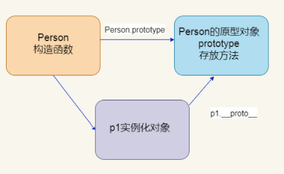

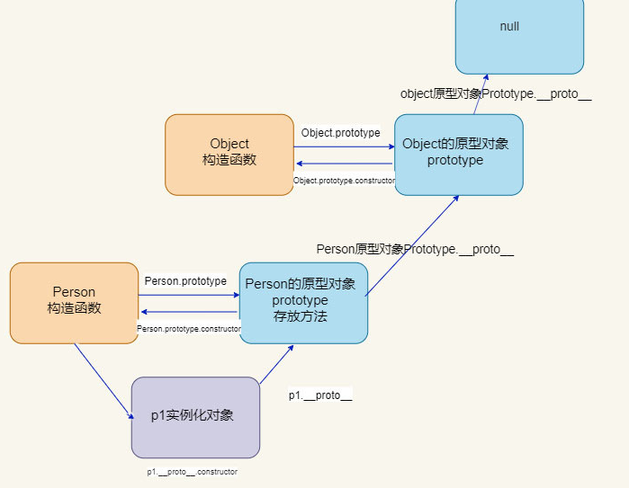


#### constructor属性

- 用来保存数据的部分，一般省略，内部会自动创建（详情看pink）
- 构造函数的原型对象的constructor属性指向了构造函数,实例对象的原型的constructor属性也指向了构造函数


#### 原型对象this指向

构造函数中的this和原型对象的this,都指向我们new出来的实例对象

```js
function Person(name) {
          this.mName = name;
};
var that;
Person.prototype.sayName = function() {
     console.log('我是大咖');
     that = this;
}
var p1 = new Person('张三');
// 1. 在构造函数中,里面this指向的是实例对象
p1.sayName();
console.log(that);
console.log(p1);
console.log(that === p1); //true
// 2.原型对象函数里面的this指向的是实例对象
```

#### 通过原型为数组扩展内置方法

```js
 Array.prototype.sum = function() {
   var sum = 0;
   for (var i = 0; i < this.length; i++) {
   sum += this[i];
   }
   return sum;
 };
 //此时数组对象中已经存在sum()方法了  可以使用数组.sum()进行数据的求和
```


#### 其他方法

- `Object.prototype.hasOwnProperty(prop)` 方法
  - 可以判断一个属性定义在对象本身而不是继承原型链的方法，主要用于判断某个对象中是否有某个属性，返回值为布尔值。
- Object.prototype.isPrototypeOf(Object)方法
  - 接收一个对象，用来判断当前对象是否在传入的参数对象的原型链上，返回一个布尔值。

```js
function Person(name, age) {
    this.name = name;
    this.age = age;
    // 自身
    // this.sayHi = function() {
    //     console.log('自身的sayHi');
    // }
};
Person.prototype.sayHi = function() {
    console.log('prototype的sayHi');
};
var p1 = new Person('乔碧萝', 43);
// 可以判断一个属性定义在对象本身而不是继承原型链的方法
console.log(p1.hasOwnProperty('name'));
console.log(p1.hasOwnProperty('sayHi'));
// isPrototypeOf方法接收一个对象，用来判断当前对象是否在传入的参数对象的原型链上，返回一个布尔值
console.log(Person.prototype.isPrototypeOf(p1)); //true
console.log(Object.prototype.isPrototypeOf(p1)); //true
var date = new Date();
console.log(Person.prototype.isPrototypeOf(date)); //false
```

> 测试题：
>
> ```js
> function A(){}
> A.prototype.n=1
> var b=new A()
> A.prototype={
>    n:2,
>    m:3
> }
> var c= new A()
> console.log(b.n, b.m, c.n, c.m)    //1 undefined 2 3 
> ```
>
> 


### 理解 Object 

- 创建对象的三种方法
  - 字面量法    var one={...}
  - 构造函数法    function two(uname){ this.uname=uname; ...}
  - 利用new Object()     var three=new Object();
  
- 遍历对象的方法
  - for( i  **in**  obj_name ) {...}   
    -  i 是每一项的索引名
    
  - Object.keys(obj_name);     
    
    ```js
    //参数：要遍历的对象的名字，结果以数组形式输出
    //返回值为对象的所有属性名组成的 可枚举属性 的数组
    console.log(Object.keys(person));
    ```
    
  - Object.getOwnPropertyNames(obj_name);       
    - 返回对象的所有属性名组成的数组(包含不可枚举属性，但不包含Symbol值作为名称的属性）
  
- **以上内容详见笔记本**


#### 检查属性是否存在

- `if( a in obj1 ){ }`

```js
var obj1={
   uname:"小刘",
   money:0
}

// 不可靠的检测方法：直接使用
if(obj.money){
   //存在该属性
}

// 可靠的检测方法 if...in
if(obj.money in obj){
   console.log("存在");
}
```


#### 删除属性

- 使用`delete`操作符将属性从对象中完全删除。

  ```js
  obj.name = undefined;
  此时name属性仍存在obj对象中，怎样才能在obj中移除name属性呢？
  //删除属性
  delete obj.name;
  ```


#### Object属性

- <span style="color:#0FA6D8">普通属性：</span>通过赋值操作定义的属性

- <span style="color:#0FA6D8">数据属性(存储数据)：</span>需要设置value值，但不能使用 set和 get 

  - 不包含值，而是定义了一个`get`和`set`函数，
  - 当读取属性时，调用`get`函数；当写属性时，调用`set`函数。

  ```js
  let person = {
      name:'吴老板',
      age:18
  }
  
  //为person对象追加新的属性
  //参数1：要添加属性的对象的名字
  //参数2：要添加的属性的名字
  //参数3：添加的属性的配置项（值）
  Object.defineProperty(person,'school',{
      value:18,             //该属性对应的值，默认为undefined,可以是任意有效js值(数值，对象，函数等)
      enumerable:true,      //控制属性是否可以能否通过 for-in 循环，进行枚举。 
      writable:true,        //控制属性值是否可以被修改
      configurable:true     //控制属性是否可以通过 delete 删除属性从而重新定义属性，能否修改属性的特性，能否把属性修改为访问器属性。
  })
  
  默认：
  // 1.使用该方法追加的属性，默认情况：不可枚举，无法遍历得到   enumerable:false, 
  // 2.默认情况下不能被修改。    writable:false,    
  // 3.默认情况下不可以被删除    configurable:false  
  ```

  

- <span style="color:#0FA6D8">访问器属性：</span>不能设置value值，使用get 和set 函数

  ```js
  var obj = {
      age: 12,
     //访问器属性
      get add(){
          return this.age + 2;
      },
      set add(value){
          this.myname = value;
      }
  };
  
  console.log(obj.add);    //  14 这里执行了add的get函数
  obj.add.value=10;         
  console.log(obj.age);    //  12 上一句赋值操作触发了add的set函数
  ```

  ```js
  //访问器属性
  Object.defineProperty(obj, 'age', {
      configurable: true,
      enumerable: true,
      get: function() { 
         // 读取 age 属性时，会执行这个函数。返回值就是 age 的值。
          return this._age;
      },
      set: function(newValue) { 
         // 写入 age  属性时，会执行这个函数。
          if (newValue > 5) {
              this._age += newValue;
          } else {
              this._age = newValue;
          }
      }
  });
  ```

- 注意：

  - 通过赋值操作定义对象，添加的普通属性，**默认都是可修改、可枚举、可配置的(删除和添加)。**

  - 使用 `Object.defineProperty()` 添加的属性**默认都是不可修改，不可枚举，不可配置(删除和添加)。**
    - 配置的默认值为false，可设置为true

##### Object.defineproperty 绑定数据

```javascript
let number = 10;
let person = {
    age:'number'
}

Object.defineProperty(person,'age'{
    //需求：当number的值更改后，person的age值就跟着发生更改
    //当读取person的age属性时，get函数就被调用，且返回值就是age的值
    //原理：只要读取get的值时，就调用get函数，重新为获取number的值更新到age
     get(){
        return number
     }
     
    //需求：当person的age值修改后nubmber跟着修改
    //当修改person的age值时，就调用set函数，且会收到修改的具体的值
    //原理：修改person的age数据后，将age的值赋给number
     set(value){
         number = value;
     }
})

//注意：使用get() 或者set() 时，不能给追加的属性再写value值
```


##### 定义多个Object属性

- 定义单个属性的内部特性使用`Object.defineProperty()`

- 定义多个属性使用的是`Object.defineProperties()` 

  - 参数1：属性所属的对象
  - 参数2：包含被定义属性的对象

  ```js
  var obj = {
      age: 2
  };
  Object.defineProperties(obj, {
      name: {
          configurable: false,
          writable: true,
          value: '李小谷'
      },
      age: {
          get: function () {
              return this._age; 
          },
          set: function (newValue) {
              if (newValue > 5) {
                  this._age += newValue;
              } else {
                  this._age = newValue;
              }
          }
      }
  });
  ```


##### 获取Object属性特征

- 该方法返回指定对象上一个自有属性对应的属性描述符
- 自有属性指的是直接赋予该对象的属性，不需要从原型链上进行查找的属性
- `Object.getOwnPropertyDescriptor(obj, "prop")`
  - `obj` : 目标所在的对象。
  - `prop` : 要获取特性的属性。**注意属性要带引号 ！**
  - 返回值：如果给定的属性存在于对象上，则返回属性描述符对象。否则返回 undefined
- `Object.getOwnPropertyDescriptors(obj)`
  - `obj` : 要获取的目标对象。
  - 返回值：所指定的对象的所有自身属性的特性描述符，如果没有任何自身属性则返回空对象。
  

```js
// 构造函数
function Star(name, age, sex) {
    // 实例成员
    // 属性
    this.name = name;
    this.age = age;
    this.sex = sex;
    // 会唱歌
    // this.singing = function() {
    //     console.log('会唱歌');
    // }
};
// 添加的方法
Star.prototype.singing = function() {
    console.log('会唱歌pro');
};
var s1 = new Star('王一博', 24, '男');
// 指定对象上一个自有属性对应的属性描述符。
console.log(Object.getOwnPropertyDescriptor(s1, 'name')); // 返回实例对象name的配置
console.log(Object.getOwnPropertyDescriptor(s1, 'singing')); //undefined
```


### 数据代理

- <span style='color:hotpink'>数据代理：</span>通过一个对象代理对另一个对象中属性的操作（读/写）。

```js
let obj = { x:100 }
let obj2 = { y:200 }

//通过obj2中的x对obj中的x进行读写操作
Object.defineProperty( obj2,'x'{
   get(){
       return obj.x
   },
   set(value){
       obj.x = value
   }
})
```


### 闭包Closure

- 如何产生闭包：当一个嵌套的内部(子)函数引用了外部(父)函数的变量(函数)时，就产生了闭包。
- 闭包到底是什么？
  - 理解1：闭包是嵌套的内部函数 (绝大多数)
  - 理解2：包含被引用变量(函数)的对象 (少数理解)
  - 闭包存在于嵌套的内部函数中
- 产生闭包的三个条件：
  - 函数嵌套
  - 内部函数引用了外部函数的数据（变量/函数）
  - 执行了外部函数，但不一定需要执行内部函数(执行函数定义就会产生闭包)


#### 了解闭包

- 将函数作为另一个**函数的返回值** 或 **参数进行传递**时，产生闭包

```js
function fn1(){
   var a=2
   function fn2(){
      a++;
      console.log(a);
   }
   return fn2
}
var a=100   // js是静态作用域语言 不会影响 fn函数中a的值
var f=fn1()
f()  // 3
f()  // 4
fn1()
// 分析：这个程序一共产生了两个闭包，没次执行一下外部函数，就产生一个闭包
// 在两次f()的过程中，都只执行了fn2，并且使用了f保留下来的a值
```

```js
// JavaScript是基于词法（静态）作用域的语言
// 词法作用域：在函数定义时就确定了作用域，而不是执行的时候再确定
// 闭包的 词法闭包的简称，是引用了自由变量的函数，被引用的函数将和这个函数一同存在，及时离开创造他的环境也不例外
var scope =10
function calculate(add){ console.log( add+scope ) }
(function(ca){
    var scope =100
    ca(5)  // 15
})(calculates)
```


- 函数作为实参传递给另一个函数

```js
function showTime(msg,time){
   serTimeout(function(){
      // 内部函数使用了外部函数的数据 msg
      console.log(msg)
   },time)
}
showTime("123",1000);
```


#### 闭包的作用

> 闭包导致内存未释放，可用来保存中间计算结果，类似于实现了计算结果的缓存

- 使函数内部的局部变量在函数执行后，仍然存活在内存中（延长了局部变量的生命周期）
- 让函数外部可以操作(读/写)函数内部的数据
- 问题：
  - 函数执行完后，局部变量一般不会继续存在，但存在于闭包中的变量可能继续存在（被引用时）
  - 在函数外部不能直接访问函数内部的变量，但通过闭包可以返回一个内部函数，操作函数内部的数据

```js
// 假设需求：让一个变量在外部只能读但不能修改
// 使用闭包，在外部函数中返回一个内部函数，内部函数执行返回数据的值(或限制对数据的操作)
function fn1(){
   var a=2
   function fn2(){
      a++;
      return a
   }
   function fn3(){
      a++;
      return a
   }
   return fn2
}
var f=fn1()
// 例如这个函数只能对a执行++ 操作并读取a的值
// 在函数执行结束后，fn3、fn2都被当做垃圾对象回收，但因为f仍然引用着fn3的函数，所以a不会被回收
```


#### 闭包的生命周期

- 产生：在嵌套函数的外部定义执行完成就产生，(不是调用时才产生)
- 死亡：在嵌套的内部函数成为垃圾对象时


#### 闭包的应用

- 定义JS模块

  - 具有特定功能的js文件
  - 将所有的数据和功能都封装在一个函数的内部（私有）
  - 只向外暴露一个包含n个方法的对象或函数
  - 模块的使用者，只需要通过模块暴露的对象调用方法来实现对应的功能

  ```js
  // 方式1： 具有明显优势，带参数window可避免代码压缩产生的问题
  // - 外部引入该函数，可以直接使用myfunction对象提供的方法
  (function(window){
     var msg='myname'
     function fn1(){
        console.log('msg'+'fn1')
     }
     function fn2(){
        console.log('msg'+'fn2')
     }
     window.myfunction={
        fn1:fn1,
        fn2:fn2
     }
  })(window);
  fn1();
  
  // 方式2：
  function myfunction2(){
     var msg='myname'
     function fn1(){
        console.log('msg'+'fn1')
     }
     function fn2(){
        console.log('msg'+'fn2')
     }
     return {
        fn1:fn1,
        fn2:fn2
     }
  }
  // 需要先执行一次，才能使用它提供的方法
  var myfunctions = myfunction2();
  myfunctions.fn1()
  ```


#### 闭包的缺点

- 函数执行结束后，函数内的局部变量没有释放，长时间占用内存，容易导致内存泄漏
- 解决方法：
  - 能不用闭包，就不用
  - 及时手动释放，赋值为null，让对应函数成为垃圾对象，回收闭包

#### 内存溢出与泄露

- 内存溢出
  - 一种程序运行出现的错误，程序无法运行
  - 当程序执行需要的内存超过了剩余内存时，就提示内存不足的错误！
- 内存泄露
  - 占用的内存**没有及时释放**，占用着内存
  - 内存泄露累计多了就容易导致**内存溢出**
  - 常见的内存泄露：
    - 意外的全局变量，例：在局部变量中没有声明的变量，成为了全局变量
    - 没有及时清理的计时器或回调函数，在后台一直运行
    - 闭包

> 面试题：
>
> ```js
> // 代码片段1：
> var name = 'The window';
> var object ={
>    name:'My Object',
>    getNamefun:function({
>       return function(){
>          return this.name;
>       }
>    })
> };
> alert(object.getNamefun()());  // the window 
> // 分析：object.getNamefun() 返回值是一个函数，函数内部的this默认指向windows
> 
> // 代码片段2：
> var name2 = 'The window';
> var object2 ={
>    name2:'My Object',
>    getNamefun:function({
>       var that=this;
>       return function(){
>          return that.name;
>       }
>    })
> };
> alert(object2.getNamefun()());  // My Object
> // 分析：that 在执行时保存了this指向的Object2
> ```
>
> 


### Image 对象

- 让浏览器缓存一张照片

```js
// js创建Image对象,等价于document.createElement('img');
// 宽、高可以省略：var a = new Image();
var a = new Image(100,100);
// 定义Image 对象
a.src = "./xxx.gif"
// 将定义的Image 内容放在页面中
document.body.appendChild(a);

//相当于在body中定义了如下内容

```

- **src 属性一定要写到 onload 的后面，否则程序在 IE 中会出错**

- 使用图片的js操作，要等图片加载完成在执行

  - ```js
    var a = new Image(100,100);
    a.src = "./xxx.gif"
    a.onload = function(){
       // 此时再操作图片，避免因图片还未加载而出错
    }
    ```

- 考虑到浏览器的兼容性和网页的加载时间，尽量不要在 Image 对象里放置过多的图片

- Image对象的 **complete属性**

  - 当图像处于装载过程中，该属性值false,

  - 当发生了onload、onerror、onabort中任何一个事件后，则表示图像装载过程结束（不管成

    没成功），此时complete属性为true）


### 正则表达式 RegExp

[在线正则表达式测试 (oschina.net)](https://tool.oschina.net/regex)

- 用于定义一些字符串规则，计算机可以根据正则表达式进行字符串的检测
- 正则表达式是一个对象
  - 创建正则表达式的两种方法
    - 使用构造函数，更加灵活   `var 变量 = new RegExp('正则表达式','匹配模式');`
    - 使用字面量，更简便    `var 变量 = /正则表达式/匹配模式`
- 转义字符`\`反斜杠
  - `/\./`表示 `.`
  - `/\\\\/` 表示`\\`

```js
var str =  'abc';
// 使用正则表达式步骤：
// 1.创建正则表达式对象 var 变量 = new RegExp('正则表达式','匹配模式');
var one = new RegExp('a');
// 使用字面量创建正则表达式   var 变量 = /正则表达式/匹配模式
var one = /a/i; 

// 2. text() 方法检测字符串是否符合规则; 符合true;不符合false
var result = one.test(str);
console.log(result);   //返回值 true   说明str符合one
```

- **匹配模式**

  | 符号 | 描述                     | 实例                            |
  | ---- | ------------------------ | ------------------------------- |
  | i    | 忽略大小写               | `new RegExp('正则表达式','i');` |
  | g    | 全局匹配模式             | `new RegExp('正则表达式','g');` |
  | gi   | 全局匹配模式且忽略大小写 |                                 |

   

- **正则表达式规则**

  | 符号    | 含义                            | 实例                                                         |
  | ------- | ------------------------------- | ------------------------------------------------------------ |
  | \|      | 或(有一个就行)                  | /a\|b/         （存在a或b）                                  |
  | [ ]     | 或(有一个就行)                  | `/[A-z]/` (存在A-z之间的任意字母）   ` /[ab]/`  (存在ab)     |
  | [^ ]    | 除了^里面内的都可以             | `/[^a-z]/`  (除了a-z之件的字母都可以)                        |
  | { }     | 连续出现的次数                  | `/ba{3}/` 连续出现3个a；   `/(ab){3}/`连续出现3个ab；     `/b{1,3}c/` 连续出现1-3次b；    `/b{3,}/`出现3次及以上次数b |
  | n+      | 至少包含一个                    | `/a|b+/` 至少出现一个a或b                                    |
  | n*      | 包含0个或多个，相当于没写       |                                                              |
  | n？     | 包含0个或1个                    |                                                              |
  | n$      | 以n结尾                         |                                                              |
  | ^n      | 以n开头                         |                                                              |
  | *？     | 重复任意次，但尽可能少重复      |                                                              |
  | +?      | 重复1次或更多次，但尽可能少重复 |                                                              |
  | (?!exp) | 匹配后面跟的不是exp的位置       |                                                              |

1. 手机号的正则：`/^1[3-9][0-9]{9}$/`
2. `/^(?!_)(?!.*?_$)[a-zA-Z0-9_\u4e00-\u9fa5]+$/`
   - 不能以_开头
   - .*?_ 结尾

- 元字符

  | 符号 | 含义                             | 实例                                        |
  | ---- | -------------------------------- | ------------------------------------------- |
  | `.`  | 查找任意字符，除了换行和行结束符 |                                             |
  | `\w` | 任意字母、数字、_                |                                             |
  | `\W` | 与\w相反，即`[^A-z0-9_]`         |                                             |
  | \d   | 任意数字                         |                                             |
  | \D   | 除了数字                         |                                             |
  | \s   | 空格                             |                                             |
  | \S   | 除了空格                         |                                             |
  | \b   | 单词边界                         | `/\bchild\b/` 检测有没有单独的单词` child ` |
  | \B   | 除了单词边界                     |                                             |

去除字符串的所有空格：`str = str.replace('/\s/g')`

去除字符串前后的空格：`/^\s*|\s*$/g`

####  支持正则表达式的Sting方法

| 方法        | 描述                                                         | 实例                                           |
| ----------- | ------------------------------------------------------------ | ---------------------------------------------- |
| `split()`   | 将一个字符串根据'拆分符'拆分为一个数组                       | `str.split(/[a-z]/)` 遇到a-z之间的符号进行拆分 |
| `search()`  | 检索字符串中是否含有指定内容,返回'索引值'或-1                | `str.search(/a[be]c/)` 是否含有abc或aec        |
| `match()`   | 默认将第一个符合条件的内容从字符串中提取出来；采用正则表达式的全局匹配模式，返回所有符合结果组成的数组 | `str.match(/[A-a]/ig)`                         |
| `replace()` | 将符合规则的字符串进行替换，参数1：被替换的内容，参数2：新的内容;  默认只替换第一个;可以使用全局匹配模式 | `str.preplace('/a/g','@')`                     |


### 内置API

#### Object对象

| 方法             | 用法                                                         | 描述 |
| ---------------- | ------------------------------------------------------------ | ---- |
| Object.keys()    | 传入对象，返回属性名；传入字符串，返回索引<br>传入数组 返回索引；构造函数 返回空数组(构造函数)或者属性名(实例对象) |      |
| Object.values()  | 返回一个数组，成员是参数对象自身的（不含继承的）所有可遍历属性的键值 |      |
| Object.entries() | 返回一个数组，成员是参数对象自身的（不含继承的）所有可遍历属性的键值对数组 |      |
| Object.assign()  | 用于将所有可枚举属性的值从一个或多个源对象复制到目标对象。并返回目标对象（[Object.assign()方法](https://juejin.cn/post/7028013563310506014)） |      |
| Object.freeze()  | 可以冻结一个对象。被冻结的对象不能被再修改（修改/添加/删除） |      |
|                  |                                                              |      |
|                  |                                                              |      |


##### Object.freeze()

- 特点：

  - Object.freeze() 方法可以冻结一个对象。被冻结的对象不能被再修改（修改/添加/删除）
  - 不能修改冻结对象已有属性的可枚举性、可配置性、可写性，以及不能修改已有属性的值
  - 此外，冻结一个对象后该对象的原型也不能被修改。freeze() 返回和传入的参数相同的对象
  - 如果被冻结的对象具有以对象作为值的属性，这些深层对象可以被更改

- 可能的使用场景（性能提升）

  - vue中，把普通对象传给data时，Vue 将遍历此对象所有的属性，并使用  Object.defineProperty 把这些属性全部转为 getter/setter，这些 getter/setter 对用户来说是不可见的，但是在内部它们让 Vue 追踪依赖，在属性被访问和修改时通知变化

    但在实际应用中，可能只是用来存储某个对象或者数组，并不要求它响应对应的视图，但在这个过程中vue还是会用object.defineProperty来监听这个数组，这样就是一种性能浪费，所以我们阔以使用Object.freeze来冻结数据

    如果有一个巨大的数组或Object，并且确信数据不会修改，使用Object.freeze()可以让性能大幅提升。在我的实际开发中，这种提升大约有5~10倍，倍数随着数据量递增

```js
const objectExample = {
  prop1: 20,
  prop2: "羊先生"
};

objectExample.prop1 = 100;  // 默认情况下，我们可以根据需要修改对象的属性

// 冻结对象（浅冻结）
Object.freeze(objectExample);
objectExample.prop2 = "Alice" // 如果在严格模式会抛出失败，在非严格模式下只会抛出异常

// 深度
const theObject = {
  x: 1,
  y: { a: "Hello",  b: "羊先生" }
}

Object.freeze(theObject);
theObject.y.a = 'vipbic';
console.log(theObject.y.a)

// 递归冻结
const deepFreeze = (obj) => {
  const propNames = Object.getOwnPropertyNames(obj)
  for (const name of propNames) {
    const value = obj[name];
    if (value && typeof value === "object") { 
      deepFreeze(value);
    }
  }
  return Object.freeze(obj);
}

deepFreeze(theObject);
theObject.y.a = 100;
console.log(theObject.y.a );

// vue中使用提升性能
data() {
    let data =  Object.freeze([{text:'羊先生'},{text:'ipbic'}])
    return {
       msg: '',
       items:data
    }
},
mounted() {
    this.items[0].text = '分享快乐'; // 界面不会更新
    this.items = [{ text: 'itnavs' },{ text: '分享快乐' }]; // 界面会更新
    this.items = Object.freeze([{ text: 'itnavs' },{ text: '分享快乐' }]); // 界面会更新
},
```


#### Number

- 新增数值函数

  ```js
  // es6 将全局函数 parseInt和parseFloat移植到 Number对象上
  // inNaN  判断参数的值是否是NaN
  Number.isNaN(NaN)   // true
  // isInteger  判断参数的值是否是整数
  Number.isInteger(12.2)   //false
  Number.isInteger(12.0)   //true   在js内部 12.0会被存储成12
  Number.isInteger(25)     //true
  ```

- 新增值

  - EPSILON  极小常量(正值)

  - 由于浮点数的计算是不精确的，会导致无法判断浮点数的运算结果是否等于某个值，如果误差小于极小常量，就可认为两个值相等

    `Math.abs(0.1+0.2-0.3)<Number.EPSILON`

 

#### String

- es6新增字符串函数

```js
var s='hello';
// repeat(n) 将源字符重复n次
s.repeat(3)   // hellohellohello
// startsWith('he')  返回ture 表示原字符以参数字符串开头
s.startsWith('he')
// endsWith('lo')   返回ture 表示原字符以参数字符串结尾
s.startsWith('lo')
// includes('el')  返回true 表示原字符包含参数字符串
s.includes('el')
```

| 方法         | 描述                                                         | 用法                                                         |
| ------------ | ------------------------------------------------------------ | ------------------------------------------------------------ |
| startsWith() | 确定字符串是否以指定字符串的字符开头。<br>如果字符串以字符开头，返回true，否则返回false。 | `var str = "Hello world!"; `<br>`var n = str.startsWith("Hello");` |
|              |                                                              |                                                              |
|              |                                                              |                                                              |

#### Array

| 方法  | 描述                                                     | 用法           |
| ----- | -------------------------------------------------------- | -------------- |
| map() | 返回新数组，数组中的元素为原始数组元素调用函数处理后的值 | `arr.map(fun)` |
|       |                                                          |                |
|       |                                                          |                |


#### Math

- 


## ES6

### 解构赋值

```js
let obj = {a:1,b:2}
// 解构得到c   解构赋值
const {a,b:big} = obj
console.log(big)  // 2

let obj = {a:{b:{c:1}}}
// 解构得到c   连续解构赋值
const {a:{b:{c}}} = obj
console.log(c)  // 1
console.log(a)  // 报错

let obj = {a:{b:{c:1}}}
// 解构得到c   连续解构赋值 + 重命名
const {a:{b:{c:city}}} = obj
console.log(city)  // 1
console.log(c)  // 报错
```


### for in/of

- `for in` 语句用于循环**对象属性**。

  循环中的代码每执行一次，就会对数组的元素或者对象的属性进行一次操作。

  JavaScript 支持不同类型的循环：

  - **[for](https://www.runoob.com/jsref/jsref-for.html)** - 循环代码块一定的次数
  - **for/in**- 循环遍历对象的属性
  - **[while](https://www.runoob.com/jsref/jsref-while.html)** - 当指定的条件为 true 时循环指定的代码块
  - **[do/while](https://www.runoob.com/jsref/jsref-dowhile.html)** - 同样当指定的条件为 true 时循环指定的代码块

  **注意：** 不要使用 for/in 语句来循环数组的索引，你可以使用 [for](https://www.runoob.com/jsref/jsref-for.html) 语句替代。

- `for of` 语句循环遍历可迭代**对象的值**。

```js
// for in 循环key值
const obj = { name:"夏之一周",age:18,sex:'男' }
for(var key in obj){
    console.log(obj[key])
}

// for of  循环每一项
const cars = ["BMW", "Volvo", "Mini"];
let text = "";
for (let x of cars) {
  text += x;
}  
// BMWVolvoMini
```


### 展开运算符

- 在函数中使用

  - 将参数列表，转化为一个数组

  ```js
  function sum(...numbers){
     // reduce是数组的方法,返回累加后的值
     return numbers.reduce((total, num)=>{
        return total+num;
     })
  }
  sum(1,2,3,4)
  ```

- 展开对象，不能直接展开对象

  ```js
  let person ={name:'123',age:123}
  person2 = {...person}  // 不报错，相当于将 person复制一份
  
  console.log(person2)
  console.log(...person)  // 报错，对象不能直接展开
  ```

- 合并

  ```js
  // 将person展开所有属性与age name 进行合并，再复制给person3
  person3 = {...person,name:'123',age:80}
  ```

  


### this指向

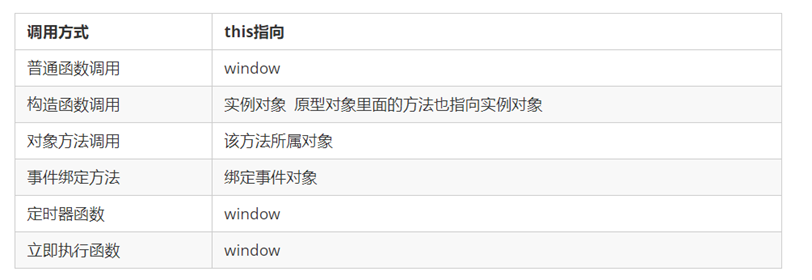


### 严格模式

- JS提供正常模式和严格模式两种，目的：为未来版本做铺垫
- 严格模式只在IE10以上浏览器版本才支持，旧版本中会被忽略
- ES5严格模式是具有限制性的JS变体，更改内容：
  1. 消除了JavaScript语法的一些不合理、不严谨，减少怪异行为
     - 变量/函数提升，但会放在 `临时死区`，不会导致提升带来的异常问题
  2. 提高编译器效率，增加运行速度。
  3. 禁用了在 ECMAScript 的未来版本中可能会定义的一些语法，为未来新版本的 Javascript 做好铺垫。比如一些保留字如：class, enum, export, extends, import, super 不能做变量名


#### 脚本开启严格模式

> 必须使用  "use strict"   引号中间不能有空格等其他任意字符！！！

- 在代码前使用`"use strict";`

  ```js
  "use strict";
  console.log("这里之后的代码都是严格模式");
  ```

- 使用立即执行函数包裹（同时存在严格模式和非严格模式时使用）

  ```js
  (function(){
     "use strict";
      console.log("这里的代码都是严格模式");
  })()
  console.log("这里是非严格模式");
  ```
  

#### 函数开启严格模式

- 把“use strict”; (或 'use strict'; ) 声明放在函数体所有语句之前

  ```js
  function fn(){
  　　"use strict";
  　　return "这是严格模式。";
  }
  ```


#### 严格模式的规范

- this指向

  | 全局作用域       | window对象   |
  | ---------------- | ------------ |
  | 全局作用域中函数 | undefined    |
  | 对象、事件等     | 谁调用指向谁 |

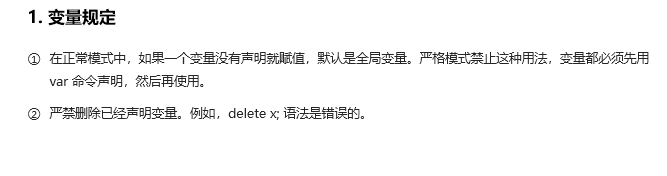

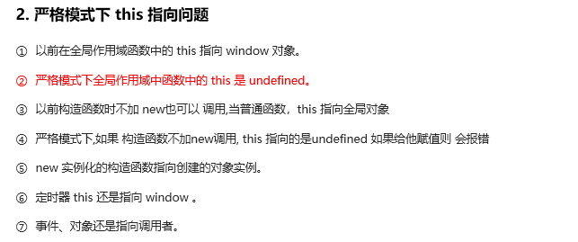

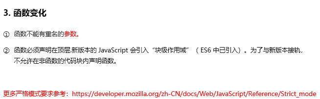


### 模块化

> - commonjs与es module 区别
>   - CommonJS 运行时 - 来源与民间
>   - ES Module 编译时 - 来源于官方
>     - 也决定了ESM的依赖引入只能放在代码头部，
>     - 动态导入方法：`import('./a.js')`
> - 因此更推荐使用 ESM，为编译时导入，代码执行前就完成依赖关系规划，有利于依赖优化。

- `<span style="color:#E2A62A">理解：</span>`将复杂的程序依据一定规则**拆**分为单个文件，使用时再组**合**在一起

- 特点：模块的内部数据是私有的，仅向外暴露一定的属性和方法

- `<span style="color:#E2A62A">模块化的优势：</span>`

  - 降低复杂度，提高解耦性（高内聚  低耦合）
  - 模块作用域私有，解决命名冲突的问题
  - 更好的分离功能代码，实现按需加载
  - 提升代码 复用性、可维护性

- 常见模块化规范

  - CommonJS 的 Modules 规范：Node.js  （同步的加载机制）
    - 同步加载机制适合服务器端，但不适合浏览器
  - ES6模块化
  - CMD
  - AMD

- 其他实现方法

   ```js
    // 借助IIFE 匿名函数自调用 / 立即执行函数 实现
    //   - 可以保证私有变量不被暴露，内部可以访问外部的变量，但外部不能访问内部的变量
    //   - 内部定义的变量不会与外部定义的变量发生冲突
    var module_one =(function(){
       var a1 = 123;
       var a2 = ()=>console.log(a1);
       return{
          a1:a1+1,
          a2:a2
       }
    })()
    
    console.log(module_one.a1);
    module_one.a2()
    ```
    
    
#### ES6模块化

- 每个文件都是一个模块
- 浏览器中可以直接使用(兼容性差)；
- Node中需要借助**[Babel ](https://www.babeljs.cn/)**和**[Browserify](https://browserify.org/)**依次进行编译
  1. Bable解决es6模块化的兼容性问题：编译为CommonJS规范
  2. browserify 再转化为es5语法

- 暴露模块
  - 默认暴露：`export default 对象`
  - 分别暴露：export 暴露内容        // 直接在要暴露的内容前加`export`
  - 统一暴露：`export { ...}`
    - 可以使用 as 对要暴露的内容重命名
- 静态导入（因为ESM为编译时运行，所以默认为静态）
  - `import xxx from '模块路径'`   // 默认暴露
  - `import {name,age,ren,...} from '模块路径' `  // 分别暴露和统一暴露
  - `import * as module1 from "模块路径/模块名"; `    // 通用的导入方式
  - 导入模块时，也可以使用as进行重命名
- 动态导入（可在代码中根据逻辑动态导入）
  - `import("./xxx.js")`


```js
// 分别暴露
const data = 'atguigu';
export const name = 'zyy';
export function showName(){
    console.log(data);
}

// 统一暴露 都声明好，再暴露出去
export {name,showName}
// 暴露时使用as重命名
export {name as username ,showName as show}

// 默认暴露，直接放在一个对象中，全部暴露
export default {
   school: 'ATLUCA',
   change: ()=>{
       console.log("我可以改变世界！");
    }
}
```

```js
// 导入 适用于分别暴露和统一暴露    可使用 as 进行重命名
import { myName, myAge, myfn as fn, myClass } from "./test.js";

// 通用方式：导入 m1.js 模块内容
import * as _m1 from "js/m1.js";
_m1.teach();
```


#### CommonJS

- 规范：
  
  > CommonJS模块化的代码，<span style="color:#0FA6D8">既可以在服务器端运行、也可以在浏览器运行</span>
  >
  > 服务器端：模块化的代码可以直接运行 Node.js环境
  >
  > 浏览器端：模块化的代码需要经过**[Browserify](https://browserify.org/)编译**
  
  
  
  1. 每个文件都是一个模块，拥有单独的作用域，不会污染全局作用域
  2. 一个模块无论在require中引用多少次，模块永远是单例，只会被加载一次
     - 模块第一次加载后就会被缓存，后续加载会读取缓存。
     - 模块的加载顺序由依赖图决定
     - 模块的加载过程是同步的
  
- 基本语法：
  - 暴露语法：
    - 第一种(统一暴露)：`module.exports = value`      / /value代表要暴露的内容，可以是一个对象
    - 第二种(分别暴露)：`exports.xxx = value;`
  - 引入语法：
    - 引入第三方模块：`conse xxx = require('xxx')`        //xxx为模块名
    - 引入自定义模块：`require('xxx')`       //xxx为模块文件路径   
    - <span style="color:#0FA6D8">一般取引入模块名为别名，引入什么取决于暴露的内容</span>
  
- 内置关系：
  - `exports == module.exports`   两者默认是同一个东西
  - 若一个文件中出现对`module.exports`的再赋值，则以`module.exports`为准，`exports`不再生效
  - 暴露的本质：向空对象中加东西
  - 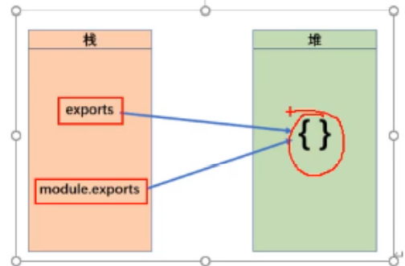


##### 服务器端Node：

- node下直接使用如下方法运行即可
- exports是module.exports的引用，只有文件中才存在exports
- 更多内容查看 Node相关笔记.......

```js
//暴露showDate ，并取别名为a
module.exports.a = function showData(){}  
module.exports.add = function(a,b){ console.log(a+b); }
-----------------------------------------------------------------
// 引入modeule自定义模块   ./表示当前文件夹路径
const module1 = require('./module1');  
//调用module1暴露的方法
module1.a();
```

```js
let data ='atguigu';
//暴露一个对象，对象中包含着需要暴露的方法和属性
//改变了原有空对象的指向，exports失效，以module.exports为准，
//且再次赋值时覆盖原暴露的内容
module.exports = {
    name:'zy',
    showData(){
        console.log(data);
    }
}
-----------------------------------------------------------------
//引入 引入的只是导出的内容
const module = require('./module');
//调用模块的方法
console.log(module.name);
module.showData();
```


```js
//使用exports暴露 sub方法
exports.sub = function(a,b){
    console.log(a-b);
}

//引入sub方法
const module = require('./module');
module.sub();
```

```js
//引入第三方模块
const http = require('http');
```


##### 浏览器端：

- 浏览器端没有`require`等node中的语法

- 需要经过**[Browserify](https://browserify.org/)编译**（全局安装）

  - 全局安装Browserify包`npm i browserify -g`

- 加工代码

  - 只需加工汇总代码的文件即可

  - 命令行切换到需要编译的文件目录
  - `browserify 引入汇总的文件名  -o  输出编译后文件的路径`
  - 例：`browserify ./app.js  -o   ./build.js `
  - html页面引入build.js


准备相关依赖包

- 全局安装`Browserify`和`babel-cli`(babel的命令工具)

  - `browserify ./app.js  -o   ./build.js  `      //Browserify
  - `npm install babel-cli -g`                     //babel-cli

- 局部安装babel-preset-es2015

  - 只需要在项目中安装即可
  - `npm install babel-presrt-es2015 `

- 定义`.baelrc`文件    运行时控制文件

  - 与要解析的文件平级

  - ```json
    {
        "presets":['es2015']
    }
    ```

- 直接加工要解析的文件夹（会自动忽略不需要加工的文件）

  - `babel  要加工的文件夹路径 -d  加工后的文件夹路径`    //会自动创建生成后的文件夹
    - `babel ./src  d ./bulid`     把根目录的文件加工后放在build文件夹中

- index.html 引入需要加载后的文件夹


### class类

1. 面向对象

   - <span style="color:hotpink">思想：</span>把事物分解为一个个对象，由对象之间的分工合作,以对象的功能划分。
     - 抽取  对象共用的属性和行为 封装 成一个 类
     - 对类进行`实例化`，获取类的对象
     
   - 优点：具有灵活、代码可复用、易于维护和开发，适合多人合作的大型项目。
   
   - 缺点：性能可能比面向过程低。
   
   - <span style="color:hotpink">特性：</span>封装性   继承性    多态性
   
   - 对象:在js中，对象是一组无序的相关属性和方法的集合，所有的事物都是对象。
   
     - 对象特指某一个，通过类的实例化为一个具体的对象
   
     - 属性：事物的<span style="color:hotpink">特征</span>，在对象中用属性表示（常用名词）
   
     - 方法：事物的<span style="color:hotpink">行为</span>，在对象中用方法表示（常用动词）
   
2. 面向过程pop

   - <span style="color:hotpink">思想：</span>分析解决问题的步骤，根据步骤依次实现，使用时再调用，以事件的步骤划分。

   - 优点：性能高，适合跟硬件联系紧密的东西，例：单片机采用面向过程。


#### 创建类

- 通过`class 类名`创建类，习惯类名**首字母大写**

-  `constructor()`方法：是类的构造函数<span style="color:hotpink">(默认方法)，用于传递参数，返回实例对象。</span>
  - 通过new命令生成对象实例时，自动调用该方法。
  - 如果没有定义，类内部会自动生成`constructor()`
  
- 类的方法都放在类的原型上，供类使用

- 关键字

  - static 声明静态属性

  - 对某个属性设置存值函数和取值函数， 拦截该属性的存取行为

    - set

    - get

      ```js
      class Obj {
          get a(){
              console.log("触发get a")
              return 1
            }
          set a(val){
              console.log("触发set a")
            }
      }
      
      let obj = new Obj()
      obj.a.  //触发set a的函数
      ```
      
      

- 注意：
  - 定义类不加小括号 ，创建实例必须用new并用小括号
  - 类中的函数不需要加`function()`，类的多个函数方法之间**不需要逗号分隔**
  - 自有属性是对象实例中的属性，不会出现在原型上
  - class类中，默认开启**局部严格模式**，注意函数this指向

```js
class Star{
   constructor(uname,age){
      // 构造器中this -- 类的实例对象
      this.uname=uname;
   }
   // 一般方法 放在类的原型对象上，供所有实例使用
   // 默认的this指向为 实例对象，也可以调用时通过call..等，改变this
   say(){
      console.log("我是say方法")
   }
   song(song){
      console.log(this.name + song)
   }
}
   
// 创建实例  必须使用new实例化对象
var ldh = new Star("刘德华",18);   
ldh.song("冰心");     //控制台会输出 刘德华冰心


// 使用类表达式
// 这种模式创建类的单例，并且 不会在作用域中暴露类的引用
```

- Class 中可以进行静态声明，与大多数语言相同，在属性上加 `static`关键字即可

  - 静态声明的方法，不需要进行实例化，可以直接调用

  ```js
  class People{
      static sayHello(){ ... }
  }
  People.sayHello()  // 可以直接执行
  ```

  

#### 类的继承

- 子类所有的 this 调用需要在super执行之后，否则在实例化时会抛出错误

```js
// 创建Son类，并继承Father类
class Son extends Father {
   constructor(uname,age,garder){
      // constructor 中必须调用先 super，并传入参数用于继承父类的值
      super(uname,age)
      this.uname = uname
   }
   // 书写与父类同名的方法，重写从父类继承的方法
   say(){
     console.log(`我手是${this.uname}，年龄${this.age}，${this.garder}年级了`)
   }
}

var son = new Son();
```

。。。。。


### cookie,Storage,token区别

|          | cookie                                                       | localStorage               | sessionStorage               |
| -------- | ------------------------------------------------------------ | -------------------------- | ---------------------------- |
| 生命周期 | maxAge属性,也就是最大超时时间；没有设置maxAge属性,关闭当前标签页或者关闭浏览器 | 不主动删除，数据将永久存在 | 关闭当前标签页或者关闭浏览器 |
| 存储位置 | 如果有设置maxAge属性,存储于硬盘中；如果没有设置maxAge属性,存储于内存中 | 存储于硬盘中               | 存储于内存中                 |
| 存储大小 | 4KB                                                          | 普遍5MB左右,IE3MB左右      | 大多5MB左右,IE3MB左右        |

1. 作用范围
   1. cookie
      1. cookie的作用范围受到两个属性的约束
         1. domain属性->代表当前cookie只能在该网址及其衍生出来的子网址中使用
            1. 也就是说高级网址不能访问低级网址的cookie,低级网址可以访问高级网址的cookie
         2. path属性->代表当前cookie能够被该路由以及子路由进行使用
            1. 例如:path="/a",那么"/a/b"路由就可以访问他的cookie,如果是"/c"就无法访问他的cookie
   2. localStorage
      1. 该存储方式,可以实现跨标签传输,主要和域名有关
   3. sessionStorage
      1. 该存储方式,只能是用于当前标签页,无法跨标签传输
         1. 只有在当前标签不关闭而且域名相同的情况下才能访问到存储的sessionStorage
2. 与服务器之间的关系
   1. cookie("被借用"的本地存储)
      1. **cookie是服务器创建,浏览器存储**
      2. 发送请求的时候,浏览器会自动发送对应的cookie
      3. 服务器通过给**响应头**设置**set-Cookie**属性,来向浏览器返回cookie数据
      4. 浏览器通过给**请求头**设置**Cookie**属性,来向服务器发送cookie数据
      5. **牛逼的其实是浏览器,浏览器会自动识别响应头中的cookie,并自动保存,还会自动发送**
   2. localStorage
      1. 与服务器不熟,没有关系
   3. sessionStorage
      1. 与服务器不熟,没有关系
3. 三者之间的区别
   1. cookie
      1. 发送请求会自动携带cookie
      2. cookie安全性不太好
      3. cookie太小了,体积才4KB
      4. cookie可以被用户禁用
      5. cookie的读写受到服务器端的控制
   2. localStorage
      1. 体积较大,可存储5MB的数据
      2. localStorage不能被用户禁用
      3. 不会自动发送数据,如果有需要,前端人员可以自己书写发送的业务逻辑
   3. sessionStorage
      1. 不能实现跨标签页传输
      2. 存储时间较短
      3. 性能较高!!!
4. 请问token与上述三者有什么区别?
   1. token是一串数据,他是服务器返回的用户的唯一标识,而上述三者他们不是数据,他们是用于存储数据的手段
   2. 前端开发中一般会将token存储于上述三者中
   3. token的本质是字符串
   4. token是服务器根据用户的唯一标识进行加密处理之后得到的结果


### Promise前世今生

- [(40条消息) promise的前世今生_weixin_34008933的博客-CSDN博客](https://blog.csdn.net/weixin_34008933/article/details/88004420)
- [JavaScript中Promise基础概念 (baidu.com)](https://baijiahao.baidu.com/s?id=1757535466291630870&wfr=spider&for=pc)
- [(40条消息) JavaScript 异步编程指南——你不知道的Promise前世Deferred_hzbooks的博客-CSDN博客](https://blog.csdn.net/hzbooks/article/details/118948988)

> 简单说就是一个类 容器，里面保存着某个未来才会结束的事件，通常是一个异步操作的结果。支持链式调用,以解决回调地狱问题：将异步从外观上同步化

- 异步编程的解决方案
  - 异步编程：fs文件操作、数据库操作、AJAX、定时器...
- 语法上：Promise是 一个构造函数
- 功能上：Promise对象用来封装一个异步操作并可以获取成功resolve / 失败reject 的结果
- 流程：启动异步任务 => 返回Promise对象 => 给Promise对象绑定回调函数(可以在异步任务结束后指定多个)
- 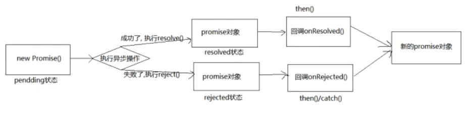
- Promise的状态（实例对象中的一个属性【PromiseState】）
  - pending   ==>    resolved / fulfilled  成功
  - pending   ==>     rejected  失败
  - 说明：只有这两种可能，且一个promise对象只能改变一次
    - 无论成功还是失败，都有一个结果数据
- Promise 对象的值（实例对象中的另一个属性【PromiseResult】）
  
  > 保存着异步任务 成功 / 失败 的结果
  
  - reslove
  - reject
- then链式调用的特点：
  - 第一个then执行完毕后(无论成功还是失败)，都会执行第二个then里函数的代码
  - then函数中可以有返回值，让下一个then的形参接受
  - 如果返回值是一个promise对象，下一个then的形参接收到的不是promise对象，而是promise对象内部的resolve函数的实际参数

```js
// 创建Promise对象
// 结果成功，调用reslove    结果失败，调用reject
const p = new Promise((reslove,reject)=>{
   reslove('abc');  // 执行 p.then中的第一个函数
})

// 成功调用第一个回调函数，失败调用第二个回调函数
p.then(value=>{
  // 成功的回调 value为'abc'
},err=>{
   // 失败的回调
})

// 链式编程，多个then
p.then(data1=>{
   console.log(data1);
   // 开发中常返回一个promise对象
   return a;
}).then(data2=>{
   // 这里的data2是上一次then回调 return的值 a
   console.log(data2);
})

// 封装promise函数
function text(time){
   // 返回promise对象
   return new Promise(function(resolve,reject){
      // 这里执行异步操作，借助promise特性 将异步变成同步
      resolve(time);
   })
}
```

#### catch() finally()

```js
// 一般，我们会将以下代码：
p.then(data=>{
   console.log(data)
},err=>{
   console.log(err)
})

// 写成：
p.then(data=>{          // 在成功时执行
   console.log(data)    
}).catch(err=>{         // 在失败时执行
   console.log(err)
}).finally(()=>{
   console.log("无论成功或者失败，都会执行")
})
```

#### all()

- 参数：是一个数组，数组元素都是Promise实例对象
- 只有数组中的Promise都成功后，才会执行 then和 catch回调

```js
// util 是node内置模块，util.promisify方法将原生方法转为promise形式
let readFilePromise= util.promisify(fs.readFile);
let p1= readFilePromise(filePath1,"utf-8");
let p2= readFilePromise(filePath2,"utf-8");
let p3= readFilePromise(filePath3,"utf-8");
Promise.all([p1,p2,p3]).then((data)=>{
   // data是一个数组，数组的每一项分别对应Promise对象成功的值
   console.log(data);
}).catch(err=>{
   console.log(err);
})
```

#### race()

- 参数：是一个数组，数组元素都是Promise实例对象

- 只要有一个promise执行成功，就执行then中的代码，且只执行一次！

- ```js
  Promise.race([p1,p2,p3]).then(data=>{
     console.log(data);   // ???
  }).catch((err)=>{
     console.log(err);
  })
  ```

  

#### 面试题

相关知识准备:

- promise
- setTimeout
- 同步和异步执行顺序
- 事件循环
- 宏观任务(宏任务)和微观任务(微任务)

```js
console.log("start");

setTimeout(()=>{
    console.log("setTimeout");
},0);

new Promise((resolve,reject)=>{
    for(var i=0;i<5;i++){
        console.log(i);
    }
    resolve() //修改promise状态为成功
}).then(()=>{
    console.log("promise回调函数");
})

console.log("end");


// 正确结果
start 0 1 2 3 4 end promise回调函数 setTimeout 
```


### async\await

> 异步编程的最终解决方案！

- *async* 使函数返回 Promise

  *await* 使函数等待 Promise

- `await` 关键字只能在 `async` 函数中使用。

- 如果await后是一个 Promise，会把 resolve的值返回

- async函数里面的 await 是同步执行的

- ```js
  // async 函数中才能写 await
  
  async function myDisplay() {
    let myPromise = new Promise(function(myResolve, myReject) {
      setTimeout(function() { myResolve("I love You !!"); }, 3000);
    });
     // 在async中 await可以将异步的内容转为同步的方式执行
    document.getElementById("demo").innerHTML = await myPromise;
  }
  
  myDisplay();
  ```

- 在 await后写一个基本数据类型，会对这个基本数据类型进行包装，包装为promise对象

- ```js
  async function func(){
     let data1= await 123;
     //1.await后只写一个基本数据类型，会将这个基本数据类型包装为 promise对象
     // 即 data1相当于：new Promise((resolve,reject)=>{resolve(123)})
     console.log(data1);   // 123
     return data1;         // return await data1
  }
  
  let a = func();
  a.then((data)=>{
     console.log(data);    // 123   data为上面返回值 Promise对象的执行结果
  });
  ```

**经典案例：**

- 利用fetch发请求
- 返回值rej是一个pomise对象
- rej.json() 当中保存了请求的数据，这个数据也是一个promise对象
- then的链式使用  +  async/await 语法糖

```js
//发送网络请求---使用fetch发送（未优化）
/* fetch(`/api1/search/users2?q=${keyWord}`).then(
	response => {
		console.log('联系服务器成功了');
		return response.json()
	},
	error => {
		console.log('联系服务器失败了',error);
		return new Promise(()=>{})
	}
).then(
	response => {console.log('获取数据成功了',response);},
	error => {console.log('获取数据失败了',error);}
) */
//发送网络请求---使用fetch发送（优化）
try {
	const response= await fetch(`/api1/search/users2?q=${keyWord}`)
	const data = await response.json()
	console.log(data);
	PubSub.publish('atguigu',{isLoading:false,users:data.items})
} catch (error) {
	console.log('请求出错',error);
	PubSub.publish('atguigu',{isLoading:false,err:error.message})
}
```


### URL相关

#### url编解码

> url当作参数传递的时，如出现空格等特殊字段，后台只可以读取到空格前的内容，后面内容丢失，造成数据读取失败，用encodeURIComponent()包裹将这些特殊字符进行转义，后台就可以成功读取了

- encodeURIComponent() 函数   url编码
- decodeURIComponent() 函数   url解码


#### URL对象

- 语法：`const url = new URL(url [, base])`

- url 是一个表示绝对或相对 URL ；
  - 如果url 是相对 URL，则会将 base 用作基准 URL。
  - 如果url 是绝对 URL，则无论参数base是否存在，都将被忽略。
  
- base 可选；是一个表示基准 URL；在url 是相对 URL 时有效，则默认为 ''。

- 使用场景回忆：

  1. 文件下载加请求头进行权限验证时

     > 使用xhr对象请求后，返回文件blob对象，
     >
     > 借助URL对象  `let href = window.URL.createObjectURL(blob)`作为a标签的下载链接
     >
     > 使用完需及时手动代码释放该临时文件`window.URL.revokeObjectURL(href);`


#### URL修改

- 常见的直接修改url
- `history.pushState() `
  - 参数1：状态对象
  - 参数2：document.title
  - 参数3：提供了新历史纪录的地址，但不会直接加载这个URL，与原地址必须同源
  - 一般使用：`不会去加载这个URL的特点  history.pushState('','',url) ` 


## BOM/DOM

- `document.documentElement   获取整个html最外层的标签`


### cookie

> `document.cookie`

```js
// 获取cookie的值
document.cookie
// 获取cookie的函数
function getCookie(name){
    var r = document.cookie.match("\\b" + name + "=([^;]*)\\b");
    return r ? r[1] : undefined;
}

getCookie("xxxx")  // 要获取的cookie key值
```


### 观察器API

> - 屏幕尺寸变化 - js中使用媒体查询
> - 元素出现在可视区回调 - 懒加载/埋点
> - 元素属性内容变化回调 - 获取变化信息，做出反应
> - 元素大小变化回调 - 性能更好的响应式元素大小设置
>
> 


#### [matchMedia() 方法](https://www.runoob.com/jsref/met-win-matchmedia.html)

> - `matchMedia()` 方法返回 `MediaQueryList`对象，表示指定的媒体查询字符串解析后的结果。
>   - `MediaQueryList`对象的 属性、方法
>     - **media**：查询语句的内容
>     - **matches**：用于检测查询结果，如果文档匹配 media query 列表，值为 true，否则为 false
>     - **addListener(functionref)**：添加一个新的监听器函数，该函数在媒体查询的结果发生变化时执行
>     - **removeListener(*functionref*)**：从媒体查询列表中删除之前添加的监听器
> - matchMedia() 方法的值可以是任何一个 [CSS @media 规则](https://www.runoob.com/cssref/css3-pr-mediaquery.html) 的特性, 如 **min-height, min-width, orientation** 等
> - 该函数必须传参（字符串），表示即将返回一个新 MediaQueryList 对象的媒体查询

```js
// 判断屏幕（screen/viewport）窗口大小：
if (window.matchMedia("(max-width: 700px)").matches) {
    /* 窗口小于或等于 700 像素 */
} else {
    /*窗口大于 700 像素 */
}

// 判断屏幕（screen/viewport）窗口大小，在小于等于 700 像素时修改背景颜色为黄色，大于 700 像素时修改背景颜色为
function myFunction(x) {
    if (x.matches) { // 媒体查询
        document.body.style.backgroundColor = "yellow";
    } else {
        document.body.style.backgroundColor = "pink";
    }
}
 
var x = window.matchMedia("(max-width: 700px)")
myFunction(x) // 执行时调用的监听函数
x.addEventListener("change", myFunction); // 状态改变时添加监听器
x.removeListener(myFunction)  // 移除监听器
```

##### 应用实践


#### [Intersection Observer](https://developer.mozilla.org/zh-CN/docs/Web/API/Intersection_Observer_API)

> 提供异步检测目标元素与祖先元素或 [viewport](https://developer.mozilla.org/zh-CN/docs/Glossary/Viewport) 相交情况变化的回调方法。
>
> 留意：注册的回调函数将会在主线程中执行，要尽可能的快。一些耗时的操作执行，建议使用[requestIdleCallback](https://developer.mozilla.org/zh-CN/docs/Web/API/Window/requestIdleCallback) 方法
>
> - 适用场景：
>   - 图片懒加载——当图片滚动到可见区时才进行加载
>   - 内容无限滚动——也就是用户滚动到接近内容底部时直接加载更多，而无需用户操作翻页，给用户一种网页可以无限滚动的错觉
>   - 埋点曝光、滚动动画
> - API思路：
>   - Intersection Observer API 会注册一个回调函数，每当被监视的元素进入或者退出另外一个元素时 (或者 [viewport](https://developer.mozilla.org/zh-CN/docs/Glossary/Viewport) )，或者两个元素的相交部分大小发生变化时，该回调方法会被触发执行。而不需要主线程持续监听元素相交变化，浏览器会自行优化元素相交管理。
> - 其它
>   - 如果要观察相对于根 (**root**) 元素的交集，请指定根 (**root**) 元素为`null`
>   - 目标 (**target**) 元素与根 (**root**) 元素之间的交叉度是交叉比，介于0和1之间
> - 回调触发时机：
>   1. Observer 第一次监听目标元素时
>   2. 目标 (**target**) 元素与设备视窗或者其他指定元素发生交集时执行
>      - 默认为设备视窗。如果要观察相对于根 (**root**) 元素的交集，请指定根 (**root**) 元素为`null`

```js
// 创建 intersection observer
//  配置参数
let options = {
  root: document.querySelector("#scrollArea"),	// 指定根元素，必须是目标元素的父元素
  rootMargin: "0px",	// px 或 % ，距离根元素的矩形偏移量，时触发,默认全为0px
  threshold: 1.0,	// 值为number或number数组，相交程度达到该值时触发回调。1.0表示目标元素完全出现在 root 选项指定的元素中可见时，回调函数将会被执行
};

// 触发的回调
let callback = (entries, observer)=>{
    console.log(entries)
    // 每个条目描述一个观察到的目标元素的交集变化：(因为可以为多个元素注册observer进行观察)
    entries.forEach((entry) => {
    // .boundingClientRect	返回包含目标元素的边界信息
    // .intersectionRatio	返回目标元素出现在可视区的比例（常用）
    // .intersectionRect	用来描述root和目标元素的相交区域
    // .isIntersecting		返回布尔值，true-目标元素出现在root可视区；false-从root可视区消失；（常用）
    // entry.rootBounds		描述交叉区域观察者(intersection observer)中的根.
    // entry.target			目标元素
    // entry.time			从 IntersectionObserver 的时间原点到交叉被触发的时间的时间戳
    })
}

let observer = new IntersectionObserver(callback,options);


// 给定要观察的目标元素
let target = document.querySelector("#listItem");
observer.observe(target);


// 方法
observe()		开始监听一个目标元素
unobserve()		停止监听特定目标元素
takeRecords()	返回所有观察目标的IntersectionObserverEntry对象数组
disconnect()	使IntersectionObserver对象停止全部监听工作
```


#### MutationObserver 元素观察器

> 用来监视DOM树的任何变动，比如：增减、属性的变动、文本内容的变动
>
> - 类似事件的处理机制，但事件是同步触发，而它是异步触发，并不会马上出发，而是等到所有的DOM操作结束后再触发
>
> - 依据DOM频繁修改的逻辑而设计为异步，有效避免频繁触发导致的浏览器卡顿
>
> - 特点：
>
>   - 等待所有脚本任务完成后才运行（异步触发方式）
>
>   - 把DOM变动记录封装为一个数组进行处理，而不是挨个处理变动
>
>   - 既可以观察DOM的所有类型变动，也可明确指定某一类变动
>
>     > DOM的增减、属性变动、文本内容变动。。。

方法：

- `observe()`：启动监听，接受两个参数
- `disconnect()方法`：停止观察，调用该方法后，DOM再发生变动，也不会触发观察器
- `takeRecords()`：用来清除变动记录，不再处理未处理的变动，回调不再执行。返回变动记录的数组

```js
let observer = new MutationObserver(callback);   // 声明MutationObserver对象

/**
* 定义观察器的回调函数
* 参数1：变动DOM的数组     参数2：观察器实例
**/
function callback(changeNodesArr,observer){
    changeNodeArr.forEach((changeNode)=>{
        console.log(changeNode);
    })
}

// observe()方法 - 用来启动监听，接受两个参数
// 参数1：所要观察的DOM节点
// 参数2：一个配置的对象，指定所要观察的特定变动(根据需求配置为true即可监听，至少指定一种)
let div = document.querySelector("div")
let options = {
    'childList': true,   // childList 子节点变动（增删改）
    'subtree':true,      // 观察所有后代节点变动
    'attributes':true,    	// 观察属性的变动
    'attributeFiller':["status"], // 属性过滤器，例如:传入["status"]，仅在指定属性变动时触发
    'characterData':true, 	// 节点内容或节点文本的变动
    'attributeOldValue':true,	 // 是否记录attributes变动前的值
}
observer.observe(div,options)

// disconnect()方法 - 用来停止观察。调用该方法后，DOM再发生变动，也不会触发观察期
observer.disconnect()

// takeRecords()方法 - 清除变动记录，不再处理未处理的变动，返回变动记录的数组
observer.takeRecords()

```


#### MutationRecord 对象

> MutationObserver 元素观察器，监测到的**变动记录**是该对象的实例

- DOM发生变化时产生一条变动记录（MutationRecord实例），包含变动相关的所有信息。
  - type：观察器的变动类型（`attributes、characterData、childList`）
  - target：发生变动的DOM节点
  - addedNodes：新增的Dom节点
  - removedNodes：删除的Dom节点
  - previousSibling：前一个同级节点，如果没有则返回null
  - nextSibling：下一个同级节点，如果没有则返回null
  - attributeName：发生变动的属性，如果设置了`attributeFilter`，则只返回预先指定的属性
  - oldValue：变动前的值，这个属性只对`attribute`和`characterData`变动有效，`childList`变动只返回null

```js
// 封装方法，实现DOM的检测，当指定节点出现时，再执行某些回调操作
// 参数1：要监测的节点 class/标签/id
// 参数2：出现后要执行的回调函数
(function(win){
    'use strict'
    var listeners = [];
    var doc = win.document;
    var MutationObserver = win.MutationObserver || win.WebKitMutationObserver;
    var observer;
    
    function ready(selector,fn){
        // 储存选择器和回调函数
        listeners.push({
            selector:selector,
            fn:fn
        });
        if(!observer){
            // 监听 document变化
            observer = new MutationObserver(check);
            observer.observer(doc.documentElement,{
                childList:true,
                subtree:true
            });
        }
        // 检查该节点是否已经在DOM中
        check();
    }
    
    function check(){
        for(var i=0;i<listeners.length;i++){
            var listener =listeners[i];
            // 检查指定节点是否有匹配
            var elements = doc.querySelectorAll(listener.selector);
            for(var j=0;j<elements.length;j++){
                var element = elements[j]
                if(!element.ready){  // ready 是自定义属性/标记
                    element.ready=true;
                    listener.fn.call(element,element)
                }
            }
        }
    }
    
    // 对外暴露
    win.ready=ready 
})(this)


//调用
ready(".ttt",function(e){
    console.log("监听到目标节点"+e)
    ......
})
```


#### [ResizeObserver](https://developer.mozilla.org/zh-CN/docs/Web/API/ResizeObserver)

> 监听 [`Element`](https://link.juejin.cn/?target=https%3A%2F%2Fdeveloper.mozilla.org%2Fzh-CN%2Fdocs%2FWeb%2FAPI%2FElement) 的内容区域  / [`SVGElement`](https://link.juejin.cn/?target=https%3A%2F%2Fdeveloper.mozilla.org%2Fzh-CN%2Fdocs%2FWeb%2FAPI%2FSVGElement)的边界框改变（专门用来观察DOM元素的尺寸是否发生了变化）
>
> - https://www.zhangxinxu.com/wordpress/2020/03/dom-resize-api-resizeobserver/

```js
const ResizeObserver = new ResizeObserver(callback)   // 创建并返回一个ResizeObserver对象
// callback执行时机，初始化、文档窗口变化、元素尺寸变化

ResizeObserver.observe(target, options)  // 观察指定dom，支持options配置观察的盒子模型类型
ResizeObserver.disconnect() // 结束观察 - 取消和结束所有目标dom的观察
ResizeObserver.unobserve(target)  // 结束观察 - 取消和结束指定dom的观察


// demo - vue.js
export default {
  methods: {
    handleResize() {
      console.log("handle resize");
    }
  },
  mounted() {
    const dom = this.$refs.target.$el;   // 假设this.$refs.target返回是VueComponent对象
    this.observer = new ResizeObserver(this.handleResize);
    this.observer.observe(dom, { box: "border-box" });
  },
  beforeDestroy() {
    this.observer.disconnect();
  }
};


// demo2
const ro = new ResizeObserver(entries => {
  for (let entry of entries) {
    const cr = entry.contentRect;
    console.log('Element:', entry.target);
    console.log(`Element size: ${cr.width}px x ${cr.height}px`);
    console.log(`Element padding: ${cr.top}px ; ${cr.left}px`);
  }
});

// Observe one or multiple elements
ro.observe(someElement);
```


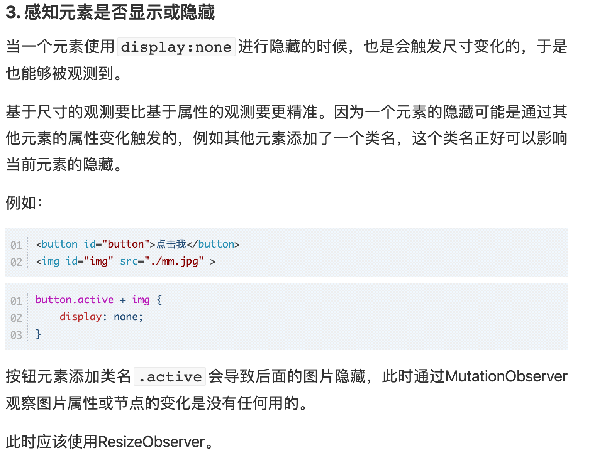


##### 总结-Dom变化

|                      |                                                              |                                                              |
| -------------------- | ------------------------------------------------------------ | ------------------------------------------------------------ |
| Media query-CSS      | 只能监听viewport变化，不能监听某个 **「组件/元素」** 大小变化 | 循环引用问题                                                 |
| window.resize-JS     | 只能监听viewport变化，不能监听某个 **「组件/元素」** 大小变化 | 需要在 viewport 大小变化时手动获取元素的大小，可能导致性能问题 |
| window-matchMedia-JS | 只能监听viewport变化，不能监听某个 **「组件/元素」** 大小变化 | 需要在 viewport 大小变化时手动获取元素的大小，可能导致性能问题 |
|                      |                                                              |                                                              |
| ResizeObserver       |                                                              |                                                              |


## JSON数据

> 一种轻量级的文本数据交换格式，独立于语言

- `JSON.stringify( value )`     //将 JavaScript 格式的数据转换为json格式的数据

- `JSON.parse( value )`       //将json格式的数据进行解析为JavaScript 对象，可以是数组、对象或其他；

- 语法规则

  1. 数据表示为：键值对；键和值都使用双引号包裹
  2. 数据用逗号分割（最后一个键值对后面不需要带逗号)
  
- 特点：

  - 大括号 **{}** 保存对象

  - 中括号 **[]** 保存数组，数组可以包含多个对象

  - JSON 布尔值可以是 true 或者 false

  - 文件类型为`.json`后缀

  - 可以通过`js数组/对象`的形式操作json中的`数组/对象`

  - ```json
    var JSONObject= {
        "name":"菜鸟教程",
        "url":"www.runoob.com", 
        "slogan":"学的不仅是技术，更是梦想！"
    };
    
    var JSONObject = {
        "sites": [
            { "name":"菜鸟教程" , "url":"www.runoob.com" }, 
            { "name":"google" , "url":"www.google.com" }, 
            { "name":"微博" , "url":"www.weibo.com" }
        ]
    }
    
    
    var JSONObject = { "runoob":null }
    ```


**特点/缺点**

1. JSON.stringify()  转化过程中，忽略值为 undefined 的字段，导致获取是报错

   > undefined、function、Symbol 不是有效的JSON值，在对象中时会被直接忽略，在数组中被修改为null

   - 可以在执行 JSON.stringify() 函数前将函数转换为字符串来避免以上问题的发生，但不建议在 JSON 中使用函数。

   ```js
   let users = [
      {
      name:"123",
      value:undefined,
   	},
      {
      name:"333",
      value:undefined,   // 对象中 默认直接忽略
      song:function(){},  // 对象中 默认直接忽略
      like:Symbol('like123')  // 对象中 默认直接忽略
   	},
   ];
   JSON.stringify(users);
   console.log(users);   // [ {name:"123"},{name:"333"}];
   
   // 解决方案
   let newUsers = users.map((item)=>{
      const value = typeof item.value == undefined ? "" : item.value;
      return {
         ...item,
         value
      }
   })
   console.log(newUsers); // [{name:"123",value:''},{name:"333",value:''}]
   ```

2. 所有的Symbol-keyed属性将被完全忽略

   ```js
   let obj={
      obj[Symbol("123")]:'123',
      obj[Symbol("age")]:'99',
   }
   JSON.stringify(obj);    // {}
   ```

3. Date 实例通过返回一个字符串实现

   ```js
   JSON.stringify(new Date());
   // "2022-07-06T14:13:13.338Z"
   ```

4. 数字 Infinity(无穷)、NaN、null 都默认转为 null

5. 对与不可枚举属性，无法进行序列化

6. 对 BigInt 值 进行转化时抛出 TypeError （BigInt 无法在 json 中序列化）

   ```js
   let obj ={
      nmb:BigInt(9090909090989827)
   }
   console.log(JSON.stringify(obj))  // 报错 BigInt 无法在 json 中序列化
   ```

7. 找到循环引用时，抛出Error

   ```js
   let cycObj={
      name:'123'
   }
   cycObj.obj=cycObj
   console.log(JSON.stringify(cycObj))    // 报错 循环对象值 异常
   ```

   


## WebSocket

- 基于TCP协议的应用层协议，实现了浏览器与服务器之间全双工通信
- 与服务器建立长连接，允许服务器主动向客户端发送信息，真正的双向平等对话
- 虽然WebSocket协议在建立连接时会使用HTTP协议，但这并不意味着WebSocket协议是基于HTTP协议实现的。
- WebSocket协议完全可以取代Ajax方法，用来向服务器端发送文本和二进制数据，而且还没有“同域限制”。
- 协议标识符是ws (加密为wss)，服务器网址就是 URL，如`ws:localhost:8080/msg`
- 使用场景：在线聊天、实时数据刷新

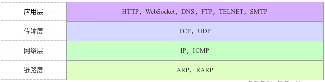

### 客户端(原生)

- H5中提供了相关的API，可以直接使用

- WebSocket实例：connet
  
  - readyState属性，表示目前的状态
    - 0：正在连接
    - 1：连接成功
    - 2：正在关闭
    - 3：连接关闭
  
- websocket事件

  | 事件    | 描述                             |
  | ------- | -------------------------------- |
  | open    | 连接建立时触发                   |
  | message | 客户端收到服务器发来的数据时触发 |
  | error   | 通信发生错误时触发               |
  | close   | 连接关闭时触发                   |

- websocket方法

  | 方法         | 描述                   |
  | ------------ | ---------------------- |
  | 实例.send()  | 客户端向服务器发送数据 |
  | 实例.close() | 关闭连接               |

```js
// 判断浏览器是否支持 WebSocket
if(window.WebSocket != undefined) { 
   // 1.建立WebSocket 连接，ws协议  localhost服务器地址  :1740 端口号
   var connection = new WebSocket('ws://localhost:1740'); 
}

// 2.连接成功后，触发实例对象身上的open事件
connection.addEventListener('open', function(event) {
    console.log("建立连接成功");
})
// 3.客户端通过send方法向服务器端发送数据。
connection.send('我是数据，可以是字符串或二进制数据Blob');
// 4.客户端收到服务器的数据时，触发message事件
connection.addEventListener('message', function(event) {
    //event.data 包含了服务器返回的数据，可能时二进制数据或字符串
    if(event.data instanceof ArrayBuffer){
       console.log('收到的是二进制数据');
    }
   if(typeof event.data === String)
    console.log(event.data);
})
// 5.当出现错误时，触发error事件
connection.addEventListener('error', function(err) {
    console.log(err);
})

// 6.手动断开连接
connection.close();
// 7.断开连接时触发close事件
connection.addEventListener('close', function() {
    console.log('连接断开');
})
```

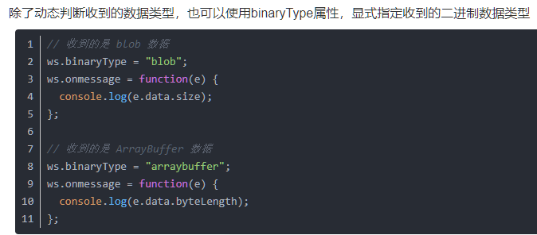

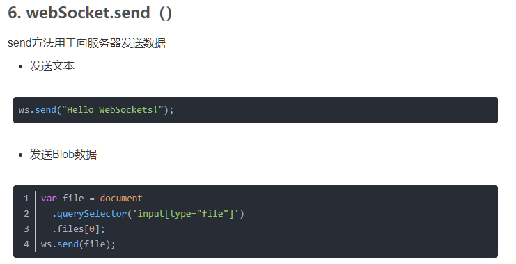

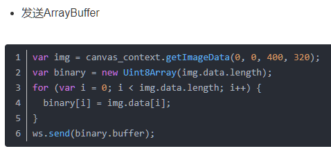


### 服务器端(包)

- Node.js中不能直接使用Websocket，需要使用第三方包
- 推荐1：[nodejs-websocket](https://github.com/sitegui/nodejs-websocket)
  - 安装依赖包`npm i nodejs-websocket`

```js
// 导入nodejs-websocket包
const ws = require('nodejs-websocket');
const POST = 8003;

// 创建一个server服务
// 当用户连接，该函数就会被执行，为每一个用户都创建一个connect对象
const server = ws.createServer(connect => {
    console.log('有个用户连接了,connect中保存着它的一些信息');
    // 每当接收到用户传递过来的数据，就会触发text事件
    connect.on('text', data => {
        console.log('接收到用户传递的数据：' + data);
        // send(),方法向客户端响应数据，只能给当前用户发消息
        connect.send(data);
    });
    // 当有用户websocket连接断开时，触发close事件
    // 注：注册close事件，就必须注册error事件
    connect.on('close', () => {
        console.log("连接断开了");
    });
    // 注册error事件，处理用户出错的信息
    connect.on('error', (err) => {
        console.log('用户连接异常');
    });
});

// 监听POST端口
server.listen(POST, () => {
    console.log('websocket服务启动成功,监听了的端口:' + POST);
})


// 给所有的用户发消息，广播事件
function broadcast(msg){
   // server.connections:是一个数组，包含了所有的用户
   server.connections.forEach(item=>{
      item.send(msg);
   })
}
```


### socket.io

- 建立在[WebSocket](https://en.wikipedia.org/wiki/WebSocket)协议之上，并提供额外的保证，支持退到HTTP长轮询或自动重新连接
- 在浏览器端、服务器端都可以使用
- 注意：
  - Socket.IO **不是** WebSocket 实现
  -  WebSocket 客户端将无法成功连接到 Socket.IO 服务器
  -  Socket.IO 客户端也无法连接到普通的 WebSocket 服务器
  - Socket.IO 不应在移动应用程序的后台服务中使用，高耗电

1. 服务器端安装 socket.io  `npm install socket.io`
2. 客户端
   - Vue：安装 socket.io  `npm install socket.io`
   - 原生，直接引入对应js文件即可，或者使用CDN

#### 服务器

- 依赖http模块的服务实例（提供 WebSocket 连接无法实现，它将回退到 HTTP 长轮询。）
- 注意：
  - `const io = require('socket.io')(app);`必须写在http服务端口创建与监听之后，否则报错
  - 因为使用到http服务，所以存在跨域问题；而WebSocket本身不存在跨域问题

```js
const http = require('http');
// 创建一个http服务
const app = http.createServer();
// 监听http的request请求
app.on('request', (req, res) => {
    fs.readFile(__dirname + './index.html', function(err, data) {
        if (err) {
            res.writeHead(500);
            return res.end('error loading index.html')
        }
        res.writeHead(200);
        res.end(data);
    })
})
app.listen(8006, function() {
    console.log('8006端口监听中');
})

// 1.引入io模块并传入app实例
const io = require('socket.io')(app);
// 2.监听用户连接事件
io.on('connection', socket => {
    console.log('有新的用户连接了');
    // socket.emit()方法  触发某个事件,可用于给浏览器发数据
    //  参数1：事件的名字     参数2：传递的数据
    socket.emit('send', { name: '小吴' });
    // socket.on()方法，接受服务器发送来的数据
    //  参数1：事件名;      参数2：事件回调，接受参数，表示服务器发送来的数据
    socket.on('send', (data) => {
       console.log(data);
    });
   // io.emit() 广播事件，给所有已经连接的客户端发送消息
   io.emit('adduser',data);
   // socket.on('disconnect', () => {})  监听用户离开事件
   socket.on('disconnect', () => {
       //处理程序
   })
})
```


#### 客户端

```js
// 前提：正确引入了socket.io.js文件
// 连接socket服务 参数为后台创建的http服务地址和端口
var socket = io('http://127.0.0.1:8006');
// socket.on()方法，接受服务器发送来的数据
socket.on('send', (data) => {
    console.log(data);
});
// scoket.emit()方法，触发事件，向服务器发送数据
socket.emit('go',{password:'123'});
```


## IndexedDB

> 用于在浏览器中储存较大数据结构的 Web API, 并提供索引功能以实现高性能查找。非关系化、事务型的数据库系统，使用 JavaScript 对象而非列数固定的表格来储存数据的。

|              | 会话期Cookie       | 持久性Cookie           | sessionStorage     | localStorage             | indexedDB          |
| ------------ | ------------------ | ---------------------- | ------------------ | ------------------------ | ------------------ |
| 存储大小     | 4KB                | 4kb                    | 2.5~10MB           | 2.5~10MB                 | >250MB             |
| 失效时间     | 窗口关闭，自动清除 | 设置过期时间，自动清除 | 窗口关闭，自动清除 | 永久保存，除非手动清除   | 手动更新或删除     |
| 与服务器交互 | 有                 | 有                     | 无                 | 无                       | 无                 |
| 访问策略     | 符合同源策略可访问 | 符合同源策略可访问     | 符合同源策略可访问 | 即使同源，也不可相互访问 | 符合同源策略可访问 |


## WebWorker

> web worker 是运行在后台的 JavaScript，独立于其他脚本，不会影响页面的性能。您可以继续做任何愿意做的事情：点击、选取内容等等，而此时 web worker 在后台运行。实现js的主线程为单线程，扩展新的线程在后台运行。可用于前端性能优化。


## Web Components

- https://zhuanlan.zhihu.com/p/580540604


## 蓝牙

```js
// 设备是否支持蓝牙检测：
navigator?.bluetooth.getAvailability().then((available)=>{
    available? console.log("蓝牙已支持！") : console.log("Doh! 此设备暂不支持蓝牙");
})


// 暴露允许此来源访问的蓝牙设备 Promise
// 注意：返回一个的BluetoothDevice数组， 允许当前源访问的设备，包括超出范围或断电的设备 
getDevices()
// 返回数据说明
[
    {
        id:xx,	// String，设备唯一标识
        name:"哈哈哈",	// 为设备提供的可读名称字符串
        gatt:""	// A reference to the device's BluetoothRemoteGATTServer.
        // BluetoothRemoteGATTServer 参考 https://developer.mozilla.org/en-US/docs/Web/API/BluetoothRemoteGATTServer
        ...
    }
]


// 为设备请求设置选项的对象。可用选项包括：
requestDevice()
requestDevice(options)
```


## 进阶大师

### aaa

#### 事件循环


##### 浏览器进程模型

> - 进程：程序运行需要自己的内存空间，且进程间相互独立，通讯需要双方同意
> - 线程：有进程就可以运行代码，一个进程至少有一个线程`主线程`去运行代码

- 浏览器是一个多进程多线程的应用程序 - 内部工作极其复杂
- 为了避免相互影响，减少崩坏几率，浏览器启动后会自动启动多个进程
  - 浏览器进程：主要负责浏览器自身的界面展示、用户交互、子进程管理等。
  - 网络进程：负责网络加载
  - **渲染进程** - chrome中一个标签页就是一个渲染进程
  - ......


##### 渲染主线程

> - 渲染进程启动后，就会开启一个**渲染主线程**，主要负责执行HTML、CSS、JS代码
> - 默认情况下，浏览器会为每个标签页开启一个新的渲染进程，以保证标签页之间互不影响。（以后可能会针对不同的平台进行优化 - 一个站点一个进程）


渲染主线程是浏览器中最繁忙的线程，需要它处理的任务包括但不限于：

> 为了完成大量复杂的任务，主线程通过“ 排队 ”方式进行任务调度，渲染主线程接收到任务后，将其放入消息队列等待处理

- 解析HTML
- 解析CSS
- 计算样式
- 布局
- 处理图层
- 每秒把页面画60次
- 执行全局JS代码
- 执行事件处理函数
- 执行计时器的回调函数
- ......

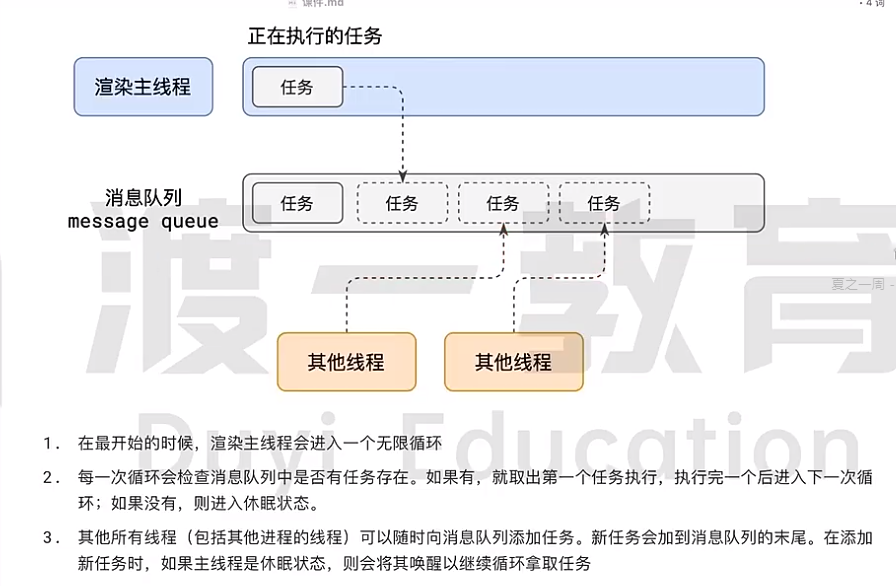

##### 若干解释

- 异步

  > 在代码执行过程中，一些无法立即处理的任务，例如定时器、网络通信、事件监听...。它们不能一直阻塞主线程进行等待，因此使用异步解决。
  >
  > JS是单线程语言，运行在浏览器的渲染主线程中，如果使用同步方式长时间等待会导致主线程堵塞，造成卡死假象等。所以使用异步方式避免，将主线程任务交给其他线程处理等待后排队。
  >
  > 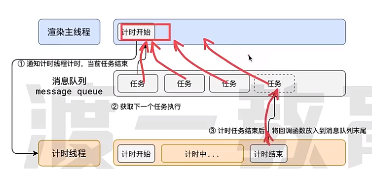

- JS为何会阻塞渲染

  > js和渲染进程都在同一个渲染主线程中进行，因此js任务会阻塞渲染进行

- 任务优先级

  > **任务没有优先级**，在消息队列中先进先出，但**消息队列有优先级**
  >
  > **★ W3C**：
  >
  > - 每个任务都有任务类型，**同一个类型的任务必须在一个队列，不同类型的任务可以分属于不同的队列**。在一次事件循环中，浏览器可以根据实际情况从不同的队列中取出任务执行。
  > - 浏览器中必须准备一个微队列，**微队列 任务优先所有其他所有任务**
  > - 随着浏览器复杂度提升，w3c不再使用宏队列说法（过于简单）
  >
  > 
  >
  > chrome中实现至少包含的队列：
  >
  > - 延时队列：存放定时器到达后的回调任务，优先级【中】
  > - 交互队列：用户操作后产生的事件处理任务，【高】
  > - 微队列：需要最快执行的任务，【顶级】
  >
  >  
  >
  > 添加任务到微队列的方式：Promise、MutationObserver
  >
  > ```js
  > // 立即把一个函数添加到微队列
  > Promise.resolve().then(函数)
  > 
  > // 例题： 结果 2 1 0
  > setTimeout(()=>{console.log(0)},0)
  > Promise.resolve().then(()=>{console.log(1)})
  > console.log(2)
  > ```
  >
  > 

##### 参考答案


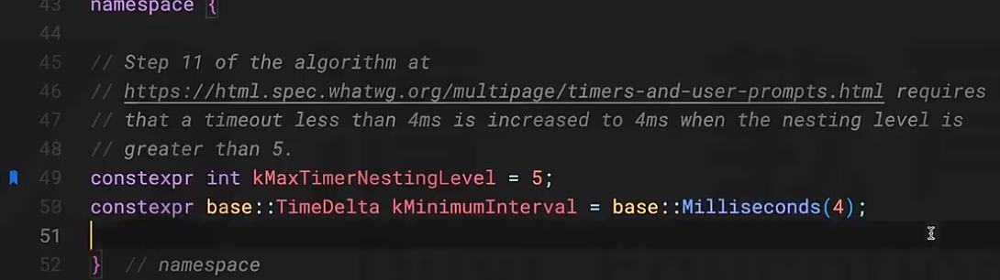


#### 浏览器渲染原理

> 渲染 render ：
>
> - 对于浏览器，是将 **html字符串 -> 像素信息**（复杂的过程）
> - 对于Vue、React，是将文件转为虚拟Dom
>
> 浏览器源码为c++，对象啥的为c++对象，外包js对象


##### 如何渲染页面？

- 网络 - 网络进程得到html字符串
- 渲染 -  渲染主线程从 - 渲染队列- 中得到并 - 执行渲染任务


###### 过程

- 解析HTML  - Parse HTML（chrome - blink内核 - 在webkit基础上发展起来）

  > 由字符串产生对象、提供js操作方法：  
  >
  > - 解析HTML 产生 DOM树
  > - 解析CSS 产生 CSSOM树
  >
  > ```js
  > document.styleSeets		// 渲染树，可以再向其中添加css规则
  > document.styleSeets[0].addRule('div','border:2px solid #f40 !important')
  > ```
  >
  > 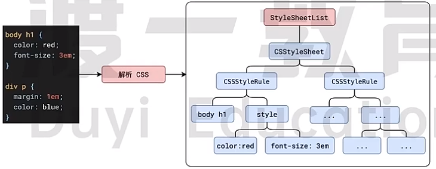

- 样式计算

  > 将DOM树和CSSOM树进行结合计算，得到带有最终样式的DOM树
  >
  > - 处理样式冲突、继承、层叠、盒模型、单位转换为px绝对单位、颜色值red变rgb(255,0,0)等

- 布局树 Layout

  > 计算得出每个元素的尺寸大小、位置（包含块-相对于谁）等布局信息
  >
  > DOM树和布局树，不一定是一一对应的，例如隐藏的DOM、伪元素等。
  >
  > - 细节
  >   - **内容必须在行盒中**
  >   - **行盒和块盒不能相邻**
  >   - 被淘汰的说法：块级元素、行级元素，样式由css决定而不是html
  >   - 布局树中的对象为C++对象，而不是js对象，但由暴露出部分内容给js使用
  >
  > 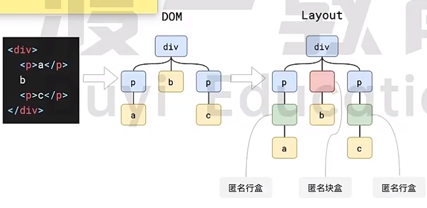

- 分层 Layer

  > 和堆叠上下文有关的属性可能会影响到浏览器的分层策略，例如z-index、trasnform、opacity等
  >
  > 也可以通过will-change属性更大程度的影响分层。
  >
  > 分层能够优化在界面改动时的再次分块绘制，属于浏览器的渲染优化

- 绘制 Paint

  > 类似与canvas，为每一层生成对应的**指令集**，用来指导如何绘制
  >
  > 至此 - 浏览器渲染主进程任务结束，后续由其他进程完成

- 分块 Tiling

  > 将每一层分为多个小的区域，交给多个线程完成
  >
  
- 光栅化 Raster

  > 将每个块的信息转化为位图，即每个点的颜色值，有限处理靠近用户视口的块。
  >
  > 光栅化会使用到GPU进程进行加速，GPU进程又会使用多个线程完成
  >
  > 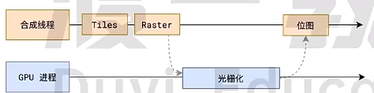

- 画 Draw

  > 这里的GPU进程是指浏览器的GPU进程，由GPU进程产生系统调用，交给GPU硬件完成最终屏幕成像。
  >
  > 为何不直接交给硬件绘制？
  >
  > - 渲染进程（渲染主线程、合成线程）都在一个沙盒中，可以很好的保护系统安全，不会直接发起对系统的调用。
  >
  > quad指引信息标识着每个位图绘画的位置，以及旋转、缩放变形等。
  >
  > 因此，transform属性的变动是发生在合成进程中，不会导致渲染主线程重绘，从而具备高效的特点。
  >
  > 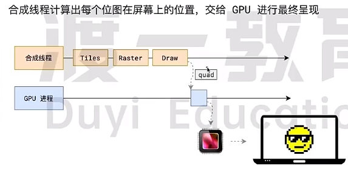


###### HTML解析过程

> - 遇到CSS：可以直接忽略
>   - 为提高解析效率，浏览器会启动 **预解析器线程**，率先下载和预解析css
>   - 所以css解析不会阻塞主渲染线程的html解析。
> - 遇到 JS：
>   - 因为在js中可能会对DOM进行修改，因此渲染主线程遇到JS时，必须暂停一切行为，等待下载+执行完才能继续
>   - 预解析器会分担一点JS下载任务


###### 参考答案

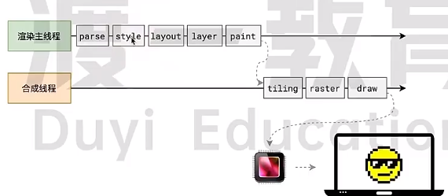

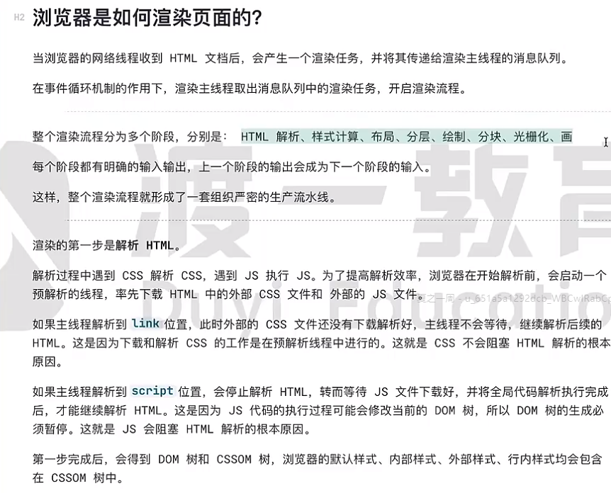

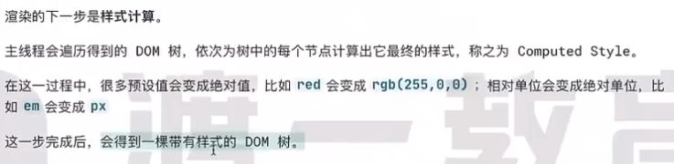


##### 相关点

###### reflow 重排/回流

> 当修改元素的几何信息（宽、高、边距等）时，会导致回流重排。渲染主线程重新执行....
>
> - 为避免多次操作DOM，导致布局树反复计算，浏览器会合并某次JS代码中的所有改动排在任务队列中统一一次计算，所以reflow是异步进行的。
> - 但当在JS中又**出现获取相关信息的代码**时，为确保拿到最新数据，浏览器会将其改为同步任务，立即进行reflow。
>
> 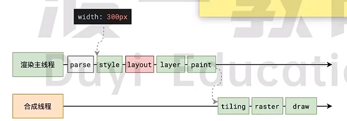
>
> 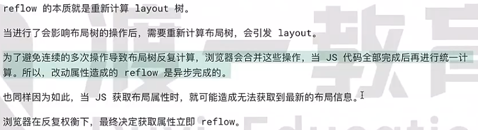


###### repaint重绘

> 当可见样式改变时，触发渲染主线程中的paint，相比于reflow重新执行的内容会少一些。
>
> 


###### transform效率高

```vue
<!--
实验：当点击死循环后，渲染主线程被阻塞，但ball1依旧保持运动，ball2依赖渲染主线程绘制，导致被卡死
-->

<button @click=delay(50000)>死循环</button>
<div class="ball1"></div>
<div class="ball2"></div>

<script>
function delay(duration){
	var start = Date.now();
	while(Date.now - start <duration){}
}
</script>
<style>
    @keyframes move1{
        to{
            transfrom:translate(100px)
        }
    }
      @keyframes move2{
        to{
            left:100px
        }
    }
</style>
```


#### 歌词播放器


### 工程化

> 发展： 函数（污染）、文件（依赖关系复杂）、包、模块化（ESM CommonJS）、包管理（npm pnpm）、语言本身的问题（html、js、css：兼容性、语言缺陷）、工程问题、流程问题（打包、发布、运维）
>

#### JS工具链

> - 兼容性问题：
>   - API增强
>     - polyfill：填充物，没有的api，手动实现并使用，从而实现兼容性（core-js）
>       - 但并不是100%实现polyfill问题：例如浏览器等环境本身的能力问题
>   - 语法兼容（大量的工具，一个工具解决几个问题）
>     - syntax transformer（runtime）：语法转换，运行时转换
>     - 常见工具：regenerator - 可以处理 async await兼容性；
>   - 代码集成转换工具（API增强、语法兼容本质都是对js代码进行转换）
>     - babel：为大量转换工具搭建平台，进行集成
>       - 处理兼容性只是其中之一的功能
>       - 将代码 -> AST抽象语法树 -> 可在此使用插件进行一些转化处理 -> 输出代码
>       - `.babel.config.js`babel配置文件，可配置大量的插件
>       - babel 内置预设插件（一大堆插件的集合）`@babel/preset-env`
> - 语言增强


```js
pnpm i -D core-js	// 安装core-js依赖，其中手写大量可能存在兼容性语法问题的api，从而解决Api兼容性问题

pnpm i -D regenerator	// async await 语法兼容转换工具
const regenerator= require("regenerator")
const result = regenerator.compile(`原始代码`,{includeRuntime:true,})
console.log("编译后的代码：",result.code)

// @babel-core babel的核心，提供转换代码的api
// @babel-cli 命令行工具，可通过命令行进行转换，本质是调用@babel/core中的内容
pnpm i -D @babel/core @babel/cli
babel 源文件相对路径 -o 输出的目标路径	// 转换命令

pnpm i @babel/preset-env	// babel预设插件（一堆插件的集合）
module.exports = {
    presets:[
        // 对插件进行配置
        ['@babel/preset-env',{
            targers:{
                edge:"17",	// 浏览器兼容的最低版本好号
                fixfox:"60",
                chrome:"67"
            },
            useBuiltIns:"usage",	// 使用按需导入
            core-js:"3.32.2"		// 配置core-js的版本
        }]
    ]
}


```


#### CSS工具链

> Postcss 类似于 babel，大量工具的聚合平台


#### 构建工具

#### 脚手架
