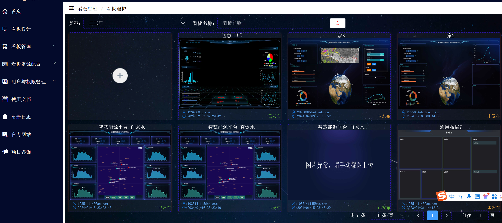

# 大屏编辑器项目
> 项目目的-因公司内部产品/项目经常需要去给业主汇报，需要有一个可以简单、快速搭建的一个页面，所以打算做一个大屏编辑器低代码平台。

登录/注册账户-> 新建项目 -> (设计编辑删除复制导出发布) -> 新建组件（容器图标地图）

## 项目地址

[http://wantonly-drag.com.cn/#/visualList/kanbanList](http://wantonly-drag.com.cn/#/visualList/kanbanList)

## 使用技术栈
vue3

## 布局

实现原理

