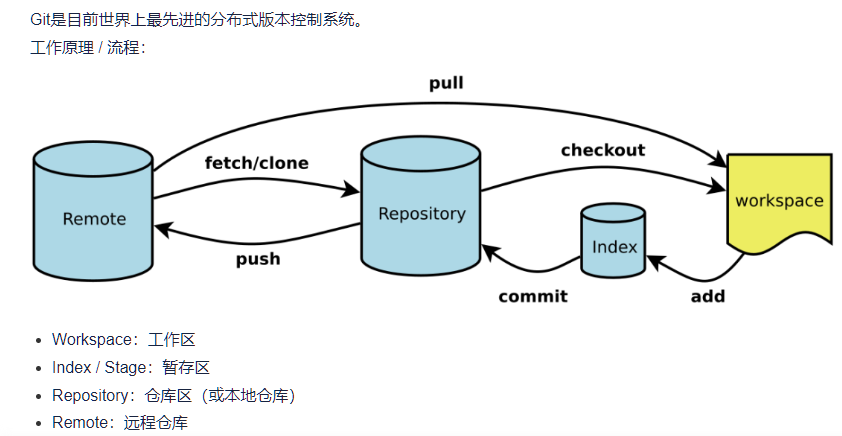
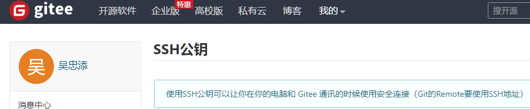
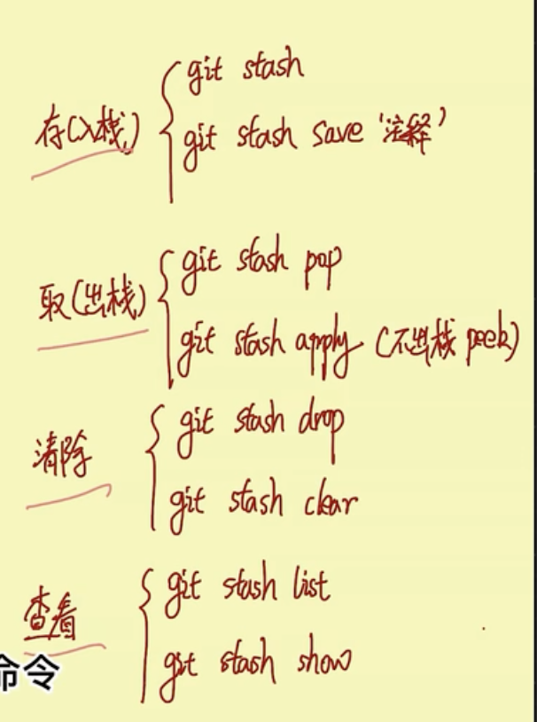
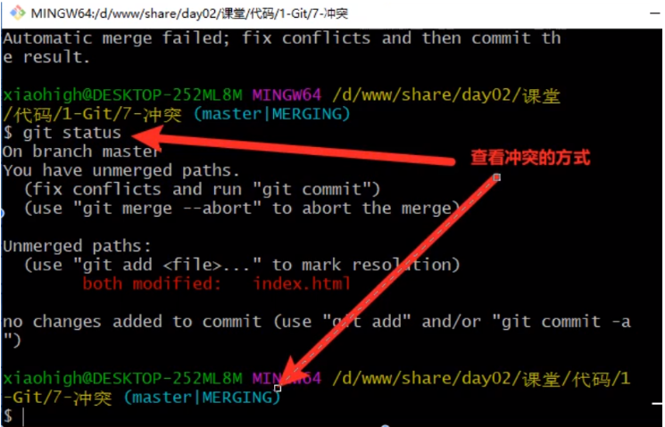
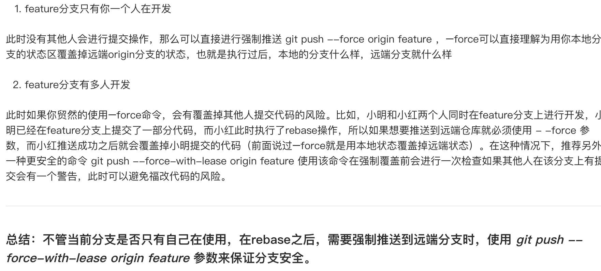
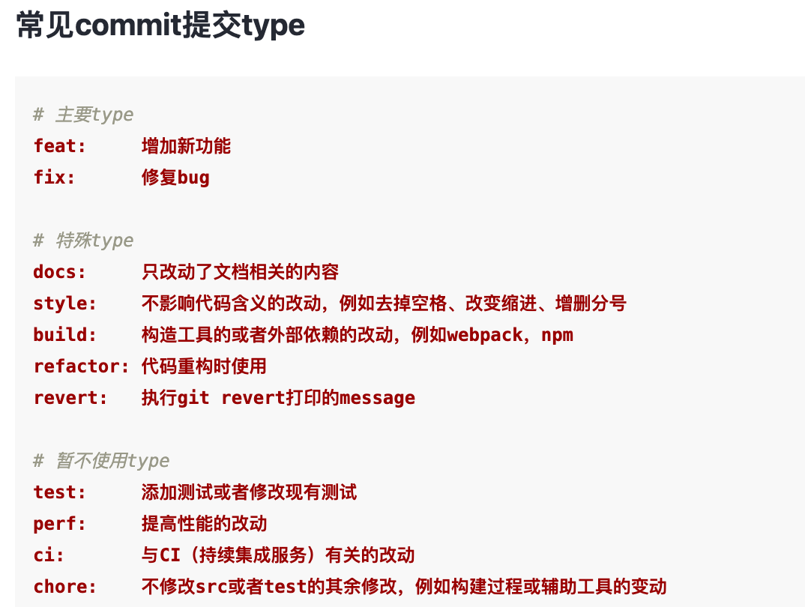
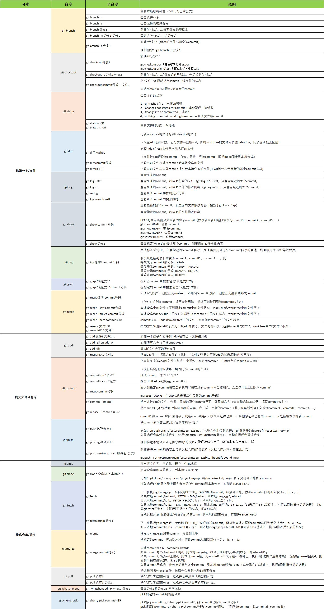

## 1. Git 构建远程仓库

> 1. 需要注册 github [GitHub 官网](https://github.com)
> 2. 安装 git [地址](https://git-scm.com/downloads)

```
echo "# cesium" >> README.md
git init
git add README.md
git commit -m "first commit"
git branch -M master
git remote add origin 远程仓库地址
git push -u origin master
```

## 2.Git 指令

```
 查看、添加、提交、删除、找回，重置修改文件

 git help <command> # 显示command的help

 git show # 显示某次提交的内容 git show $id

 git co -- <file> # 抛弃工作区修改

 git co . # 抛弃工作区修改

 git add <file> # 将工作文件修改提交到本地暂存区

 git add . # 将所有修改过的工作文件提交暂存区

 git rm <file> # 从版本库中删除文件

 git rm <file> --cached # 从版本库中删除文件，但不删除文件

 git reset <file> # 从暂存区恢复到工作文件

 git reset -- . # 从暂存区恢复到工作文件

 git reset --hard # 恢复最近一次提交过的状态，即放弃上次提交后的所有本次修改

 git ci <file> git ci . git ci -a # 将git add, git rm和git ci等操作都合并在一起做　　　　　　　　　　　　　　　　　　　　　　　　　　　　　　　　　　　　git ci -am "some comments"

 git ci --amend # 修改最后一次提交记录

 git revert <$id> # 恢复某次提交的状态，恢复动作本身也创建次提交对象

 git revert HEAD # 恢复最后一次提交的状态

 查看文件diff


 git help <command> # 显示command的help

 git show # 显示某次提交的内容 git show $id

 git co -- <file> # 抛弃工作区修改

 git co . # 抛弃工作区修改

 git add <file> # 将工作文件修改提交到本地暂存区

 git add . # 将所有修改过的工作文件提交暂存区

 git rm <file> # 从版本库中删除文件

 git rm <file> --cached # 从版本库中删除文件，但不删除文件

 git reset <file> # 从暂存区恢复到工作文件

 git reset -- . # 从暂存区恢复到工作文件

 git reset --hard # 恢复最近一次提交过的状态，即放弃上次提交后的所有本次修改

 git ci <file> git ci . git ci -a # 将git add, git rm和git ci等操作都合并在一起做　　　　　　　　　　　　　　　　　　　　　　　　　　　　　　　　　　　　git ci -am "some comments"

 git ci --amend # 修改最后一次提交记录

 git revert <$id> # 恢复某次提交的状态，恢复动作本身也创建次提交对象

 git revert HEAD # 恢复最后一次提交的状态

 查看提交记录

 git log git log <file> # 查看该文件每次提交记录

 git log -p <file> # 查看每次详细修改内容的diff

 git log -p -2 # 查看最近两次详细修改内容的diff

 git log --stat #查看提交统计信息
 tig

 Mac上可以使用tig代替diff和log，brew install tig


 Git 本地分支管理
 查看、切换、创建和删除分支


 git br -r # 查看远程分支

 git br <new_branch> # 创建新的分支

 git br -v # 查看各个分支最后提交信息

 git br --merged # 查看已经被合并到当前分支的分支

 git br --no-merged # 查看尚未被合并到当前分支的分支

 git co <branch> # 切换到某个分支

 git co -b <new_branch> # 创建新的分支，并且切换过去

 git co -b <new_branch> <branch> # 基于branch创建新的new_branch

 git co $id # 把某次历史提交记录checkout出来，但无分支信息，切换到其他分支会自动删除

 git co $id -b <new_branch> # 把某次历史提交记录checkout出来，创建成一个分支

 git br -d <branch> # 删除某个分支

 git br -D <branch> # 强制删除某个分支 (未被合并的分支被删除的时候需要强制)
  分支合并和reba
 git merge <branch> # 将branch分支合并到当前分支

 git merge origin/master --no-ff # 不要Fast-Foward合并，这样可以生成merge提交

 git rebase master <branch> # 将master rebase到branch，相当于： git co <branch> && git rebase master && git co master && git merge <branch>
  Git补丁管理(方便在多台机器上开发同步时用)


 git merge <branch> # 将branch分支合并到当前分支

 git merge origin/master --no-ff # 不要Fast-Foward合并，这样可以生成merge提交

 git rebase master <branch> # 将master rebase到branch，相当于： git co <branch> && git rebase master && git co master && git merge <branch>

  Git暂存管
 git stash # 暂存

 git stash list # 列所有stash

 git stash apply # 恢复暂存的内容

 git stash drop # 删除暂存区

 Git远程分支管理

 git pull # 抓取远程仓库所有分支更新并合并到本地

 git pull --no-ff # 抓取远程仓库所有分支更新并合并到本地，不要快进合并

 git fetch origin # 抓取远程仓库更新

 git merge origin/master # 将远程主分支合并到本地当前分支

 git co --track origin/branch # 跟踪某个远程分支创建相应的本地分支

 git co -b <local_branch> origin/<remote_branch> # 基于远程分支创建本地分支，功能同上

 git push # push所有分支

 git push origin master # 将本地主分支推到远程主分支

 git push -u origin master # 将本地主分支推到远程(如无远程主分支则创建，用于初始化远程仓库)

 git push origin <local_branch> # 创建远程分支， origin是远程仓库名

 git push origin <local_branch>:<remote_branch> # 创建远程分支

 git push origin :<remote_branch> #先删除本地分支(git br -d <branch>)，然后再push删除远程分支

 Git远程仓库管
 git remote -v # 查看远程服务器地址和仓库名称

 git remote show origin # 查看远程服务器仓库状态

 git remote add origin git@ github:robbin/robbin_site.git # 添加远程仓库地址

 git remote set-url origin git@ github.com:robbin/robbin_site.git # 设置远程仓库地址(用于修改远程仓库地址) git remote rm <repository> # 删除远程仓库

 创建远程仓库

 git clone --bare robbin_site robbin_site.git # 用带版本的项目创建纯版本仓库

 scp -r my_project.git git@ git.csdn.net:~ # 将纯仓库上传到服务器上

 mkdir robbin_site.git && cd robbin_site.git && git --bare init # 在服务器创建纯仓库

 git remote add origin git@ github.com:robbin/robbin_site.git # 设置远程仓库地址

 git push -u origin master # 客户端首次提交

 git push -u origin develop # 首次将本地develop分支提交到远程develop分支，并且track

 git remote set-head origin master # 设置远程仓库的HEAD指向master分支

 也可以命令设置跟踪远程库和本地库

 git branch --set-upstream master origin/master

 git branch --set-upstream develop origin/develop
```

<WaterMark />
# Git

## Linux 命令 /Git Bash 命令

- shell 编程
- 潜规则：命令执行后没有任何输出，即表示执行成功

```shell
ls            # 查看当前文件夹下的文件 (list单词缩写)
pwd           # 查看当前所处的绝对路径
cd            # 进入某一文件夹内
cd ..         # 回到上一级目录
clear         # 清屏;也可以使用  ctrl+l
dir           # 查询
tab			 # 补全

mkdir  文件夹名     // 创建文件夹
touch 文件名        // 创建文件

rm  文件名         //删除文件,无法找回
rm 文件夹名 -r         //删除文件夹 -r ；强制删除 -f

mv 文件名 目标文件地址            //将指定文件移动到指定地址
mv 文件名 新的文件名              //更改指定文件的命名
mv 文件名 指定路径/新文件名        //将文件移动到指定路径并更名为新文件名

cat 文件名         //查看文件里面的内容
ctrl + c          //取消命令，当写错时 另起一行  //中止终端中的运行程序
tab键             //自动补全路径
上下方向键         //挑选曾经输入过的命令

q字母 / 输入exit/quit     # Linux 命令退出操作

cd -h / --help           # 获取帮助
git -h / --help          # 获取帮助
git remove -h            # 获取remove的相关解释
git rev-parse --is-inside-work-tree   # 判断当前路径是不是git仓库，是则返回true；返回其他值，都是非git仓库。

exit 或 quit 或 ctrl+D        # 退出终端
```

例子：

进入 c 盘 ` cd /c`

进入文件 `cd 文件名`（tab 键自动补全路径）

删库跑路(强制删除根目录)：`rm / -rf`

同时创建多个文件夹：`mkdir css html js imags`

新建文件/查看当前文件下的文件，可以不切换路径：在输入命令时后面跟个路径就可以了。

## zsh 命令

```shell

```

## Vim 文本编辑器

vim 是一款命令行下的文本编辑器，编辑方式与图形化的编辑器不同。

因为:在非图形化的 Linux 下无法使用 VS code 等图形化编辑器。

vim 命令模式--底线命令 vim 命令模式--插入模式

```sh
vim  文件名        //进入vim模式，编辑文件的内容

i / a / o         # 进入插入模式，才能开始写入内容
Esc键             # 退回到  vim命令模式
:w                # 进入底线命令模式，保存文件
:q                # 进入底线命令模式，退出vim模式,且不保存
：wq              # 进入底线命令模式，保存并退出

ctrl+r            # 重做，写错时删除上一行
ctrl+insert       # 复制
shift+insert      # 粘贴
#                 # vim git 中#号表示注释内容，后面可以跟任何内容。
```

<span style='color:red'>注意：一定要在英文模式下输入命令！</span>

## [Git](https://git-scm.com/)

> 一款免费开源的分布式版本控制系统，是一个应用程序
>
> - 代码备份、版本退回、协作开发、权限控制
> - 在 Git Bash 中，使用的是 Linux 环境的命令。
> - 下载 Git：[Git - Downloads (git-scm.com)](https://git-scm.com/downloads)
> - 常见平台：[Git Hub](https://github.com/)、Gitee(码云)、GitLab
> - [Git - Book](https://git-scm.com/book/zh/v2)官方教程

- Git 三区：

  - 工作区（代码编辑区） 项目文件夹，写代码时就是在工作区修改内容
  - 暂存区（修改待提交区） `.git`的 index 文件，修改的待提交区， add
  - 仓库区（代码保存区） `objects`仓库，提交后的代码都放在里面。 commit
  - 

- Git 分支

  - 分支是 Git 的重要功能特性之一，开发人员可以在主开发线的基础上分离出新的开发线。

  - 默认：`master`主分支 ； 其他分支的命名由创建分支时自定义。
    - 创建分支前需提交过代码，有主线存在，否则无法建立分支。
    - 在某个节点创建分支时，新创建的分支中包含该节点仓库中的所有代码。
    - <span style="color:hotpink">版本的切换、分支的切换前：一定要先对工作区的内容进行提交，否则切换后，原有未提交的代码文件会继续存在工作区 影响对切换后的代码。</span>

- Git 初始配置

  - 第一次使用时，需要配置自己的用户名和邮箱，用于表示开发者的信息。
  - 安装后配置一次即可，如果不配置 `git commit`无法生效

```shell
git config --global user.name "用户名"                 # 配置用户名
git config --global user.email "1602453034@qq.com"    # 配置邮箱
git config -l          # 查看配置信息,l=list
git config user.name   # 查询现在的用户名
```

### Git 基本操作

- 借助 vscode 代码管理区域，手动选择更改提交的文件（不是自己修改的不要提交）
- 提交前先 pull 拉取代码

```sh
git init                      # 在当前路径下初始化仓库,初始化前的变化无法记录

git add 文件路径(index.html)   # 将指定文件加入暂存区；添加的是修改，而不是文件
git add -A                    # 将所有的修改都加入暂存区 A == all

git commit -m '提交注释'       # 将暂存区的内容提交到仓库，提交注释用来描述提交的内容。
git commit      #不写提交注释，会进入vim界面，需要填写并保存后退出才能正常存入暂存区。

git reset --soft HEAD~1       # 撤回上一次commit的内容。如果有两次并撤回 HEAD~2

git branch name            # 创建新的分支，name为分支的名称（分支内容为当前所在分支的内容，仅在本地）
git branch -m newname			 # 给本地分支重命名
git branch                 # 查看分支，列出本地已经存在的分支
git branch -r              # 查看远程版本库的分支列表
git branch -a              # 查看所有分支列表（包括本地和远程，remotes/开头的表示远程分支）
git branch -v              # 查看一个分支的最后一次提交
git branch --merged        # 查看哪些分支已经合并到当前分支
git branch --no-merged     # 查看所有未合并工作的分支

git checkout name          # 切换为name的分支仓库
git checkout -b name       # 创建+切换 到新创建的分支
git branch -D name         # 删除指定的分支
git push origin --delete name   # 删除远程分支
git merge name             # 将指定分支合并到当前分支，不删除被合并的分支；合并后，提示分支中有merging，表示存在冲突。
git rebase name。          # 将指定分支合并到当前分支，保持直线形的提交记录。

git push -u origin master   # 将本地（master分支）推送到别名为origin的远程仓库
git push     # 进行过提交且进行-u分支关联的分支 再次提交时的简写
git push -f  # main分支名  -f强制覆盖仓库原有内容

git pull                  #将远程仓库更新到本地，且只拉取当前所在的仓库
git pull origin master    #将指定远程仓库的分支更新到本地  origin是远程仓库的别名； master是远程仓库的分支名

git remote update origin --p    #更新本地分支信息，远程可能新建但本地看不到时使用 --prune
```

```shell
补充：
git log             #打印完整的仓库记录 查看HEAD日志
git log --oneline   #以简短的形式 显示该版本之前的显示仓库的记录
git reflog          #查看所有的版本操作记录，能够显示该版本之后的新版本编号。

git ls-files         # 查看暂存区的文件
git status        #查看已经做的修改，查看当前版本库的状态
  # 结果1：nothing to commint，working tree clean  表示所有的修改都已经存档
  # 结果2:红的文件名表示未放入暂存区，绿色表示已经放在暂存区，正常白色显示记录。

git diff             # 查看工作区与暂存区的差异(不显示新增文件)，显示做了那些修改。
git diff --cached    # 查看暂存区与仓库最新版本的差异。

git restore 文件名   # 还原文件，撤销对它的修改
git reset --hard 版本编号前七位   # 回滚到指定版本

git rm -cached 文件名            # 从版本库中删除该文件

git rev-parse --is-inside-work-tree   # 判断当前路径是不是git仓库，是则返回true；返回其他值，都是非git仓库。
```

- 代码回退
  1. reset 是回退代码到某一版本，某一版本以后的代码都不保存
  2. revert 是只回退某一版本代码，对齐它版本代码不影响(推荐)

```shell
1）回退到某一版本
git log  #查看HEAD日志
git reset --hard [目标版本号]   #目标版本号为HEAD编号，一般输前几位就可
git push -f  #将代码强制推送到远程仓库中

2）回退某一版本代码
git log  #查看HEAD日志
git revert [要回退的版本号]  #回退该版本代码并生成新的版本号
git status #查看本地变化的文件，是回退那个版本变化的文件，将其改回来了
git add .  #提交问价难道暂存区
git commit -m ''  #提交代码到本地仓库
git push  #上传到远程分支
```

- 本地有仓库
  - 获取远程仓库地址，本地配置远程仓库的地址
  - 本地提交后，再将本地仓库推送到远程仓库
  - readme.md 上传到 github 中会被以页面形式解析出来。
  - 注意事项
    - `GitHub` 仓库的存储器命名，不要使用中文，否则会出现一些错误。
    - 新构建的仓库不建议选择推荐的配置

```shell
git remote                 # 查看已经存在的远程仓库别名
git remote -v 			  # 远程仓库路径查询
git remote remove origin   # 移除origin这个别名 ，remove删除，rename重命名，add添加

# 创建远程仓库的别名  add添加  origin代表该地址仓库的别名
git remote add origin https://github.com/wuZhongtian/linshicangku121342.git
# 将本地仓库当前分支进行重命名为：main
git branch -M main

git remote rm origin   # 删除指定的远程仓库/ 删除项目本地文件夹下的.git 文件夹

# 将本地的（main分支）推送到别名为origin的仓库；（需要输入github令牌、账号和密码）
# push推送   main分支名 -u分支关联，下次提交时可直接git push  -f会强制覆盖仓库原有内容
git push -u origin main -f

# 进行过提交且进行-u分支关联的分支 再次提交时的简写。
git push

```

- 本地没有仓库

  - 根据官网指示，配置此电脑的 ssh 公钥，加入安全组

    

```shell
# 克隆远端仓库，将项目代码同步到本地，本地会产生默认的远程地址的配置，别名为 origin
# git clone  将仓库的所有分支全部下载到本地
git clone https://github.com/wuZhongtian/linshicangku121342.git

# 本地修改代码并保存到本地仓库
# 将指定分支推送到指定的远程仓库
git push origin master

# 默认已经关联，可以直接进行 git push，只推送当前分支
# origin远端仓库地址的别名    master本地分支名
git push
```

<span style='color:red'>注意：</span>

- `git init` 仓库初始化时自动生成 `.git`文件 ，若没有可以尝试打开`显示隐藏文件`。
- 每`git init `一次就创建一个新的仓库。

- 只有在有`.git`的文件夹下才能执行`git命令`

- 版本切换为旧版本后，`git log --oneline`命令无法查看该版本之后的新版本。

- 切换版本前一定要进行当前代码的存档，否则工作区未保存的新代码会在切换版本后依然存在，影响切换后代码的状态。

- 对于不小心已经存入 git 仓库的忽略文件需要做三步操作，具体看第 5 部分（配置忽略文件）。

### 切换分支时保存修改

> 多个分支之间切换时，携带着其他分支未保存的修改 可能出现问题
>
> - 合适的方案：
>   - 及时 commit 代码
>     - 在 new 分支上把已经开发完成的部分代码 commit 掉，不 push，然后切换到 old 分支修改代码，做完了 commit，所有分支互不影响，这是一个理想的方法。
>   - **使用 git stash**
>   - 用 IDE 工具的 shelve 的功能

```sh
# 使用git stash（代码不能进行commit时）
# 切换分支之前使用 git stash，让代码回到上一个commit时的样子
git stash # 将所有修改但未提交的文件保存在堆栈中，用于后续需要的时候取出
git stash save "test1" # 将本次stash内容注释为 test1 方便取用

# 再次回来时
git stash list # 查看当前stash过的记录
git stash pop  # 将当前stash中的内容弹出 最近一次的
git stash pop stash@{id} # 选取其中的一次stash 弹出到当前分支
git stash apply # 将最新的一次stash内容，拿出来 但是不会删除栈中的数据
git stash apply stash@{id} # 选取一次stash记录 回复到当前分支
git stash drop stash@{id} # 从堆栈中删除某个指定的stash
git stash clear   # ！！！谨慎！！！清除堆栈中所有的内容（会清楚在所有分支的保存）
```



### 配置忽略文件

- 常见的忽略文件（项目中不应出现在版本库中的文件）
  - 临时文件
  - 多媒体文件，如音频、视频。
  - 编辑器生成的配置文件（.idea 不属于项目文件）
  - `npm`安装的第三方模块
- 误存入版本仓库的文件设置忽略
  - 从版本库中 删除该文件 `git rm -cached 文件名`
  - 在`.gitigonre 中配置忽略规则`
  - 进行 `add`和 `commit`再次提交到仓库即可

```sh
# 创建 .gitignore配置文件，一般与 .git目录同级
#  .gitignore中写入 忽略规则

/app.swp         # 忽略当前文件夹下的 app.swp
text.html        # 直接写文件名，忽略当前项目下所有名为 text.html 的文件
*.mp4            # *+后缀名，忽略当前项目中所有的 .mp4 后缀的文件
.文件夹名         # 忽略所有指定的文件夹
/node_modules    # 忽略当前文件夹下的 node_modules 文件和文件夹
```

### 冲突合并

- 合并分支前，需要先切换到合成的分支中，再合并需要合并的分支.
- 当多个分支修改同一个文件后，合并分支时就会产生冲突。
- 解决思路：将内容修改为最想要的结果，然后继续执行`git add`与`git commit`保存到即可。
- 冲突的文件合并后会将两者的内容都合并到一个文件中。
  - `git status`定位冲突的文件
  - 修改冲突的文件内容 为最终正确的内容



### .git 目录

- hooks 目录 ：包含客户端或服务器的钩子脚本，在特定操作下自动执行。类似于 JS 事件，自动执行。
- info 信息文件夹：包含一个全局性排除文件、可配置文件忽略。不属于项目代码的临时性文件。
- logs 日志：记录我们的提交历史记录。
- objects 仓库目录：每次版本的更改都会保存再里面。
- refs 分支信息：
- index 暂存文件：存放暂存区文件的文件。

### 多人协作

Github 团队协作开发管理比较容易，可以创建一个组织。

- 首页 — 右上角+号 — new Organization
- 免费计划
- 填写组织名称和联系方式（不能使用中文名称）
- 邀请其他开发者进入组织（会发送邮件邀请）
- 点击仓库的 settings 设置
- 将用户权限由'Read'设置为'Write'
- 创建多人协作仓库时，一定要在组织中创建仓库
- 每次提交前都要 将远端仓库更新到本地。

```shell
git pull                  #将远程仓库更新到本地，且只拉取当前所在的仓库
git pull origin master    #将指定远程仓库的分支更新到本地  origin是远程仓库的别名； master是远程仓库的分支名
```

#### 第一次：

- 得到`Github`远程仓库的地址
- 将代码克隆 clone 到本地
- 切换分支（不要在主分支做修改，另建分支用来存放提交自己的代码）
- 合并分支（在确定代码没有问题后，**切换到主分支，进行合并，并处理冲突）**
- 在指定分支上更新本地代码`git pull`
- 在指定分支上提交代码`git push`

#### 第 n 次：

- 更新代码（更新主分支的代码即可）

  ```shell
  git checkout master
  git pull
  ```

- 切换并合并分支（将最新的主分支合并到自己的开发分支中，再进行开发）

  ```shell
  #切换到自己开发使用的分支
  git checkout name
  #将 main 分支合并到自己的开发分支上，在此之前需要先切换到main拉一下最新代码（推荐 git reabase ）
  git merge main
  ```

- 开发功能

- 提交

- 合并分支（将自己确认无误的分支合并到主分支）

- 更新代码（更新本地主分支的内容）

- 推送代码

#### 关于 git rebase



git push --force-with-lease origin feature

这是一个 Git 命令，用于将本地分支“feature”上的更改推送到名为“origin”的远程存储库。“——force-with-lease”选项用于强制推送到远程存储库，但前提是远程分支自上次本地分支更新以来没有被其他人更新过。这有助于防止意外地覆盖其他人的更改。

#### 注意：

- 所有的工作不要直接在主分支上进行操作
  - push 操作后，原有的的代码会被直接覆盖掉
  - 在自己创建的分支上进行开发
- **每次提交代码到远端仓库时都必须先将远端仓库更新 pull 到本地，保证不存在差异代码。**
- 提交时，相当于将原代码与现存代码进行合并，在弹出的 vim 文本编辑器中直接保存退出即可。`:wq`
- 在进行仓库的操作时，不能进行仓库套仓库。不能在仓库里再克隆一个仓库。否则出错！
- 很多情况下企业并不使用`Github`作为企业仓库。
- 好习惯：**每次修改代码后，及时提交到本地仓库**

### git 规范.

pr 样例：注意：后面要有空格

`feat(frontend): fix bug with /instance/consumers/detail page `

协作流程：https://blog.csdn.net/qq_37974755/article/details/126304583

- commit 代码时 git cmmit -s -m 'feat(console): Engilsh annotation'
- 模块开发分支命名 feature-xxx：用来做分模块功能开发，建议命名为 feature-xxx,完成之后合并到‘主’分支；
- 代码提交 -> main 流程
  - 本地切换 main 拉取 main 分支最新代码
  - 切换回自己的分支，将 main 分支合并到当前分支，**本地进行代码合并**后提交到远程分支
  - 在 github 中 提 pr / 提 mr
  - 删除自己本地的提交过的分支，新建一个（避免下次提交时残留提交记录）
    - 审核通过后，远程仓库会被管理员自动删除



### Git Flow 最佳实践

- Master 主分支：只保存正式发布的版本。
- Hotfix 线上代码 bug 修复分支：修复 BUG 后需要合并回 Master 和 Develop 分支，同时在 Master 上打一个 tag
- Release 分支：待发布分支，居于 Develop 分支单独创建，在这个分支上进行发布前的测试和修复 BUG。
- Develop 开发分支：开发者都在该分支上进行开发。
- Feature 功能分支：当各个开发者进行功能开发时，都新建自己的分支进行开发，完成后合并到 Develop 分支。





## Workflows

> - [Collaborating more effectively with Git using workflows_哔哩哔哩_bilibili](https://www.bilibili.com/video/BV13L4y1A79T?p=1&vd_source=12c717d82cfc8f0cc3894516956cc8b3) 视频教程
> - [Gitee Go 流水线构建镜像并推送到阿里云容器镜像服务 ACR | 草梅友仁的博客 (cmyr.ltd)](https://blog.cmyr.ltd/archives/26f5ba7.html)

### gitee 工作流

> - [Gitee Go 流水线构建镜像并推送到阿里云容器镜像服务 ACR | 草梅友仁的博客 (cmyr.ltd)](https://blog.cmyr.ltd/archives/26f5ba7.html)
>
> - 或使用阿里云 服务器部署关联，需要创建阿里云子账号并授权
>
>   

- gitee 流水线，关联阿里云服务器，实现代码 push，自动打包更新服务器 build 资源

### github page

> - 新建存储库，命名为 `姓名.github .io`

### github 工作流

## 其他

- [GitHub 页面 |您和您的项目的网站，直接从您的 GitHub 存储库托管。只需编辑、推送，您的更改即可生效。](https://pages.github.com/)
- [解决 window 下使用 git clone 时没有提示输入用户名密码认证的问题（gitlab 使用 https 协议）\_git 拉取代码时没有账号密码输入 ](https://blog.csdn.net/hacker_lpy/article/details/124078021)
  - 解决办法：控制面板 - 凭据管理 - windows 凭据 - 删除对应仓库的信息，重新拉取！

