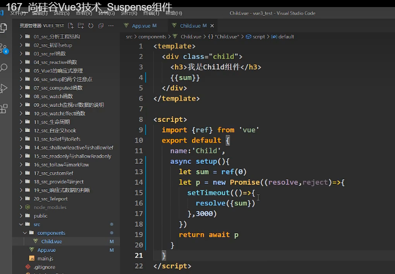

<WaterMark />
# Vue3

## 基础内容

### 创建项目

- 使用 Vue-cli 创建（Vue-cli 版本4.5.0  +）

  > 官方更推荐使用 vite创建vue3项目

  ```js
  vue -V // 查看Vue-cli 版本   （4.5.0+ 才能创建vue3）
  
  vue create 项目名  // *创建vue3项目
  npm run serve //运行项目 
  npm run build //项目打包
  ```

- 使用 [Vite](https://vitejs.cn/) 创建

  ```js
  npm create vite@latest   // 使用npm创建项目（vue、react、）
  yarn create vite  // 使用yarn创建项目
  pnpm create vite  // 使用pnpm创建项目
  
  npm init vite-app 项目名  // *创建vue3项目
  npm install //安装依赖！
  npm run dev //运行项目 
  ```

### 关闭语法检查

- 在 项目根目录下 vue.config.js 中进行配置

```js
module.exports = {
    lintOnSave: false, //关闭语法检查 修改配置后需要重启
}
```


### main.js

- 入口文件 发生改动（不兼容Vue2的写法）

```js
// 引入createApp工厂函数 创建vm
import { createApp } from 'vue'
import App from './App.vue'
createApp(App).mount('#app')  // app为index.html容器的id
/*
	createApp(App).mount('#app') 可拆分为
	const app=createApp(App)  // 相当于创建vm，但app比vm更轻
	app.mount('#app')   // 挂载到节点
*/

/*  引入的不再是Vue构造函数 
    new Vue({
      render: h => h(App),
    }).$mount('#app')
*/
```


### 全局API的转移

- Vue 2.x 有许多全局 API 和配置。

  - 例如：注册全局组件、注册全局指令等。

    ```js
    //注册全局组件
    Vue.component('MyButton', {
      data: () => ({
        count: 0
      }),
      template: '<button @click="count++">Clicked {{ count }} times.</button>'
    })
    
    //注册全局指令
    Vue.directive('focus', {
      inserted: el => el.focus()
    }
    ```

- Vue3.0中对这些API做出了调整：

  - 将全局的API，即：```Vue.xxx```调整到应用实例（```app```）上

    | 2.x 全局 API（```Vue```） | 3.x 实例 API (`app`)                        |
    | ------------------------- | ------------------------------------------- |
    | Vue.config.xxxx           | app.config.xxxx                             |
    | Vue.config.productionTip  | <strong style="color:#DD5145">移除</strong> |
    | Vue.component             | app.component                               |
    | Vue.directive             | app.directive                               |
    | Vue.mixin                 | app.mixin                                   |
    | Vue.use                   | app.use                                     |
    | Vue.prototype             | app.config.globalProperties                 |

### 其他改变

- data选项应始终被声明为一个函数。

- 过度类名的更改：

  - Vue2.x写法

    ```css
    .v-enter,
    .v-leave-to {
      opacity: 0;
    }
    .v-leave,
    .v-enter-to {
      opacity: 1;
    }
    ```

  - Vue3.x写法

    ```css
    .v-enter-from,
    .v-leave-to {
      opacity: 0;
    }
    
    .v-leave-from,
    .v-enter-to {
      opacity: 1;
    }
    ```

- 父组件中绑定事件

  ```vue
  <my-component
    v-on:close="handleComponentEvent"
    v-on:click="handleNativeClickEvent"
  />
  ```

- 子组件中声明自定义事件

  ```vue
  <script>
    export default {
      emits: ['close']
    }
  </script>
  ```

- <strong style="color:#DD5145">移除</strong>keyCode作为 v-on 的修饰符，同时也不再支持```config.keyCodes```

- <strong style="color:#DD5145">移除</strong>```v-on.native```修饰符

- <strong style="color:#DD5145">移除</strong>过滤器（filter）

  > 过滤器虽然这看起来很方便，但它需要一个自定义语法，打破大括号内表达式是 “只是 JavaScript” 的假设，这不仅有学习成本，而且有实现成本！建议用方法调用或计算属性去替换过滤器。

- ......


### 预处理器

- 代码块可以使用 `lang` 这个 attribute 来声明预处理器语言，最常见的用例就是在 `<script>` 中使用 TypeScript：

- `lang` 在任意块上都能使用，比如我们可以在 `<style>` 标签中使用 [SASS](https://sass-lang.com/) 或是 `<template>` 中使用 [Pug](https://pugjs.org/api/getting-started.html)：

  ```vue
  <script lang="ts">
    // use TypeScript
  </script>
  
  <template lang="pug">
  p {{ msg }}
  </template>
  
  <style lang="scss">
    $primary-color: #333;
    body {
      color: $primary-color;
    }
  </style>
  ```

  

### 杂项

1. Vue文件结构中可以 存在多个标签，不再要求只有一个根标签包裹

2. Vue3中使用Vue2 的data、methods配置依旧生效，**尽量不要与Vue2.x配置混用**

   - - Vue2.x配置（data、methos、computed...）中<strong style="color:#DD5145">可以访问到</strong>setup中的属性、方法。
     - 但在setup中<strong style="color:#DD5145">不能访问到</strong>Vue2.x配置（data、methos、computed...）。
     - 如果有重名, setup优先。

3. Vue3中setup配置的响应式数据，是深层次的

   - 可以对代理过的数据 直接进行删除、添加操作，同时界面跟随变化

4. 单向数据流 props

   > 组件间数据传递时，依旧需要使用props进行接收

   - vue2中接收后可以直接使用

   - vue3中接收后可通过**setup函数**的**第一个参数**拿到，也能直接使用

     - ```js
       export default {
           props:{
               text:{
                   type:String,
                   default:""
               },
               message:Number
           },
           setup(props:Data){
               const {text} = toRefs(props)
               const formatText = `Hi,${text.value}`
               return {
                   formatText
               }
           }
       }
       ```

       

     - 使用`setup`[语法糖](https://so.csdn.net/so/search?q=语法糖&spm=1001.2101.3001.7020)时，需要用`defineProps`编译器宏无需引入、定义接收`props`

       ```js
       const props = defineProps({
           text:String,
           message:Number
       })
       
       // 或
       const props = defineProps(['text', 'message'])
       ```
       
       

5. 具名插槽

   - 为组件命名时，推荐使用 `v-slot:xxx`  避免使用 `slot="xxx"`


## 组合式API（常用）

### setup配置

> - Vue3中的一个配置项，值为一个函数；是所有Composition API(组合式api)的`表演舞台`
> - 组件中所有用到的：数据、方法、计算属性等，均要配置在setup中

- setup的两种返回值
  1. 若返回一个对象，则对象中的属性、方法，在模板中均可直接使用
  2. 若返回一个渲染函数：可以自定义渲染内容！
     - 需要单独引入 渲染函数 h  `import {h} from 'vue'`
     - 返回值是一个函数，函数中需要 再返回 h函数调用的结果
     - `template`模板中的内容会被完全替换为 h函数调用的结果
- 注意点：
  - setup**执行时机 **
    - 在beforeCreate之前执行一次，this指向undefined
  - setup 接受的参数
    - 参数1 props：通过props接收的父组件传递过来的数据（具有响应式）
      - 多传未收有警告，未传多收不警告
    - 参数2 context：
      - attrs：值为对象，包含组件外部传递过来，但没有在props配置中声明的属性, 相当于 `this.$attrs`
      - slots: 收到的插槽内容, 相当于 `this.$slots`
      - emit: 分发自定义事件的函数, 相当于 `this.$emit`
  - setup不能是一个async函数，因为返回值不再是return的对象, 而是promise, 模板看不到return对象中的属性。（后期也可以返回一个Promise实例，但需要Suspense和异步组件的配合）

```vue
<!-- setup 的第一种返回值，对象中的属性、方法，在模板中均可直接使用 -->
<template> 
  <h2>姓名{{ name }}</h2>
  <h2>年龄{{ age }}</h2>
  <button @click="sayHello">说话</button>
</template>
<script>
export default {
  name: "App", //配置组件名
  setup() {
    // 数据
    let name = "张三";
    let age = 18;
    //方法
    function sayHello() {
      alert(`你好,我是${name}`);
    }
    return {
      name,
      age,
      sayHello,
    };
  },
};
</script>
```

```vue
<!-- setup 的第二种返回值，渲染函数,自定义渲染内容 -->
<template>
	<h2>23456 会被替换的内容</h2>
</template>
<script>
import {h} from 'vue'
export default{
	name:'App', //配置组件名
    setup(){
        // 数据
        let name = "张三";
        let age = 18;
        //方法
        function sayHello(){
            alert(`你好,我是${name}`)
        }
        return ()=>{ return h('h1',name)}
    }
}
</script>
```


### ref函数

- 作用: 定义一个**响应式的数据**

  - 引入 `import {ref} from 'vue'`

- 语法: `const xxx = ref(initValue)`

  - 创建一个包含响应式数据的<strong style="color:#DD5145">引用对象（reference对象，简称ref对象）</strong>。
  - JS中操作数据需要携带  .value： `xxx.value`
  - 模板中读取数据: 不需要.value，直接：`<div>{{xxx}}</div>`

- 备注：

  - 接收的数据可以是：基本类型、也可以是对象类型。
  - 基本类型的数据：响应式依然是靠``Object.defineProperty()``的```get```与```set```完成的。
  - 对象类型的数据：内部 <i style="color:gray;font-weight:bold">“ 求助 ”</i> 了Vue3.0中的一个新函数—— ```reactive```函数。（Proxy实现）

- ```vue
  <template>
    <h2>姓名{{ name }}</h2>
    <h2>工作{{ job.type }}</h2>
    <button @click="changeInfo">修改信息</button>
  </template>
  <script>
  import {ref} from 'vue'
  export default{
  	name:'App', //配置组件名
      setup(){
          // 数据
          let name = ref("张三");
          let job= ref({
              type:'前端工程师',
              salary:'30k'
          })
          //方法
          function changeInfo(){
              name.value='李四'
              job.value.type='UI设计师'
          }
          return{
              name,
              job,
              changeInfo
          }
      }
  }
  </script>
  ```


#### 模板引用

> `ref` 是一个特殊的 attribute，和 `v-for` 章节中提到的 `key` 类似
>
> 允许我们在一个特定的 DOM 元素或子组件实例被挂载后，获得对它的直接引用

使用细节

- 如果不使用 `<script setup>`，需确保从 `setup()` 返回 ref 的引用input
- 只可以**在组件挂载后**才能访问模板引用，初次渲染时元素不存在，值为null
  - 可用 watchEffect 侦听模板引用的变化。

```vue
<script setup lang="ts">
import { ref, watchEffect } from 'vue'

// 声明一个 ref 来存放该元素的引用
// 必须和模板里的 ref 同名
const input = ref<HTMLInputElement | null>(null)

watchEffect(() => {
  if (input.value) {
    input.value.focus()
  } else {
    // 此时还未挂载，或此元素已经被卸载（例如通过 v-if 控制）
  }
})
    
</script>

<template>
  <input ref="input" />
</template>
```


#### v-for中的模板引用

> 在 `v-for` 中使用模板引用时，对应的 ref 中包含的值是一个数组，它将在元素被挂载后包含对应整个列表的所有元素
>
> - 注意：ref 数组**并不**保证与源数组相同的顺序

```vue
<script setup>
import { ref, onMounted } from 'vue'
const list = ref([1,2,3])
const itemRefs = ref([])
onMounted(() => console.log(itemRefs.value))
</script>
<template>
  <ul>
    <li v-for="item in list" ref="itemRefs">
      {{ item }}
    </li>
  </ul>
</template>
```


#### 组件ref

> 能够获得组件实例

注意：

- 使用了 `<script setup>` 的组件是**默认私有**的：一个父组件无法访问到一个使用了 `<script setup>` 的子组件中的任何东西，除非子组件在其中通过 `defineExpose` 宏显式暴露：

```vue
<script setup>
import { ref, onMounted } from 'vue'
import Child from './Child.vue'

const child = ref(null)
const a = ref(null)

onMounted(() => {
  // child.value 是 <Child /> 组件的实例
})
// 像 defineExpose 这样的编译器宏不需要导入
defineExpose({
  a
})
</script>

<template>
  <Child ref="child" />
</template>
```


#### 函数模板引用

> `ref` attribute 还可以绑定为一个函数，会在每次组件更新时都被调用。该函数会收到元素引用作为其第一个参数
>
> 需要使用动态的 `:ref` 绑定才能够传入一个函数。当绑定的元素被卸载时，函数也会被调用一次，此时的 `el` 参数会是 `null`

```vue
<input :ref="(el) => { /* 将 el 赋值给一个数据属性或 ref 变量 */ }">
```


### reactive函数

- 作用: 定义一个`对象类型`的响应式数据（基本类型，要用```ref```函数）
- 语法：`const 代理对象= reactive(源对象)`
  - 接收一个 对象 / 数组，返回一个代理对象（Proxy的实例对象，简称proxy对象）
  - 对于数组可以直接通过下标进行修改
- reactive定义的响应式数据是“深层次的”。
- 内部基于 ES6 的 Proxy 实现，通过代理对象操作源对象内部数据进行操作。

```js
setup(){
    // 数据
    let name=ref('张三'),
    let job=ref({
        type:'前端开发',
        salary:{
            number:'12k'
        }
    })
    let hobby=reactive(['吸烟','喝酒','打游戏'])
    // 方法
    function changeInfo(){
        name.value='李四',
        job.value.salary.number='32k'
        hobby[1]='吃饭'
    }
}
```


### reactive与ref

-  从定义数据角度对比：
   -  ref用来定义：基本类型数据
   -  reactive用来定义：对象（或数组）类型数据。
   -  备注：ref 也可以用来定义<strong style="color:#DD5145">对象（或数组）类型数据</strong>, 它内部会自动通过```reactive```转为<strong style="color:#DD5145">代理对象</strong>。
-  从原理角度对比：
   -  ref 通过`Object.defineProperty()`的```get```与`set`来实现响应式（数据劫持）。
   -  reactive通过使用<strong style="color:#DD5145">Proxy</strong>来实现响应式（数据劫持）, 并通过<strong style="color:#DD5145">Reflect</strong>操作 源对象 内部的数据。
-  从使用角度对比：
   -  ref定义的数据：操作数据<strong style="color:#DD5145">需要</strong>```.value```，读取数据时模板中直接读取<strong style="color:#DD5145">不需要</strong>```.value```。
   -  reactive定义的数据：操作数据与读取数据：<strong style="color:#DD5145">均不需要</strong>```.value```。


### 计算与侦听属性

#### computed计算属性

- 使用步骤  与vue2中基本一致

  ```vue
  <script>
  // 使用前先从 vue 引入 computed （组合式api）
  import {reactive,computed} from 'vue'
  export default {
      name:'Dome',
      setup(){
          // 数据
          let person = reactive({
              firstName:'张',
              lastName:'三'
          })
          // 计算属性(简写 不考虑计算属性被修改的情况)
          person.fullName = computed(()=>{
              return person.firstName + '-' + person.lastName
          })
          // 计算属性(完整写法 )
          person.fullNames = computed({
              get(){
                  return person.firstName + '-' + person.lastName
              }
              set(value){
              	const nameArr=value.split('-')
                  person.firstName=nameArr[0]
              	person.lastName=nameArr[1]
         		}
          })
          return { person }
      }
  }
  </script>
  ```


#### watch侦听属性

- watch三个参数
  - 参数1：需要监视的响应式数据，可以是对象
  - 参数2：当侦听数据改变时触发的回调
  - 参数3：配置对象，watch的其他配置
- 两个小“坑”：

  - 监视reactive定义的响应式数据时：oldValue无法正确获取、强制开启了深度监视（deep配置失效，不能手动关闭）
  - 监视reactive定义的响应式数据中某个属性时：deep配置有效
    - ref监视对象，底层还是reactive，道理同上
- `.value`问题
  - ref 定义的基本数据类型 做watch时，不需要`.value`
  - ref 定义的对象数据类型 做watch时，需要 `.value` **或** 开启深度监视

```js
// 使用前先从 vue 引入 watch （组合式api）
import {ref,reactive,watch} from 'vue'
export default {
    name:'Dome',
    setuip(){
        // 数据
        let sum = ref(0)
        let msg=ref('你好！')
        let person=reactive({
            name:'张三',
            age:18
            job:{
            	j1：{salary:20}
        	}
        })
        
        // 情况一：监视ref所定义的响应式数据
        watch(sum,(newValue,oldValue)=>{
            console.log('sum改变了',newValue,oldValue)
        },{immediate:true})
        
        // 情况二：监视ref所定义的多个响应式数据
        watch([sum,msg],(newValue,oldValue)=>{
            console.log('sum或msg变了',newValue,oldValue)
        })

        /* 情况三：监视reactive定义的响应式数据
			若watch监视的是reactive定义的响应式数据，则无法正确获得oldValue！！
			若watch监视的是reactive定义的响应式数据，则强制开启了深度监视 
        */
        watch(person,(newValue,oldValue)=>{
            console.log('person变化了',newValue,oldValue)
        },{immediate:true,deep:false}) //此处的deep配置不再奏效

        //情况四：监视reactive定义的响应式数据中的某个属性
        // 参数1不能再直接写 person.job
        watch(()=>person.job,(newValue,oldValue)=>{
            console.log('person的job变化了',newValue,oldValue)
        },{immediate:true,deep:true}) 

        //情况五：监视reactive定义的响应式数据中的某些属性
        watch([()=>person.job,()=>person.name],(newValue,oldValue)=>{
            console.log('person的job变化了',newValue,oldValue)
        },{immediate:true,deep:true})

        //特殊情况 监视job，修改job深层次数据时，需要开启深度监视
        watch(()=>person.job,(newValue,oldValue)=>{
            console.log('person的job变化了',newValue,oldValue)
        },{deep:true}) //此处由于监视的是reactive所定义的对象中的某个属性，所以deep配置有效
        return { sum }
    }
}
```


#### watchEffect

- watch的套路是：既要指明监视的属性，也要指明监视的回调。

- watchEffect的套路是：不用指明监视哪个属性，监视的回调中用到哪个属性，那就监视哪个属性。

- watchEffect有点像computed：

  - 但computed注重的计算出来的值（回调函数的返回值），所以必须要写返回值。
  - 而watchEffect更注重的是过程（回调函数的函数体），所以不用写返回值。

  ```js
  //引入 watchEffect
  import {ref,reactive,watchEffect} from 'vue'
  //watchEffect所指定的回调中用到的数据只要发生变化，则直接重新执行回调。
  watchEffect(()=>{
      const x1 = sum.value
      const x2 = person.age
      console.log('watchEffect配置的回调执行了')
  })
  ```


### Vue3生命周期

- Vue3.0中 **可以继续使用Vue2.x中的生命周期钩子**，但有有两个被更名：

  - `beforeDestroy`改名为 `beforeUnmount`
  - ```destroyed```改名为 `unmounted`

- Vue3.0提供 `组合式API` 形式的生命周期钩子：

  - `beforeCreate`===>`setup()`
  - `created`=======>`setup()`
  - `beforeMount` ===>`onBeforeMount`
  - `mounted`=======>`onMounted`
  - `beforeUpdate`===>`onBeforeUpdate`
  - `updated` =======>`onUpdated`
  - `beforeUnmount` ==>`onBeforeUnmount`
  - `unmounted` =====>`onUnmounted`

  ```js
  //使用前必须先引入 
  import {onBeforeMount,onMounted,...} from 'vue'
  
  setup(){
      onBeforeMount(()=>{
          console.log('--onBeforeMount')
      })
      onMounted(()=>{
          console.log('--onBeforeMount')
      })
  }
  ```

- 如果组合式生命周期钩子、配置项形式的生命周期钩子同时存在

  - 组合式api生命周期先调用，对应配置项钩子后调用


### hook函数

> 本质是一个函数，把setup函数中使用的Composition API进行了封装。
>
> - 类似于vue2.x中的mixin。
>
> - 自定义hook的优势: 复用代码, 让setup中的逻辑更清楚易懂。

- src文件下新建hooks文件夹  -  新建 xxx.js文件

```js
// 把需要复用的内容放在js文件中  函数形式暴露，并return其中的数据
import {reactive,onMounted,onBeforeUnmount} from 'vue'
export default function(){
    // 可复用的数据
    let point=reactive({ x:0,y:0 })
    // 可复用的方法
    function xxxx(){ ... }
    // 可复用的生命周期钩子
    onMounted(){ ... }
    onBeforeUnmount(){ ... }
    return point
}

// 再其他组件中使用hook函数 引入当前文件配置即可
import xxx from '../hooks/xxx'   // 引入hooks下的某个js文件,接收、执行函数并return接收到的值
export default {
    name:'Demo',
    setup(){
        const point = xxx()
        return {point}
    }
}
```


### toRef与toRefs

- 作用：创建一个 ref 对象，其value值指向另一个对象中的某个属性，保留响应式

- 语法：`const name = toRef(person,'name')`

- 应用:   要将响应式对象中的某个属性单独提供给外部使用时。

- 扩展：`toRefs` 与`toRef`功能一致，但可以批量创建多个 ref 对象，语法：`toRefs(person)`

  ```js
  // toRef 的第一个参数值是个对象即可，第二个参数是对象中数据的键
  // toRefs 直接传入一个对象即可，与toRef功能一致(拆除外面一层，方便模板书写)
  
  import {reactive,toRef} from 'vue'
  export default {
      name:'Demo',
      setup(){
          let person=reactive({
              	name:'张三'，
              	obj:{age:30}
              })
          const name1=person.name // name1将失去响应式，只是的得到对应字符串
          const name2=toRef(person,'name')//借助toRef，指向原数据，保留响应式
          return {
              name:toRef(person,'name'),
              age:toRef(person.obj,'age'),
              ...toRefs(person)
          }
      }
  }
  ```


## 组合式API（其他）

### shallowReactive 与 shallowRef

- shallowReactive：只处理对象最外层属性的响应式（浅响应式）。

- shallowRef：只处理基本数据类型的响应式, 不进行对象的响应式处理。

- 什么时候使用?  做性能优化

  -  如果有一个对象数据，结构比较深, 但变化时只是外层属性变化 ===> shallowReactive。
  -  如果有一个对象数据，后续功能不会修改该对象中的属性，而是生新的对象来替换 ===> shallowRef。
     - 保持 x的响应式，确保替换操作仍能引起页面的变化

  ```js
  // 组合式api 使用前先引入
  import {shallowRef,shallowReactive} from 'vue'
  ```


### readonly 与 shallowReadonly

- readonly: 让一个响应式数据变为只读的（深只读）。

- shallowReadonly：让一个响应式数据变为只读的（浅只读）。

- 应用场景: 不希望数据被修改时。

  ```js
  import {ref,reactive,toRefs,readonly} from 'vue'
  
  setup(){
      let person = reactive({
          name:'张三',
          age:13,
          job:{
              salary:20
          }
      })
      // readonly 中传入一个响应式数据，转化为只读的
      person = readonly(person)
      return {
          sum,
          ...toRefs(person)
      }
  }
  ```

  

### toRaw 与 markRaw

- toRaw：
  - 作用：将一个由```reactive```生成的<strong style="color:orange">响应式对象</strong>转为<strong style="color:orange">普通对象</strong>。
  - 使用场景：用于读取响应式对象对应的普通对象，对这个普通对象的所有操作，不会引起页面更新。
- markRaw：`markRaw(响应式对象)`
  - 作用：标记一个对象，使其永远不会再成为响应式对象。
  - 应用场景:
    1. 有些值不应被设置为响应式的， 例如复杂的第三方类库等。
    2. 当渲染具有不可变数据源的大列表时，跳过响应式转换可以**提高性能**。


### customRef  自定义Ref

- 作用：创建一个自定义的 ref，并对其依赖项跟踪和更新触发进行显式控制。

- 实现防抖效果：

  ```vue
  <template>
  	<input type="text" v-model="keyword">
  	<h3>{{keyword}}</h3>
  </template>
  
  <script>
  	import {ref,customRef} from 'vue'
  	export default {
  		name:'Demo',
  		setup(){
  			// let keyword = ref('hello') //使用Vue准备好的内置ref
  			//自定义一个myRef
  			function myRef(value,delay){
  				let timer
  				//通过customRef去实现自定义
  				return customRef((track,trigger)=>{
  					return{
  						get(){
  							track() //告诉Vue这个value值是需要被“追踪”的
  							return value
  						},
  						set(newValue){
  							clearTimeout(timer)
  							timer = setTimeout(()=>{
  								value = newValue
  								trigger() //告诉Vue去更新界面
  							},delay)
  						}
  					}
  				})
  			}
  			let keyword = myRef('hello',500) //使用程序员自定义的ref
  			return {
  				keyword
  			}
  		}
  	}
  </script>
  ```


### provide 与 inject

- 作用：实现<strong style="color:#DD5145">祖与后代组件间</strong>通信

- 套路：父组件有一个 `provide` 选项来提供数据，后代组件有一个 `inject` 选项来开始使用这些数据

- 具体写法：

  1. 祖组件中：

     ```js
     setup(){
     	......
         let car = reactive({name:'奔驰',price:'40万'})
         provide('car',car)
         ......
     }
     ```

  2. 后代组件中：

     ```js
     setup(props,context){
     	......
         const car = inject('car')
         return {car}
     	......
     }
     ```


### 响应式数据的判断

> 返回值 true / false

- isRef: 检查一个值是否为一个 ref 对象
- isReactive: 检查一个对象是否是由 `reactive` 创建的响应式代理
- isReadonly: 检查一个对象是否是由 `readonly` 创建的只读代理
- isProxy: 检查一个对象是否是由 `reactive` 或者 `readonly` 方法创建的代理


## 新增组件


### Teleport

- 什么是Teleport？—— `Teleport` 是一种能够将我们的<strong style="color:#DD5145">组件html结构</strong>移动到指定位置的技术。

  - to 的值可以是 id` #app ` 标签名 `body ` 的形式
  - 能够将其中包裹的内容移动到指定的位置进行显示，无论它所在的组件结构有多深

  ```vue
  <teleport to="移动位置">
  	<div v-if="isShow" class="mask">
  		<div class="dialog">
  			<h3>我是一个弹窗</h3>
  			<button @click="isShow = false">关闭弹窗</button>
  		</div>
  	</div>
  </teleport>
  ```


### Suspense

- 等待异步组件时渲染一些额外内容，让应用有更好的用户体验

- 使用步骤：

  - 异步引入组件

    ```js
    import {defineAsyncComponent} from 'vue'
    const Child = defineAsyncComponent(()=>import('./components/Child.vue'))
    ```

  - 使用```Suspense```包裹组件，并配置好```default``` 与 ```fallback```

    ```vue
    <template>
    	<div class="app">
    		<h3>我是App组件</h3>
    		<Suspense>
    			<template v-slot:default>
    				<Child/>
    			</template>
    			<template v-slot:fallback>
    				<h3>加载中.....</h3>
    			</template>
    		</Suspense>
    	</div>
    </template>
    ```

- 只有使用异步引入，使用该组件标签的情况下，组件返回值，才能写成如下形式，否则页面无法显示该组件！




## 响应式原理

### vue2的响应式

- 实现原理：

  - 对象类型：通过`Object.defineProperty()`对属性的读取、修改进行拦截（数据劫持）。

  - 数组类型：通过重写更新数组的一系列方法来实现拦截。（对数组的变更方法进行了包裹）。

    ```js
    Object.defineProperty(data, 'count', {
        get () {}, 
        set () {}
    })
    ```

- 存在问题：

  - Object.defineProperty() 捕获不到 新增属性、删除属性的操作, 无法直接相应式更新界面。
  - 直接通过下标修改数组, 界面不会自动更新。


### Vue3的响应式

- 实现原理: 

  - 通过Proxy（代理）:  拦截对象中任意属性的变化, 包括：属性值的读写、属性的添加、属性的删除等。

  - 通过Reflect（反射）:  对源对象的属性进行操作。

  - MDN文档中描述的Proxy与Reflect：

    - Proxy：https://developer.mozilla.org/zh-CN/docs/Web/JavaScript/Reference/Global_Objects/Proxy

    - Reflect：https://developer.mozilla.org/zh-CN/docs/Web/JavaScript/Reference/Global_Objects/Reflect

      ```js
      new Proxy(data, {
      	// 拦截读取属性值
          get (target, prop) {
          	return Reflect.get(target, prop)
          },
          // 拦截设置属性值或添加新属性
          set (target, prop, value) {
          	return Reflect.set(target, prop, value)
          },
          // 拦截删除属性
          deleteProperty (target, prop) {
          	return Reflect.deleteProperty(target, prop)
          }
      })
      
      proxy.name = 'tom'   
      ```


### 模拟Vue3响应式数据原理

#### Proxy  代理对象

- Proxy构造函数 参数
  - 参数1：源数据
  - 参数2：配置对象，get、set、deleteProperty 函数
  - 不配置这些函数时，默认就会达成相应操作
- get 函数 **读取数据**
  - 参数1：new Proxy时传入的源对象
  - 参数2：读取的属性名
- set 函数 **修改数据 **  新增
  - 参数1、参数2 同上get函数
  - 参数3：修改后的值
- deleteProperty 函数 **删除数据**
  - 参数同 get 函数

```js
// 原数据
let person = {
    name:'张三',
    age:18
}
const p = new Proxy(person,{
    get(target,propName){
        console.log(`读取了person的${person}值`);
        return Reflect.get(targrt,propName)
    },
    set(target,propName,value){
        console.log(`修改了person的${propName}值,改变为${value}`)
        return Reflect.set(targrt,propName,value)
    },
    deleteProperty(target,propName){
        return Reflect.deleteProperty(target,propName)
    }
}) 
// 增删改查时调用Proxy底层的Handler
// 此时通过p修改属性值，会导致person的值一起改，实现代理操作
```


#### Reflect 反射对象

- Reflect 优点
  - 重复追加同一个属性，
    - Object.defineProperty对导致代码出错挂掉
    - Reflect.defineProperty不会导致代码挂掉，代码依旧能执行，会返回true/false告知是否成追加成功
      - 只有第一次成功返回ture，第二次失败返回false

```js
// 使用window身上的Reflect对象  
let obj={a:1,b:2}
// 读取obj.a
Reflect.get(obj,'a')    // 1
// 修改obj.a
Reflect.set(obj,'a',666)   // true
// 删除obj.a
Reflect.deleteProperty(obj,'a')  // true
// 追加obj.c
Reflect.defineProperty(obj,'c',{
    get(){ return 4 }
})
```


## Composition API优势

- Options API  - 命令式api  存在的问题
  - 使用传统OptionsAPI中，新增或者修改一个需求，就需要分别在data，methods，computed里修改 。

- Composition API  - 声明式api 的优势
  - 可以更加好的组织代码、函数。将同一功能的相关代码放在一起。


## `<script setup>`

> 是在单文件组件 (SFC) 中使用组合式 API 的编译时语法糖。当同时使用 SFC 与组合式 API 时该语法是默认推荐。相比于普通的 `<script>` 语法，它具有更多优势：


优势：

- 更少的样板内容，更简洁的代码。
- 能够使用纯 TypeScript 声明 props 和自定义事件。
- 更好的运行时性能 (其模板会被编译成同一作用域内的渲染函数，避免了渲染上下文代理对象)。
- 更好的 IDE 类型推导性能 (减少了语言服务器从代码中抽取类型的工作)。


特点：

- 类似与React的render？

- 里面的代码会被编译成组件 `setup()` 函数的内容。这意味着与普通的 `<script>` 只在组件被首次引入的时候执行一次不同，`<script setup>` 中的代码会在**每次组件实例被创建的时候执行**。

- 任何在 `<script setup>` 声明的顶层的绑定 (包括变量，函数声明，以及 import 导入的内容) 都能在模板中直接使用：

- import 导入的内容也会以同样的方式暴露。这意味着我们可以在模板表达式中直接使用导入的 helper 函数，而不需要通过 `methods` 选项来暴露它：

  ```vue
  <script setup>
  import {toRefs} from 'vue'
  // 相比于 <script> 不需要再通过return返回内容，直接使用
  import { capitalize } from './helpers'
  const props = defineProps({		// props
      text:String,
      message:Number
  })
  const {text} = toRefs(props) // 保留text响应式
  const msg = 'Hello!'   // 变量
  function log() { console.log(props.text,msg) }   // 函数
  </script>
  
  <template>
    <button @click="log">{{ msg }}</button>
    <div>{{ capitalize('hello') }}</div>
  </template>
  ```


## 全家桶

### [Vuex ](https://vuex.vuejs.org/zh/guide/#最简单的-store)

> 模块化写法同 VUEX3

```js
npm install vuex -S // 下载

// 新建store文件夹 index.js
import { createStore } from 'vuex'
export default createStore({
    state(){
        return {
            key:value,
       	    xxx:xxxx,
        }
    },
    mutations:{
        functionname(state,传参1,...){
            state.key=xxxx
        }
    }
})


// main.js
import store from './store/index.js'
app.use(store)      // app是 createApp(App)


// 组件中使用 store中的数据，不需要this
<p :xxx="$store.state.xxx" />
    
// 组件中调用 mutations
// 在setup中使用store时也需采用该方法
import { useStore } from 'vuex'
setup(){
    let store = useStore()
    ...
    // 在触发的方法中写commit
	store.commit('mutation中的名字',)
}

```


### Pinia

> Vuex的迭代方案，与Vuex的API类似，作者是Vue.js及Vuex的核心成员之一。
>
> - 独特之处
>   - 直观，像定义components一样地定义 store
>   - 去除 mutations，只有 state、getters、actions
>   - 不分同步异步，更完整的TypeScript支持
>   - Vue浏览器插件支持Pinia，提供更好的开发体验
>   - 能够构建多个stores，可直接分模块化的使用,并自动的代码拆分
>   - 兼容Vue2、Vue3 及其轻量（1kb）

```js
// 安装pinia
yarn add pinia
// Vue3导入并应用pinia   main.js入口文件
import { createPinia } from 'pinia'
const pinia = createPinia()
app.use(pinia)

// 定义数据仓库   src/store/index.js
	import { defineStore } from 'pinia'
	import axios from 'axios'
	// 传入数据仓库的id命名、仓库配置项
	export default defineStore("仓库名",{
        // 定义静态数据
    	state:()=>{
            return {
                count:10,
                timuList:[],
                list:[{
                    name:"phone",
                    money:6666
                },{
                    name:"ipad",
                    money:9999
                }]
            }
        },
        // 定义计算属性
        getters:{
            sumPrice:(state)=>{   // 求所有商品的总价值
                return state.list.reduce((pre,item)=>{
                    return per+item.money
                })
            }
        },
        // 定义action 修改数据的方法,异步同步都可以
        actions:{
            async getTimu(){
                let result = await axios.get("http://xxx.com/")
                this.timuList = result.data
            }
        }
	})  


// 组件中使用 store
// 1. 导入数据对象
import useMainStore from './stort/index'
let store = useMainStore()
// 2.在标签中使用
` <p>{{ store.count }}</p> `
// 3.1修改store    借助解构赋值、storeToRefs()      
import { storeToRefs } from 'pinia'
let { count } = storeToRefs(store)
function handleClick(){
    count.value++  // 此时可以通过解构赋值得到的变量修改操作store中的store
}
// 3.2 修改store   使用$patch：对象式/函数式
function handleClick(){
    store.list.push({name:"watch",money:2000})
    store.$patch({ 
        count:store.count++,
        list:store.list,
    })  // 相比于3.1 可同时修改多个数据 
}

store.$patch((state)=>{
    store.count += 10;
	store.list.push({
        name:"watch",
        money:2000
    })
})

// 4.修改store 将现在的整个state进行替换
store.$store={
    count:100,
    list:[
         { name:"watch",money:2000 },
         { name:"watch2",money:2100 },
    ]
}


// 5.重置store 恢复为初始状态
store.$reset()

// 6.监听整个仓库变化
store.$subscribe((mutation,state)=>{
    console.log(mutation)
    console.log(state)
})

// 7.调用axios的方法，获取异步数据
store.getTimu()
```


```js
// store 数据使用时响应式问题：
// 直接解构使用时，数据不具备响应式，只能获取第一次默认的值

// 解决方法1：使用 Pian 的 storeToRefs() 方法
// 得到的数据在script中使用需要带 .value
// template中使用不需要带 .value
import useMainStore from './stort/index'
let store = useMainStore()
import { storeToRefs } from 'pinia'
let { count } = storeToRefs(store)

```


#### 持久化存储

> 问题：pinia/vuex管理的状态，在手动刷新浏览器时，状态管理的数据都会丢失，被初始化，需要进行持久化存储，常用方式是sessionStroage或localStorage手动保存，或借助第三方插件完成。

[Getting started | Pinia Plugin Persist (seb-l.github.io)](https://seb-l.github.io/pinia-plugin-persist/)


### router 4

#### 基本使用

- 与 router 3  大致一致

```js
// 1.安装 npm i vue-router
// router文件夹下 index.js
import { createRouter,createWebHashHistory } from 'vue-router'
const routes = [{
    path:'/',
    component:()=>import('../views/Main.vue'),
    redirect:'/home',
    children:[
        {
            path:'./home',
            name:'home'
            component:()=>import('../views/home/Home.vue'),
        },
    ]
}]
const router = createRouter({
    history:createWebHashHistory(),	// # hash模式
    // history:createWebHistory(),	// H5模式
    routes
})
export default router


// main.js
.use(router)


// 在组件中使用
import { useRouter } from 'vue-router';
const router = useRouter()
// 使用
router.push({
    name:'xxx'
})
```


#### 动态添加路由

```js
import { authentication } from "../api/common"
import { useRouter } from 'vue-router';
const router = useRouter()
let token = location.href.slice(location.href.indexOf("id_token=")+9)
authentication(token).then((res)=>{
    if(res==200){
        const childRouter = {
            path: '/home',
            component: () => import('../components/Tabs.vue'),
            name: 'home',
        }
        router.addRoute('home', childRouter) // 这里的意思是将这个路由添加到根目录下，也就是在根目录下创建一个路由
        router.push({path: '/home'})
    }
})
```


#### useRouter/useRoute区别

- 作用：
  - `useRouter`返回路由器实例，
  - `useRoute`返回当前的路由地址。
- `useRouter`提供了全局路由信息，如`.push()`, `.replace()`, `.go()`, `.back()`, `.forward()`等方法
- `useRoute`提供了当前路由的信息，如`.path`, `.hash`, `.query`, `.params`, `.fullPath`等。


### axios封装

> 携带必要的请求信息，处理同样的相应状态码等，逻辑一致时，进行封装统一操作

```js
const NETWORK_ERROR='网络请求出错，稍后再试'
import axios from 'axios'
// 创建axios实例对象
const service =axios.create({ 
    baseURL:'xxxx.xxx',
    timeout:5000   // 设置超时时间
})

// 在请求之前进行处理  axios拦截器
service.interceptors.request.use((req)=>{
    // 在请求之前自定义header
    // jwt-token认证的事情
}),err => {
    return Promise.reject(err)
}

// 请求相应回来时，先做一些处理
service.interceptors.response.use(res=>{
    // 根据接口规范，获取相应的数据，执行特定操作
    const { code,data,msg } = req.data
    if(code==200){
        return data
    }else{
        // 网络请求错误，进行全局提示？
        return Promise.reject( msg || NETWORK_ERROR )
    }   
})


// 封装的核心函数
function request(options){
    options.method = options.method || 'get'
    if(options.method.toLowerCase()=='get'){
        options.params=options.data
    }
    return service(options)
}

export default request
```

- api.js  整个项目的api管理

```js
// 整个项目的api管理
import request from './request.js'
export default {
    // 获取左侧的菜单的接口
    getTableDate(params){
        return request({
            url:'/home/getTableDate',
            mathod:'get',
            data:params
        })
    },
    getxxxxx(){...},
    getxxxxx(){...},
    ....
}


// 将api挂载到全局中  main.js
import api from './api/api.js'
app.config.globalProperties.$api = api  // app 是 createApp(App)
// 在组件中调用
import { getCurrentInstance } from 'vue'
const {proxy} = getCurrentInstance();  // proxy类似于vue2中的this
proxy.$api.getTableDate(params).then(()=>{
    
})
```


## 进阶内容


### Vue模板解析

> vue模板 -> AST -> render函数 -> vnode
>
> - AST 用一个JSON对象来描述一个元素信息
> - vnode 同样用来标识模板，优势在于进行diff对比时性能更好
> - 优化真实dom生成的过程


## 其他内容

### IDE及插件

- VsCode

> - 强烈推荐 [Visual Studio Code](https://code.visualstudio.com/) (VSCode)，因为它对 TypeScript 有着很好的内置支持。
> - [Volar](https://marketplace.visualstudio.com/items?itemName=Vue.volar) 是官方的 VSCode 扩展，提供了 Vue 单文件组件中的 TypeScript 支持，还伴随着一些其他非常棒的特性。
> - 注意：Volar 取代了我们之前为 Vue 2 提供的官方 VSCode 扩展 [Vetur](https://marketplace.visualstudio.com/items?itemName=octref.vetur)。如果你之前已经安装了 Vetur，请确保在 Vue 3 的项目中禁用它。

- [WebStorm](https://www.jetbrains.com/webstorm/) 对 TypeScript 和 Vue 也都提供了开箱即用的支持


### tag 实战步骤

> 1. 首页的 tag一开始就会存在，而且是不能进行删除的
> 2. 当点击左侧栏的时候，如果tag没有该菜单名称则新增并置为蓝色，如果有则当前tag背景变为蓝色
> 3. 删除当前tag，如果是最后一个，那么路由调整为前一个标签并背景变蓝；如果不是最后一个那么路由调整为后一个标签并且背景变蓝


### Mock模拟数据

- 本地[Mock](http://mockjs.com/)

```js
// 下载mock插件
npm i mockjs -S
// 新建 api/mockData 文件夹 home.js
export default {
    getHomeDate:()=>{
        return {
            code:200,
            data:{
                tableDate:[{...},{...},...]
            }
        }
    }
}
    
// api文件夹下 mock.js
import Mock from 'mockjs'   // 引入mock
import homeApi from './mockData/home.js'
Mock.mock('/home/getData',homeApi.getHomeDate)   //拦截路径并传入数据（例：'/home/getData'）

// 在代码中使用axios get请求 /home/getData 接口即可拿到数据
```


- 在线mock


### [Element+](https://element-plus.gitee.io/zh-CN)

- 安装

  ```sh
  # 选择一个你喜欢的包管理器
  
  # NPM
  $ npm install element-plus --save
  
  # Yarn
  $ yarn add element-plus
  
  # pnpm
  $ pnpm install element-plus
  ```

- 完整引入

  ```js
  // main.js
  import { createApp } from 'vue'
  import ElementPlus from 'element-plus'
  import 'element-plus/dist/index.css'
  import './style.css'
  import App from './App.vue'
  
  createApp(App).mount('#app').use(ElementPlus)
  ```

- 按需自动引入（代码中可直接使用）

  ```js
  // 安装unplugin-vue-components 和 unplugin-auto-import这两款插件
  npm install -D unplugin-vue-components unplugin-auto-import
  
  // vite 插入配置 vite.config.js
  import { defineConfig } from 'vite'
  import AutoImport from 'unplugin-auto-import/vite'
  import Components from 'unplugin-vue-components/vite'
  import { ElementPlusResolver } from 'unplugin-vue-components/resolvers'
  
  export default defineConfig({
    // ...
    plugins: [
      // ...
      AutoImport({
        resolvers: [ElementPlusResolver()],
      }),
      Components({
        resolvers: [ElementPlusResolver()],
      }),
    ],
  })
  
  //webpack 插入配置，参看官网
  ```

- 手动引入（麻烦）


### [ECharts](https://echarts.apache.org/zh/index.html)

```js
// 1.下载 echarts
npm install echarts -S

// 引入
// 2.1 完全引入
import * as echarts from 'echarts';

// 2.2 按需引入  main.js  (建议单独建文件进行管理)
// 引入 echarts 核心模块，核心模块提供了 echarts 使用必须要的接口。
import * as echarts from 'echarts/core';
// 引入柱状图图表，图表后缀都为 Chart
import { BarChart } from 'echarts/charts';
// 引入提示框，标题，直角坐标系，数据集，内置数据转换器组件，组件后缀都为 Component
import {
  TitleComponent,
  TooltipComponent,
  GridComponent,
  DatasetComponent,
  TransformComponent
} from 'echarts/components';
// 标签自动布局，全局过渡动画等特性
import { LabelLayout, UniversalTransition } from 'echarts/features';
// 引入 Canvas 渲染器，注意引入 CanvasRenderer 或者 SVGRenderer 是必须的一步
import { CanvasRenderer } from 'echarts/renderers';

// 注册必须的组件
echarts.use([
  TitleComponent,
  TooltipComponent,
  GridComponent,
  DatasetComponent,
  TransformComponent,
  BarChart,
  LabelLayout,
  UniversalTransition,
  CanvasRenderer
]);

// 在组件中进行使用 跟之前一样，初始化图表，设置配置项，看官网实例
var myChart = echarts.init(document.getElementById('main'));
myChart.setOption({
  // ...
});
```


### 动态引入

#### 动态引入图片

- 如下图，使用时直接掉用 getImgSrc方法


#### 动态引入组件

- 借助 `<component :is='xxx'>`

- 由于组件是通过变量引用而不是基于字符串组件名注册的，在 `<script setup>` 中要使用动态组件的时候，应该使用动态的 `:is` 来绑定：

- 请注意组件是如何在三元表达式中被当做变量使用的。

  ```vue
  <script setup>
  import Foo from './Foo.vue'
  import Bar from './Bar.vue'
  </script>
  
  <template>
    <component :is="Foo" />
    <component :is="someCondition ? Foo : Bar" />
  </template>
  ```


- vue插件

  - Vuetify：开源组件库
  - NuxtJS：
  - VueX、Piano
  - Vue-persistedState
  - VuePess
  - Vue meta
  - Vue- chartjs
  - Vue grid layout
  - VeeValidate
  - TroisJS
  - 自定义滚动库——iScroll
  - 移动端UI：VantUI、[cube-ui Document (didi.github.io)](https://didi.github.io/cube-ui/#/zh-CN)、[cube-ui](https://didi.github.io/cube-ui/#/zh-CN)、[Vuetify](https://vuetifyjs.com/zh-Hans/)、
  - PC端UI：[Element UI](https://element.eleme.cn/#/zh-CN)、[iView](https://www.iviewui.com/)、[AT UI](https://at-ui.github.io/at-ui/#/zh/docs/introduction)、[beauty2](https://fe-driver.github.io/vue-beauty/#/components/button)、[Buefy](https://buefy.org/)

​    


## 使用记录

### markRaw或者shallowRef代替ref

- [vue3告警:用markRaw或者shallowRef代替ref - 掘金 (juejin.cn)](https://juejin.cn/post/7235906062310473784)

