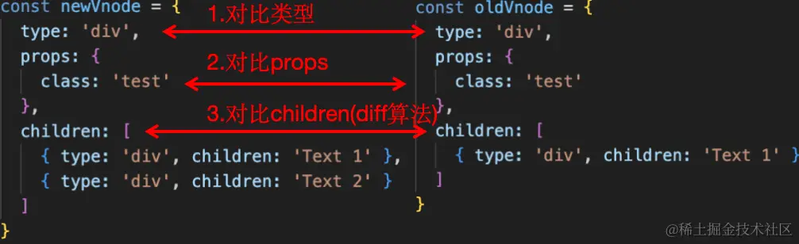
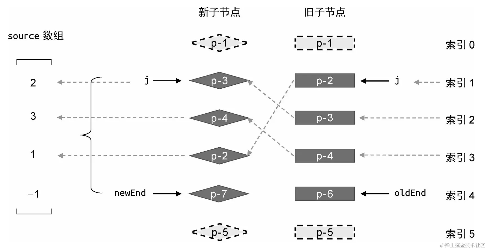
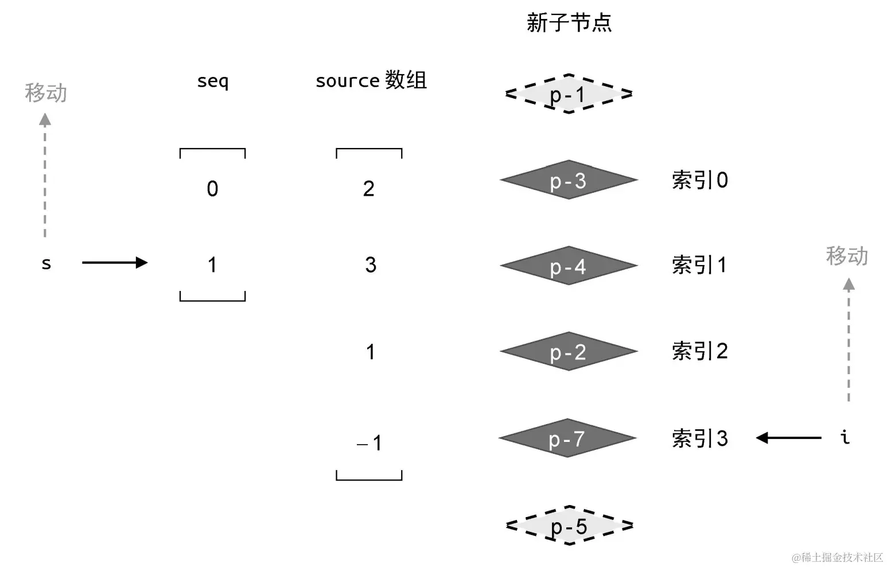

[diff参考地址](https://juejin.cn/post/7301242165279457307)

## Vue Diff 算法源码解析

## 引入

我们知道，在`Vue`的渲染器（`renderer`）中，`Vue`通过对新旧虚拟节点进行`patch`来进行真实`DOM`的更新。对比新旧节点分为三个部分：

+   对比类型：如果类型不同则直接卸载旧`DOM`元素，并挂载新的`DOM`元素，这样就完成了更新
+   如果类型相同，则：
+   对比`props`：这里会用到编译器生成的编译时信息，对可能发生改变的`props`进行更新
+   对比`children`：对比`children`并更新真实`DOM`所用到的算法就是`Diff`算法，也是这篇文章所要介绍的内容



在`Vue2`中，使用的算法是双端`diff`算法；而在`Vue3`中则换为了性能更佳的快速`diff`算法。由于本文的核心内容是结合`Vue3`源码介绍快速`diff`算法，因此对于双端`diff`算法仅做简单介绍。

简单来说，对于新旧节点都为数组的情况（不为数组的情况只需要进行简单的卸载/挂载即可），双端`diff`会用头、尾指针各两个，分别指向新、旧节点`children`的头和尾，并分别进行头-头、尾-尾、头-尾和尾-头比较，如果：

+   四次比较中存在`key`相同的节点，则进行对应节点的`patch`，并移动指针，进行下一轮比较
+   如果四次比较都没有发现`key`相同的节点，则对于新节点的第一个子节点，在旧节点的`children`中查找`key`相同的节点。如果：
    +   没找到。说明这是新增节点，直接在`DOM`中增加新节点
    +   找到了相同节点。对节点进行`patch`，并移动新节点的头指针，并将旧节点的对应`children`标记为“已经发生过`patch`”，下次旧节点指针移动到该节点时直接跳过该节点
+   当新/旧节点中的尾指针小于头指针时，退出循环

最后对于新/旧节点中遗留的节点（说明是新增/需要删除的），执行挂载/卸载`DOM`节点的操作。

## 快速 diff 算法

在正式介绍快速`diff`之前，我们先来通过一个例子看一下是怎么从数据更新开始进入`diff`的。

下面这段代码使用`v-for`渲染了一个数组`array`，并绑定了`key`。当点击按钮时，数组中的数据顺序会反转。

```html
<div>
  <div id="demo">
    <div v-for="data in array" :key="data.id">{{ data.name }}</div>
    <button @click="reverse">reverse</button>
  </div>
</div>

<script src="../../dist/vue.global.js"></script>
<script>
  const { createApp, ref } = Vue
  const app = createApp({
    setup() {
      let array = ref([
        { name: 1, id: 1 },
        { name: 2, id: 2 }
      ])
      function reverse() {
        array.value.reverse()
      }
      return {
        array,
        reverse
      }
    }
  })
  app.mount('#demo')
</script>
```

当`array`的数据顺序发生改变时，显然会触发组件的更新，从而带来新旧虚拟节点间的`patch`。由于`v-for`在编译过程中生成的虚拟节点会被`Fragment`包裹，所以实际参与对比的节点长这个样子：

```ts
const oldVnode = {
  type: 'Fragment',
  props: null,
  children: [
    // 第一个 Children 是包裹 v-for 的 Fragment，是我们着重关注的
    {
      type: 'Fragment',
      props: null,
      // *新旧节点唯一发生改变的地方
      children: [
        { type: 'div', props: { key: 1 }, children: 1 },
        { type: 'div', props: { key: 2 }, children: 2 }
      ]
    },
    // 第二个 Children 是 button。由于这个 Children 没有发生变化，所以不会发生更新
    { type: button, props: { onClick: f }, children: 'reverse' }
  ]
}

const newVode = {
  // 只有*处发生了改变，即 children 的顺序发生了改变，其他都一样
}
```

在`patch`过程中，由于`button`并没有发生任何变化，因此不会发生更新；只有`v-for`发生了改变，因此下一步会比较这两个`VNode`：

```ts
const n1 = {
  type: 'Fragment',
  props: null,
  // *新旧节点唯一发生改变的地方
  children: [
    { type: 'div', props: { key: 1 }, children: 1 },
    { type: 'div', props: { key: 2 }, children: 2 }
  ]
}
const n1 = {
  type: 'Fragment',
  props: null,
  // *新旧节点唯一发生改变的地方
  children: [
    { type: 'div', props: { key: 2 }, children: 2 },
    { type: 'div', props: { key: 1 }, children: 1 }
  ]
}
```

### patchChildren

这两个`VNode`的`patch`逻辑发生在`patchChildren`函数中。通过编译生成的`patchFlag`，可以得知需要进行`diff`的`children`是否绑定了`key`。如果绑定了`key`则调用`patchKeyedChildren`；否则调用`patchUnkeyedChildren`。

```ts
const c1 = n1 && n1.children
const c2 = n2.children

const { patchFlag, shapeFlag } = n2
// fast path
if (patchFlag > 0) {
  if (patchFlag & PatchFlags.KEYED_FRAGMENT) {
    // this could be either fully-keyed or mixed (some keyed some not)
    // presence of patchFlag means children are guaranteed to be arrays
    patchKeyedChildren(
      c1 as VNode[],
      c2 as VNodeArrayChildren,
      container,
      anchor,
      parentComponent,
      parentSuspense,
      isSVG,
      slotScopeIds,
      optimized
    )
    return
  } else if (patchFlag & PatchFlags.UNKEYED_FRAGMENT) {
    // unkeyed
    patchUnkeyedChildren(
      c1 as VNode[],
      c2 as VNodeArrayChildren,
      container,
      anchor,
      parentComponent,
      parentSuspense,
      isSVG,
      slotScopeIds,
      optimized
    )
    return
  }
}
```

### patchUnkeyedChildren

对于未绑定`key`的情况，由于`Vue`无法确定新旧节点间的对应关系，所以`patchUnkeyedChildren`的逻辑也很简单，就是对于新旧节点中的元素，一一做`patch`，即第一个元素和第一个元素进行`patch`，第二个和第二个做`patch`，以此类推。最后多出来的节点进行挂载或卸载操作。

### patchKeyedChildren

对于绑定了`key`的`children`之间的`patch`就是我们所说的**快速 diff 算法**了，也就是**patchKeyedChildren**函数的内容。其**核心目标**是根据旧虚拟节点数组`n1[]`和新虚拟节点数组`n2[]`，来对真实`DOM`节点进行增加、删除和移动节点的三种操作，从而更新`DOM`。

由于在修改之前**DOM节点和旧虚拟节点数组**是一一对应的，因此这个算法完全等价于：给定字符串`s1`和`s2`，对字符串中的字符可以进行增加、删除和移动三种操作，找到操作序列使得`s1`变为`s2`并且操作次数最少。基于这种理解，我们来介绍快速`diff`算法。

快速`diff`算法分为以下几个步骤：

#### 一、对`children`中相同的前置元素和后置元素做`patch`

这里的相同指的是元素的`key`和`type`相同。对于相同的前置元素和后置元素，我们可以直接做`patch`来更新`DOM`而不用对真实`DOM`元素进行移动。

比如对于相同的**前置元素**`n1`和`n2`，假如对于字符串来说，显然不需要任何操作；但是对于虚拟节点来说，它们的`key`相同说明可以复用`DOM`节点，因此需要进行`patch`操作，又由于它们在新旧两组`children`中的相对位置不变，因此无需移动它们对应的`DOM`节点。

```ts
// 1. sync from start
// (a b) c
// (a b) d e
while (i <= e1 && i <= e2) {
  const n1 = c1[i] // 旧 VNode 对应的 DOM 节点
  const n2 = (c2[i] = optimized // 新 VNode 对应的 DOM 节点
              ? cloneIfMounted(c2[i] as VNode)
              : normalizeVNode(c2[i]))
  // 如果是相同节点，直接 patch
  if (isSameVNodeType(n1, n2)) {
    patch(
      n1,
      n2,
      container,
      null,
      parentComponent,
      parentSuspense,
      isSVG,
      slotScopeIds,
      optimized
    )
  } else {
    break
  }
  // 指针前移
  i++
}
```

对于后置元素也是同样的道理：

```ts
// 2. sync from end
// a (b c)
// d e (b c)
while (i <= e1 && i <= e2) {
  const n1 = c1[e1]
  const n2 = (c2[e2] = optimized
              ? cloneIfMounted(c2[e2] as VNode)
              : normalizeVNode(c2[e2]))
  if (isSameVNodeType(n1, n2)) {
    patch(
      n1,
      n2,
      container,
      null,
      parentComponent,
      parentSuspense,
      isSVG,
      slotScopeIds,
      optimized
    )
  } else {
    break
  }
  e1--
  e2--
}
```

#### 二、对于多出的元素进行挂载/卸载

当我们处理完相同的前置元素，如果新/旧节点数组中有一方是空的，并且另一方有元素，那么说明需要进行挂载或卸载。如果是新节点多出元素，说明是新增的元素，需要挂载到`DOM`中（如`n1=ab, n2=abc`，）；如果是旧节点多出元素，说明这些元素应该被卸载（如`n1=abc, n2=ab`）。

```ts
// 3. common sequence + mount
// (a b)
// (a b) c
// i = 2, e1 = 1, e2 = 2
// (a b)
// c (a b)
// i = 0, e1 = -1, e2 = 0
if (i > e1) {
  if (i <= e2) {
    const nextPos = e2 + 1
    const anchor = nextPos < l2 ? (c2[nextPos] as VNode).el : parentAnchor
    while (i <= e2) {
      patch(
        null,
        (c2[i] = optimized
         ? cloneIfMounted(c2[i] as VNode)
         : normalizeVNode(c2[i])),
        container,
        anchor,
        parentComponent,
        parentSuspense,
        isSVG,
        slotScopeIds,
        optimized
      )
      i++
    }
  }
}

// 4. common sequence + unmount
// (a b) c
// (a b)
// i = 2, e1 = 2, e2 = 1
// a (b c)
// (b c)
// i = 0, e1 = 0, e2 = -1
else if (i > e2) {
  while (i <= e1) {
    unmount(c1[i], parentComponent, parentSuspense, true)
    i++
  }
}
```

#### 三、处理剩余的节点

假设对于旧/新虚拟节点数组分别为`ab[cde]fg`和`ab[edch]fg`，那么经过步骤一对相同前置/后置元素进行`patch`后，我们会得到剩余节点数组`cde`和`edch`，这一步骤的任务就是对它们进行`patch`。

处理剩余节点的过程可以分为以下几步：

1.  构造`source`数组，建立新节点对应的旧节点的数组下标索引（插图来自《`Vue.js`设计与实现》），过程中如果遇到的旧子节点无法对应到新子节点，则将其卸载（如图中的`p-6`）：
    
    
2.  生成`source`数组的最长递增子序列`seq`，并使用`s`和`i`分别指向`seq`和新子节点的尾部：
    
    
3.  让`i`从下到上遍历（这样是为了使用上一个`patched`过的节点作为锚点），如果：
    
    +   对应节点在`source`中的值为`-1`，说明新子节点没有对应的旧子节点，则需要把新节点挂载到`DOM`树中的下一个节点之前（对应上图，就是需要把`p-7`节点插入到`p-5`节点之前）。
    +   对应节点在`source`中的值不为`-1`，但是对应的值等于`s`指向的值。这说明该节点位于最大递增子序列中，因此该节点不需要移动，只需要进行`patch`即可。之后`s--`，指向上一个元素。
    +   对应节点的值不为`-1`并且也不在`seq`数组中。这说明该节点需要被移动，因此在`patch`后把该节点移动到`DOM`树中的下一个节点之前。
    
    执行完操作后`i--`，指向前一个节点。
    

至此，快速`diff`算法完成，所有的子节点都`patch`完毕，并且`DOM`也完成了更新。

## 思考与总结

### diff 算法的时间复杂度

在传统的`diff`算法中，`diff`发生在两棵`vdom`树之间，这种`diff`是跨层级的，因此比较节点的时间复杂度是`O(n^2)`，而加上`DOM`操作的时间复杂度（因为需要找到`anchor`）为`O(n)`，因此总的时间复杂度为`O(n^3)`

而在双端/快速`diff`算法中，比较的过程发生在同级之间，每个节点只被遍历了一次，相当于做了一次`DFS`，并且由于记录了`vnode`对应的`DOM`节点`el`，因此`DOM`操作的时间复杂度为`O(1)`，所以总的时间复杂度为`O(n)`。