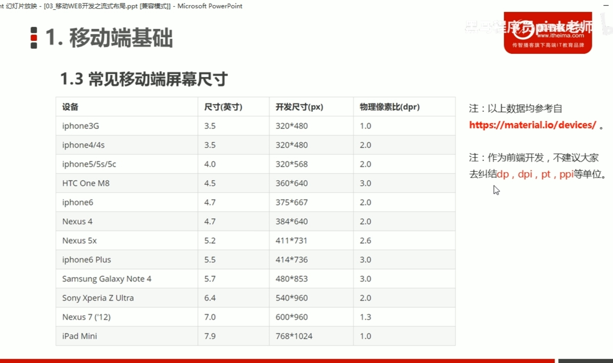
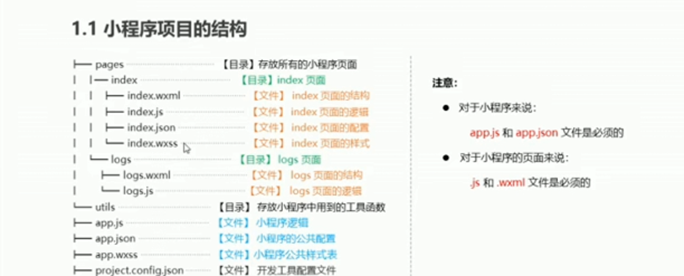
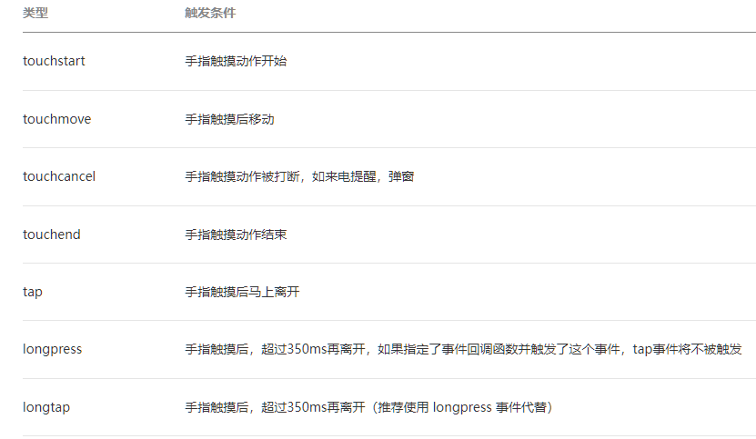
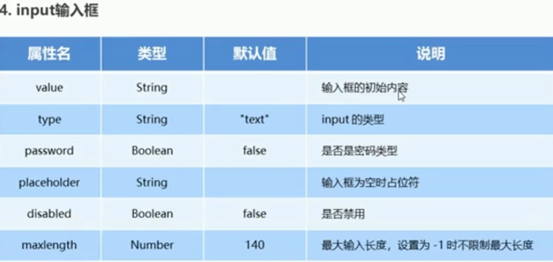
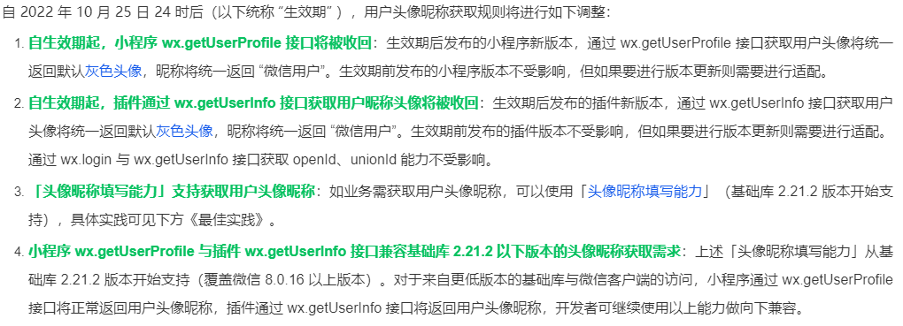
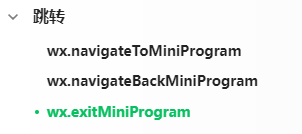
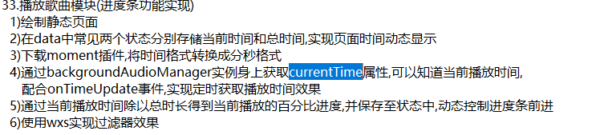
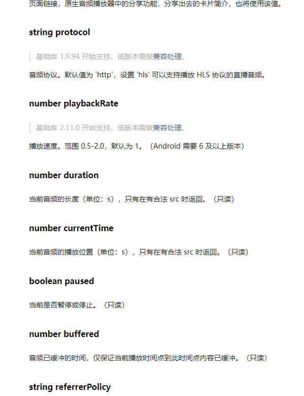
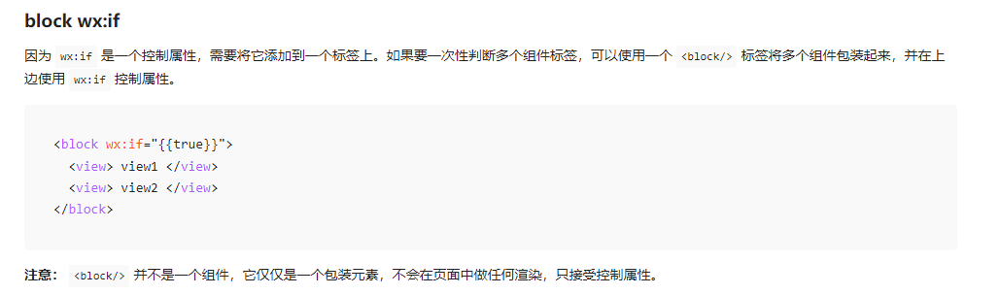

# 微信小程序
[wechat-app-demo](https://github.com/xwartz/wechat-app-demo)

[taro](https://docs.taro.zone/docs/)
[uni-app](https://uniapp.dcloud.net.cn/quickstart.html)

###  开发简介

- [微信开放平台](https://open.weixin.qq.com/)
  
  - ###### 对外提供接口，供第三方的网站和APP使用
  - 包括但不限于：微信分享/微信支付/微信登录/微信收藏 
- [小程序](https://mp.weixin.qq.com/wxamp/home/guide?lang=zh_CN&token=1006115686)
  
  - 基于微信公众号进行的开发
  - 订阅号：偏于为用户传达资讯，类似报纸杂志；  发送简单的消息
  - 服务号：偏于服务交互，类似银行、114；  提供更多服务
  - 小程序：一种新的开放能力，具有类似app的体验
  - 企业微信：企业的专业办公管理工具；


### 基础知识

#### 移动端布局

- 物理像素

  - 屏幕显示的最小颗粒，屏幕的分辨率，是厂商设置好的真实像素。如750*1334

- 设备独立像素 & CSS像素

  - 代表计算机中可以由程序使用并控制的 虚拟像素

- dpr：物理像素比  

  - 物理像素/虚拟像素  的值，1px能显示的物理像素点个数

  - 例：iphone6  dpr 为2    实际宽750  使用时350

  - 视网膜屏幕是分辨率超过人眼识别极限的高分辨率屏幕，营销术语。

    Iphone4的dpr = 2; 人类肉眼分辨的极限

- PPI: 一英寸显示屏上的像素点个数

- DPI：最早指的是打印机在单位面积上打印的墨点数，墨点越多越清晰

- 视口概念

  - 视觉视口，屏幕窗口的大小
  
  - 布局视口，网页的宽度
  
  - 完美视口 || 理想视口，让视觉视口 = 布局视口
  
    ```html
    <!--
    width:设置理想视口viewport的宽度
    initial-scale:初始缩放比例，大于0的数字
    maximum-scale:最大缩放比例，大于0的数字
    minimum-scale:最小缩放比例，大于0的数字
    user-scalable:用户是否可以缩放，yes或no(0或1)
    -->
    <meta name='viewport' content='width=device-width,initial-scale=1.0'>
    ```
  
- flex布局

- 第三方库实现：lib-flexible + px2rem-loader

- rem布局

  - ```js
    function remRefresh() {
    let clientWidth = document.documentElement.clientWidth;
    	// 将屏幕等分10份
        let rem = clientWidth / 10;
        document.documentElement.style.fontSize = rem + 'px';
        document.body.style.fontSize = '12px';
    }
    
    window.addEventListener('pageshow', () => {
       remRefresh()
    })
    // 函数防抖
    let timeoutId;
    window.addEventListener('resize', () => {
      timeoutId && clearTimeout(timeoutId);
      timeoutId = setTimeout(() =>{
         remRefresh()
      }, 300)
    })
    
    ```




#### 创建项目

- 通过微信开发者工具创建项目，AppID在官网查看
- 存放路径必须为空目录
- 创建自己的小程序（不使用云开发）
  - pages目录上右键，创建新建文件夹并重命名
  - 新文件夹右键-新建page，会自动创建页面相关的文件；
  - 项目根目录，app.json(全局配置文件)
    - 其中pages节点是一个数组，存储页面的访问路径，
    - 第一个页面路径，就是小程序默认的项目首页；
    - 修改pages数组中的路径顺序即可；
- 创建自己的小程序（云开发）
  - cloudfunctions 云函数
  - miniprogram的pages中会生成一些默认的界面，如果不需要可以直接删除
  - 点击 云开发 按钮，进行相关内容设置
    - 云函数-- 创建云函数  -- cloudfunctions文件夹右键-- 同步云函数列表 -- 开启云函数本地调试
    - 云函数相当于创建了 Node服务，可以直接写node的代码！
    - 理念：用小程序的方法 —> 请求云函数(包装过的Node服务)，获取数据。

#### 项目结构

-  .wxml 结构：用来描述当前页面的结构，同时提供了类似vue指令的语法；
- .wxss 样式：用于定义样式，美化当前页面；
- .js 逻辑：用于定义当前页面中的数据、交互逻辑、响应用户的操作；
- .json 配置：用来定义界面的个性化配置；例：为每个页面单独配置顶部颜色、是否允许下拉刷新等。。




#### 小程序特点

- 小程序要求压缩包的体积**不能大于2M**，否则无法通过审核
- 没有DOM(不遵守W3C的语法规范)
- 事件分为
  - 冒泡事件：会向父节点传递
  - 非冒泡事件


#### 小程序配置

- 全局配置

  ```json
  {
     // 项目根目录下的 app.json文件  
     // pages 将所有使用的页面配置在pages中
    "pages": [
       // 第一个页面作为首页默认显示
      "pages/shouYe/shouYe",
      "pages/qita/qita",
      "pages/wode/wode",
      "pages/home/home"
    ],
     // window 用于设置小程序的状态栏、导航条、标题、窗口背景色。
     "window": {
      "backgroundTextStyle": "light",  // 下拉 loading的样式，仅支持 dark / light
      "navigationBarBackgroundColor": "#fff", // 顶部背景颜色
      "navigationBarTitleText": "女小开的实验", // 顶部标题
      "navigationBarTextStyle": "black", // 顶部字体颜色
      "backgroundColor": "#b1b4be",   // 窗口的背景色
      "enablePullDownRefresh": true,  // 是否开启全局的下拉刷新。
    },
  }
  ```

- project.config.json 

  - 配置文件，可以通过点击右上角详情，进行可视化的配置
  
- sitemap.json 配置

  - 用来配置小程序及其页面是否允许被微信索引，类似于SEO

- app.wxss

  - 样式为公共样式

- app.js

  - 注册小程序：App() 必须在 `app.js` 中调用，必须调用且只能调用一次。不然会出现无法预期的后果。接受一个 `Object` 参数，其指定小程序的生命周期回调等。

  - 可以通过 `getApp` 方法获取到全局唯一的 App 实例，App上的数据和函数由所有界面共享。

  - ```js
    // app.js
    App({
      onLaunch (options) {
        // Do something initial when launch.
      },
      onShow (options) {
        // Do something when show.
      },
      onHide () {
        // Do something when hide.
      },
      onError (msg) {
        console.log(msg)
      },
      globalData: {
          a:12
      }
    })
    
    // xxx.js
    const b = getApp()
    console.log(appInstance.globalData.a=1) // I am global data
    ```
    
    

#### [事件](https://developers.weixin.qq.com/miniprogram/dev/framework/view/wxml/event.html)

- tap事件相当于   click点击

- longtap事件   长按触发

- 绑定事件方式

  - bind ：默认的冒泡事件

  - catch ：阻止事件向上冒泡。

  - capture-bind ：在捕获阶段监听事件

  - capture-catch ：中断捕获阶段和取消冒泡阶段。

    - 触摸类事件支持捕获阶段，且捕获阶段位于冒泡阶段之前

  - mut-bind ：互斥事件

    - 一个 `mut-bind` 触发后，如果事件冒泡到其他节点上，其他节点上的 `mut-bind` 绑定函数不会被触发，但 `bind` 绑定函数和 `catch` 绑定函数依旧会被触发。所有 `mut-bind` 是“互斥”的，只会有其中一个绑定函数被触发，并不影响 `bind` 和 `catch` 的绑定效果。

  - ```html
    <!-- 直接在组件标签中写 bind+事件类型 ="事件名"  -->
    <view catchlongtap="事件名">hello word！</view>
    
    事件名(){}
    ```

- 事件类型分类

  1. 冒泡事件
     1. 其实就是原生事件机制中的冒泡阶段的事件
     2. **语法:bind+事件名称="事件回调函数名称"**
     3. bind其实就相当于Vue中的@符号,用来声明绑定事件
     4. **注意:小程序的事件回调函数声明位置与生命周期同级**
  2. 非冒泡事件（阻止事件冒泡阶段）
     1. **语法:catch+事件名称="事件回调函数名称"**
     2. **注意:阻止冒泡之后,当前节点的事件回调函数依旧会执行,只是后续的节点的事件不会再被触发**

  1. 捕获事件
     1. 其实就是原生事件机制中的捕获阶段的事件
     2. **语法:capture-bind+":"+事件名称="事件回调函数名称"**
     3. **注意:绑定事件的时候一定要加上冒号,不能省略,绑定冒泡事件时,可以简写冒号**
  2. 非捕获事件（阻止事件捕获阶段）
     1. **语法:capture-catch+":"+事件名称="事件回调函数名称"**

  1. 总结
     1. 如果面试遇到询问事件回调函数的触发顺序,首先要注意的是所有事件所处的事件阶段,在观察每个节点的DOM嵌套结构
     2. 优先级:事件阶段>DOM嵌套层级
     3. 除了React的合成事件外，学习到的所有**事件名都是小写**

- 


#### 组件和 API

- 组件通常包括**开始标签**和**结束标签**，**属性**用来修饰这个组件，**内容**在两个标签之间；类似于HTML标签
  - 组件名和属性名都是小写;
  - 例： `<button type="primary">绿色按钮</button>`
- API（应用程序编程接口），是一些预定义的函数，
  - 事件监听API
    - 特点：以on开头，监听某个事件是否触发；
    - 例：`wx.onNetworkStatusChange(function callback)     //当网络状态更改时触发此事件`
  - 同步API
    - 特点：以Sync结尾的api；执行结果通过函数返回值获取；
    - 例：获取电池信息
  - 异步api：
    - 特点：通常需要指定回调函数接收调用的结果；大多属于异步api
    - 例:发起HTTPS网络请求


### UI组件

#### 常见组件

##### text 文本

- 行内标签，相当于span ，属于行内标签；；可以设置是否能被选中；；空格和编码的显示方式；

- ```html
  <text selectable='true'>这是文本标签</text>
  ```

- | 属性名      | 类型    | 默认值 | 说明                                                         |
  | ----------- | ------- | ------ | ------------------------------------------------------------ |
  | user-select | boolean | false  | 文本是否可选，该属性会使文本节点显示为 inline-block          |
  | space       | string  |        | 是否显示连续空格;   ensp:英文空格   emsp:中文空格   nbsp：字体长度 |
  | decode      | boolean | false  | 是否解码                                                     |


##### view 容器

- 块级标签，相当于div，可以设置点击的相关样式属性

- ```html
  <!--  对应wxss中定制hc1样式： .hc1 { background-color : red; }   -->
  <view hover-class='hc1'>独占一行的标签，类似于div</view>   
  ```

- 属性 hover-start-time、hover-stay-time 的值不能带单位；

- | 属性                   | 类型    | 默认值 | 说明                                                         |
  | ---------------------- | ------- | ------ | ------------------------------------------------------------ |
  | hover-class            | string  | none   | 指定按下去的样式类。当 `hover-class="none"` 时，没有点击态效果 |
  | hover-stop-propagation | boolean | false  | 指定是否阻止本节点的祖先节点出现点击态                       |
  | hover-start-time       | number  | 50     | 按住后多久出现点击态，单位毫秒                               |
  | hover-stay-time        | number  | 400    | 手指松开后点击态保留时间，单位毫秒                           |

  

##### image 图片

- 双标签，因为微信小程序的文件大小限制，一般使用网络地址的图片

- image组件，默认宽度300px；高度225px；

- ```html
   <image style="width: 200px; height: 200px; background-color: #eeeeee;" mode="{{item.mode}}" src="{{src}}"></image>
  ```

  | 属性                   | 类型        | 默认值      | 说明                                                         |
  | ---------------------- | ----------- | ----------- | ------------------------------------------------------------ |
  | src                    | string      |             | 图片资源地址，支持本地/网络地址                              |
  | mode                   | string      | scaleToFill | 支持图片剪切、缩放模式，具体配置查官网                       |
  | webp                   | boolean     | false       | 默认不解析 webP 格式，只支持网络资源                         |
  | lazy-load              | boolean     | false       | 图片懒加载，在即将进入一定范围（上下三屏）时开始加载         |
  | binderror              | eventhandle |             | 当错误发生时触发，event.detail = {`errMsg`}                    |
  | bindload               | eventhandle |             | 当图片载入完毕时触发，event.detail = {`height, width`}         |
  | show-menu-by-longpress | boolean     | false       | 长按图片显示发送给朋友、收藏、保存图片、搜一搜、打开名片/前往群聊/打开小程序（若图片中包含对应二维码或小程序码）的菜单。 |


##### button 按钮

禁用的按钮显示灰色，不可点击；

##### input 输入框

- disabled禁用后，显示灰色，无法输入

- ```html
  <input value='abc'></input>    <!-- 输入的默认值 -->
  <input placeholder='请输入内容'></input>  <!-- 提示文本，输入内容后消失 -->
  ```

- 


video视频

> 特别点：
>
> - 直接通过动态绑定src实现视频切换，可能会出问题
> - 使用单个video标签，实现播放多个不同的视频时，无法实现视频的预加载，可能会导致切换时的卡顿，影响体验。
>   - 解决思路1：
>     - 循环生成多个video，通过z-index控制显示层级 及 视频的播放与暂停
>     - 当切换时，视频暂停，回来时，继续播放，视频循环播放


#### 列表渲染 

- wx:key

如果列表中项目的位置会动态改变或者有新的项目添加到列表中，并且希望列表中的项目保持自己的特征和状态（如 [input](https://developers.weixin.qq.com/miniprogram/dev/component/input.html) 中的输入内容，[switch](https://developers.weixin.qq.com/miniprogram/dev/component/switch.html) 的选中状态），需要使用 `wx:key` 来指定列表中项目的唯一的标识符。

`wx:key` 的值以两种形式提供

1. 字符串，代表在 for 循环的 array 中 item 的某个 property，该 property 的值需要是列表中唯一的字符串或数字，且不能动态改变。
2. 保留关键字 `*this` 代表在 for 循环中的 item 本身，这种表示需要 item 本身是一个唯一的字符串或者数字。

当数据改变触发渲染层重新渲染的时候，会校正带有 key 的组件，框架会确保他们被重新排序，而不是重新创建，以确保使组件保持自身的状态，并且提高列表渲染时的效率。

**如不提供 `wx:key`，会报一个 `warning`， 如果明确知道该列表是静态，或者不必关注其顺序，可以选择忽略**

```html
<!-- wx:key="unique"   这里的unique 是没有西昂 -->
<switch wx:for="{{objectArray}}" wx:key="unique" style="display: block;"> {{item.id}} </switch>

<switch wx:for="{{numberArray}}" wx:key="*this" style="display: block;"> {{item}} </switch>
```


### wxss样式

> wxss 具有css大部分特性；与css书写基本一致；对css 进行了扩充和修改；

#### rpx单位

- responsive pixel 响应式像素单位 ，微信小程序独有 rpx
- 规定任何屏幕下的宽度固定为 750rpx，100vw = 750rpx
- iphone6 下 1px=2rpx

#### 书写样式

- `page{}` 为页面最外层标签，类似于html
- 除app.wxss外的wxss文件都只在当前界面生效，相当于vue中的 scoped


### js逻辑

- 配置  数据 、方法

- ```js
  // 在js文件中创建Page,并传入对象
  let options = {
     // data配置数据，底层做了深拷贝，因此不需要使用vue中函数的形式
     data:{
        msg:'微信小程序实验',
        id:123456,
        isif:false,
        gender:'男',
        lis:['周董','杰伦','稻香']
     },
     // wxml中使用的方法可以直接配置
     addStar(){
        // 可以通过 this.data.lis 读取到数据，但只读！
        this.data.lis.push('张碧晨');   // 这样直接修改数据无效！结合setData方法修改。
        console.log(this.data.lis);
        
        // 修改数据，借助 setData方法
        this.setData({
           lis:this.data.lis
        })
     },
     goIndex(){
        // 实现界面跳转
        w.navigateTo({
           // 配置绝对路径,以项目根目录为准
           url:'/pages/index/index'
        })
     }
  }
  Page(options);
  
  ```
  
  ```html
  <!-- 在wxml页面中使用数据，与Vue模板语法类似，但可用于 属性+标签体 -->
  <view>{{msg}}</view>
  <view id='{{id}}'>绑定属性渲染</view>
  
  <view wx:if='{{isif}}'>条件渲染，类似v-if,false不显示</view>
  <view wx:if='{{!isif}}'>条件渲染，类似v-if，true显示</view>
  <view wx:else>条件渲染，上级都不显示时，显示该项</view>
  
  <view wx:if='{{gender=="男"}}'>条件渲染，if 男神</view>
  <view wx:elif='{{gender=="女"}}'>条件渲染，else if 女神</view>
  <view wx:else>条件渲染，上级都不显示时显示 人类</view>
  
  <!-- 循环渲染，默认 index为索引值  item为每一项  -->
  <!-- 和vue一样需要设置key，不需要要括号  -->
  <view wx:for="{{lis}}" wx:key='index'>{{index}} -- {{item}}</view>
  <!-- 手动设置 默认的index、item别名   -->
  <view wx:for="{{lis}}" wx:key='index' wx:for-item='aaaa'  wx:for-index='idx'>
     {{idx}} -- {{aaaa.b}}
  </view>
  
  <!-- bindtap 绑定tap事件，即移动端的用户点击事件   addStar是自定义事件名 -->
  <button bindtap="addStar">添加明星</button>
  <button bindtap="goIndex">添加明星</button>
  ```
  


#### getApp()

- 获取到小程序全局唯一的 `App` 实例。

- 注意：

  - 不要在定义于 `App()` 内的函数中，或调用 `App` 前调用 `getApp()` ，使用 `this` 就可以拿到 app 实例。
  - 通过 `getApp()` 获取实例之后，不要私自调用生命周期函数。

- ```js
  var appInstance = getApp()
  console.log(appInstance.globalData) // I am global data
  ```

  


#### 数据请求

1. 语法:
   1. API:wx.request(配置对象)
   2. 配置对象必传url属性,默认请求方式为GET请求
   3. url属性必须完整书写,必须写清楚请求的地址,请求的路由
2. 所需做的配置
   1. 项目准备上线
      1. 位置:登录微信公众平台->开发->开发管理->开发设置->找到**服务器域名配置**
      2. 将项目上线之后需要请求的域名提前配置在request域名中
   2. 项目正在开发
      1. 位置:微信开发者工具->详情->本地设置->勾选"不校验合法域名"
      2. 只要勾选该按钮,在开发过程中就不需要担心发送请求域名报错问题
3. 注意点:
   1. **小程序必须使用 HTTPS/WSS 发起网络请求**
   2. **小程序只能跟提前配置好的域名进行通信**
   3. 网络接口允许与局域网 IP 通信，但要注意 **不允许与本机 IP 通信**
   4. 在微信开发者工具中，可以临时开启 `开发环境不校验请求域名、TLS版本及 HTTPS 证书` 选项，跳过85服务器域名的校验。此时，在微信开发者工具中及手机开启调试模式时，不会进行服务器域名的校验。
   5. 默认超时时间和最大超时时间都是 **60s**
      1. 超时时间可以在 app.json 中通过 networktimeout 配置
   6. [wx.request](https://developers.weixin.qq.com/miniprogram/dev/api/network/request/wx.request.html)、[wx.uploadFile](https://developers.weixin.qq.com/miniprogram/dev/api/network/upload/wx.uploadFile.html)、[wx.downloadFile](https://developers.weixin.qq.com/miniprogram/dev/api/network/download/wx.downloadFile.html) 的最大并发限制是 **10** 个,Chrome和FireFox发送请求的最大并发限制为6个
      - 如果发送的请求数量大于最大并发限制,那么前几个请求会发送出,剩余请求会暂停发送,等待前面请求成功响应
   7. [wx.connectSocket](https://developers.weixin.qq.com/miniprogram/dev/api/network/websocket/wx.connectSocket.html) 的最大并发限制是 **5** 个。
   8. 小程序进入后台运行后，如果 **5s** 内网络请求没有结束,会自动变为失败
   9. 只要成功接收到服务器返回，无论 statusCode 是多少，都会进入 success 回调


#### 路由跳转?

1. VueRouter的作用：用于实现单页面应用(SPA)
   1. 问题:什么是单页面应用?
      1. 一个项目只有一个html文件,就是单页面应用
      2. 单页面应用就是在一个html文件上,使用原生DOM的CRUD的API对其页面结构进行修改,实现不同内容之间的切换,但是不会发送任何的请求去获取新的html文件
   
2. VueRouter的路由跳转
   1. 声明式导航
      1. router-link
      2. 默认生成a标签,当用户点击该标签时,会实现路由的跳转
      3. **定义:通过标签形式,引导用户进行跳转,就可以成为声明式导航**
   2. 编程式导航
      1. $router对象的API
      2. 开发者可以调用$router身上的push,replace,go,back等方法实现路由的跳转
      3. **定义:通过js调用API的形式,控制用户进行跳转,就可以成为编程式导航**
   
3. 小程序的路由跳转
   1. 声明式导航
      1. 组件:navigator
      
   2. 编程式导航
      1. wx.navigateTo(配置对象)
         1. **该跳转方式类似于push+keep-alive** 
         
         2. **保留当前页面的实例对象**，跳转到应用内的某个页面
         
         3. 路由传参：借助events属性，绑定事件
         
            > 如果一个页面由另一个页面通过 [`wx.navigateTo`](https://developers.weixin.qq.com/miniprogram/dev/api/route/wx.navigateTo.html) 打开，这两个页面间将建立一条数据通道：
            >
            > - 被打开的页面可以通过 `this.getOpenerEventChannel()` 方法来获得一个 `EventChannel` 对象；
            > - `wx.navigateTo` 的 `success` 回调中也包含一个 `EventChannel` 对象。
            >
            > 这两个 `EventChannel` 对象间可以使用 `emit` 和 `on` 方法相互发送、监听事件。
         
            - 在新的界面Load声明周期中监听对应事件，得到数据
         
            - 在界面跳转的成功会回调中触发事件，传递数据
         
            - ```js
              wx.navigateTo({
                url: 'test?id=1',
                events: {
                  // 为指定事件添加一个监听器，获取被打开页面传送到当前页面的数据
                  acceptDataFromOpenedPage: function(data) {
                    console.log(data)
                  },
                  someEvent: function(data) {
                    console.log(data)
                  }
                  ...
                },
                success: function(res) {
                  // 通过 eventChannel 向被打开页面传送数据
                  res.eventChannel.emit('acceptDataFromOpenerPage', { data: 'test' })
                }
              })
              
              
              //test.js
              Page({
                onLoad: function(option){
                  console.log(option.query)
                  const eventChannel = this.getOpenerEventChannel()
                  eventChannel.emit('acceptDataFromOpenedPage', {data: 'test'});
                  eventChannel.emit('someEvent', {data: 'test'});
                  // 监听 acceptDataFromOpenerPage 事件，获取上一页面通过 eventChannel 传送到当前页面的数据
                  eventChannel.on('acceptDataFromOpenerPage', function(data) {
                    console.log(data)
                  })
                }
              })
              ```
         
              
         
      2. wx.redirectTo(配置对象)
         1. 该跳转方法类似于replace，**销毁当前页面的实例对象**，跳转到应用内的某个页面
         2. **redirectTo不会影响到页面栈的层数**
         
      3. 注意：
         - url属性可以写相对路径,相对于当前文件所在的目录
         - url属性可以写绝对路径,绝对路径参考于当前项目根路径
         - url中不要输入文件的后缀名,只需要输入文件的名称即可
         - 小程序中页面栈最多十层,旧版最多五层(相当于keep-alive的max属性写为10)
         - 如果小程序页面栈已经达到十层,此时在使用wx.navigateTo进行跳转,将会失去效果,不会跳转


#### 生命周期

1. 页面的生命周期一共有5个
2. 生命周期阶段划分
   1. 进入阶段
      1. onLoad
         1. 当页面开始加载时触发
         2. 类似于Vue的created生命周期
         3. 小总结:如果有些事情在每次创建组件时都要执行,就放在onLoad里面
      2. onShow(**任何情况下都会执行**)
         1. 当页面开始显示时触发
         2. 类似于Vue的activated生命周期
         3. 小总结:如果有些事情每次进入页面都要执行,就放在onShow里面
      3. onReady
         1. 当页面初次渲染完成时触发
         2. 类似于Vue的mounted生命周期(挂载结束)
         3. **问题:区分挂载和渲染**
            1. **挂载->将真实DOM插入到html上**
            2. **渲染->将html上的内容绘制到浏览器上**
         4. 小总结:如果有些事情在首次渲染组件时都要执行,就放在onReady里面
   2. 离开阶段
      1. onHide
         1. 当页面隐藏时触发
         2. 类似于Vue的deactivated生命周期
         3. **当用户使用wx.navigateTo方法离开当前页面时,当前页面会被缓存隐藏起来,所以会触发onHide生命周期**
         4. **当回到之前缓存的页面时,该页面只会执行onShow生命周期**
      2. onUnload
         1. 当页面卸载时触发
         2. **当用户使用wx.redirectTo方法离开当前页面时,当前页面会被销毁掉,所以会触发onUnload生命周期**
         3. **当重新显示某个页面时,该页面会执行进入阶段的所有生命周期,重新初始化页面**
   3. 生命周期图注意点
      1. **根据官网所示生命周期图,在onLoad和onShow执行之后,才会将默认的data数据发送给视图层进行渲染**
      2. **实际调试效果是在onLoad中就已经可以看到页面展示的默认数据**
      3. **最终,个人认为实际调试效果与官网生命周期图不相符,可能是debugger问题,开发依旧以官网的生命周期图为准**


#### 用户授权

1. 

2. 首次登录用户授权

   1. 早期

      1. API:wx.getUserInfo({})
      2. 在小程序早期时,只要调用该API就会弹出授权窗口,找用户获取个人信息

   2. 中期  ——2.21.0

      1. 于21/4/10左右,开始正式废弃,开始使用最新版本
         1. **注意:想要测试该功能,需要将基础库版本调至2.15.0以下**
      2. 流程:
         1. 使用button组件，添加标签属性open-type="getUserInfo",实现授权弹窗
         2. 给button组件绑定事件监听,事件名:getuserinfo
         3. 在事件回调函数中,可以通过形参中的detail属性获取到用户相关数据(如果res.detail.userInfo有值就说明用户授权成功)
         4. 将res.detail中的userInfo对象更新到data中
         5. 在wxml中,使用data中的userInfo对象数据进行动态渲染

   3. API: wx.getUserProfile({})    2.10~2.21

      1. 给页面上的某个组件绑定tap事件
      2. 在事件的回调函数中,调用wx.getUserProfile方法,获取到用户个人信息
      3. 将数据更新到data中进行展示

      1. 注意点:
         1. 该API必须在用户触发tap事件的回调函数中调用才能执行,否则无效
         2. 该API必须在2.15.0版本及以上才能使用
         3. 配置对象中的desc属性必传,否则该API无效
         4. 每次调用该API都会弹出授权窗口,再加上wx.getUserInfo方法已经废弃,所以如果想要实现二次登录免授权功能,就需要在授权成功之后,将用户信息存储到Storage(本地存储)中,在二次登录的时候,读取出来使用

3. 用户二次登录免授权(又称为**静默登录**)

   1. 需求:当用户进入首页时,自动获取用户信息,并进行展示
   2. 拆解:
      1. 当用户进入首页时: 触发首页进入阶段的所有生命周期->onLoad
      2. 自动获取用户信息
         1. 使用js的API获取用户信息
         2. API:wx.getUserInfo({})
         3. **注意:该API必须在用户已经经过首次授权逻辑之后才能使用,否则无效**
      3. 在页面上进行展示
         1. 将数据更新到data中,wxml就会自动展示最新数据

4. 奇特的组件

   1. 组件名:open-data
   2. 这个组件很鸡肋,能看不能用,该组件可以显示用户的部分个人信息,但是开发者无法从该组件上提取到数据
   3. 据官网所示,open-data的权限即将被收回,也就是说后面小程序开发,该组件将无法使用

5. 最新  2.21.0~

   - [头像昵称填写 | 微信开放文档 (qq.com)](https://developers.weixin.qq.com/miniprogram/dev/framework/open-ability/userProfile.html)


#### [网页跳小程序](https://developers.weixin.qq.com/miniprogram/dev/wxcloud/guide/staticstorage/jump-miniprogram.html)


#### 小程序跳转小程序

1. 从当前小程序跳转到另外一个小程序

   1. API:wx.navigateToMiniProgram

   2. 文档位置:API->跳转

   3. 该API需要传递另外一个小程序的appid,才可以实现跳转

      


#### 使用插件

1. 前往fuwu.weixin.qq.com寻找自己想要的插件(开发者资源)

2. 进入插件详情页面->点击添加插件

3. 进入微信公众平台后台,可以在设置->第三方设置

4. 由于当前学习的插件是定位以及城市选择器,所以需要使用到定位功能

   1. 需要申请开启定位功能
      1. 微信公众平台后台->开发->开发工具,点击腾讯位置服务
      2. 扫码授权之后,会自动跳转到腾讯位置服务官网,点击进入控制台(第一次需要注册账号)
      3. 控制台->左侧导航->应用管理->我的应用中,添加新的key值

5. 在小程序中引入插件

   1. 在**app.json**中添加一个**plugins配置项**,用于声明当前项目使用到的插件

      ```json
      {
        "plugins": {
         "citySelector": {
           "version": "1.0.0",
           "provider": "wx63ffb7b7894e99ae"
         }
       }
      }
      ```

   2. 在app.json中添加一个permission配置项,用于申请获取用户定位信息

      ```json
      {
        "permission": {
          "scope.userLocation": {
            "desc": "你的位置信息将用于小程序定位"
          }
        }
      }
      ```

6. 使用插件

   1. 通过某个按钮的点击事件,用于跳转到对应的插件页面

      1. ```javascript
             const key = 'BZ7BZ-QQWCU-DHWV2-BFJJG-B2JZF-KSBT3'; // 使用在腾讯位置服务申请的key
             const referer = '七月入栈'; // 调用插件的app的名称
             const hotCitys = '上海,北京,深圳,泉州'; // 用户自定义的的热门城市
         
             wx.navigateTo({
               url: `plugin://citySelector/index?key=${key}&referer=${referer}&hotCitys=${hotCitys}`,
             })
         ```

   7.获取当前用户选择的城市信息

   ​	1.引入组件

   ```javascript
   const citySelector = requirePlugin('citySelector');
   ```

   ​	1.在当前页面的onShow中,调用该组件的getCity方法获取到用户的选择结果

   ```javascript
   const selectedCity = citySelector.getCity();
   ```


#### 强制更新

​	前言:小程序的启动一共分两种,分别是热启动和冷启动

​	**冷启动**:根据小程序机制,首次开启的时候,小程序需要初始化渲染

​	**热启动**:根据小程序机制,如果用户离开当前小程序不超过5分钟(期间用户的内存足够),再次进入小程序,小程序会保持离开之前的状态,不会关闭

​	1.获取全局唯一的更新管理器实例

```javascript
let updateManager = wx.getUpdateManager();
```

​	2.绑定checkforupdate事件监听

​		1.他会不断向微信官方服务器发送请求,检测当前小程序版本是否为最新版本

​		2.如果出现比本地更新的版本,会自动下载

```javascript
updateManager.onCheckForUpdate(function (res) {
      // 请求完新版本信息的回调
    //res中的hasUpdate可以知道是否需要更新
      if (res.hasUpdate) {
          //弹窗提示用户
      }
    })
```

​	3.绑定updateReady事件,监听小程序更新是否下载完成

```javascript
 updateManager.onUpdateReady(function () {
     //调用该API实现更新包安装,强制更新
     updateManager.applyUpdate()
    })
```

​	注意:一般来说不会直接调用updateManager.applyUpdate(),因为这个代码会直接关闭小程序,并开始更新的安装操作,为了防止用户正在做某些大事,我们一般会友好的弹出窗口提示用户有最新版本,咨询是否更新


#### 背景音乐





### 技巧

#### 封装函数

- 代码封装思想：
  - 暴露的内容是个函数，通过形参传入动态变化的数据

```js
// 新建reqjs文件  封装发请求函数
export default function(data={},method="GET"){
  return new Promise((resolve,reject)=>{
      wx.request({
          url:url,
          data,
          method,
          success:(res)=>{
               resolve(res)
          }
       })	
   })
}


// 在其他页面引入并调用
import req from './req.js'
```


#### 类似template

不显示在页面上的标签




## 其他

### wxss目前支持的选择器

*标签选择器       *id选择器            *class选择器

*伪类选择器       *：nth-of-typr() 等常用的css3选择器

\* data-\* 属性选择器：//自定义属性，使用属性选择器时，属性必须data-开头；wxcss也是data-开头；     

 。。。。。。

### @import 导入外联样式表

语法格式： @import “wxss样式表的相对路径”;

（外联语句应写在对应页面的 .wxss中）

 

### 全局样式与局部样式

**全局样式：**定义在app.wxss中的样式为全局样式，作用于每一个页面；

**局部样式：**在page的 .wxss文件中定义的样式为局部样式，只作用在对应的页面，并会覆盖app.wxss中相同的样式；

注意：当局部样式的权重大于或等于全局样式的权重时，才会覆盖全局的样式效果；

 

**在app.json配置文件中，主要的配置节点是：**

l **pages 数组**：配置小程序的页面路径；

l **window 对象**：用于设置小程序的状态栏、导航栏、标题、窗口背景色；

l **tabBar 对象**：配置小程序的tap栏效果；


### tabBar配置Tab栏

**（在json文件中与window平级）**

tabar是移动端常见的页面效果，用于实现多页面的快速切换；

小程序中通常分为**顶部top**和**底部top**

 

**如果是顶部tab栏，不显示icon；底部tab栏，显示icon；**

**注意：tabBar中，最少设置2项，最多5项tab页签；**

tabBar的组成部分：

**backgroundColor**：导航条背景颜色；

**iconPath**：未选中时的图片路径；

**selectedlconPath**：选中时的图片路径；

**color**：未选中时文字的颜色（默认）；

**selectedColor**：选中时tab栏文字的颜色；

**borderStyle**：tabBar上边框的颜色；

 

### 生命周期函数

**生命周期函数：**有小程序框架提供的**内置函数**，会伴随生命周期，**自动按次序执行；**

**注意：生命周期强调的是时间段，生命周期函数强调的是时间点；**
